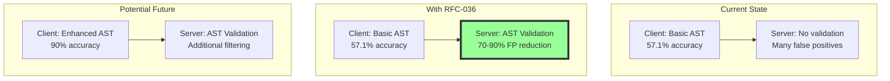

# ADR-018: Deferred AST Analysis Enhancement Decision

**Status**: Accepted  
**Date**: 2025-07-17  
**Author**: RSOLV Engineering Team  

## Context

We have two complementary RFCs for reducing false positives in vulnerability detection:

1. **RFC-035**: Client-side AST pattern interpretation enhancement
   - Status: Partially implemented (57.1% accuracy vs 90% target)
   - Would require 3-4 weeks to fully implement
   - Adds sophisticated AST rule evaluation, OR conditions, property path resolution

2. **RFC-036**: Server-side AST validation
   - Status: Fully implemented and deployed
   - Validates detected vulnerabilities against actual code context
   - Targets 70-90% false positive reduction

## Decision

We will:
1. **Deploy RFC-036 first** and monitor its effectiveness for 30 days
2. **Defer the decision** on completing RFC-035 until we have production metrics
3. **Use data-driven approach** to determine if additional client-side sophistication is needed

## Rationale

### Why Defer RFC-035 Completion?

1. **Effort vs Impact Uncertainty**
   - RFC-035 requires 3-4 weeks of complex development
   - RFC-036 might already solve the false positive problem
   - Combined effectiveness of partial RFC-035 + full RFC-036 is unknown

2. **Server-Side Advantages**
   - Centralized logic easier to update and maintain
   - Can leverage full file context without client-side performance impact
   - Already handles all languages, not just JavaScript/TypeScript

3. **Measurable Success Criteria**
   - RFC-036 provides clear telemetry and metrics
   - Can measure actual false positive reduction in production
   - Data will inform whether RFC-035 completion is necessary

### Architecture Trade-offs



## Implementation Status

### What's Deployed
- ✅ RFC-036 server-side validation (production as of 2025-07-17)
- ✅ Comprehensive telemetry for monitoring
- ✅ Grafana dashboard configuration
- ✅ ValidationCache for performance

### What's Deferred
- ❌ RFC-035 property path resolution
- ❌ RFC-035 OR condition handling
- ❌ RFC-035 generic AST rule evaluation
- ❌ RFC-035 multi-language client-side parsing

## Monitoring Plan

See "Monitoring Guide" section below for detailed instructions.

### Key Metrics to Track
1. **False Positive Reduction Rate**: Target 70-90%
2. **API Response Time**: Target <100ms per vulnerability
3. **Cache Hit Rate**: Target >80%
4. **Pattern Rejection Distribution**: Which patterns need client-side help?

### Decision Criteria (After 30 Days)

| Metric | Complete RFC-035 | Leave As-Is |
|--------|------------------|-------------|
| FP Reduction | <70% | ≥70% |
| Response Time | N/A | <100ms |
| Specific Patterns High FP | Yes | No |
| Customer Complaints | Yes | No |

## Consequences

### Positive
- **Faster time to value**: RFC-036 deployed immediately
- **Data-driven decision**: No speculative development
- **Reduced complexity**: Might avoid 3-4 weeks of work
- **Flexibility**: Can implement incrementally if needed

### Negative
- **Delayed accuracy**: Client-side remains at 57.1% for now
- **Potential rework**: Might need RFC-035 anyway
- **Customer perception**: May seem like incomplete solution

### Risks and Mitigations
- **Risk**: Server-side validation becomes a bottleneck
  - **Mitigation**: ValidationCache and performance monitoring
- **Risk**: Specific patterns still have high false positives
  - **Mitigation**: Can implement pattern-specific client improvements
- **Risk**: 30 days too long to wait
  - **Mitigation**: Can make decision earlier if metrics are clear

## Alternatives Considered

1. **Complete RFC-035 First**
   - Rejected: High effort without proven need
   
2. **Implement Both Simultaneously**
   - Rejected: Resource intensive, might be redundant
   
3. **Abandon RFC-035 Completely**
   - Rejected: Client-side improvements might still be valuable

## References
- [RFC-035: AST Interpreter Enhancement](../RFCs/RFC-035-AST-INTERPRETER-ENHANCEMENT.md)
- [RFC-036: Server-side AST Validation](../RFCs/RFC-036-SERVER-SIDE-AST-VALIDATION.md)
- [ADR-016: AST Validation Architecture](./ADR-016-AST-VALIDATION-ARCHITECTURE.md)

---

# Monitoring Guide for RFC-036 Effectiveness

## Overview
This guide explains how to monitor the effectiveness of RFC-036 (Server-side AST Validation) to make an informed decision about completing RFC-035.

## 1. Accessing Metrics

### Prometheus Metrics (Raw Data)
```bash
# Port-forward to Prometheus (if deployed)
kubectl port-forward -n monitoring svc/prometheus 9090:9090

# Access at http://localhost:9090
```

### Key Prometheus Queries
```promql
# False Positive Reduction Rate (%)
avg(rsolv_validation_false_positive_rate)

# API Response Time (95th percentile)
histogram_quantile(0.95, rate(rsolv_validation_request_duration_bucket[5m]))

# Cache Hit Rate (%)
rate(rsolv_validation_cache_hits[5m]) / 
(rate(rsolv_validation_cache_hits[5m]) + rate(rsolv_validation_cache_misses[5m])) * 100

# Validation Requests per Minute
rate(rsolv_validation_request_total[1m])

# Top Rejected Patterns
topk(10, sum by (pattern_id) (rsolv_validation_pattern_rejections))
```

## 2. Application Logs Analysis

### View Telemetry Reporter Output
```bash
# Production logs
kubectl logs -n rsolv-production deployment/rsolv-platform --since=1h | grep "AST Validation Metrics"

# Staging logs (for testing)
kubectl logs -n rsolv-staging deployment/staging-rsolv-platform --since=1h | grep "AST Validation Metrics"
```

### Expected Log Format
```
AST Validation Metrics (last 60s):
=====================================
Requests: 150 (Success: 145, Error: 5)
Response Times: p50=45ms, p95=89ms, p99=125ms
False Positive Rate: 78.5% (118/150)
Cache Hit Rate: 82.3% (123 hits, 27 misses)

Top Rejected Patterns:
  js-eval-injection: 45
  sql-injection-concat: 32
  xss-dom-write: 28
```

## 3. Grafana Dashboard

### Deploy Grafana (if not already deployed)
```bash
# Apply monitoring stack
kubectl apply -f /home/dylan/dev/rsolv/RSOLV-infrastructure/shared/monitoring/

# Apply AST validation dashboard
kubectl create configmap ast-validation-dashboard \
  --from-file=/home/dylan/dev/rsolv/RSOLV-infrastructure/shared/monitoring/ast-validation-dashboard.json \
  -n monitoring
```

### Access Grafana
```bash
# Port-forward
kubectl port-forward -n monitoring svc/grafana 3000:3000

# Default credentials: admin/admin
# Dashboard: "AST Validation Monitoring (RFC-036)"
```

## 4. Database Queries

### Connect to Production Database
```bash
kubectl exec -it -n rsolv-production deployment/rsolv-platform -- /app/bin/rsolv remote
```

### Useful Queries
```elixir
# Get validation statistics from the last 24 hours
import Ecto.Query
alias Rsolv.Repo

# Count of validations by result
from(v in "validation_logs",
  where: v.inserted_at > ago(24, "hour"),
  group_by: v.is_valid,
  select: {v.is_valid, count(v.id)}
) |> Repo.all()

# Most rejected patterns
from(v in "validation_logs",
  where: v.inserted_at > ago(24, "hour") and v.is_valid == false,
  group_by: v.pattern_id,
  select: {v.pattern_id, count(v.id)},
  order_by: [desc: count(v.id)],
  limit: 10
) |> Repo.all()
```

## 5. Creating a Monitoring Report

### Weekly Report Template
```markdown
# RFC-036 Monitoring Report - Week [X]

## Executive Summary
- False Positive Reduction: X% (Target: 70-90%)
- Average Response Time: Xms (Target: <100ms)
- Cache Hit Rate: X% (Target: >80%)

## Detailed Metrics

### False Positive Analysis
- Total validations: X
- Rejected (false positives): X
- Validated (true positives): X
- Reduction rate: X%

### Performance Metrics
- p50 response time: Xms
- p95 response time: Xms
- p99 response time: Xms
- Cache effectiveness: X% hit rate

### Pattern Analysis
Top rejected patterns:
1. pattern-id: X rejections
2. pattern-id: X rejections
3. pattern-id: X rejections

## Recommendations
[ ] Continue monitoring - metrics trending positive
[ ] Implement RFC-035 - false positive rate still high
[ ] Investigate specific patterns - isolated issues
```

## 6. Automated Monitoring

### Set up Alerts
```yaml
# prometheus-alerts.yaml
groups:
  - name: ast_validation
    rules:
      - alert: HighFalsePositiveRate
        expr: avg(rsolv_validation_false_positive_rate) < 70
        for: 1h
        annotations:
          summary: "False positive reduction below target"
          
      - alert: SlowValidationResponse
        expr: histogram_quantile(0.95, rate(rsolv_validation_request_duration_bucket[5m])) > 100
        for: 15m
        annotations:
          summary: "Validation API response time above target"
          
      - alert: LowCacheHitRate
        expr: |
          rate(rsolv_validation_cache_hits[5m]) / 
          (rate(rsolv_validation_cache_hits[5m]) + rate(rsolv_validation_cache_misses[5m])) < 0.5
        for: 30m
        annotations:
          summary: "Cache hit rate below 50%"
```

### Daily Summary Script
```bash
#!/bin/bash
# save as: check-validation-metrics.sh

echo "=== AST Validation Daily Summary ==="
echo "Date: $(date)"
echo ""

# Get metrics from logs
kubectl logs -n rsolv-production deployment/rsolv-platform --since=24h | \
  grep "AST Validation Metrics" -A 10 | tail -20

echo ""
echo "=== Top Rejected Patterns (Last 24h) ==="
kubectl logs -n rsolv-production deployment/rsolv-platform --since=24h | \
  grep "Top Rejected Patterns" -A 10 | tail -10
```

## 7. Decision Checklist (After 30 Days)

- [ ] False positive reduction rate ≥70%?
- [ ] Average response time <100ms?
- [ ] Cache hit rate >80%?
- [ ] No specific patterns with >50 rejections/day?
- [ ] No customer complaints about false positives?
- [ ] No performance degradation reported?

**If all checked**: RFC-035 completion not needed
**If any unchecked**: Analyze specific gaps and consider RFC-035 completion

## 8. Quick Commands Reference

```bash
# Check current false positive rate
kubectl logs -n rsolv-production deployment/rsolv-platform --tail=100 | grep "False Positive Rate"

# Get validation endpoint status
curl -X POST https://api.rsolv.ai/api/v1/vulnerabilities/validate \
  -H "Content-Type: application/json" \
  -H "x-api-key: $API_KEY" \
  -d '{"vulnerabilities": [], "files": {}}'

# Export metrics for analysis
kubectl exec -n rsolv-production deployment/rsolv-platform -- \
  /app/bin/rsolv eval "Rsolv.Telemetry.ValidationReporter.export_metrics()"
```