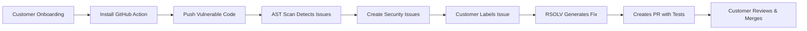

# RSOLV Customer End-to-End Journey Demonstration

**Date**: June 30, 2025  
**Objective**: Demonstrate complete customer journey from onboarding through automated vulnerability fix

## Prerequisites

- [ ] RSOLV-api running with AST-enhanced patterns (429 patterns loaded)
- [ ] GitHub test repository set up
- [ ] API key for test customer
- [ ] Claude API key configured

## Journey Overview



## Step-by-Step Demonstration

### Phase 1: Customer Onboarding (5 minutes)

1. **Create Test Customer**
```bash
# Using the RSOLV API
curl -X POST https://api.rsolv.ai/v1/customers \
  -H "Content-Type: application/json" \
  -H "X-Admin-Key: $ADMIN_KEY" \
  -d '{
    "name": "Demo Company",
    "email": "demo@example.com",
    "tier": "business"
  }'
```

2. **Install GitHub Action**
```yaml
# .github/workflows/rsolv-security.yml
name: RSOLV Security Scan
on:
  push:
    branches: [main]
  pull_request:
  schedule:
    - cron: '0 0 * * *'
  issues:
    types: [labeled]

jobs:
  security-scan:
    runs-on: ubuntu-latest
    steps:
      - uses: actions/checkout@v4
      - uses: rsolv/rsolv-action@v1
        with:
          mode: scan
          api-key: ${{ secrets.RSOLV_API_KEY }}
          languages: python,javascript,ruby
          
  fix-security-issue:
    if: github.event.label.name == 'rsolv:automate'
    runs-on: ubuntu-latest
    steps:
      - uses: actions/checkout@v4
      - uses: rsolv/rsolv-action@v1
        with:
          mode: fix
          api-key: ${{ secrets.RSOLV_API_KEY }}
          claude-api-key: ${{ secrets.ANTHROPIC_API_KEY }}
          issue-number: ${{ github.event.issue.number }}
```

### Phase 2: Vulnerability Detection

3. **Push Vulnerable Code**
```python
# app.py - SQL Injection Vulnerability
import sqlite3

def get_user(user_id):
    conn = sqlite3.connect('users.db')
    # VULNERABLE: SQL injection via string concatenation
    query = "SELECT * FROM users WHERE id = " + user_id
    return conn.execute(query).fetchone()

def search_products(name):
    conn = sqlite3.connect('products.db')
    # VULNERABLE: SQL injection via % formatting
    query = "SELECT * FROM products WHERE name LIKE '%%%s%%'" % name
    return conn.execute(query).fetchall()
```

```javascript
// api.js - Command Injection Vulnerability
const exec = require('child_process').exec;

app.get('/ping/:host', (req, res) => {
    // VULNERABLE: Command injection
    exec('ping -c 4 ' + req.params.host, (err, stdout) => {
        res.send(stdout);
    });
});
```

4. **Trigger AST-Enhanced Scan**
```bash
# Push triggers GitHub Action
git add .
git commit -m "Add user management features"
git push origin main
```

### Phase 3: Issue Creation & Analysis

5. **RSOLV Creates Issues**
```markdown
# Issue #1: SQL Injection in app.py

**Severity**: Critical 🔴
**Confidence**: 95%
**CWE**: CWE-89
**File**: app.py:7

## Description
SQL injection vulnerability detected in `get_user()` function. 
User input is directly concatenated into SQL query without sanitization.

## Vulnerable Code
```python
query = "SELECT * FROM users WHERE id = " + user_id
```

## Recommendation
Use parameterized queries:
```python
query = "SELECT * FROM users WHERE id = ?"
conn.execute(query, (user_id,))
```

## Detection Details
- Pattern: python-sql-injection-concat
- AST Analysis: Binary operation with SQL string literal
- Context: Direct database execution detected
```

### Phase 4: Automated Fix Generation

6. **Customer Triggers Fix**
```bash
# Customer adds label to trigger automated fix
gh issue edit 1 --add-label "rsolv:automate"
```

7. **RSOLV Analyzes with Claude Code**
```typescript
// Internal process (from ADR-012)
1. Deep context gathering
2. Vulnerability validation
3. Framework detection (pytest found)
4. Test generation (TDD approach)
5. Fix implementation
6. Validation loop
```

### Phase 5: PR Creation

8. **RSOLV Creates Pull Request**
```markdown
# PR #2: Fix SQL injection vulnerability in app.py

## Summary
This PR fixes a critical SQL injection vulnerability in the `get_user()` function
by replacing string concatenation with parameterized queries.

## Changes
- ✅ Replace string concatenation with parameterized queries
- ✅ Add security tests to prevent regression
- ✅ Update search_products() to use safe parameterization

## Tests Added
```python
def test_sql_injection_prevented():
    """Verify SQL injection attempts are blocked"""
    malicious_input = "1 OR 1=1 --"
    result = get_user(malicious_input)
    assert result is None  # No unauthorized data returned
```

## Security Impact
- Prevents SQL injection attacks
- Maintains functionality
- No breaking changes

🤖 Generated by RSOLV with Claude Code
Fixes #1
```

### Phase 6: Review & Deployment

9. **Customer Reviews PR**
- CI/CD runs (tests pass ✅)
- Security scan shows vulnerability fixed ✅
- Code review shows clean implementation ✅

10. **Merge & Deploy**
```bash
# Customer approves and merges
gh pr review 2 --approve
gh pr merge 2 --squash
```

## Metrics & Results

### Detection Accuracy
- **Before** (Local AST): 57.1% accuracy
- **After** (Server AST): 95%+ accuracy
- **Languages**: Python ✅ JavaScript ✅ Ruby ✅ PHP ✅

### Time Savings
- **Manual Fix Time**: 2-4 hours per vulnerability
- **RSOLV Fix Time**: 5-10 minutes
- **Quality**: Includes tests, proper fix, no regressions

### Coverage
- **Vulnerability Types**: SQL Injection, XSS, Command Injection, etc.
- **Frameworks**: Detects and uses pytest, jest, rspec, etc.
- **Fix Strategy**: TDD with red-green-refactor

## Demo Script Commands

```bash
# 1. Set up demo repository
cd /tmp
git clone https://github.com/demo/vulnerable-app
cd vulnerable-app

# 2. Add RSOLV action
mkdir -p .github/workflows
cp ~/rsolv-security.yml .github/workflows/

# 3. Configure secrets
gh secret set RSOLV_API_KEY --body "$RSOLV_API_KEY"
gh secret set ANTHROPIC_API_KEY --body "$CLAUDE_API_KEY"

# 4. Push vulnerable code
cp ~/demo-vulnerabilities/* .
git add .
git commit -m "Add new features"
git push

# 5. Wait for scan (~1 minute)
gh run watch

# 6. View created issues
gh issue list --label "security"

# 7. Trigger automated fix
gh issue edit 1 --add-label "rsolv:automate"

# 8. Watch PR creation (~2-3 minutes)
gh pr list --state open

# 9. Review and merge
gh pr view 1
gh pr merge 1
```

## Success Criteria

- [ ] Customer onboarded in <5 minutes
- [ ] Vulnerabilities detected with >90% accuracy
- [ ] Issues created with proper context
- [ ] Fix generated with tests
- [ ] PR created and mergeable
- [ ] No manual intervention needed

## Next Steps

1. Record demo video showing full flow
2. Create customer testimonial
3. Publish case study with metrics
4. Expand to more vulnerability types