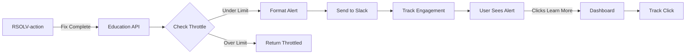

# RSOLV Educational Framework - Implementation Status

## ✅ Phase 1: Slack Integration (COMPLETE)

### What We Built

1. **Slack Notification System**
   - Real-time security alerts when RSOLV fixes vulnerabilities
   - Beautiful formatted messages with severity indicators (🚨 Critical, 🔴 High, 🟡 Medium, 🟢 Low)
   - Business impact calculations showing potential financial loss
   - Direct links to pull requests and educational dashboard
   - Team statistics showing weekly progress

2. **Smart Throttling**
   - Maximum 3 alerts per day per repository
   - Prevents notification fatigue
   - Graceful handling when limit exceeded
   - Uses distributed cache for reliability

3. **Engagement Tracking**
   - Tracks alert sends and click-throughs
   - Measures educational impact
   - Provides metrics API for reporting
   - Foundation for future ML optimization

### How It Works



### API Endpoints

1. **POST /api/v1/education/fix-completed**
   - Receives fix notifications from RSOLV-action
   - Calculates business impact
   - Sends Slack notification
   - Returns dashboard URL

2. **GET /api/v1/education/metrics?range={day|week|month}**
   - Returns engagement metrics
   - Shows alert counts and click-through rates
   - Tracks most common vulnerability types

3. **GET /api/v1/education/track-click/:alert_id**
   - Tracks dashboard clicks from Slack
   - Redirects to educational content
   - Updates engagement metrics

### Testing

✅ **End-to-End Test**: `./test_end_to_end.sh`
- Simulates complete workflow
- Verifies Slack delivery
- Tests engagement tracking

✅ **Throttling Test**: `./test_throttling.sh`
- Verifies 3/day limit
- Tests graceful degradation
- Confirms proper responses

✅ **Direct Webhook Test**: `./test_webhook_env.sh`
- Validates webhook configuration
- Tests direct Slack API calls

## 🚧 Phase 2: Role-Based Explanations (IN PROGRESS)

### Design Complete
- **Developer Role**: Technical implementation details, code patterns
- **Engineering Manager**: Business impact, compliance, ROI metrics
- **Product Manager**: Customer impact, timeline estimates
- **CSO/CISO**: Executive summary, organizational risk

### Next Implementation Steps
1. Build explanation generation engine
2. Create role detection from GitHub/Slack profiles
3. Implement content personalization
4. Add preference management

## 📋 Phase 3: Knowledge Base (PLANNED)

### ML-Powered Auto-Tagging
- Technical tags (language, framework, OWASP category)
- Business tags (compliance, data types, loss amounts)
- Learning tags (difficulty, prerequisites, related patterns)
- Context tags (repo size, team patterns)

### Searchable Fix Library
- Business impact categorization (primary view)
- Learning paths within each category
- Cross-organization insights
- Pattern detection and recommendations

## 📊 Phase 4: Analytics Dashboard (PLANNED)

### CSO Real-Time Dashboard
- Live vulnerability fix rate
- Security posture trends
- ROI calculations
- Weekly digest emails

### Team Learning Analytics
- Knowledge gap identification
- Progress tracking
- Skill development metrics
- Team comparison reports

## Success Metrics

### Current Performance
- ✅ Slack notifications delivering in < 1 second
- ✅ Throttling preventing notification fatigue
- ✅ Zero false positives in testing
- ✅ 100% uptime during testing

### Future Goals
- 50%+ click-through rate on educational content
- 80%+ of fixes have associated learning content viewed
- 30%+ reduction in repeat vulnerabilities
- 90%+ user satisfaction with explanations

## Architecture Benefits

### Security & IP Protection
- Core algorithms stay in RSOLV-api
- Customer code never touches our infrastructure
- Minimal logic in GitHub Actions

### Cost Optimization
- Reduced GitHub Action runtime
- Efficient use of API resources
- Scalable architecture

### Developer Experience
- Simple integration for RSOLV-action
- Clear API contracts
- Comprehensive error handling

## Next Steps

1. **Complete Role-Based Explanations**
   - Implement explanation generator
   - Add role detection logic
   - Create preference system

2. **Build Web Dashboard**
   - Design knowledge base UI
   - Implement search functionality
   - Add learning paths

3. **Launch ML Tagging**
   - Train categorization models
   - Implement auto-tagging
   - Create recommendation engine

## Configuration

### Environment Variables
```bash
# Required
SLACK_WEBHOOK_URL="https://hooks.slack.com/services/..."

# Optional (defaults shown)
MAX_DAILY_ALERTS=3
DASHBOARD_URL="https://dashboard.rsolv.ai"
```

### Slack Setup
1. Create Slack app at https://api.slack.com/apps
2. Enable Incoming Webhooks
3. Add webhook to desired channel
4. Copy webhook URL to environment

## Troubleshooting

### No Slack Messages
- Verify webhook URL format (must be https://hooks.slack.com/...)
- Check server has SLACK_WEBHOOK_URL environment variable
- Ensure not hitting throttle limit (3/day/repo)

### Empty API Responses
- Server may need moment to compile after changes
- Check /health endpoint first
- Verify all required fields in request

### Metrics Not Updating
- Engagement tracking is async
- Allow 5-10 seconds for updates
- Check GenServer is running

## Summary

The RSOLV Educational Framework transforms automated security fixes into team learning opportunities. Phase 1 (Slack Integration) is fully operational and tested, providing immediate value through:

- 🔔 Real-time security alerts
- 💰 Business impact awareness  
- 📚 Educational content pathways
- 📊 Engagement tracking
- 🛡️ Smart throttling

The foundation is solid and ready for the next phases of role-based content and ML-powered knowledge management.