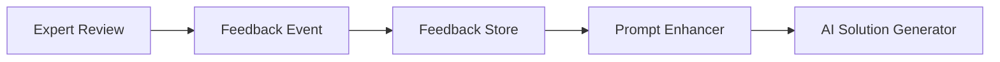

# RSOLV GitHub Action

Automatically fix issues in your codebase with AI-powered solutions.

## Day 5 Demo Environment

For Day 5 milestone, we've created a comprehensive demo environment that allows you to manually exercise all components of the RSOLV system, including:

- Issue Analysis
- Solution Generation
- PR Creation
- Feedback Collection & Processing
- Prompt Enhancement based on feedback
- Claude Code Integration for enhanced context gathering

### Running the Demo Environment

To run the demo environment:

```bash
# Set up your environment variables (optional)
export GITHUB_TOKEN=your_github_token
export ANTHROPIC_API_KEY=your_anthropic_api_key
export AI_PROVIDER=anthropic # or openrouter, ollama, claude-code

# Run the demo environment
cd RSOLV-action
bun run demo-env
```

## AI Provider Integrations

RSOLV supports multiple AI providers to fit your needs and preferences:

### Claude Code Integration

RSOLV uses a hybrid approach that combines Claude Code's sophisticated context-gathering capabilities with our unique feedback-enhanced prompt system.

#### Setup and Usage

1. Install the Claude Code CLI first:

```bash
# Install Claude Code CLI (required for real Claude Code integration)
npm install -g @anthropic-ai/claude-code

# Verify installation
claude -v
```

2. Run with Claude Code:

```bash
# Set your Anthropic API key
export ANTHROPIC_API_KEY=your_anthropic_api_key

# Run the demo
bun run demo-env

# Select "claude-code" as the AI provider when prompted
```

3. Using in GitHub Action:

```yaml
- name: RSOLV AI Fix
  uses: rsolv-dev/rsolv-action@main
  with:
    github_token: ${{ secrets.GITHUB_TOKEN }}
    ai_provider: anthropic
    anthropic_api_key: ${{ secrets.ANTHROPIC_API_KEY }}
    use_claude_code: true  # Enable Claude Code integration
```

If Claude Code CLI is not detected, the system will automatically fall back to simulation mode with a warning message.

#### Benefits of Hybrid Approach

- **Intelligent Context Gathering**: Claude Code analyzes repository structure and relationships between files
- **Enhanced Solution Quality**: Deeper code understanding leads to more accurate fixes
- **Feedback Integration**: Combines context gathering with historical feedback patterns
- **Performance Optimization**: Focuses on relevant files and code patterns

### Ollama Integration

RSOLV supports using Ollama as an AI provider, allowing you to run models locally or on your own servers.

#### Setup and Usage

1. Install and set up Ollama first:

```bash
# Install Ollama
curl -fsSL https://ollama.com/install.sh | sh

# Start Ollama server
ollama serve

# Pull the recommended model
ollama pull deepseek-r1:14b
```

2. Run with Ollama:

```bash
# Run the demo
AI_PROVIDER=ollama bun run demo-env

# Or with specific model
OLLAMA_MODEL=deepseek-r1:14b AI_PROVIDER=ollama bun run demo-env
```

3. Using in GitHub Action:

```yaml
- name: RSOLV AI Fix
  uses: rsolv-dev/rsolv-action@main
  with:
    github_token: ${{ secrets.GITHUB_TOKEN }}
    ai_provider: ollama
    ollama_api_url: http://ollama-server:11434/api  # Optional
```

#### Benefits of Ollama

- **Complete Privacy**: All processing happens locally, no data leaves your infrastructure
- **Cost Efficiency**: Free to use with no API usage fees
- **Model Flexibility**: Use any model supported by Ollama
- **Self-Hosting**: Run on your own hardware with full control

For detailed information, see our [Ollama Integration Guide](docs/ollama-integration.md)

#### Testing and Evaluation

The demo environment includes a context quality evaluation tool that compares solution quality with and without Claude Code. Use the "Evaluate Claude Code Context Quality" option in the demo menu to see a side-by-side comparison.

### Demo Features

The demo environment provides an interactive CLI interface that allows you to:

1. **Get Issue Context**: Either from a real GitHub issue or by manually entering issue details
2. **Analyze Issue**: Use AI to analyze the issue complexity, estimate time to fix, and identify related files
3. **Generate Solution**: Create a solution with AI, with optional feedback enhancement
4. **Create PR**: Generate a pull request with the solution
5. **Simulate Feedback**: Add simulated feedback from expert reviewers
6. **View Feedback Statistics**: See aggregate statistics on collected feedback
7. **Test Prompt Enhancement**: See how feedback affects future prompt generation
8. **Try Claude Code**: Use the advanced context-gathering capabilities of Claude Code (with CLI installed)

### Demo Workflow

The demo follows the same workflow as the actual RSOLV action:

1. **Issue Detection**: Start with an issue (from GitHub or manual input)
2. **Issue Analysis**: AI analyzes the issue to understand complexity and approach
3. **Solution Generation**: AI generates a solution with code changes
4. **PR Creation**: A pull request is created with the solution
5. **Feedback Loop**: Expert feedback is collected and used to improve future prompts

## Overview

RSOLV is a GitHub Action that automatically addresses tagged issues in your repository. It uses AI to analyze issues, generate fixes, and create pull requests for your review.

## Security

RSOLV is designed with security as a top priority:

- All code processing happens within your GitHub environment
- Your source code never leaves your repository
- The action runs in an isolated container with minimal permissions

For more information, see our [security architecture documentation](../RSOLV-docs/security/architecture.md).

## Installation

1. Add the RSOLV GitHub Action to your repository
2. Configure your API key as a secret
3. Start tagging issues with "AUTOFIX" to trigger the action

## Usage

### Automated triggering

Tag any issue with "AUTOFIX" to have RSOLV automatically generate a fix.

```yaml
name: RSOLV Automated Fix Generator

on:
  issues:
    types: [labeled]

jobs:
  autofix:
    if: ${{ github.event.label.name == 'AUTOFIX' }}
    runs-on: ubuntu-latest
    steps:
      - uses: actions/checkout@v3
      - name: RSOLV Fix Generator
        uses: rsolv/action@v1
        with:
          api_key: ${{ secrets.RSOLV_API_KEY }}
```

### Manual triggering

You can also manually trigger the action for testing:

1. Go to "Actions" in your repository
2. Select "Manual Trigger for Testing"
3. Input the issue number and repository
4. Click "Run workflow"

## Expert Review & Feedback Loop

For complex issues, you can request expert review by commenting `/request-expert-review` on the pull request.

### Feedback System

RSOLV incorporates a sophisticated feedback loop system that:

1. Captures feedback from expert reviews, PR comments, and edits
2. Analyzes sentiment and extracts useful patterns
3. Enhances future AI prompts based on historical feedback
4. Continuously improves solution quality over time



## Configuration Options

| Input | Description | Required | Default |
|-------|-------------|----------|---------|
| `api_key` | Your RSOLV API key | Yes | - |
| `issue_tag` | Tag to identify issues for automation | No | `AUTOFIX` |
| `expert_review_command` | Command to request expert review | No | `/request-expert-review` |
| `ai_provider` | AI provider to use (anthropic, openrouter, ollama) | No | `anthropic` |
| `use_claude_code` | Use Claude Code for enhanced context gathering | No | `false` |

## Local Development

For local development:

```bash
# Clone the repository
git clone https://github.com/RSOLV-dev/RSOLV-action.git
cd RSOLV-action

# Install dependencies
bun install

# Run tests
bun test

# Build
bun run build

# Run local demo
bun run demo https://github.com/owner/repo/issues/123

# Run interactive demo environment
bun run demo-env
```

### Claude Code Testing

We've implemented multiple levels of testing for the Claude Code integration:

#### End-to-End Simulation Tests

These tests validate the Claude Code integration with simulated responses:

```bash
# Set your API key
export ANTHROPIC_API_KEY=your_api_key

# Run simulation tests locally (does not require Claude CLI)
./run-claude-code-test.sh

# Run simulation tests in Docker
./run-claude-code-test.sh --docker
```

The simulation tests:
- Analyze sample issues using both standard and Claude Code approaches
- Generate solutions using simulated Claude Code responses
- Compare results quantitatively (file count, test coverage, complexity)
- Save detailed output for benchmarking

#### Live Integration Tests

These tests validate the actual Claude CLI integration with real responses:

```bash
# Set your API key
export ANTHROPIC_API_KEY=your_api_key

# Run live tests (requires Claude CLI to be installed)
./run-live-claude-test.sh
```

The live tests:
- Directly exercise the Claude Code adapter with real Claude CLI
- Send actual prompts and process real responses
- Validate the structure and content of generated solutions
- Verify end-to-end integration works correctly

All test results are saved to the `test-data` directory for inspection and benchmarking.

## Support

For questions or issues, please contact support@rsolv.dev or open an issue in this repository.

## Continuous Integration

This project is configured with automated CI pipelines through both GitHub Actions and SourceHut:

- **GitHub Actions**: Primary CI system for push/PR validation and releases
- **SourceHut**: Secondary CI system that offers lightweight, text-focused builds

### CI Status
[](https://github.com/arboreal-studios/RSOLV-action/actions)
[](https://builds.sr.ht/~arubis/rsolv-action?)

## License

Proprietary. Copyright (c) 2024-2025 Arboreal Studios, Inc. All rights reserved.

See [LICENSE.md](LICENSE.md) for details.