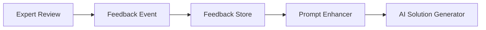

# RSOLV GitHub Action

Automatically fix issues in your codebase with AI-powered solutions.

## Day 5 Demo Environment

For Day 5 milestone, we've created a comprehensive demo environment that allows you to manually exercise all components of the RSOLV system, including:

- Issue Analysis
- Solution Generation
- PR Creation
- Feedback Collection & Processing
- Prompt Enhancement based on feedback

### Running the Demo Environment

To run the demo environment:

```bash
# Set up your environment variables (optional)
export GITHUB_TOKEN=your_github_token
export ANTHROPIC_API_KEY=your_anthropic_api_key
export AI_PROVIDER=anthropic # or openrouter, ollama

# Run the demo environment
cd RSOLV-action
bun run demo-env
```

### Demo Features

The demo environment provides an interactive CLI interface that allows you to:

1. **Get Issue Context**: Either from a real GitHub issue or by manually entering issue details
2. **Analyze Issue**: Use AI to analyze the issue complexity, estimate time to fix, and identify related files
3. **Generate Solution**: Create a solution with AI, with optional feedback enhancement
4. **Create PR**: Generate a pull request with the solution
5. **Simulate Feedback**: Add simulated feedback from expert reviewers
6. **View Feedback Statistics**: See aggregate statistics on collected feedback
7. **Test Prompt Enhancement**: See how feedback affects future prompt generation

### Demo Workflow

The demo follows the same workflow as the actual RSOLV action:

1. **Issue Detection**: Start with an issue (from GitHub or manual input)
2. **Issue Analysis**: AI analyzes the issue to understand complexity and approach
3. **Solution Generation**: AI generates a solution with code changes
4. **PR Creation**: A pull request is created with the solution
5. **Feedback Loop**: Expert feedback is collected and used to improve future prompts

## Overview

RSOLV is a GitHub Action that automatically addresses tagged issues in your repository. It uses AI to analyze issues, generate fixes, and create pull requests for your review.

## Security

RSOLV is designed with security as a top priority:

- All code processing happens within your GitHub environment
- Your source code never leaves your repository
- The action runs in an isolated container with minimal permissions

For more information, see our [security architecture documentation](../RSOLV-docs/security/architecture.md).

## Installation

1. Add the RSOLV GitHub Action to your repository
2. Configure your API key as a secret
3. Start tagging issues with "AUTOFIX" to trigger the action

## Usage

### Automated triggering

Tag any issue with "AUTOFIX" to have RSOLV automatically generate a fix.

```yaml
name: RSOLV Automated Fix Generator

on:
  issues:
    types: [labeled]

jobs:
  autofix:
    if: ${{ github.event.label.name == 'AUTOFIX' }}
    runs-on: ubuntu-latest
    steps:
      - uses: actions/checkout@v3
      - name: RSOLV Fix Generator
        uses: rsolv/action@v1
        with:
          api_key: ${{ secrets.RSOLV_API_KEY }}
```

### Manual triggering

You can also manually trigger the action for testing:

1. Go to "Actions" in your repository
2. Select "Manual Trigger for Testing"
3. Input the issue number and repository
4. Click "Run workflow"

## Expert Review & Feedback Loop

For complex issues, you can request expert review by commenting `/request-expert-review` on the pull request.

### Feedback System

RSOLV incorporates a sophisticated feedback loop system that:

1. Captures feedback from expert reviews, PR comments, and edits
2. Analyzes sentiment and extracts useful patterns
3. Enhances future AI prompts based on historical feedback
4. Continuously improves solution quality over time



## Configuration Options

| Input | Description | Required | Default |
|-------|-------------|----------|---------|
| `api_key` | Your RSOLV API key | Yes | - |
| `issue_tag` | Tag to identify issues for automation | No | `AUTOFIX` |
| `expert_review_command` | Command to request expert review | No | `/request-expert-review` |

## Local Development

For local development:

```bash
# Clone the repository
git clone https://github.com/RSOLV-dev/RSOLV-action.git
cd RSOLV-action

# Install dependencies
bun install

# Run tests
bun test

# Build
bun run build

# Run local demo
bun run demo https://github.com/owner/repo/issues/123

# Run interactive demo environment
bun run demo-env
```

## Support

For questions or issues, please contact support@rsolv.dev or open an issue in this repository.

## Continuous Integration

This project is configured with automated CI pipelines through both GitHub Actions and SourceHut:

- **GitHub Actions**: Primary CI system for push/PR validation and releases
- **SourceHut**: Secondary CI system that offers lightweight, text-focused builds

### CI Status
[](https://github.com/arboreal-studios/RSOLV-action/actions)
[](https://builds.sr.ht/~arubis/rsolv-action?)

## License

Proprietary. Copyright (c) 2024-2025 Arboreal Studios, Inc. All rights reserved.

See [LICENSE.md](LICENSE.md) for details.