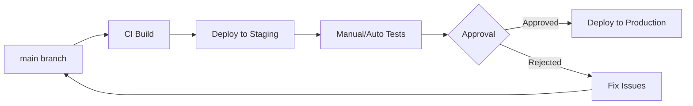

# RFC: RSOLV Staging Environment Architecture

**RFC Number**: 002  
**Title**: Staging Environment Design and Deployment Strategy  
**Author**: Infrastructure Team  
**Status**: Implemented  
**Created**: June 3, 2025  
**Updated**: June 3, 2025  

## Summary

This RFC proposes the architecture and implementation strategy for a staging environment that mirrors production. The design prioritizes cost efficiency, operational simplicity, and reliable testing capabilities while maintaining proper isolation between environments.

## Motivation

Currently, RSOLV lacks a staging environment, leading to:
- Direct production deployments with higher risk
- Limited ability to test infrastructure changes
- No environment for customer demos or training
- Inability to validate backup/restore procedures
- No safe place for performance testing

## Proposed Solution

### 1. Architecture Decision: Shared Cluster with Namespace Isolation

**Decision**: Use the same k3s cluster with namespace-based isolation

```yaml
Namespaces:
  - production (current default namespace)
  - staging
  - staging-monitoring (separate monitoring stack)
```

**Rationale**:
- Cost-effective (no additional nodes needed initially)
- Simplified management (single cluster to maintain)
- Easy resource sharing (ingress controller, cert-manager)
- Can migrate to separate cluster later if needed

### 2. Deployment Strategy: GitOps with Manual Promotion

**Decision**: Trunk-based development with manual approval gates



**Future Considerations**:
- Automatic promotion: After confidence in testing coverage
- Blue/Green: When zero-downtime becomes critical
- Canary: When customer base grows significantly

### 3. Environment Configuration

#### URLs and Ingress
```yaml
Production:
  - rsolv.dev
  - api.rsolv.dev
  - grafana.rsolv.dev

Staging (separate domain):
  - rsolv-staging.com
  - api.rsolv-staging.com
  - grafana.rsolv-staging.com
```

**Rationale**: Separate domain prevents DNS namespace pollution and provides clearer environment separation.

#### Database Strategy
```yaml
Decision: Separate PostgreSQL instances
  - staging-postgres (lower resources)
  - Periodic production data sync (monthly)
  - Independent backup schedules
  - Complete isolation from production
```

#### Resource Limits
```yaml
Staging resources = 50% of production:
  - Pods: 1 replica (vs 2 in prod)
  - Memory: 512Mi (vs 1Gi in prod)
  - CPU: 250m (vs 500m in prod)
```

### 4. CI/CD Pipeline Design

#### GitHub Actions Workflow
```yaml
name: Deploy to Staging
on:
  push:
    branches: [main]
  workflow_dispatch:

jobs:
  test:
    runs-on: ubuntu-latest
    steps:
      - Test suite
      - Security scanning
      - Build containers

  deploy-staging:
    needs: test
    steps:
      - Deploy to staging namespace
      - Run smoke tests
      - Notify Slack

  promote-to-prod:
    needs: deploy-staging
    if: github.event_name == 'workflow_dispatch'
    steps:
      - Approval gate
      - Deploy to production
      - Run health checks
```

#### Deployment Tools
```yaml
Primary: kubectl + kustomize
  - Base manifests in k8s/base/
  - Environment overlays in k8s/overlays/staging, k8s/overlays/production
  
Alternative: ArgoCD (if GitOps complexity grows)
```

### 5. Data Management

#### Staging Data Strategy
**Decision**: Hybrid approach with synthetic data and monthly production copies

1. **Synthetic Data** (Default)
   - Generated test data for daily development
   - Predictable and safe
   - No privacy concerns

2. **Production Snapshot** (Monthly)
   - Direct copy initially (no sanitization needed yet)
   - Will add sanitization when customer data exists
   - Useful for realistic performance testing

#### Sync Process
```bash
# Monthly production -> staging sync (no sanitization initially)
pg_dump prod | psql staging

# Future: Add sanitization when needed
# pg_dump prod | ./sanitize-data.sh | psql staging
```

### 6. Monitoring and Observability

#### Monitoring Architecture
**Decision**: Complete separation with dedicated staging monitoring stack

- Separate Prometheus/Grafana in staging-monitoring namespace
- grafana.rsolv-staging.com for staging dashboards
- Lower retention (3 days vs 7 days)
- Same dashboard templates for consistency

#### Key Differences
- No PagerDuty integration for staging
- Relaxed SLOs (99% vs 99.9%)
- More verbose logging enabled
- No production data mixing

### 7. Secret Management

#### Secret Isolation Strategy
**Decision**: Complete credential separation with no overlap

```yaml
Staging Secrets:
  - ConvertKit sandbox account
  - Test payment provider credentials
  - Separate OAuth applications
  - Different database passwords
  - Unique monitoring passwords
```

#### Implementation:
- Prefix pattern: `staging-` vs `prod-`
- Separate secret storage paths
- No shared credentials between environments
- Regular rotation without production impact

## Implementation Plan

### Phase 1: Foundation (Week 1)
- Create staging namespace
- Deploy base services (database, ingress rules)
- Configure staging URLs and TLS

### Phase 2: Application Deployment (Week 2)
- Deploy rsolv-landing to staging
- Deploy RSOLV-api to staging
- Configure staging-specific secrets

### Phase 3: CI/CD Integration (Week 3)
- Update GitHub Actions workflows
- Implement promotion pipeline
- Add approval gates

### Phase 4: Data and Monitoring (Week 4)
- Set up data sync process
- Deploy staging monitoring stack
- Configure alerts and dashboards

## Linear Organization

### Initiative: Staging Environment Implementation

#### Project 1: Infrastructure Setup
- Create staging namespace and RBAC
- Configure resource quotas and limits
- Set up staging database instance
- Configure ingress for staging URLs

#### Project 2: Application Configuration
- Create staging-specific configs
- Set up staging secrets
- Deploy applications to staging
- Verify connectivity and health

#### Project 3: CI/CD Pipeline
- Update GitHub Actions workflows
- Implement staging deployment jobs
- Add production promotion gate
- Create deployment documentation

#### Project 4: Operational Readiness
- Set up staging monitoring
- Create data sync procedures
- Document staging usage
- Train team on new workflow

## Final Architecture Decisions

| Aspect | Decision | Rationale |
|--------|----------|-----------|
| **Cluster** | Shared k3s with namespace isolation | Cost-effective, can migrate later |
| **Domain** | Separate TLD (rsolv-staging.com) | Clean DNS separation |
| **Database** | Separate PostgreSQL instances | Eliminates cross-env query risks |
| **Deployment** | Manual promotion gates | Control during early stages |
| **Data** | Hybrid: synthetic + monthly prod copies | Balance of safety and realism |
| **Secrets** | Complete separation, no sharing | Maximum security isolation |
| **Monitoring** | Separate Prometheus/Grafana stack | Clean metrics separation |
| **Resources** | 50% of production allocation | Balanced cost vs functionality |

## Security Considerations

- Network policies to prevent cross-namespace traffic
- Separate service accounts per environment
- No production secrets in staging
- Regular security scans in staging
- Staging-only API keys for third-party services

## Cost Analysis

**Shared Cluster Approach**:
- Additional cost: ~$50-100/month (storage, bandwidth)
- No new node costs
- Shared ingress and cert-manager

**If Separate Cluster** (future):
- Additional cost: ~$300-500/month
- Better isolation but higher complexity

## Success Metrics

- Deployment frequency increase: 2x
- Production incidents from deployments: -50%
- Time to validate changes: <30 minutes
- Test coverage in staging: >80%

## Migration Path

1. Start with namespace isolation (proposed)
2. Monitor resource usage for 3 months
3. If needed, migrate to separate cluster:
   - Export staging manifests
   - Provision new cluster
   - Migrate with zero production impact

## Resolved Questions

1. ~~Staging data refresh frequency?~~ → Monthly
2. ~~Who approves production promotions?~~ → Manual approval for now
3. ~~Automatic or manual promotion?~~ → Manual initially, automate later
4. ~~Performance testing impact?~~ → 50% resources sufficient for most tests

## Implementation Notes

- Domain rsolv-staging.com already registered and pointed to cluster
- Manual promotion provides safety during early customer phase
- Sanitization scripts can be added when customer data exists
- Architecture supports easy migration to separate cluster if needed

## References

- [Kubernetes Namespace Best Practices](https://kubernetes.io/docs/concepts/overview/working-with-objects/namespaces/)
- [GitOps Principles](https://www.gitops.tech/)
- [Staging Environment Patterns](https://www.martinfowler.com/bliki/EnvironmentPattern.html)