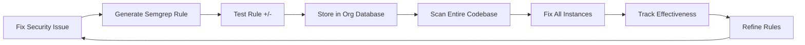

# RFC: Learning Security System with Semgrep Integration

**RFC Number**: 003  
**Title**: Organization-Specific Security Rule Generation and Learning  
**Author**: Infrastructure Team  
**Status**: Draft  
**Created**: June 3, 2025  
**Inspired By**: [Fly.io - Semgrep But For Real Now](https://fly.io/blog/semgrep-but-for-real-now/)

## Summary

This RFC proposes transforming RSOLV from a reactive security fixing tool into a proactive, learning security platform. By integrating Semgrep and implementing closed-loop learning, RSOLV will generate custom security rules for each organization based on actual vulnerabilities found and fixed, creating an ever-improving, organization-specific security scanner.

**Key Business Insight**: This learning approach may require adjusting our trial offering. We need to experimentally determine when the learning effect becomes apparent to users - this could be after 10, 20, or 30 fixes depending on codebase diversity and vulnerability patterns. The trial size should be data-driven based on actual customer perception of value.

## Motivation

Current limitations:
- Static set of 76 security patterns across 4 languages
- No learning from fixed vulnerabilities
- Same rules applied to all organizations
- No adaptation to codebase-specific patterns
- Limited value accumulation over time

The Fly.io article demonstrates how LLMs can effectively generate Semgrep rules, and how closed-loop systems can learn from their own fixes. This approach would give RSOLV:
- Dynamic, growing security knowledge
- Organization-specific vulnerability patterns
- Increasing value over time
- Strong competitive moat
- Premium pricing justification

## Proposed Solution

### 1. Core Learning Loop



### 2. Architecture Components

#### A. Semgrep Integration
```typescript
interface SemgrepRule {
  id: string;
  pattern: string;
  message: string;
  severity: 'error' | 'warning' | 'info';
  languages: string[];
  fix?: string;
  metadata: {
    created_from_issue: string;
    organization_id: string;
    vulnerability_type: string;
    confidence: number;
  };
}

class SemgrepRuleGenerator {
  async generateFromFix(
    originalCode: string,
    fixedCode: string,
    vulnerability: VulnerabilityInfo
  ): Promise<SemgrepRule> {
    // Use LLM to generate Semgrep pattern
    const pattern = await this.llm.generateSemgrepPattern({
      vulnerable: originalCode,
      fixed: fixedCode,
      vulnType: vulnerability.type
    });
    
    // Test with positive/negative examples
    const validated = await this.validateRule(pattern);
    
    return validated;
  }
}
```

#### B. Organization-Specific Storage (SQLite MCP)
```sql
-- Core rule storage
CREATE TABLE organization_rules (
  id TEXT PRIMARY KEY,
  org_id TEXT NOT NULL,
  rule_id TEXT NOT NULL,
  semgrep_yaml TEXT NOT NULL,
  vulnerability_type TEXT,
  language TEXT,
  pattern_signature TEXT,
  created_at TIMESTAMP DEFAULT CURRENT_TIMESTAMP,
  last_updated TIMESTAMP,
  is_active BOOLEAN DEFAULT true,
  UNIQUE(org_id, rule_id)
);

-- Rule effectiveness tracking
CREATE TABLE rule_metrics (
  id INTEGER PRIMARY KEY AUTOINCREMENT,
  rule_id TEXT NOT NULL,
  scan_id TEXT NOT NULL,
  matches_found INTEGER DEFAULT 0,
  true_positives INTEGER DEFAULT 0,
  false_positives INTEGER DEFAULT 0,
  fixes_applied INTEGER DEFAULT 0,
  scan_duration_ms INTEGER,
  codebase_snapshot TEXT,
  created_at TIMESTAMP DEFAULT CURRENT_TIMESTAMP,
  FOREIGN KEY (rule_id) REFERENCES organization_rules(rule_id)
);

-- Test cases for validation
CREATE TABLE rule_test_cases (
  id INTEGER PRIMARY KEY AUTOINCREMENT,
  rule_id TEXT NOT NULL,
  test_type TEXT CHECK(test_type IN ('positive', 'negative')),
  code_snippet TEXT NOT NULL,
  should_match BOOLEAN NOT NULL,
  actual_match BOOLEAN,
  language TEXT,
  FOREIGN KEY (rule_id) REFERENCES organization_rules(rule_id)
);

-- Pattern evolution tracking
CREATE TABLE rule_evolution (
  id INTEGER PRIMARY KEY AUTOINCREMENT,
  rule_id TEXT NOT NULL,
  version INTEGER NOT NULL,
  pattern_before TEXT,
  pattern_after TEXT NOT NULL,
  reason TEXT,
  performance_delta REAL,
  created_at TIMESTAMP DEFAULT CURRENT_TIMESTAMP,
  FOREIGN KEY (rule_id) REFERENCES organization_rules(rule_id)
);
```

#### C. Memory MCP for Pattern Recognition
```typescript
interface PatternMemory {
  // Short-term pattern tracking
  recentPatterns: Map<string, PatternFrequency>;
  
  // Emerging vulnerability types
  emergingThreats: VulnerabilityPattern[];
  
  // Cross-repository patterns
  commonPatterns: Map<string, RepositoryPattern[]>;
  
  // Suggested consolidations
  ruleMergeOpportunities: RuleMerge[];
}

class PatternRecognitionEngine {
  private memory: MemoryMCP;
  
  async identifyPatterns(fixes: Fix[]): Promise<PatternInsight[]> {
    // Track patterns across current session
    const patterns = await this.extractPatterns(fixes);
    
    // Identify emerging trends
    const trends = await this.analyzeTrends(patterns);
    
    // Suggest new rules or refinements
    return this.generateInsights(trends);
  }
}
```

### 3. Implementation Workflow

#### Phase 1: Rule Generation Pipeline
```typescript
class LearningSecuritySystem {
  async processSecurityFix(
    issue: Issue,
    fix: Fix,
    context: CodeContext
  ): Promise<LearningResult> {
    // 1. Apply the fix
    const applied = await this.applyFix(fix);
    
    // 2. Generate Semgrep rule
    const rule = await this.generateRule(issue, fix, context);
    
    // 3. Validate rule with test cases
    const validation = await this.validateRule(rule);
    
    // 4. Store in organization database
    await this.storeRule(issue.orgId, rule, validation);
    
    // 5. Scan codebase with new rule
    const scanResults = await this.scanWithRule(rule);
    
    // 6. Fix additional instances
    const additionalFixes = await this.fixAdditionalInstances(scanResults);
    
    // 7. Update metrics
    await this.updateMetrics(rule.id, scanResults, additionalFixes);
    
    return {
      originalFix: applied,
      ruleGenerated: rule,
      additionalFixesApplied: additionalFixes.length,
      coverageImprovement: this.calculateCoverage(scanResults)
    };
  }
}
```

#### Phase 2: Rule Testing Framework
```yaml
# Generated Semgrep rule example
rules:
  - id: org-acme-sql-injection-user-input
    patterns:
      - pattern: |
          $QUERY = $"SELECT * FROM $TABLE WHERE $COLUMN = " + $USER_INPUT
      - pattern-not: |
          $QUERY = $"SELECT * FROM $TABLE WHERE $COLUMN = ?" 
    message: "SQL injection vulnerability: User input concatenated directly into query"
    languages: [javascript, typescript]
    severity: ERROR
    fix: |
      $QUERY = $"SELECT * FROM $TABLE WHERE $COLUMN = ?"
      // Use parameterized query with $USER_INPUT as parameter
    metadata:
      organization: acme-corp
      created_from_issue: ISSUE-123
      vulnerability_type: sql-injection
      confidence: 0.95
```

#### Phase 3: Continuous Learning
```typescript
class RuleOptimizer {
  async optimizeRules(orgId: string): Promise<OptimizationResult> {
    // Load all rules for organization
    const rules = await this.loadOrgRules(orgId);
    
    // Analyze effectiveness metrics
    const metrics = await this.loadMetrics(rules);
    
    // Identify underperforming rules
    const weak = this.identifyWeakRules(metrics);
    
    // Suggest improvements
    const improvements = await this.llm.suggestImprovements(weak);
    
    // Test improvements
    const tested = await this.testImprovements(improvements);
    
    // Apply successful improvements
    return this.applyImprovements(tested);
  }
}
```

### 4. User Experience Enhancements

#### A. Organization Dashboard
```typescript
interface SecurityProfile {
  totalRules: number;
  uniquePatterns: number;
  coverageScore: number;
  falsePositiveRate: number;
  learningVelocity: number; // rules/month
  topVulnerabilityTypes: VulnType[];
  recentLearnings: Learning[];
}
```

#### B. Rule Management Interface
- View all organization-specific rules
- Enable/disable rules
- Adjust sensitivity
- Export rules for CI/CD integration
- Share rules across teams (with permission)

### 5. Pricing Model Evolution

#### Current Model
- Pay per fix applied
- Same price for all fixes
- 10 free fixes in trial

#### New Model with Learning
- **Starter**: Pay per fix (no learning)
- **Professional**: Pay per fix + rule generation
- **Enterprise**: Unlimited fixes + custom rule library + cross-repo learning
- **Premium Feature**: Export Semgrep rules for CI/CD: +$500/month

#### Trial Strategy Considerations
**Research Needed**: The optimal trial size for a learning system is unknown and requires experimentation. Key questions:
- At what point do users perceive the learning value? (5 fixes? 15? 30?)
- How does this vary by codebase size and complexity?
- What metrics indicate user "aha moment" with learning?

Potential trial experiments:
- **A/B Test**: Different trial sizes (10 vs 20 vs 30 fixes)
- **Metrics to Track**: 
  - Number of unique rules generated
  - Additional fixes found by generated rules
  - User engagement with rule dashboard
  - Conversion rate by trial size
  - Time to conversion

The trial size should ultimately be set based on data showing when customers recognize and value the learning effect.

### 6. Technical Requirements

#### Dependencies
```json
{
  "dependencies": {
    "semgrep": "^1.45.0",
    "@mcp/sqlite": "^0.1.0",
    "@mcp/memory": "^0.1.0",
    "ajv": "^8.12.0"  // For rule validation
  }
}
```

#### Infrastructure
- SQLite database per organization (or shared with row-level security)
- Memory MCP for pattern recognition
- Semgrep runtime environment
- Isolated testing environments for rule validation

### 7. Security Considerations

- **Rule Isolation**: Each org's rules are completely isolated
- **Validation**: All generated rules tested before activation
- **Sandbox**: Rule testing in isolated environments
- **Audit Trail**: Complete history of rule changes
- **Export Control**: Rules contain security intelligence

### 8. Success Metrics

- Rules generated per organization per month
- Reduction in repeat vulnerabilities
- False positive rate < 5%
- Coverage improvement over time
- Customer retention increase
- Premium tier adoption rate

## Implementation Plan

### Phase 1: Foundation (Weeks 1-2)
- Integrate Semgrep into RSOLV
- Implement basic rule generation via LLM
- Set up SQLite schema
- Create rule validation framework

### Phase 2: Learning Loop (Weeks 3-4)
- Implement fix-to-rule pipeline
- Add test case generation
- Create metrics tracking
- Build rule storage system

### Phase 3: Intelligence Layer (Weeks 5-6)
- Integrate Memory MCP
- Implement pattern recognition
- Add rule optimization
- Create learning analytics

### Phase 4: User Experience (Weeks 7-8)
- Build rule management UI
- Add organization dashboard
- Implement rule export
- Create API for CI/CD integration

### Phase 5: Experimental Validation (Weeks 9-10)
- Design A/B testing framework for trial sizes
- Implement learning perception metrics
- Create cohort analysis tools
- Run experiments with beta customers
- Analyze data to determine optimal trial size
- Document learning curve patterns by organization type

## Risks and Mitigations

| Risk | Impact | Mitigation |
|------|--------|------------|
| Poor rule quality | High | Extensive validation, human review option |
| False positives | High | Confidence scoring, gradual rollout |
| Performance impact | Medium | Async scanning, rule indexing |
| Rule explosion | Medium | Deduplication, consolidation engine |
| Customer distrust | Low | Transparency, audit trails, manual override |

## Alternatives Considered

1. **Static Rule Library Expansion**: Just add more built-in rules
   - Rejected: Doesn't scale, not personalized

2. **Manual Rule Creation**: Let customers write rules
   - Rejected: Too complex for most users

3. **Third-party Rule Services**: Use existing rule databases
   - Rejected: Not organization-specific

## Open Questions

1. Should rules be shareable between organizations (anonymized)?
2. How to handle rule versioning and rollbacks?
3. Integration with existing CI/CD security tools?
4. Pricing for rule export functionality?
5. What is the actual threshold for learning perception?
6. How does learning value vary by industry/codebase type?

## Future Enhancements

1. **Cross-Organization Learning** (anonymized)
2. **Industry-Specific Rule Templates**
3. **Compliance Mapping** (OWASP, CWE, etc.)
4. **AI-Powered Rule Synthesis** (combining multiple patterns)
5. **Predictive Vulnerability Detection**

## References

- [Fly.io - Semgrep But For Real Now](https://fly.io/blog/semgrep-but-for-real-now/)
- [Semgrep Documentation](https://semgrep.dev/docs/)
- [MCP SDK Documentation](https://github.com/modelcontextprotocol/sdk)
- [SQLite Full-Text Search](https://www.sqlite.org/fts5.html) (for rule searching)