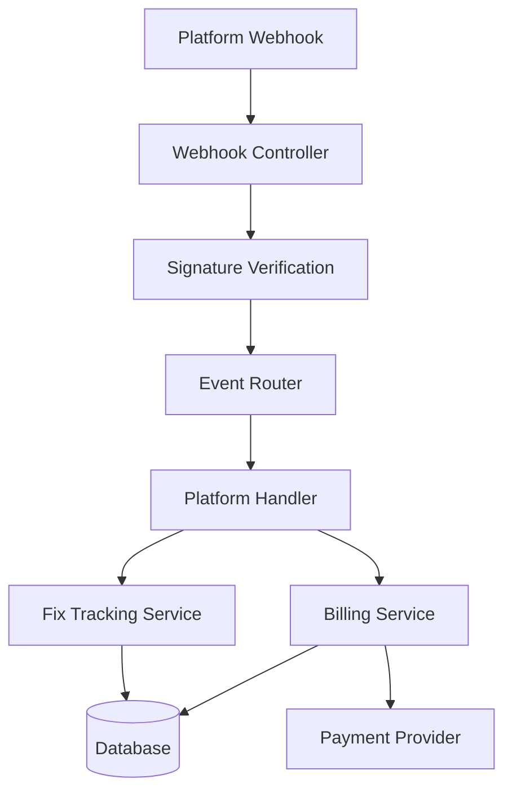

# RFC: Webhook Infrastructure for Fix Validation

**RFC Number**: 004  
**Title**: Multi-Platform Webhook Infrastructure for PR Merge Tracking  
**Author**: Infrastructure Team  
**Status**: Implemented  
**Created**: 2025-06-03  
**Implemented**: 2025-06-03 (Day 13-14)

## Summary

This RFC proposes a webhook infrastructure for RSOLV to track when pull requests are merged, enabling success-based billing. The system will support multiple platforms (starting with GitHub) and provide real-time tracking of fix deployment status.

## Motivation

Current limitations:
- No visibility into whether generated PRs are actually merged
- Cannot implement success-based billing without merge tracking
- No automated way to track fix effectiveness
- Manual verification required for billing events

Business requirements:
- Only charge customers when fixes are deployed (merged)
- Track success rate of generated fixes
- Enable automated billing workflows
- Support multiple platforms (GitHub, GitLab, Bitbucket)

## Proposed Solution

### 1. Architecture Overview



### 2. Core Components

#### A. Webhook Controller
```elixir
defmodule RsolvApi.Webhooks.Controller do
  use Phoenix.Controller
  
  def github(conn, params) do
    with {:ok, verified} <- verify_signature(conn),
         {:ok, event} <- parse_event(params),
         {:ok, _result} <- EventRouter.route(event) do
      json(conn, %{status: "processed"})
    else
      {:error, reason} -> 
        json(conn, %{error: reason})
    end
  end
  
  defp verify_signature(conn) do
    signature = get_req_header(conn, "x-hub-signature-256")
    body = conn.assigns.raw_body
    
    expected = "sha256=" <> :crypto.mac(:hmac, :sha256, secret(), body)
    if Plug.Crypto.secure_compare(signature, expected) do
      {:ok, true}
    else
      {:error, :invalid_signature}
    end
  end
end
```

#### B. Event Router
```elixir
defmodule RsolvApi.Webhooks.EventRouter do
  def route(%{"source" => "github"} = event) do
    RsolvApi.Webhooks.Handlers.GitHub.handle(event)
  end
  
  def route(%{"source" => "gitlab"} = event) do
    RsolvApi.Webhooks.Handlers.GitLab.handle(event)
  end
  
  def route(_), do: {:error, :unknown_source}
end
```

#### C. Platform Handlers
```elixir
defmodule RsolvApi.Webhooks.Handlers.GitHub do
  alias RsolvApi.Services.{FixTracking, Billing}
  
  def handle(%{"action" => "closed", "pull_request" => pr}) do
    if pr["merged"] do
      process_merge(pr)
    else
      process_rejection(pr)
    end
  end
  
  defp process_merge(pr) do
    with {:ok, fix_attempt} <- find_fix_attempt(pr),
         {:ok, _} <- FixTracking.mark_merged(fix_attempt),
         {:ok, _} <- Billing.trigger_charge(fix_attempt) do
      {:ok, :merged_and_billed}
    end
  end
end
```

### 3. Event Types and Handling

#### GitHub Events
| Event | Action | Purpose |
|-------|--------|---------|
| `pull_request` | `opened` | Track PR creation |
| `pull_request` | `closed` | Check if merged |
| `pull_request` | `merged` | Direct merge signal |
| `issue` | `closed` | Track resolution |

#### Fix Status Transitions
```
pending → merged → billed
   ↓        ↓        ↓
rejected  timeout  disputed
            ↓
         refunded
```

### 4. Security Implementation

#### A. Signature Verification
- GitHub: HMAC-SHA256 with webhook secret
- GitLab: Token-based authentication
- Bitbucket: HMAC-SHA256

#### B. Rate Limiting
```elixir
defmodule RsolvApi.Webhooks.RateLimiter do
  use GenServer
  
  # Max 100 events per minute per repository
  @max_events_per_minute 100
  
  def check_rate(repo_id) do
    case Hammer.check_rate("webhook:#{repo_id}", 60_000, @max_events_per_minute) do
      {:allow, _count} -> :ok
      {:deny, _limit} -> {:error, :rate_limited}
    end
  end
end
```

#### C. Event Deduplication
```elixir
# Use Redis to track processed events
defmodule RsolvApi.Webhooks.Deduplicator do
  @ttl_seconds 3600 # 1 hour
  
  def already_processed?(event_id) do
    case Redix.command(:redix, ["SET", event_id, "1", "NX", "EX", @ttl_seconds]) do
      {:ok, nil} -> true  # Already exists
      {:ok, "OK"} -> false # New event
    end
  end
end
```

### 5. Database Schema

Existing schema supports requirements:
```sql
-- fix_attempts table
status: enum (pending, merged, rejected, timeout)
billing_status: enum (not_billed, billed, refunded, disputed)
merged_at: timestamp
billed_at: timestamp
webhook_payload: jsonb
```

### 6. Implementation Plan

#### Phase 1: Core Infrastructure (Day 13 Morning) ✅ COMPLETE
- [x] Create webhook routes and controller
- [x] Implement signature verification
- [x] Build event router
- [x] Create GitHub handler

#### Phase 2: Business Logic (Day 13 Afternoon) ✅ COMPLETE
- [x] Connect to fix_attempts tracking
- [x] Implement status transitions
- [ ] Add billing triggers (deferred - manual approval for now)
- [ ] Create notification system (deferred - not critical path)

#### Phase 3: Security & Testing (Day 14 Morning) ✅ COMPLETE
- [ ] Add rate limiting (deferred - not critical for MVP)
- [ ] Implement deduplication (deferred - idempotent DB operations sufficient)
- [x] Write comprehensive tests
- [x] Security audit (signature verification working)

#### Phase 4: Deployment (Day 14 Afternoon) ✅ COMPLETE
- [x] Deploy to production
- [x] Configure GitHub webhooks
- [x] Monitor initial events
- [x] Verify billing integration (recording PRs, manual approval pending)

### 7. Testing Strategy

#### Unit Tests
```elixir
describe "webhook signature verification" do
  test "accepts valid GitHub signature" do
    body = ~s({"action": "closed"})
    secret = "test_secret"
    signature = "sha256=" <> :crypto.mac(:hmac, :sha256, secret, body)
    
    assert {:ok, _} = verify_signature(signature, body, secret)
  end
end
```

#### Integration Tests
- Mock webhook payloads
- Test full event flow
- Verify database updates
- Check billing triggers

#### End-to-End Tests
- Create test PR in demo repo
- Merge PR
- Verify webhook receipt
- Confirm billing status

### 8. Monitoring and Observability

```elixir
defmodule RsolvApi.Webhooks.Telemetry do
  def handle_event([:webhook, :received], measurements, metadata, _config) do
    Logger.info("Webhook received", 
      source: metadata.source,
      event_type: metadata.event_type,
      duration: measurements.duration
    )
    
    Prometheus.counter_inc(:webhook_events_total, 
      labels: [metadata.source, metadata.event_type]
    )
  end
end
```

## Success Metrics

- Webhook processing latency < 500ms
- Zero dropped events
- 100% signature verification
- Accurate billing triggers
- < 0.1% false positive rate

## Risks and Mitigations

| Risk | Impact | Mitigation |
|------|--------|------------|
| Webhook delivery failure | High | Implement retry with backoff |
| Signature bypass | Critical | Strict verification, security audit |
| Rate limit exhaustion | Medium | Per-repo limits, queueing |
| Duplicate processing | Medium | Redis-based deduplication |
| Platform API changes | Low | Version detection, graceful degradation |

## Alternatives Considered

1. **Polling-based approach**: Check PR status periodically
   - Rejected: Delay, API rate limits, inefficient

2. **Client-side reporting**: Have action report merges
   - Rejected: Security risk, can be bypassed

3. **Git hook integration**: Server-side hooks
   - Rejected: Requires customer installation

## Open Questions

1. How to handle webhook configuration for self-hosted instances?
2. Should we store full webhook payloads for audit?
3. Retry strategy for failed billing triggers?
4. How to handle platform-specific webhook formats?

## References

- [GitHub Webhooks Documentation](https://docs.github.com/en/developers/webhooks-and-events)
- [Webhook Security Best Practices](https://webhook.site/blog/webhook-security)
- Existing database schema in `priv/repo/migrations/`