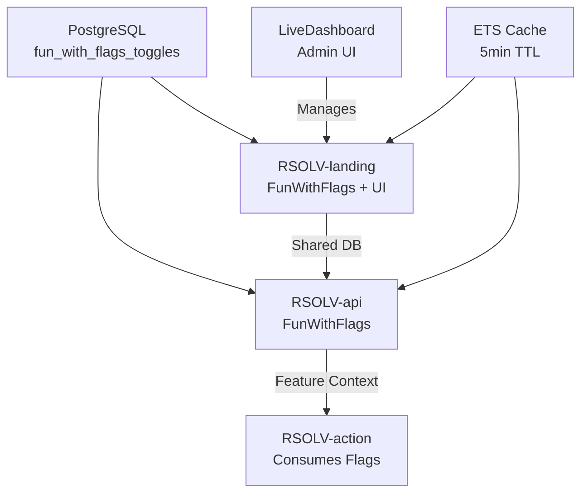

# RFC: Dynamic Feature Flags System

**RFC Number**: 005  
**Title**: Ecosystem-Wide Feature Flag Integration  
**Author**: Infrastructure Team  
**Status**: Draft  
**Created**: 2025-06-03  
**Implementation Started**: Partial (RSOLV-landing complete)

## Summary

This RFC proposes implementing a unified feature flag system across all RSOLV services using FunWithFlags. The system will enable dynamic feature control without deployments, A/B testing, gradual rollouts, and customer-specific feature enablement. RSOLV-landing already has FunWithFlags implemented; this RFC covers extending it to RSOLV-api and RSOLV-action.

## Motivation

Current limitations:
- Feature changes require deployments and pod restarts
- No ability to quickly disable problematic features
- Cannot do A/B testing or gradual rollouts
- No per-customer feature control
- Environment variables are static and inflexible

Business requirements:
- Enable/disable features without deployment
- Test new features with specific customers
- Quick rollback capability for issues
- Premium feature gating per customer
- Compliance with feature audit requirements

## Current State

| Service | Status | Feature Flag System |
|---------|--------|-------------------|
| RSOLV-landing | ✅ Complete | FunWithFlags with LiveDashboard |
| RSOLV-api | ❌ None | Uses environment variables |
| RSOLV-action | ⚠️ Minimal | Has `enableSecurityAnalysis` config flag |

## Proposed Solution

### 1. Architecture Overview



### 2. Implementation Design

#### A. Shared Database Architecture
```sql
-- Shared table between RSOLV-landing and RSOLV-api
CREATE TABLE fun_with_flags_toggles (
  id SERIAL PRIMARY KEY,
  flag_name VARCHAR(255) NOT NULL,
  gate_type VARCHAR(255) NOT NULL,
  target VARCHAR(255),
  enabled BOOLEAN NOT NULL DEFAULT FALSE,
  created_at TIMESTAMP DEFAULT CURRENT_TIMESTAMP,
  updated_at TIMESTAMP DEFAULT CURRENT_TIMESTAMP
);

CREATE UNIQUE INDEX idx_unique_flag_gate ON fun_with_flags_toggles(flag_name, gate_type, target);
```

#### B. RSOLV-api Integration
```elixir
# config/config.exs
config :fun_with_flags, :persistence,
  adapter: FunWithFlags.Store.Persistent.Ecto,
  repo: RsolvApi.Repo

config :fun_with_flags, :cache,
  enabled: true,
  ttl: 300 # 5 minutes

# lib/rsolv_api/application.ex
children = [
  RsolvApi.Repo,
  FunWithFlags.Supervisor,
  {Phoenix.PubSub, name: RsolvApi.PubSub},
  RsolvApiWeb.Endpoint
]
```

#### C. Feature Flag Categories

1. **System Features**
   - `slack_notifications` - Enable Slack integration
   - `ai_provider_anthropic` - Enable Anthropic AI
   - `ai_provider_openai` - Enable OpenAI
   - `ai_provider_ollama` - Enable Ollama
   - `security_analysis` - Enable security scanning
   - `educational_content` - Three-tier explanations

2. **Business Features**
   - `webhook_billing` - Success-based billing triggers
   - `dynamic_rate_limiting` - Per-customer rate limits
   - `business_impact_calculation` - ROI calculations
   - `expert_review_system` - Human review requests

3. **Customer-Specific**
   - `premium_features` - Premium tier access
   - `beta_features` - Early access features
   - `custom_integrations` - Customer-specific integrations

### 3. API Endpoint Design

```elixir
# GET /api/v1/feature-flags
defmodule RsolvApiWeb.FeatureFlagController do
  use RsolvApiWeb, :controller
  
  def index(conn, _params) do
    customer = conn.assigns.current_customer
    
    flags = %{
      system: %{
        slack_notifications: enabled?(:slack_notifications),
        security_analysis: enabled?(:security_analysis),
        educational_content: enabled?(:educational_content)
      },
      customer: %{
        premium_features: enabled?(:premium_features, for_actor(customer)),
        beta_features: enabled?(:beta_features, for_actor(customer)),
        rate_limit: get_rate_limit(customer)
      }
    }
    
    json(conn, flags)
  end
  
  defp for_actor(customer) do
    %FunWithFlags.Actor{id: customer.id, groups: customer.groups}
  end
end
```

### 4. RSOLV-action Integration

```typescript
// src/types/credentials.ts
export interface VendedCredentials {
  token: string;
  expiresAt: Date;
  featureFlags: FeatureFlags;
}

export interface FeatureFlags {
  system: {
    slackNotifications: boolean;
    securityAnalysis: boolean;
    educationalContent: boolean;
  };
  customer: {
    premiumFeatures: boolean;
    betaFeatures: boolean;
    rateLimit: number;
  };
}

// src/credentials/manager.ts
export class CredentialManager {
  async getCredentials(): Promise<VendedCredentials> {
    const response = await fetch(`${API_URL}/credentials/vend`, {
      headers: { 'Authorization': `Bearer ${this.apiKey}` }
    });
    
    const data = await response.json();
    return {
      token: data.token,
      expiresAt: new Date(data.expiresAt),
      featureFlags: data.featureFlags // Now includes flags
    };
  }
}

// Usage in workflow
if (credentials.featureFlags.system.securityAnalysis) {
  await performSecurityAnalysis(code);
}
```

### 5. LiveDashboard UI Access

```elixir
# router.ex - Already in RSOLV-landing
import Phoenix.LiveDashboard.Router

scope "/live" do
  pipe_through [:browser, :admin_auth]
  
  live_dashboard "/dashboard",
    metrics: RsolvLandingWeb.Telemetry,
    additional_pages: [
      feature_flags: FunWithFlagsUI.Router
    ]
end
```

### 6. Implementation Phases

#### Phase 1: Pre-Production Tasks (1 day)
- [ ] Verify production database migrations
- [ ] Document admin access procedures
- [ ] Set up monitoring and alerts
- [ ] Create flag lifecycle documentation

#### Phase 2: RSOLV-api Integration (2-3 days)
- [ ] Add FunWithFlags dependencies
- [ ] Configure shared database
- [ ] Implement feature flag endpoint
- [ ] Migrate environment variables to flags
- [ ] Add flag checks throughout codebase
- [ ] Write comprehensive tests

#### Phase 3: RSOLV-action Integration (2-3 days)
- [ ] Update credential vending to include flags
- [ ] Modify TypeScript interfaces
- [ ] Add flag consumption logic
- [ ] Update workflow conditionals
- [ ] Test flag propagation

#### Phase 4: Production Deployment (1 day)
- [ ] Deploy RSOLV-landing (already has flags)
- [ ] Run database migrations
- [ ] Deploy RSOLV-api with flags
- [ ] Deploy RSOLV-action updates
- [ ] Verify flag propagation
- [ ] Test emergency rollback

### 7. Testing Strategy

```elixir
# Unit test example
describe "feature flags" do
  test "returns correct flags for premium customer" do
    customer = insert(:customer, tier: :premium)
    FunWithFlags.enable(:premium_features, for_actor: actor(customer))
    
    conn = get(conn, "/api/v1/feature-flags")
    
    assert json_response(conn, 200)["customer"]["premium_features"] == true
  end
end

# Integration test
test "action respects security analysis flag" do
  FunWithFlags.disable(:security_analysis)
  
  {:ok, result} = Workflow.run(issue)
  
  refute result.security_analysis_performed
end
```

## Success Metrics

- Zero-downtime feature changes
- < 5 minute flag propagation time
- 50% reduction in emergency deployments
- Successful A/B tests on 3+ features
- No performance degradation from flag checks

## Risks and Mitigations

| Risk | Impact | Mitigation |
|------|--------|------------|
| Cache inconsistency | Medium | Shared database, 5-min TTL |
| Flag sprawl | Low | Quarterly cleanup reviews |
| Performance impact | Medium | ETS caching, monitoring |
| Admin access abuse | High | Audit logs, restricted access |
| Database failure | High | Read-through cache, defaults |

## Alternatives Considered

1. **Environment Variables**: Current approach
   - Rejected: Requires restarts, not dynamic

2. **Redis-based System**: Custom implementation
   - Rejected: More complexity, FunWithFlags is proven

3. **External Service**: LaunchDarkly, Split.io
   - Rejected: Cost, data residency concerns

4. **Configuration Files**: YAML/JSON configs
   - Rejected: Still requires deployments

## Migration Strategy

1. **Identify All Config Points**
   ```bash
   grep -r "System.get_env" lib/
   grep -r "process.env" src/
   ```

2. **Prioritize Migration**
   - Critical: Rate limits, feature gates
   - Important: AI provider selection
   - Nice-to-have: Logging levels

3. **Gradual Migration**
   - Keep env vars as fallback initially
   - Move to flags one at a time
   - Remove env vars after verification

## Open Questions

1. Should we implement percentage-based rollouts immediately?
2. How long to retain flag change history?
3. Should customer success have flag management access?
4. Integration with monitoring/alerting systems?
5. Flag naming conventions and namespacing?

## References

- [FunWithFlags Documentation](https://github.com/tompave/fun_with_flags)
- [Feature Flag Best Practices](https://launchdarkly.com/blog/feature-flag-best-practices/)
- Existing implementation in RSOLV-landing