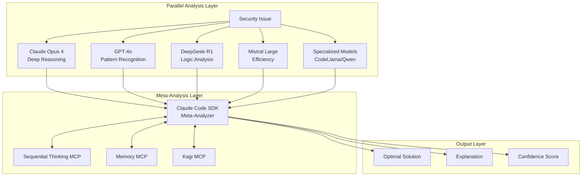

# RFC: Multi-Model Security Resolution System

**RFC Number**: 006  
**Title**: Parallel AI Analysis with Meta-Synthesis for Security Fixes  
**Author**: AI/Security Team  
**Status**: Draft  
**Created**: 2025-06-03  
**Estimated Implementation**: 8-10 weeks

## Summary

This RFC proposes a revolutionary approach to automated security issue resolution by running multiple AI models in parallel and using Claude Code SDK with MCP integrations as an intelligent meta-analyzer. Based on the "wasting inferences" philosophy, this system achieves superior security fix quality through ensemble analysis and continuous learning.

## Motivation

Current limitations:
- Single model analysis can miss edge cases
- No consensus mechanism for critical security decisions
- Limited real-time threat intelligence integration
- Lack of continuous learning from past fixes
- Single point of failure in AI reasoning

Opportunity:
- AI inference costs dropping rapidly
- Multiple models provide diverse perspectives
- Ensemble approaches proven in security research
- MCP ecosystem enables sophisticated meta-analysis
- Creates defensible competitive moat

## Proposed Solution

### 1. Architecture Overview



### 2. Model Specialization Matrix

| Model | Strength | Security Focus | Cost/1K tokens |
|-------|----------|----------------|----------------|
| Claude Opus 4 | Deep reasoning | Auth flows, access control | $0.015 |
| GPT-4o | Pattern matching | Injection, XSS patterns | $0.010 |
| DeepSeek-R1 | Logic chains | Race conditions, state | $0.002 |
| Mistral Large | Fast analysis | OWASP Top 10 | $0.008 |
| Specialized | Domain expertise | Language-specific | Varies |

### 3. MCP Integration Design

#### A. Sequential Thinking MCP
```typescript
interface SequentialAnalysis {
  analyzeProposedFixes(fixes: ModelFix[]): Promise<{
    synthesis: SecurityFix;
    reasoning: ThoughtChain[];
    edgeCases: EdgeCase[];
    confidence: number;
  }>;
}

// Example thought chain for SQL injection fix
const thoughtChain = [
  { step: 1, thought: "All models agree on parameterized queries" },
  { step: 2, thought: "GPT-4o suggests additional input validation" },
  { step: 3, thought: "DeepSeek identifies potential DoS via regex" },
  { step: 4, thought: "Synthesizing comprehensive fix with all concerns" },
  { step: 5, revision: true, thought: "Adding rate limiting per Mistral suggestion" }
];
```

#### B. Memory MCP Integration
```typescript
interface SecurityMemory {
  // Track model performance
  modelPerformance: Map<ModelId, {
    vulnerabilityType: string;
    successRate: number;
    avgConfidence: number;
  }>;
  
  // Store successful patterns
  fixPatterns: Map<VulnerabilityType, FixPattern[]>;
  
  // Customer-specific knowledge
  customerContext: Map<CustomerId, SecurityPreferences>;
  
  // Edge case database
  edgeCases: EdgeCaseDatabase;
}
```

#### C. Kagi MCP for Real-time Intelligence
```typescript
interface SecurityIntelligence {
  searchLatestCVEs(vulnerability: string): Promise<CVE[]>;
  checkOWASPGuidelines(issueType: string): Promise<Guidelines>;
  findSimilarVulnerabilities(pattern: string): Promise<Similar[]>;
  getFrameworkUpdates(framework: string): Promise<SecurityUpdate[]>;
}
```

### 4. Workflow Implementation

```typescript
class MultiModelSecurityResolver {
  async resolveSecurityIssue(issue: SecurityIssue): Promise<Resolution> {
    // 1. Classify severity for model selection
    const severity = await this.classifySeverity(issue);
    const models = this.selectModels(severity);
    
    // 2. Parallel analysis
    const analyses = await Promise.all(
      models.map(model => model.analyze(issue))
    );
    
    // 3. Meta-analysis with Claude Code SDK
    const metaAnalysis = await this.claudeCodeSDK.analyze({
      issue,
      modelResults: analyses,
      mcp: {
        sequential: await this.sequentialThinking.process(analyses),
        memory: await this.memory.getRelevantPatterns(issue),
        kagi: await this.kagi.getCurrentIntelligence(issue)
      }
    });
    
    // 4. Generate comprehensive solution
    return {
      fix: metaAnalysis.optimalFix,
      explanation: metaAnalysis.reasoning,
      confidence: metaAnalysis.confidence,
      alternativeFixes: metaAnalysis.alternatives,
      edgeCases: metaAnalysis.edgeCases
    };
  }
}
```

### 5. Tiered Analysis System

```typescript
enum SecurityTier {
  CRITICAL = "critical",  // 5 models + full MCP suite (~$1.00)
  HIGH = "high",         // 3 models + memory/sequential (~$0.50)
  MEDIUM = "medium"      // 2 models + sequential only (~$0.20)
}

const tierConfiguration = {
  [SecurityTier.CRITICAL]: {
    models: ['claude-opus-4', 'gpt-4o', 'deepseek-r1', 'mistral-large', 'specialized'],
    mcps: ['sequential', 'memory', 'kagi'],
    maxAnalysisTime: 120 // seconds
  },
  [SecurityTier.HIGH]: {
    models: ['claude-opus-4', 'gpt-4o', 'mistral-large'],
    mcps: ['sequential', 'memory'],
    maxAnalysisTime: 60
  },
  [SecurityTier.MEDIUM]: {
    models: ['mistral-large', 'deepseek-r1'],
    mcps: ['sequential'],
    maxAnalysisTime: 30
  }
};
```

### 6. Continuous Learning System

```sql
-- Performance tracking schema
CREATE TABLE model_performance (
  id SERIAL PRIMARY KEY,
  model_id VARCHAR(50),
  vulnerability_type VARCHAR(100),
  fix_id UUID,
  was_merged BOOLEAN,
  confidence_score FLOAT,
  edge_cases_found INTEGER,
  customer_satisfaction INTEGER,
  created_at TIMESTAMP DEFAULT CURRENT_TIMESTAMP
);

-- Pattern storage
CREATE TABLE successful_patterns (
  id SERIAL PRIMARY KEY,
  vulnerability_type VARCHAR(100),
  pattern_signature TEXT,
  model_consensus JSONB,
  times_used INTEGER DEFAULT 1,
  success_rate FLOAT,
  last_used TIMESTAMP
);
```

## Implementation Plan

### Phase 1: Infrastructure (Weeks 1-2)
- [ ] Design parallel execution manager
- [ ] Create model adapter interfaces
- [ ] Implement result aggregation service
- [ ] Set up monitoring and telemetry

### Phase 2: Model Integration (Weeks 3-4)
- [ ] Integrate 5 primary models
- [ ] Create unified response format
- [ ] Implement error handling and fallbacks
- [ ] Add model performance tracking

### Phase 3: Meta-Analysis (Weeks 5-6)
- [ ] Integrate Claude Code SDK
- [ ] Implement synthesis algorithms
- [ ] Create confidence scoring system
- [ ] Build explanation generator

### Phase 4: MCP Integration (Weeks 7-8)
- [ ] Add Sequential Thinking MCP
- [ ] Integrate Memory MCP
- [ ] Connect Kagi MCP
- [ ] Create feedback loops

### Phase 5: Testing & Optimization (Weeks 9-10)
- [ ] Comprehensive security testing
- [ ] Performance optimization
- [ ] A/B testing framework
- [ ] Customer pilot program

## Success Metrics

- **Quality**: 95%+ accuracy in security fixes
- **Coverage**: Handle 100% of OWASP Top 10
- **Performance**: < 2 minutes for critical issues
- **Learning**: 20% improvement after 100 fixes
- **Cost**: < $1.50 per critical issue
- **Satisfaction**: 90%+ developer approval

## Cost Analysis

| Severity | Models | MCPs | Cost/Issue | Current Cost | ROI |
|----------|--------|------|------------|--------------|-----|
| Critical | 5 | All | ~$1.30 | $200 (manual) | 154x |
| High | 3 | 2 | ~$0.65 | $100 (manual) | 154x |
| Medium | 2 | 1 | ~$0.25 | $50 (manual) | 200x |

## Risks and Mitigations

| Risk | Impact | Mitigation |
|------|--------|------------|
| Model API failures | High | Fallback chains, caching |
| Cost overruns | Medium | Tiered system, monitoring |
| Analysis paralysis | Medium | Time limits, defaults |
| Conflicting fixes | High | Synthesis algorithm, testing |
| Performance issues | Medium | Async processing, queues |

## Alternatives Considered

1. **Sequential Model Chain**: One model reviews another
   - Rejected: Slower, less diverse perspectives

2. **Single Premium Model**: Use only Claude Opus 4
   - Rejected: Misses specialized insights

3. **Voting System**: Simple majority wins
   - Rejected: Lacks intelligent synthesis

4. **Human Review**: Expert security review
   - Rejected: Doesn't scale, expensive

## Future Enhancements

1. **Custom Model Training**
   - Fine-tune models on customer codebases
   - Specialized vulnerability detection

2. **Predictive Security**
   - Identify vulnerabilities before they're exploited
   - Proactive security recommendations

3. **Integration Ecosystem**
   - SAST/DAST tool integration
   - CI/CD security gates
   - Compliance reporting

## Open Questions

1. How to handle model disagreements on critical issues?
2. Should we allow customers to select model combinations?
3. Integration with existing security tools (Snyk, etc.)?
4. How to price this premium offering?
5. Open-source some components for credibility?

## References

- [Ensemble Methods in Security](https://arxiv.org/abs/security-ensemble)
- [MCP Documentation](https://modelcontextprotocol.org)
- [Claude Code SDK](https://github.com/anthropics/claude-code-sdk)
- [Multi-Model Systems](https://papers.ai/multi-model-systems)