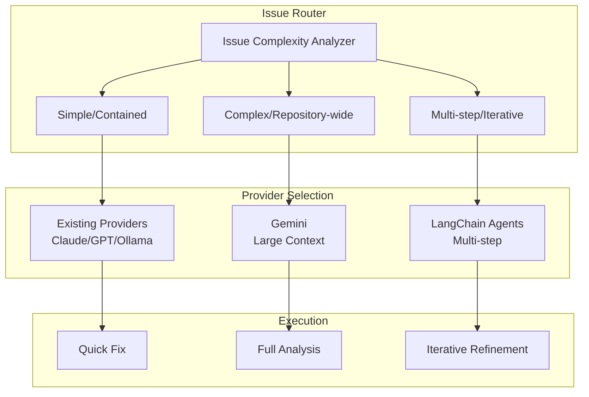
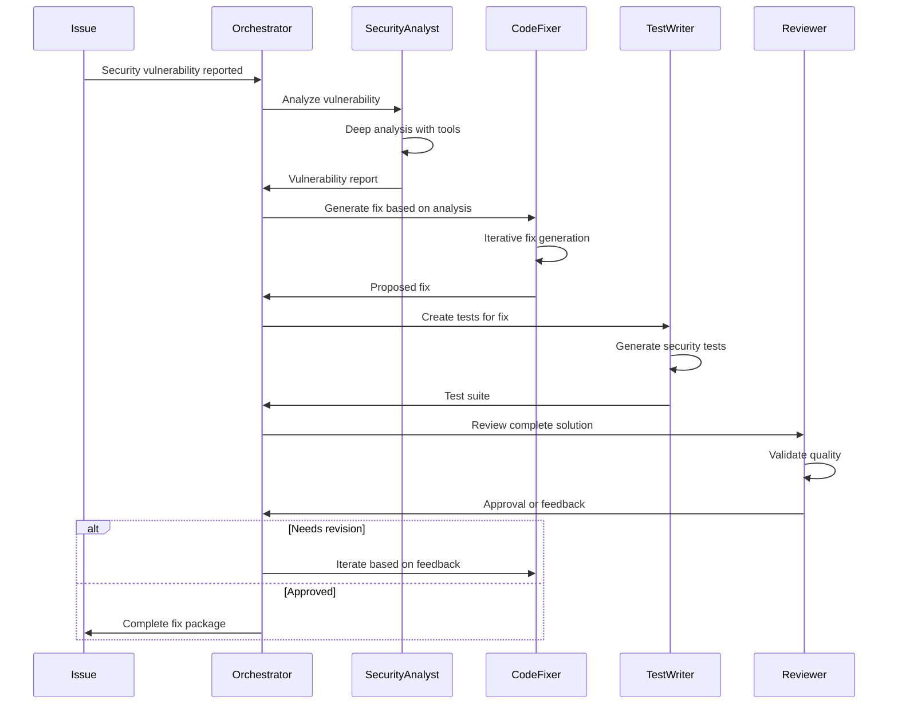

# RFC: AI Provider Expansion - Gemini and LangChain Integration

**RFC Number**: 007  
**Title**: Expanding AI Capabilities with Gemini and LangChain Agents  
**Author**: AI Team  
**Status**: Partially Implemented  
**Created**: 2025-06-03  
**Updated**: 2025-06-22  
**Estimated Implementation**: 9 weeks (Claude Code complete, others pending)

## Summary

This RFC proposes expanding RSOLV's AI capabilities by integrating Google Gemini for large-context analysis and LangChain for multi-agent reasoning systems. Gemini's 1M token context window enables full repository analysis, while LangChain agents provide iterative, tool-using capabilities for complex security fixes.

**Update (2025-06-22)**: Claude Code has been successfully integrated via TypeScript SDK, providing sophisticated context-gathering capabilities that partially address the goals of this RFC. See ADR-011 for implementation details.

## Motivation

Current limitations (partially addressed by Claude Code):
- Context window limits prevent full repository understanding *(Claude Code helps with intelligent context selection)*
- Single-shot analysis misses iterative refinement opportunities
- No persistent memory across fix attempts
- Limited tool use for dynamic analysis
- Cannot handle complex multi-file security issues effectively *(Claude Code excels at multi-file understanding)*

Opportunities:
- Gemini's 1M token context enables repository-wide analysis
- LangChain agents can iterate and use tools
- Multi-step reasoning improves fix quality
- Agent memory enables learning within sessions

## Proposed Solution

### 1. Architecture Overview



### 2. Google Gemini Integration

#### A. Capabilities
```typescript
interface GeminiCapabilities {
  contextWindow: 1_000_000; // tokens
  features: [
    "full-repository-analysis",
    "cross-file-dependency-tracking",
    "monorepo-support",
    "architectural-understanding"
  ];
}
```

#### B. Implementation
```typescript
// src/ai/adapters/gemini.ts
export class GeminiAdapter implements AIProvider {
  async analyze(issue: SecurityIssue, context: RepoContext): Promise<Analysis> {
    // Prepare large context
    const fullContext = await this.buildRepositoryContext(context);
    
    // Analyze with full repository understanding
    const response = await this.gemini.generateContent({
      model: 'gemini-1.5-pro',
      contents: [{
        parts: [
          { text: this.buildPrompt(issue) },
          { text: fullContext } // Up to 1M tokens
        ]
      }],
      generationConfig: {
        temperature: 0.1,
        maxOutputTokens: 8192
      }
    });
    
    return this.parseAnalysis(response);
  }
  
  private async buildRepositoryContext(context: RepoContext): Promise<string> {
    // Include all relevant files, dependencies, and architecture
    const files = await this.gatherRelevantFiles(context);
    const dependencies = await this.analyzeDependencyGraph(context);
    const architecture = await this.inferArchitecture(files);
    
    return this.formatContext({ files, dependencies, architecture });
  }
}
```

#### C. Use Cases
| Scenario | Why Gemini | Example |
|----------|------------|---------|
| Monorepo Security | Needs cross-package context | Auth leak across microservices |
| Dependency Chains | Full graph understanding | Transitive vulnerability propagation |
| Architecture Refactoring | Repository-wide patterns | Moving from REST to GraphQL |
| Complex Migrations | Historical context needed | Database schema security updates |

### 3. LangChain Agent Framework

#### A. Agent Architecture
```python
# Pseudo-code for agent structure
class SecurityFixAgent:
    def __init__(self):
        self.tools = [
            CodeSearchTool(),
            TestExecutionTool(),
            SecurityScannerTool(),
            DependencyAnalyzerTool(),
            GitOperationsTool()
        ]
        
        self.memory = ConversationBufferMemory()
        self.llm = ChatAnthropic(model="claude-3-opus")
        
        self.agent = initialize_agent(
            tools=self.tools,
            llm=self.llm,
            agent=AgentType.STRUCTURED_CHAT_ZERO_SHOT_REACT_DESCRIPTION,
            memory=self.memory,
            verbose=True
        )
    
    async def fix_security_issue(self, issue):
        # Multi-step reasoning process
        steps = [
            "1. Analyze the security vulnerability",
            "2. Search for all affected code locations",
            "3. Generate initial fix proposal",
            "4. Run security tests on fix",
            "5. Iterate if tests fail",
            "6. Validate no regressions introduced",
            "7. Generate final fix with explanation"
        ]
        
        return await self.agent.run(
            input=f"Fix security issue: {issue}",
            steps=steps
        )
```

#### B. Specialized Agents
```typescript
interface AgentRoles {
  securityAnalyst: {
    purpose: "Deep vulnerability analysis";
    tools: ["CVEDatabase", "OWASPChecker", "DependencyScanner"];
    expertise: ["threat-modeling", "attack-vectors", "security-patterns"];
  };
  
  codeFixer: {
    purpose: "Generate and validate fixes";
    tools: ["CodeGenerator", "TestRunner", "LintChecker"];
    expertise: ["refactoring", "best-practices", "performance"];
  };
  
  testWriter: {
    purpose: "Create comprehensive test coverage";
    tools: ["TestGenerator", "CoverageAnalyzer", "MutationTester"];
    expertise: ["edge-cases", "security-tests", "regression-tests"];
  };
  
  reviewer: {
    purpose: "Validate solution quality";
    tools: ["CodeReviewer", "SecurityAuditor", "PerformanceProfiler"];
    expertise: ["code-quality", "security-standards", "maintainability"];
  };
}
```

#### C. Multi-Agent Collaboration


### 4. Decision Framework

```typescript
class AIProviderSelector {
  selectProvider(issue: SecurityIssue): AIProvider {
    const complexity = this.assessComplexity(issue);
    
    if (complexity.requiresFullRepoContext) {
      return new GeminiProvider();
    }
    
    if (complexity.requiresIteration || complexity.multiStep) {
      return new LangChainAgentProvider();
    }
    
    if (complexity.simple && complexity.isolated) {
      return this.selectTraditionalProvider();
    }
    
    // Default to multi-model approach (RFC-006)
    return new MultiModelProvider();
  }
  
  private assessComplexity(issue: SecurityIssue): ComplexityAssessment {
    return {
      fileCount: this.estimateAffectedFiles(issue),
      requiresFullRepoContext: this.needsArchitecturalUnderstanding(issue),
      requiresIteration: this.needsRefinement(issue),
      multiStep: this.requiresMultipleOperations(issue),
      crossRepository: this.spannsMultipleRepos(issue)
    };
  }
}
```

## Credential Management

### Integration with Credential Vending System

All new AI providers (Gemini, LangChain) will integrate with RSOLV's credential vending architecture:

```typescript
// Example: Gemini integration with credential vending
export class GeminiAdapter implements AIProvider {
  private credentialManager: RSOLVCredentialManager;
  
  constructor() {
    this.credentialManager = new RSOLVCredentialManager();
  }
  
  async initialize(): Promise<void> {
    // Get Gemini credentials from RSOLV API
    const credentials = await this.credentialManager.getAICredentials('gemini');
    
    // Initialize Gemini client with vended credentials
    this.client = new GoogleGenerativeAI(credentials.apiKey);
    
    // Set up automatic refresh
    this.credentialManager.onRefresh('gemini', (newCreds) => {
      this.client.updateApiKey(newCreds.apiKey);
    });
  }
}
```

### Benefits
- Customers only need RSOLV_API_KEY
- No Gemini API key management required
- Automatic credential rotation
- Usage tracking and limits per customer
- Enhanced security - keys never exposed

## Implementation Plan

**Update**: Claude Code integration (✅ Complete - see ADR-011) has provided sophisticated context-gathering capabilities that address some of the goals below. The remaining phases focus on Gemini and LangChain integration.

### Phase 1: Gemini Integration (Weeks 1-2)
- [ ] Create Gemini API client and adapter
- [ ] Integrate with credential vending system
- [ ] Implement context building system
- [ ] Add large file handling and chunking
- [ ] Create Gemini-specific prompts
- [ ] Benchmark vs existing providers

### Phase 2: LangChain Foundation (Weeks 3-4)
- [ ] Set up LangChain framework
- [ ] Create base agent architecture
- [ ] Implement core tools (search, scan, test)
- [ ] Build memory system
- [ ] Create orchestration layer

### Phase 3: Specialized Agents (Weeks 5-7)
- [ ] Implement Security Analyst agent
- [ ] Create Code Fixer agent
- [ ] Build Test Writer agent
- [ ] Develop Reviewer agent
- [ ] Test multi-agent collaboration

### Phase 4: Integration & Optimization (Weeks 8-9)
- [ ] Integrate with existing RSOLV workflow
- [ ] Create provider selection logic
- [ ] Optimize performance
- [ ] Add monitoring and telemetry
- [ ] Documentation and training

## Success Metrics

- **Gemini Performance**: Handle 100MB+ repositories
- **Agent Success Rate**: 90%+ complex issue resolution
- **Iteration Efficiency**: < 5 iterations average
- **Cost Efficiency**: < $5 per complex issue
- **Time to Fix**: < 10 minutes for complex issues

## Cost Analysis

| Provider | Cost Model | Estimated per Issue |
|----------|------------|-------------------|
| Gemini 1.5 Pro | $0.00125/1K tokens | $1.25 (1M context) |
| LangChain Agents | Multiple LLM calls | $2-4 (5-10 iterations) |
| Combined Approach | Selective use | $0.50-2.00 average |

## Risks and Mitigations

| Risk | Impact | Mitigation |
|------|--------|------------|
| Gemini API limits | High | Implement caching, chunking |
| Agent complexity | Medium | Start simple, iterate |
| Cost overruns | High | Smart routing, monitoring |
| Integration complexity | Medium | Phased rollout |
| Latency | Medium | Async processing, caching |

## Alternatives Considered

1. **Custom Large Context Model**: Train our own
   - Rejected: Expensive, time-consuming

2. **Simple Tool Calling**: Just add tools to existing providers
   - Rejected: Lacks sophisticated reasoning

3. **Human-in-the-loop**: Manual iteration
   - Rejected: Doesn't scale

## Future Enhancements

1. **Custom Gemini Fine-tuning**
   - Train on security-specific patterns
   - Optimize for code understanding

2. **Agent Learning System**
   - Persistent memory across sessions
   - Pattern recognition and reuse

3. **Hybrid Approaches**
   - Gemini for analysis, agents for fixing
   - Multi-provider consensus

## Open Questions

1. Should we expose provider choice to customers?
2. How to handle Gemini rate limits effectively?
3. Agent conversation history retention policy?
4. Integration with multi-model approach (RFC-006)?
5. Pricing model for complex, multi-step fixes?

## References

- [Gemini API Documentation](https://ai.google.dev/gemini-api/docs)
- [LangChain Documentation](https://python.langchain.com/docs/get_started/introduction)
- [Building LLM Agents](https://www.pinecone.io/learn/series/langchain/langchain-agents/)
- [Large Context Window Applications](https://arxiv.org/abs/2404.02060)