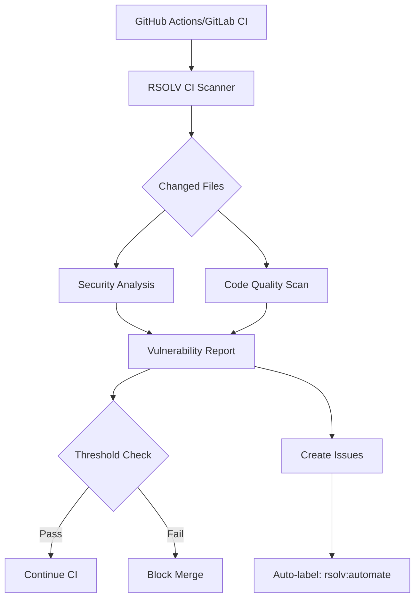

# RFC: CI/CD Integration for Continuous Security Scanning

**RFC Number**: 009  
**Title**: Continuous Security Scanning via CI/CD Integration  
**Author**: Infrastructure Team  
**Status**: Draft  
**Created**: 2025-01-06  

## Summary

This RFC proposes extending RSOLV beyond issue-based triggers to provide continuous security scanning integrated into CI/CD pipelines. This enables proactive vulnerability detection on every commit, PR, and deployment.

## Motivation

Current limitations:
- Only scans when issues are manually labeled
- Misses vulnerabilities introduced between issue creation
- No preventive scanning before code reaches main branch
- Reactive rather than proactive security posture

Market research findings:
- 39M secrets leaked on GitHub in 2024
- "Shift left" security is the #1 enterprise requirement
- CI/CD integration is table stakes for security tools
- Developers want security in existing workflows, not separate tools

Business opportunity:
- Expand addressable market beyond issue resolution
- Increase fix volume per customer (more findings = more revenue)
- Competitive parity with Snyk, SonarQube, etc.
- Higher customer retention through deeper integration

## Proposed Solution

### 1. Architecture Overview



### 2. Implementation Modes

#### A. GitHub Actions Mode
```yaml
name: RSOLV Security Scan
on: [push, pull_request]

jobs:
  security-scan:
    runs-on: ubuntu-latest
    steps:
      - uses: actions/checkout@v4
      - uses: RSOLV-dev/security-scan@v1
        with:
          rsolv-api-key: ${{ secrets.RSOLV_API_KEY }}
          fail-on: high  # Fail build on high severity
          create-issues: true  # Auto-create issues for findings
          auto-fix: true  # Generate fix PRs automatically
```

#### B. Direct Integration Mode
```typescript
// src/ci/scanner.ts
export class CIScanner {
  async scanPullRequest(pr: PullRequestContext): Promise<ScanResult> {
    const changedFiles = await this.getChangedFiles(pr);
    const results = await this.securityAnalyzer.analyze(changedFiles);
    
    if (results.hasHighSeverity && this.config.blockOnHigh) {
      await this.blockMerge(pr, results);
    }
    
    if (this.config.createIssues) {
      await this.createIssuesFromFindings(results);
    }
    
    return results;
  }
}
```

### 3. Scanning Triggers

| Trigger | Purpose | Default Behavior |
|---------|---------|------------------|
| `push` | Scan commits to protected branches | Create issues for findings |
| `pull_request` | Pre-merge security gate | Comment on PR, optionally block |
| `schedule` | Regular security audits | Full repo scan, trend reports |
| `workflow_dispatch` | Manual security audit | Comprehensive scan with report |

### 4. Integration with Existing Features

#### A. Issue Creation
```typescript
async createIssuesFromFindings(findings: SecurityFinding[]): Promise<void> {
  for (const finding of findings) {
    const issue = await this.github.createIssue({
      title: `[Security] ${finding.type} in ${finding.file}`,
      body: this.formatFindingAsIssue(finding),
      labels: ['security', 'rsolv:automate', `severity:${finding.severity}`]
    });
    
    // Track for billing
    await this.rsolvApi.recordScanFinding({
      issueId: issue.id,
      source: 'ci-scan',
      severity: finding.severity
    });
  }
}
```

#### B. PR Comments
```markdown
## 🔒 RSOLV Security Scan Results

Found **3 security issues** in this PR:

### High Severity (1)
- **SQL Injection** in `src/api/users.js:45`
  ```javascript
  db.query(`SELECT * FROM users WHERE id = ${userId}`)
  ```
  **Fix Available**: RSOLV can automatically fix this issue. 
  [Create Fix PR](https://rsolv.dev/fix/abc123)

### Medium Severity (2)
- **Hardcoded Secret** in `config/app.js:12`
- **Insecure Random** in `src/crypto/token.js:8`

---
[View Full Report](https://rsolv.dev/scan/xyz789) | [Configure Scanning](https://rsolv.dev/settings)
```

### 5. Configuration Options

```yaml
# .github/rsolv-ci.yml
version: 1
scanning:
  # What to scan
  paths:
    include: ["src/**", "lib/**"]
    exclude: ["test/**", "vendor/**"]
  
  # When to fail builds
  thresholds:
    high: block      # Block merge on high severity
    medium: warn     # Warning only
    low: ignore      # Don't report
  
  # Issue creation
  issues:
    create: true
    auto-assign: true
    batch: true      # Group similar findings
  
  # Reporting
  reports:
    pr-comment: true
    summary-email: security@company.com
    sarif-export: true  # GitHub Security tab
```

### 6. Billing Model Integration

```typescript
// New billing events for CI scanning
enum BillingEvent {
  CI_SCAN_FINDING = 'ci_scan_finding',
  AUTO_FIX_FROM_SCAN = 'auto_fix_from_scan',
  BLOCKED_VULNERABILITY = 'blocked_vulnerability'
}

// Pricing considerations
- Per-scan pricing: $X per 1000 files scanned
- Per-finding pricing: $Y per actionable finding
- Included in Teams/Enterprise: Unlimited scanning
```

## Implementation Plan

### Phase 1: MVP GitHub Actions (3-5 days)
- [ ] Create GitHub Action for security scanning
- [ ] Integrate with existing security analyzer
- [ ] PR comment functionality
- [ ] Basic configuration options

### Phase 2: Issue Creation (2-3 days)
- [ ] Auto-create issues from findings
- [ ] Batch similar findings
- [ ] Link to fix generation

### Phase 3: Advanced Features (5-7 days)
- [ ] GitLab CI integration
- [ ] Bitbucket Pipelines support
- [ ] SARIF format export
- [ ] Trend analysis dashboard

### Phase 4: Performance & Scale (3-5 days)
- [ ] Incremental scanning (only changed files)
- [ ] Parallel analysis
- [ ] Results caching
- [ ] Large repository optimization

## Success Metrics

- 10x increase in findings per customer
- 50% of customers enable CI scanning
- < 30 second scan time for average PR
- 90% reduction in security issues reaching main
- 5x increase in fix volume (revenue)

## Risks and Mitigations

| Risk | Impact | Mitigation |
|------|--------|------------|
| CI pipeline slowdown | High | Incremental scanning, parallel processing |
| False positive fatigue | High | Tunable thresholds, ML-based filtering |
| Competition with existing tools | Medium | Superior fixes, not just detection |
| Resource consumption | Medium | Efficient scanning, caching |

## Alternatives Considered

1. **Webhook-only approach**: React to push events
   - Rejected: Less integrated, requires customer setup

2. **IDE plugin first**: Catch issues during development
   - Rejected: Adoption friction, limited reach

3. **Standalone CLI tool**: Separate scanning binary
   - Rejected: Another tool to manage, less integrated

## Open Questions

1. Should we support custom security rules?
2. How to handle private package vulnerabilities?
3. Integration with existing SAST tools?
4. Monorepo optimization strategies?
5. Free tier scanning limits?

## References

- [GitHub Advanced Security](https://docs.github.com/en/code-security)
- [SARIF Specification](https://sarifweb.azurewebsites.net/)
- Market research on CI/CD security adoption