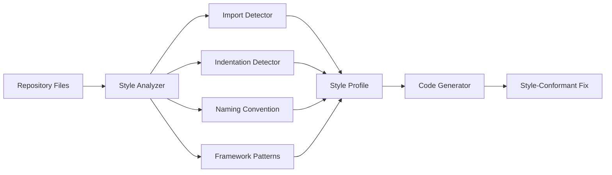

# RFC: Automatic Code Style Detection and Preservation

**RFC Number**: 010  
**Title**: Context-Aware Code Style Detection for Generated Fixes  
**Author**: Engineering Team  
**Status**: Draft  
**Created**: 2025-01-06  

## Summary

This RFC proposes implementing automatic code style detection to ensure RSOLV-generated fixes match the existing codebase's conventions. This includes import styles, indentation, naming conventions, and framework-specific patterns.

## Motivation

Current limitations:
- Generated fixes may use different import styles (ESM vs CommonJS)
- Indentation mismatches (spaces vs tabs, 2 vs 4 spaces)
- Naming convention conflicts (camelCase vs snake_case)
- Framework pattern inconsistencies

Customer impact:
- PRs require manual style fixes before merging
- Linting failures in CI/CD pipelines
- Reduced trust in automated fixes
- Additional review burden

## Proposed Solution

### 1. Architecture Overview



### 2. Core Components

#### A. Style Detection Engine
```typescript
// src/style/detector.ts
export class CodeStyleDetector {
  async analyzeRepository(files: Map<string, string>): Promise<StyleProfile> {
    const profile: StyleProfile = {
      imports: await this.detectImportStyle(files),
      indentation: await this.detectIndentation(files),
      naming: await this.detectNamingConventions(files),
      framework: await this.detectFrameworkPatterns(files),
      language: await this.detectLanguageFeatures(files)
    };
    
    return profile;
  }
  
  private async detectImportStyle(files: Map<string, string>): Promise<ImportStyle> {
    const stats = {
      esm: 0,
      commonjs: 0,
      typescript: 0
    };
    
    for (const [path, content] of files) {
      if (path.endsWith('.js') || path.endsWith('.ts')) {
        // ESM imports
        const esmImports = content.match(/^import\s+.+\s+from\s+['"].+['"]/gm);
        stats.esm += esmImports?.length || 0;
        
        // CommonJS requires
        const cjsRequires = content.match(/^const\s+.+\s*=\s*require\s*\(['"].+['"]\)/gm);
        stats.commonjs += cjsRequires?.length || 0;
        
        // TypeScript imports
        if (path.endsWith('.ts')) {
          stats.typescript++;
        }
      }
    }
    
    return {
      primary: stats.esm > stats.commonjs ? 'esm' : 'commonjs',
      hasTypeScript: stats.typescript > 0,
      stats
    };
  }
}
```

#### B. Style Profile Schema
```typescript
interface StyleProfile {
  imports: {
    primary: 'esm' | 'commonjs' | 'mixed';
    hasTypeScript: boolean;
    stats: Record<string, number>;
  };
  
  indentation: {
    type: 'spaces' | 'tabs';
    size: number;
    consistency: number; // 0-1 score
  };
  
  naming: {
    variables: 'camelCase' | 'snake_case' | 'PascalCase';
    functions: 'camelCase' | 'snake_case';
    files: 'kebab-case' | 'camelCase' | 'snake_case';
    components: 'PascalCase' | 'camelCase'; // React/Vue
  };
  
  framework: {
    type?: 'react' | 'vue' | 'angular' | 'express' | 'fastify';
    patterns: string[]; // e.g., ['hooks', 'class-components']
    stateManagement?: 'redux' | 'mobx' | 'vuex' | 'context';
  };
  
  language: {
    ecmaVersion: string;
    features: string[]; // e.g., ['async-await', 'optional-chaining']
    strict: boolean;
  };
}
```

#### C. Style Application
```typescript
// src/style/applicator.ts
export class StyleApplicator {
  applyStyle(code: string, style: StyleProfile, fileType: string): string {
    let styledCode = code;
    
    // Apply import style
    if (style.imports.primary === 'commonjs' && fileType === '.js') {
      styledCode = this.convertToCommonJS(styledCode);
    }
    
    // Apply indentation
    styledCode = this.applyIndentation(styledCode, style.indentation);
    
    // Apply naming conventions
    styledCode = this.applyNamingConventions(styledCode, style.naming);
    
    // Apply framework patterns
    if (style.framework.type) {
      styledCode = this.applyFrameworkPatterns(styledCode, style.framework);
    }
    
    return styledCode;
  }
  
  private convertToCommonJS(code: string): string {
    // Convert: import { foo } from 'bar';
    // To: const { foo } = require('bar');
    return code.replace(
      /import\s+{([^}]+)}\s+from\s+['"]([^'"]+)['"]/g,
      'const {$1} = require(\'$2\')'
    );
  }
}
```

### 3. Integration Points

#### A. Analysis Phase Enhancement
```typescript
// src/ai/analyzer.ts
export async function analyzeIssue(
  issue: IssueContext,
  config: ActionConfig,
  styleProfile?: StyleProfile // New parameter
): Promise<AnalysisData> {
  // Existing analysis...
  
  if (!styleProfile) {
    const files = await getRepositoryFiles(issue.repository);
    styleProfile = await new CodeStyleDetector().analyzeRepository(files);
  }
  
  return {
    ...existingData,
    styleProfile // Include in analysis
  };
}
```

#### B. Solution Generation
```typescript
// src/ai/solution.ts
export async function generateSolution(
  issue: IssueContext,
  analysis: AnalysisData,
  config: ActionConfig
): Promise<SolutionResult> {
  // Generate fix...
  
  // Apply detected style
  if (analysis.styleProfile) {
    const applicator = new StyleApplicator();
    for (const [file, content] of Object.entries(result.changes)) {
      result.changes[file] = applicator.applyStyle(
        content,
        analysis.styleProfile,
        path.extname(file)
      );
    }
  }
  
  return result;
}
```

### 4. Advanced Detection Features

#### A. Linting Configuration
```typescript
async detectLintingRules(repo: Repository): Promise<LintConfig> {
  // Check for ESLint
  const eslintConfig = await this.findFile([
    '.eslintrc.js',
    '.eslintrc.json',
    '.eslintrc.yml',
    'package.json' // eslintConfig section
  ]);
  
  // Check for Prettier
  const prettierConfig = await this.findFile([
    '.prettierrc',
    '.prettierrc.js',
    '.prettierrc.json'
  ]);
  
  return {
    eslint: eslintConfig ? await this.parseESLintConfig(eslintConfig) : null,
    prettier: prettierConfig ? await this.parsePrettierConfig(prettierConfig) : null
  };
}
```

#### B. Framework-Specific Patterns
```typescript
const FRAMEWORK_PATTERNS = {
  react: {
    detect: [
      /import\s+React/,
      /from\s+['"]react['"]/,
      /\.jsx$/
    ],
    patterns: {
      hooks: /^use[A-Z]/,
      components: /^[A-Z][a-zA-Z]*\.(jsx?|tsx?)$/
    }
  },
  vue: {
    detect: [
      /\.vue$/,
      /from\s+['"]vue['"]/
    ],
    patterns: {
      composition: /<script\s+setup>/,
      options: /export\s+default\s+{/
    }
  }
};
```

### 5. Configuration Options

```yaml
# .github/rsolv-style.yml
style:
  # Override detected styles
  overrides:
    imports: "esm"  # Force ESM even if CommonJS detected
    indentation:
      type: "spaces"
      size: 2
  
  # Respect existing configs
  respect:
    eslint: true
    prettier: true
    editorconfig: true
  
  # Custom patterns
  patterns:
    test-files: "*.test.{js,ts}"
    components: "src/components/**/*"
```

## Implementation Plan

### Phase 1: Core Detection (3-4 days)
- [ ] Import style detection
- [ ] Indentation detection
- [ ] Basic naming convention detection
- [ ] Integration with analyzer

### Phase 2: Style Application (2-3 days)
- [ ] Style applicator implementation
- [ ] Import style conversion
- [ ] Indentation formatting
- [ ] Integration with solution generator

### Phase 3: Advanced Features (4-5 days)
- [ ] Framework pattern detection
- [ ] Linting configuration parsing
- [ ] Custom pattern support
- [ ] Style consistency scoring

### Phase 4: Testing & Refinement (2-3 days)
- [ ] Multi-language testing
- [ ] Framework-specific testing
- [ ] Performance optimization
- [ ] Documentation

## Success Metrics

- 95% style consistency with existing code
- 80% reduction in style-related PR comments
- Zero linting failures from generated code
- 90% customer satisfaction with code style

## Risks and Mitigations

| Risk | Impact | Mitigation |
|------|--------|------------|
| Inconsistent codebases | Medium | Detect dominant style, provide overrides |
| Performance overhead | Low | Cache style profiles, incremental updates |
| Complex style rules | Medium | Start simple, iterate based on feedback |
| Framework evolution | Low | Pluggable pattern system |

## Open Questions

1. How to handle mixed-style codebases?
2. Should we auto-run prettier/eslint on generated code?
3. How deep should framework pattern detection go?
4. Support for less common languages/frameworks?
5. Style profile versioning strategy?

## References

- [ESLint Configuration](https://eslint.org/docs/user-guide/configuring/)
- [Prettier Options](https://prettier.io/docs/en/options.html)
- [EditorConfig Specification](https://editorconfig.org/)