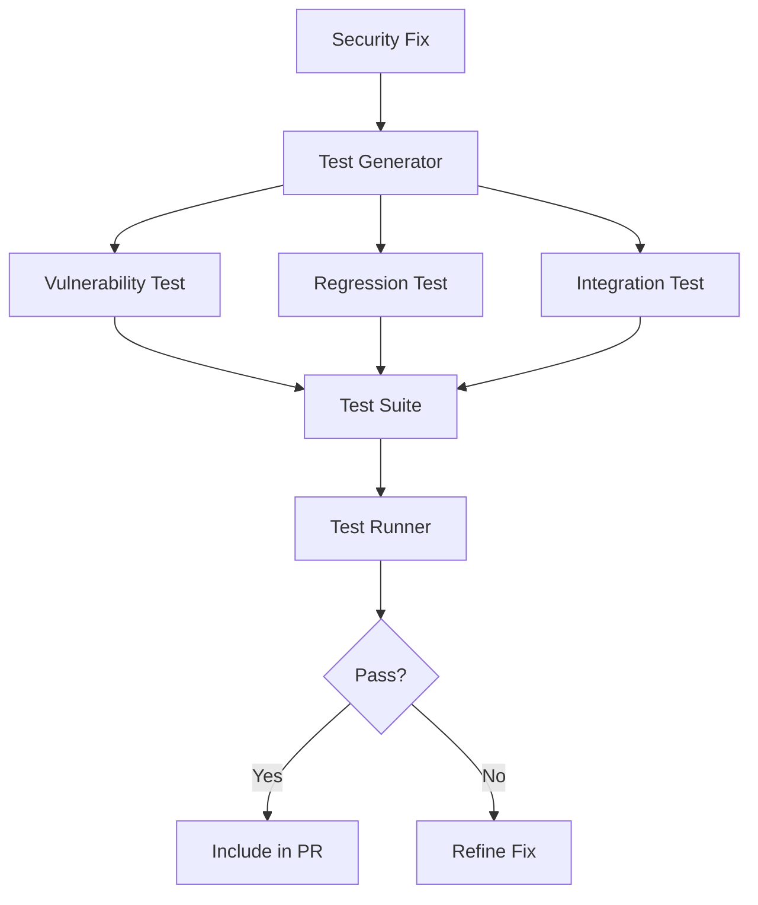

# RFC: Automated Test Generation for Security Fixes

**RFC Number**: 011  
**Title**: Test-Driven Security Fix Validation  
**Author**: Security Engineering Team  
**Status**: Draft  
**Created**: 2025-01-06  

## Summary

This RFC proposes implementing automated test generation for all security fixes to ensure fixes work correctly, prevent regressions, and demonstrate the fix doesn't break existing functionality.

## Motivation

Current limitations:
- Security fixes lack accompanying tests
- No regression prevention for vulnerabilities
- Cannot prove fixes don't break functionality
- Manual test writing burden on customers

Business drivers:
- Increase confidence in automated fixes
- Reduce review time for PRs
- Prevent vulnerability reintroduction
- Demonstrate comprehensive fix quality

## Proposed Solution

### 1. Architecture Overview



### 2. Test Generation Framework

#### A. Core Test Generator
```typescript
// src/testing/security-test-generator.ts
export class SecurityTestGenerator {
  async generateTests(
    vulnerability: Vulnerability,
    fix: CodeChange,
    context: CodeContext
  ): Promise<TestSuite> {
    const tests: Test[] = [];
    
    // Generate vulnerability-specific test
    tests.push(await this.generateVulnerabilityTest(vulnerability, fix));
    
    // Generate regression prevention test
    tests.push(await this.generateRegressionTest(vulnerability, context));
    
    // Generate integration tests if needed
    if (this.requiresIntegrationTest(fix)) {
      tests.push(...await this.generateIntegrationTests(fix, context));
    }
    
    return new TestSuite(tests);
  }
}
```

#### B. Vulnerability-Specific Test Templates
```typescript
const VULNERABILITY_TEST_TEMPLATES = {
  SQL_INJECTION: {
    template: `
describe('{{functionName}} SQL Injection Prevention', () => {
  it('should safely handle malicious SQL input', () => {
    const maliciousInputs = [
      "'; DROP TABLE users; --",
      "1' OR '1'='1",
      "admin'--",
      "1; DELETE FROM products"
    ];
    
    for (const input of maliciousInputs) {
      expect(() => {{functionName}}(input))
        .not.toThrow();
      
      // Verify the query is parameterized
      const query = db.getLastQuery();
      expect(query).toContain('?');
      expect(query).not.toContain(input);
    }
  });
  
  it('should handle legitimate input correctly', () => {
    const result = {{functionName}}('legitimate-user');
    expect(result).toBeDefined();
    expect(result.username).toBe('legitimate-user');
  });
});`,
    imports: ['describe', 'it', 'expect']
  },
  
  XSS: {
    template: `
describe('{{functionName}} XSS Prevention', () => {
  it('should escape dangerous HTML characters', () => {
    const xssPayloads = [
      '<script>alert("XSS")</script>',
      '',
      '<iframe src="javascript:alert(\'XSS\')">',
      '{{constructor.constructor("alert(1)")()}}'
    ];
    
    for (const payload of xssPayloads) {
      const result = {{functionName}}(payload);
      expect(result).not.toContain('<script>');
      expect(result).not.toContain('onerror=');
      expect(result).toContain('&lt;');
      expect(result).toContain('&gt;');
    }
  });
});`,
    imports: ['describe', 'it', 'expect']
  },
  
  PATH_TRAVERSAL: {
    template: `
describe('{{functionName}} Path Traversal Prevention', () => {
  it('should prevent directory traversal attacks', () => {
    const traversalPayloads = [
      '../../../etc/passwd',
      '..\\\\..\\\\..\\\\windows\\\\system32',
      '%2e%2e%2f%2e%2e%2f',
      '....//....//etc/passwd'
    ];
    
    for (const payload of traversalPayloads) {
      const result = {{functionName}}(payload);
      expect(result).not.toContain('..');
      expect(result).toMatch(/^[a-zA-Z0-9_\\-\\/]+$/);
    }
  });
  
  it('should allow legitimate file paths', () => {
    const legitimatePaths = [
      'uploads/image.jpg',
      'documents/report.pdf',
      'data/config.json'
    ];
    
    for (const path of legitimatePaths) {
      expect(() => {{functionName}}(path)).not.toThrow();
    }
  });
});`
  }
};
```

#### C. Test Framework Detection
```typescript
export class TestFrameworkDetector {
  async detect(packageJson: any, files: string[]): Promise<TestFramework> {
    // Check package.json for test dependencies
    const deps = {
      ...packageJson.dependencies,
      ...packageJson.devDependencies
    };
    
    if (deps.jest) return { type: 'jest', version: deps.jest };
    if (deps.mocha) return { type: 'mocha', version: deps.mocha };
    if (deps.vitest) return { type: 'vitest', version: deps.vitest };
    if (deps.jasmine) return { type: 'jasmine', version: deps.jasmine };
    
    // Check for test files
    const testPatterns = [
      '**/*.test.js',
      '**/*.spec.js',
      '**/test/**/*.js'
    ];
    
    // Analyze existing test syntax
    for (const file of files) {
      if (testPatterns.some(pattern => minimatch(file, pattern))) {
        const content = await readFile(file);
        if (content.includes('jest.mock')) return { type: 'jest' };
        if (content.includes('sinon.')) return { type: 'mocha' };
      }
    }
    
    // Default to jest
    return { type: 'jest', version: 'latest' };
  }
}
```

### 3. Test Generation Strategies

#### A. Positive and Negative Tests
```typescript
export class TestCaseGenerator {
  generateTestCases(vuln: Vulnerability): TestCases {
    return {
      positive: this.generatePositiveTests(vuln),
      negative: this.generateNegativeTests(vuln),
      edge: this.generateEdgeCases(vuln),
      performance: this.generatePerformanceTests(vuln)
    };
  }
  
  private generateNegativeTests(vuln: Vulnerability): Test[] {
    // Test that the vulnerability is actually fixed
    const exploitVectors = this.getExploitVectors(vuln.type);
    
    return exploitVectors.map(vector => ({
      name: `should prevent ${vector.name}`,
      code: this.generateExploitTest(vector, vuln)
    }));
  }
}
```

#### B. Integration with Existing Tests
```typescript
export class TestIntegrator {
  async integrateTests(
    newTests: Test[],
    existingTestFile: string
  ): Promise<string> {
    const ast = parse(existingTestFile);
    
    // Find appropriate describe block
    const describeBlock = this.findOrCreateDescribeBlock(ast);
    
    // Add new tests
    for (const test of newTests) {
      this.addTestToBlock(describeBlock, test);
    }
    
    // Ensure imports
    this.ensureImports(ast, newTests);
    
    return generate(ast);
  }
}
```

### 4. Framework-Specific Adaptations

#### A. Multi-Language Support
```typescript
const LANGUAGE_TEST_GENERATORS = {
  javascript: new JavaScriptTestGenerator(),
  typescript: new TypeScriptTestGenerator(),
  python: new PythonTestGenerator(),
  ruby: new RubyTestGenerator(),
  java: new JavaTestGenerator()
};

// Python example
class PythonTestGenerator {
  generateTest(vuln: Vulnerability): string {
    return `
import pytest
from ${vuln.module} import ${vuln.function}

class Test${vuln.function}Security:
    @pytest.mark.parametrize("malicious_input", [
        "'; DROP TABLE users; --",
        "1' OR '1'='1"
    ])
    def test_sql_injection_prevention(self, malicious_input):
        # Should not raise an exception
        result = ${vuln.function}(malicious_input)
        assert result is not None
`;
  }
}
```

### 5. Test Quality Assurance

#### A. Coverage Verification
```typescript
export class TestCoverageAnalyzer {
  async verifyTestCoverage(
    fix: CodeChange,
    tests: TestSuite
  ): Promise<CoverageReport> {
    // Run tests with coverage
    const coverage = await this.runWithCoverage(tests);
    
    // Verify fixed lines are covered
    const fixedLines = this.extractFixedLines(fix);
    const uncoveredLines = fixedLines.filter(
      line => !coverage.coveredLines.includes(line)
    );
    
    return {
      percentCovered: (fixedLines.length - uncoveredLines.length) / fixedLines.length * 100,
      uncoveredLines,
      suggestion: uncoveredLines.length > 0 
        ? 'Add tests for lines: ' + uncoveredLines.join(', ')
        : 'All fixed lines covered'
    };
  }
}
```

### 6. PR Integration

Example generated test in PR:

```javascript
// tests/auth.test.js
describe('Authentication Security Fixes', () => {
  describe('SQL Injection Prevention', () => {
    it('should safely handle malicious SQL in login', () => {
      const maliciousUsername = "admin'; DROP TABLE users; --";
      const result = authenticateUser(maliciousUsername, 'password');
      
      // Should not throw an error
      expect(result).toBeDefined();
      
      // Should not authenticate malicious user
      expect(result.authenticated).toBe(false);
      
      // Verify parameterized query was used
      const lastQuery = db.getLastExecutedQuery();
      expect(lastQuery).toContain('WHERE username = ?');
    });
  });
  
  describe('Regression Prevention', () => {
    it('should still authenticate valid users', () => {
      const result = authenticateUser('validuser', 'correctpassword');
      expect(result.authenticated).toBe(true);
      expect(result.user.username).toBe('validuser');
    });
  });
});
```

## Implementation Plan

### Phase 1: Core Generator (3-4 days)
- [ ] Test template system
- [ ] Vulnerability-specific generators
- [ ] Framework detection

### Phase 2: Language Support (4-5 days)
- [ ] JavaScript/TypeScript tests
- [ ] Python test generation
- [ ] Ruby test generation
- [ ] Java test generation

### Phase 3: Integration (3-4 days)
- [ ] Test file detection
- [ ] AST-based integration
- [ ] Import management
- [ ] Coverage verification

### Phase 4: Quality & Polish (2-3 days)
- [ ] Edge case generation
- [ ] Performance test generation
- [ ] Documentation
- [ ] Customer examples

## Success Metrics

- 100% of security fixes include tests
- 95% test coverage of fixed code
- 90% of generated tests pass on first run
- 50% reduction in PR review time
- Zero regressions of fixed vulnerabilities

## Risks and Mitigations

| Risk | Impact | Mitigation |
|------|--------|------------|
| Test framework variety | High | Detect and adapt to existing framework |
| Complex test setup | Medium | Analyze existing tests for patterns |
| False test confidence | High | Multiple test vectors, coverage analysis |
| Performance impact | Low | Optional performance test generation |

## Open Questions

1. How to handle mocking/stubbing requirements?
2. Should we generate property-based tests?
3. Integration with CI/CD test reporting?
4. Support for BDD-style tests?
5. Test data generation strategies?

## References

- [OWASP Testing Guide](https://owasp.org/www-project-testing-guide/)
- [Jest Documentation](https://jestjs.io/docs/getting-started)
- [pytest Documentation](https://docs.pytest.org/)