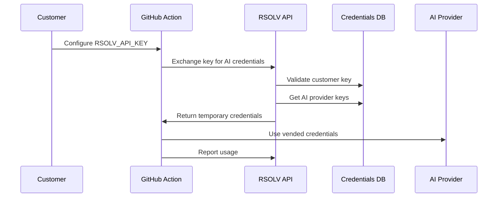

# RFC: Credential Vending Architecture

**RFC Number**: 012  
**Title**: Secure Credential Vending System for AI Provider Access  
**Author**: Infrastructure Team  
**Status**: Implemented  
**Created**: 2025-06-04  
**Implemented**: 2025-06-03

## Summary

This RFC documents RSOLV's credential vending system that enables customers to access AI providers (Anthropic, OpenAI, etc.) using only their RSOLV API key. The system exchanges customer API keys for temporary, scoped AI provider credentials, eliminating the need for customers to manage multiple API keys.

## Motivation

Previous architecture required customers to:
- Obtain and manage API keys from multiple AI providers
- Store sensitive keys in GitHub Secrets
- Handle key rotation and security
- Deal with provider-specific authentication

This created friction in onboarding and security risks from exposed keys.

## Architecture

### Overview



### Components

#### 1. RSOLVCredentialManager (Client-side)

Located in `RSOLV-action/src/credentials/manager.ts`:

```typescript
export class RSOLVCredentialManager {
  private rsolvApiUrl: string;
  private rsolvApiKey: string;
  private cachedCredentials: Map<string, CachedCredential>;
  
  async getAICredentials(provider: string): Promise<AICredentials> {
    // Check cache first
    const cached = this.cachedCredentials.get(provider);
    if (cached && !this.isExpired(cached)) {
      return cached.credentials;
    }
    
    // Exchange RSOLV API key for AI credentials
    const response = await this.exchangeCredentials(provider);
    
    // Cache with TTL
    this.cacheCredentials(provider, response);
    
    return response.credentials;
  }
  
  async refreshCredentials(provider: string): Promise<AICredentials> {
    const response = await fetch(`${this.rsolvApiUrl}/api/v1/credentials/refresh`, {
      method: 'POST',
      headers: {
        'x-api-key': this.rsolvApiKey,
        'Content-Type': 'application/json'
      },
      body: JSON.stringify({ provider })
    });

    return this.handleResponse(response);
  }
}
```

#### 2. Credential Controller (Server-side)

Located in `RSOLV-api/lib/rsolv_web/controllers/credential_controller.ex`:

```elixir
defmodule RsolvWeb.CredentialController do
  use RsolvWeb, :controller
  
  def exchange(conn, %{"provider" => provider}) do
    with {:ok, customer} <- authenticate_customer(conn),
         {:ok, credentials} <- CredentialService.get_provider_credentials(customer, provider),
         {:ok, encrypted} <- encrypt_credentials(credentials) do
      
      # Log credential vending
      AuditLog.create(%{
        customer_id: customer.id,
        action: "credential_exchange",
        provider: provider,
        timestamp: DateTime.utc_now()
      })
      
      json(conn, %{
        credentials: encrypted,
        expires_at: DateTime.add(DateTime.utc_now(), 3600), # 1 hour TTL
        provider: provider
      })
    end
  end
  
  def report_usage(conn, %{"provider" => provider, "usage" => usage_data}) do
    with {:ok, customer} <- authenticate_customer(conn) do
      UsageTracker.record(customer, provider, usage_data)
      json(conn, %{status: "recorded"})
    end
  end
end
```

### Security Features

1. **Short-lived Credentials**
   - 1-hour TTL by default
   - Automatic refresh before expiry
   - Reduces exposure window

2. **Encrypted Transport**
   - TLS for all API communications
   - Additional encryption layer for credentials
   - No plaintext key storage

3. **Audit Trail**
   - All credential exchanges logged
   - Usage tracking per customer
   - Anomaly detection capabilities

4. **Scope Limitation**
   - Credentials limited to RSOLV operations
   - Rate limits per customer
   - Provider-specific restrictions

## Implementation Details

### API Endpoints

#### POST /api/v1/credentials/exchange
Exchange RSOLV API key for AI provider credentials.

**Request:**
```json
{
  "provider": "anthropic"
}
```

**Response:**
```json
{
  "credentials": {
    "apiKey": "encrypted_key_data",
    "endpoint": "https://api.anthropic.com"
  },
  "expires_at": "2025-06-04T12:00:00Z",
  "provider": "anthropic"
}
```

#### POST /api/v1/credentials/refresh
Refresh expiring credentials.

**Request:**
```json
{
  "provider": "anthropic"
}
```

#### POST /api/v1/credentials/report_usage
Report usage metrics for billing.

**Request:**
```json
{
  "provider": "anthropic",
  "usage": {
    "tokens": 1500,
    "requests": 1,
    "model": "claude-3-sonnet"
  }
}
```

### Configuration

In `RSOLV-action/src/config/index.ts`:

```typescript
aiProvider: {
  provider: 'anthropic',
  model: 'claude-3-sonnet-20240229',
  useVendedCredentials: true  // Default to using vended credentials
}
```

## Customer Benefits

1. **Simplified Setup**
   - Only one API key to manage (RSOLV_API_KEY)
   - 5-minute onboarding instead of 30+
   - No provider account setup required

2. **Enhanced Security**
   - Customer never sees AI provider keys
   - Automatic key rotation
   - Centralized security management

3. **Cost Management**
   - Usage tracked per customer
   - Consolidated billing
   - No surprise AI provider bills

4. **Provider Flexibility**
   - Switch AI providers without customer changes
   - A/B test different models transparently
   - Add new providers without customer action

## Migration Path

For existing customers using direct AI provider keys:

1. **Phase 1**: Both methods supported
   - Detect if ANTHROPIC_API_KEY is set
   - Fall back to credential vending if not
   - Log deprecation warnings

2. **Phase 2**: Encourage migration
   - Email customers about benefits
   - Provide migration guide
   - Offer support for transition

3. **Phase 3**: Deprecate direct keys
   - Set sunset date
   - Require credential vending for new features
   - Final migration assistance

## Future Enhancements

1. **Multi-Provider Credentials**
   ```typescript
   const credentials = await manager.getMultiProviderCredentials([
     'anthropic',
     'openai',
     'gemini'
   ]);
   ```

2. **Customer-Specific Limits**
   ```typescript
   interface CustomerLimits {
     maxTokensPerDay: number;
     maxRequestsPerHour: number;
     allowedModels: string[];
     priorityAccess: boolean;
   }
   ```

3. **Credential Policies**
   - Time-based access (business hours only)
   - Geographic restrictions
   - Model-specific permissions
   - Compliance requirements (HIPAA, SOC2)

4. **Advanced Features**
   - Credential sharing for teams
   - Temporary elevated access
   - Emergency credential revocation
   - Cross-region failover

## Monitoring and Observability

```elixir
defmodule RsolvApi.Monitoring.CredentialMetrics do
  def track_exchange(customer_id, provider) do
    Prometheus.Counter.inc(
      name: :credential_exchanges_total,
      labels: [customer_id, provider]
    )
  end
  
  def track_usage(customer_id, provider, tokens) do
    Prometheus.Histogram.observe(
      name: :ai_token_usage,
      labels: [customer_id, provider],
      value: tokens
    )
  end
end
```

Dashboard available at: https://grafana.rsolv.dev

## Compliance Considerations

- **SOC2**: Credential access logged and audited
- **GDPR**: No PII in credential exchange
- **HIPAA**: Encryption at rest and in transit
- **PCI**: Keys never stored in plaintext

## References

- Implementation: `RSOLV-action/src/credentials/manager.ts`
- API endpoints: `RSOLV-api/lib/rsolv_web/controllers/credential_controller.ex`
- Tests: `RSOLV-action/src/__tests__/credentials/manager.test.ts`
- Security audit: `security/credential-vending-audit.md`