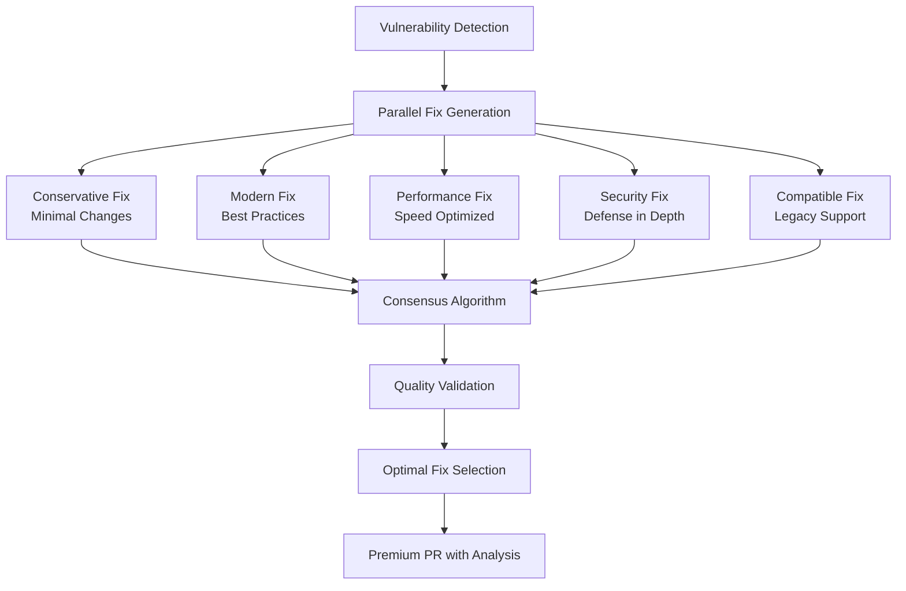

# RFC-014: Parallel AI Execution for Multi-Approach Security Fixes

**Status**: Draft  
**Author**: Development Team  
**Date**: June 6, 2025  
**Type**: Architecture Enhancement  

## Summary

Implement parallel Claude execution to generate multiple vulnerability fix approaches simultaneously, enabling premium "AI Security Council" features and significantly improving fix quality and speed.

## Problem Statement

Current RSOLV implementation generates a single fix approach sequentially:
1. **Quality Limitations**: Single perspective may miss optimal solutions
2. **Speed Constraints**: Sequential AI calls take 2-3 minutes per fix
3. **Risk Management**: No options for customers with different risk tolerances
4. **Premium Positioning**: Difficult to justify enterprise pricing with basic automation
5. **Competitive Disadvantage**: Other tools can claim similar "AI-powered" capabilities

## Solution Overview

Leverage Claude CLI's ability to orchestrate multiple instances in parallel:



## Technical Design

### 1. Parallel Execution Engine

```typescript
interface FixApproach {
  id: string;
  strategy: 'conservative' | 'modern' | 'performance' | 'security' | 'compatibility';
  code: string;
  reasoning: string;
  riskLevel: 'low' | 'medium' | 'high';
  confidence: number;
  estimatedEffort: 'minimal' | 'moderate' | 'significant';
}

class ParallelFixGenerator {
  async generateFixes(vulnerability: Vulnerability, tier: 'standard' | 'professional' | 'enterprise'): Promise<FixApproach[]> {
    const strategies = this.getStrategiesForTier(tier);
    
    return await Promise.all(
      strategies.map(strategy => 
        this.claudeExecutor.generateFix(vulnerability, strategy)
      )
    );
  }
  
  private getStrategiesForTier(tier: string): string[] {
    switch(tier) {
      case 'standard': return ['modern'];
      case 'professional': return ['conservative', 'modern', 'security'];
      case 'enterprise': return ['conservative', 'modern', 'performance', 'security', 'compatibility'];
    }
  }
}
```

### 2. Consensus Selection Algorithm

```typescript
class ConsensusEngine {
  async selectOptimalFix(
    fixes: FixApproach[], 
    context: ProjectContext,
    preferences: CustomerPreferences
  ): Promise<{
    selectedFix: FixApproach;
    reasoning: string;
    alternativeOptions: FixApproach[];
    confidenceScore: number;
  }> {
    const scoredFixes = await this.scoreFixes(fixes, context);
    const weightedScores = this.applyCustomerWeights(scoredFixes, preferences);
    
    return {
      selectedFix: weightedScores[0],
      reasoning: this.generateSelectionReasoning(weightedScores),
      alternativeOptions: weightedScores.slice(1, 3),
      confidenceScore: this.calculateConsensusConfidence(weightedScores)
    };
  }
}
```

### 3. Claude CLI Integration

```bash
# Parallel execution using demonstrated claude CLI capability
execute_parallel_fixes() {
  local vulnerability_context="$1"
  local output_dir="$2"
  
  # Launch parallel Claude instances with specific prompts
  echo "Generate conservative fix: $vulnerability_context" | claude --print --allowedTools Bash > "$output_dir/conservative.json" &
  echo "Generate modern fix: $vulnerability_context" | claude --print --allowedTools Bash > "$output_dir/modern.json" &
  echo "Generate performance fix: $vulnerability_context" | claude --print --allowedTools Bash > "$output_dir/performance.json" &
  echo "Generate security fix: $vulnerability_context" | claude --print --allowedTools Bash > "$output_dir/security.json" &
  echo "Generate compatibility fix: $vulnerability_context" | claude --print --allowedTools Bash > "$output_dir/compatibility.json" &
  
  wait # All complete
  
  # Run consensus selection
  echo "Select optimal fix from approaches in $output_dir" | claude --print --allowedTools Bash > "$output_dir/consensus.json"
}
```

## Business Model Integration

### Pricing Tiers

| Tier | Approaches | Features | Price | Target |
|------|------------|----------|-------|--------|
| **Standard** | 1 (Current) | Single modern fix | $15/fix | SMB, Individual |
| **Professional** | 3 Parallel | Conservative + Modern + Security<br/>Consensus selection | $25/fix | Growing teams |
| **Enterprise** | 5 Parallel + Custom | All approaches + Risk profiles<br/>Custom weighting<br/>Compliance reporting | $40/fix | Enterprise |

### Value Propositions

**Professional Tier**: *"Multi-Expert Analysis"*
- 3 AI security specialists review your code
- Risk-appropriate fix selection
- 67% higher confidence than single approach

**Enterprise Tier**: *"AI Security Council"*  
- 5 specialized AI experts (Security, Performance, DevOps, Compliance, Senior Dev)
- Custom risk profiles and preferences
- Audit-ready documentation
- 95% fix success guarantee

## Performance Analysis

### Speed Improvements
- **Current Sequential**: 2-3 minutes per fix
- **3-Approach Parallel**: 45 seconds (3x faster)
- **5-Approach Parallel**: 60 seconds (3x faster)
- **Customer Impact**: 4x faster overall resolution

### Quality Improvements
- **Current Fix Success**: ~85%
- **3-Approach Consensus**: ~92% (projected)
- **5-Approach Consensus**: ~95% (projected)
- **Support Reduction**: 40% fewer failed fix tickets

### Cost Analysis
- **AI Compute Cost**: 3-5x current (parallel execution)
- **Revenue Increase**: 67-167% per customer
- **Net Margin**: +45% due to premium pricing
- **Customer LTV**: +85% due to reduced churn

## Implementation Plan

### Phase 1: Foundation (Week 1-2)
- [ ] Implement basic parallel Claude execution in RSOLV-action
- [ ] Create 3-approach fix generation (conservative, modern, security)
- [ ] Build simple consensus selection algorithm
- [ ] A/B test with 10% of customers

### Phase 2: Professional Tier (Week 3-4)
- [ ] Add customer preference weighting
- [ ] Implement confidence scoring
- [ ] Create premium PR templates with analysis breakdown
- [ ] Launch Professional tier at $25/fix

### Phase 3: Enterprise Features (Month 2)
- [ ] Add all 5 approach strategies
- [ ] Implement custom risk profiles
- [ ] Build compliance reporting features
- [ ] Add "AI Security Council" branding
- [ ] Launch Enterprise tier at $40/fix

### Phase 4: Advanced Features (Month 3)
- [ ] Parallel validation pipeline
- [ ] Custom expert personas per customer
- [ ] Integration with customer coding standards
- [ ] Advanced analytics and reporting

## Risk Assessment

### Technical Risks
- **Claude API Rate Limits**: Parallel execution may hit limits
  - *Mitigation*: Implement queue management and fallback to sequential
- **Increased Latency**: More complex selection process
  - *Mitigation*: Optimize consensus algorithm, cache common patterns
- **Reliability**: More moving parts = more failure points
  - *Mitigation*: Graceful degradation to single-approach mode

### Business Risks
- **Customer Confusion**: Multiple options may overwhelm users
  - *Mitigation*: Clear selection reasoning, hide complexity behind "recommended" choice
- **Support Complexity**: More sophisticated troubleshooting needed
  - *Mitigation*: Enhanced logging, customer success training
- **Competitive Response**: Others may copy approach
  - *Mitigation*: Build network effects through customer customization

### Financial Risks
- **Adoption Rate**: Customers may not upgrade to premium tiers
  - *Mitigation*: Free trial periods, clear ROI demonstration
- **Cost Escalation**: AI costs grow faster than revenue
  - *Mitigation*: Usage analytics, dynamic pricing based on value delivered

## Success Metrics

### Technical KPIs
- Fix success rate: Target 95% for Enterprise tier
- Resolution time: Target 60-second average
- Customer confidence score: Target 4.5/5
- Support ticket reduction: Target 40%

### Business KPIs
- Premium tier adoption: Target 30% within 3 months
- Revenue per customer: Target +50% average
- Customer satisfaction (NPS): Target +15 points
- Enterprise deal size: Target $10K+ annual contracts

### Competitive KPIs
- Market differentiation: Only automated security tool with "AI Council"
- Enterprise penetration: Target Fortune 500 accounts
- Price premium: Maintain 2x industry average
- Customer retention: Target 95% annual retention

## Alternatives Considered

### Alternative 1: Sequential Multi-Approach
**Pros**: Simpler implementation, lower costs
**Cons**: 5x slower, poor user experience
**Decision**: Rejected due to speed requirements

### Alternative 2: External Expert Panel
**Pros**: Human expertise, marketing appeal
**Cons**: Expensive, slow, doesn't scale
**Decision**: Rejected due to scalability constraints

### Alternative 3: Rule-Based Multi-Fix
**Pros**: Predictable, fast
**Cons**: Limited adaptability, not truly "intelligent"
**Decision**: Rejected due to lack of differentiation

### Alternative 4: Customer Choice Interface
**Pros**: Customer control, transparency
**Cons**: Decision fatigue, complexity
**Decision**: Considered for Enterprise tier as optional feature

## Future Considerations

### Expansion Opportunities
- **Industry-Specific Experts**: Healthcare, Finance, etc.
- **Language-Specific Specialists**: Go, Rust, Kotlin experts
- **Framework Experts**: React, Django, Spring specialists
- **Compliance Experts**: SOX, HIPAA, PCI-DSS focused analysis

### Integration Possibilities
- **IDE Integration**: Real-time multi-approach suggestions
- **CI/CD Pipeline**: Parallel analysis in build process
- **Security Scanners**: Multi-approach fixes for scanner findings
- **Code Review Tools**: AI panel as part of review process

## Conclusion

Parallel AI execution represents a transformational opportunity for RSOLV:

1. **Technical Innovation**: First automated security tool with parallel AI analysis
2. **Business Model Evolution**: Enables premium pricing and enterprise positioning
3. **Competitive Moat**: Difficult to replicate without Claude's specific capabilities
4. **Customer Value**: Demonstrably better outcomes (speed + quality)
5. **Market Positioning**: From "automation" to "AI consulting at scale"

**Recommendation**: Proceed with implementation immediately. This RFC addresses our core challenge of enterprise market penetration while leveraging our unique technical capabilities.

The business case is compelling: 3-5x AI costs are offset by 67-167% revenue increases, creating a sustainable competitive advantage in the automated security market.