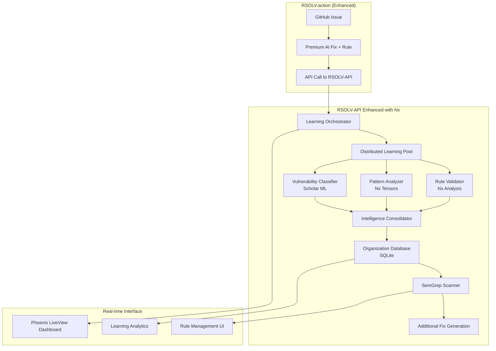

# RFC-016: Elixir/Nx Learning Engine Implementation

**RFC Number**: 016  
**Title**: Elixir/Nx Learning Engine Implementation  
**Status**: Proposed  
**Created**: June 6, 2025  
**Updated**: June 6, 2025  
**Author**: RSOLV Technical Team  
**Depends On**: RFC-014 (Self-Improving Security Platform), RFC-015 (Business Model)  
**Related To**: RFC-003 (Learning Security System)  

## Summary

This RFC details the technical implementation of RSOLV's learning engine using the Elixir/Nx ecosystem as the intelligence infrastructure layer, working in conjunction with our existing premium AI integration for rule generation. By leveraging BEAM's fault-tolerant distributed computing with Nx's GPU-accelerated machine learning capabilities, we create a uniquely powerful security learning platform that combines premium AI rule generation with distributed pattern analysis (Nx tensors) and traditional ML (Scholar) for organizational intelligence accumulation.

**Technical Innovation**: First security platform to combine premium AI rule generation with fault-tolerant distributed computing (BEAM) and modern ML frameworks (Nx) for real-time security pattern learning and organizational intelligence.

## Motivation

### Technical Requirements from RFC-014

The Self-Improving Security Platform requires:

1. **Distributed Learning Infrastructure**: Process multiple learning tasks across cluster nodes
2. **Premium AI Integration**: Extend existing high-quality AI for rule generation  
3. **Semantic Analysis**: Understand code patterns with Nx tensors
4. **Fault Tolerance**: Learning must never stop (BEAM supervision)
5. **Real-time Intelligence**: Phoenix LiveView learning dashboards
6. **Pattern Recognition**: Scholar ML for vulnerability classification
7. **Scalable Storage**: Organization-specific intelligence databases

### Why Elixir/Nx vs Alternatives

**Compared to Python/scikit-learn**:
- ✅ Fault-tolerant learning (supervision trees)
- ✅ Distributed processing (BEAM clustering)
- ✅ Real-time web interfaces (Phoenix LiveView)
- ✅ Production-ready concurrency (Actor model)

**Compared to Node.js/TensorFlow.js**:
- ✅ Better ML ecosystem (Nx, Scholar, Bumblebee)
- ✅ Fault tolerance (let-it-crash philosophy)
- ✅ True parallelism (vs single-threaded event loop)
- ✅ Hot code swapping (update models without downtime)

**Compared to Go/PyTorch**:
- ✅ Better web framework integration (Phoenix)
- ✅ Dynamic compilation (JIT for ML models)
- ✅ Pattern matching for rule processing
- ✅ Built-in clustering and distribution

### Current RSOLV Integration Points

**Existing Infrastructure**:
- RSOLV-API: Elixir/Phoenix with BEAM clustering ✅
- RSOLV-action: TypeScript (integrates via API calls) ✅
- Credential vending: Working with external AI providers ✅
- Webhooks: GitHub integration for triggering learning ✅

**Enhancement Strategy**: Extend existing RSOLV-API with Nx learning capabilities while maintaining premium AI integration for rule generation

## Technical Architecture

### 1. Overall System Design



### 2. Nx Ecosystem Integration

#### Core Dependencies
```elixir
# mix.exs
defp deps do
  [
    # Existing Phoenix/BEAM dependencies
    {:phoenix, "~> 1.7.0"},
    {:phoenix_live_view, "~> 0.20.0"},
    
    # Nx ecosystem for ML
    {:nx, "~> 0.7.0"},
    {:exla, "~> 0.7.0"},        # GPU/CPU acceleration
    {:bumblebee, "~> 0.5.0"},   # Pre-trained models
    {:scholar, "~> 0.3.0"},     # Traditional ML
    {:axon, "~> 0.6.0"},       # Neural networks (future use)
    
    # Additional ML utilities
    {:explorer, "~> 0.8.0"},   # DataFrames for analysis
    {:kino_bumblebee, "~> 0.5.0"}, # Development/debugging
    
    # Existing dependencies  
    {:ecto_sql, "~> 3.10"},
    {:postgrex, "~> 0.17"},
    # Note: Remove Bumblebee dependency - using existing premium AI integration
    # ... other existing deps
  ]
end
```

#### Configuration
```elixir
# config/config.exs
import Config

# Nx backend configuration
config :nx, :default_backend, EXLA.Backend
config :nx, :default_defn_options, [compiler: EXLA, client: :host]

# Premium AI integration (existing configuration)
# No additional model caching needed - leveraging existing AI integration

# Learning engine configuration
config :rsolv, Rsolv.Learning,
  model_cache_ttl: :timer.hours(24),
  rule_generation_timeout: :timer.minutes(5),
  pattern_analysis_batch_size: 100,
  distributed_workers: System.schedulers_online() * 2

# EXLA GPU configuration (production)
config :exla, :clients,
  cuda: [platform: :cuda],
  rocm: [platform: :rocm],
  host: [platform: :host]
```

### 3. Learning Engine Implementation

#### A. Learning Orchestrator (Main Coordinator)
```elixir
defmodule Rsolv.Learning.Orchestrator do
  @moduledoc """
  Coordinates the complete learning cycle for security fixes.
  Manages distributed processing across BEAM cluster nodes.
  """
  
  use GenServer
  require Logger
  
  alias Rsolv.Learning.{RuleValidator, PatternAnalyzer, VulnerabilityClassifier}
  
  @doc "Process a security fix and trigger complete learning cycle"
  def process_security_fix(org_id, fix_data) do
    GenServer.call(__MODULE__, {:process_fix, org_id, fix_data}, :infinity)
  end
  
  def handle_call({:process_fix, org_id, fix_data}, _from, state) do
    learning_id = generate_learning_id()
    
    Logger.info("Starting learning cycle", learning_id: learning_id, org_id: org_id)
    
    # Distribute learning tasks across cluster
    learning_tasks = [
      {:rule_generation, RuleGenerator, :generate_from_fix, [fix_data]},
      {:pattern_analysis, PatternAnalyzer, :analyze_patterns, [fix_data]},
      {:vulnerability_classification, VulnerabilityClassifier, :classify, [fix_data]}
    ]
    
    # Execute tasks in parallel across available nodes
    results = 
      learning_tasks
      |> Task.Supervisor.async_stream(
          Rsolv.Learning.TaskSupervisor,
          &execute_learning_task/1,
          timeout: :timer.minutes(10),
          max_concurrency: System.schedulers_online(),
          ordered: false
        )
      |> Enum.to_list()
      |> handle_learning_results()
    
    # Consolidate and store learning results
    learning_result = consolidate_learning(org_id, learning_id, results)
    
    # Trigger organization-wide scan with new intelligence
    spawn_link(fn -> trigger_organization_scan(org_id, learning_result) end)
    
    # Publish real-time update
    Phoenix.PubSub.broadcast(
      Rsolv.PubSub,
      "learning:#{org_id}",
      {:learning_complete, learning_result}
    )
    
    {:reply, {:ok, learning_result}, state}
  end
  
  defp execute_learning_task({task_type, module, function, args}) do
    try do
      result = apply(module, function, args)
      {:ok, {task_type, result}}
    rescue
      error ->
        Logger.error("Learning task failed", 
          task: task_type, 
          error: inspect(error),
          stacktrace: __STACKTRACE__
        )
        {:error, {task_type, error}}
    end
  end
  
  defp consolidate_learning(org_id, learning_id, results) do
    %{
      learning_id: learning_id,
      org_id: org_id,
      timestamp: DateTime.utc_now(),
      rule_generation: get_result(results, :rule_generation),
      pattern_analysis: get_result(results, :pattern_analysis),
      classification: get_result(results, :vulnerability_classification),
      status: determine_overall_status(results)
    }
  end
end
```

#### B. Rule Validator with Nx Analysis
```elixir
defmodule Rsolv.Learning.RuleValidator do
  @moduledoc """
  Validates and analyzes AI-generated SemGrep rules using Nx-powered analysis.
  Focuses on rule quality, effectiveness, and optimization rather than generation.
  """
  
  use GenServer
  import Nx.Defn
  
  def start_link(opts) do
    GenServer.start_link(__MODULE__, opts, name: __MODULE__)
  end
  
  def init(_opts) do
    {:ok, %{validation_cache: %{}}}
  end
  
  @doc "Validate and analyze an AI-generated SemGrep rule"
  def validate_rule(rule_data, context) do
    %{
      rule: semgrep_rule,
      original_code: original,
      fixed_code: fixed,
      vulnerability_type: vuln_type,
      language: language
    } = rule_data
    
    # Validate rule syntax and structure
    syntax_validation = validate_rule_syntax(semgrep_rule)
    
    # Analyze rule effectiveness using Nx
    effectiveness_analysis = analyze_rule_effectiveness(rule_data, context)
    
    # Test rule against positive/negative examples
    test_results = run_rule_tests(semgrep_rule, context)
    
    # Generate rule quality metrics
    quality_metrics = calculate_rule_quality(syntax_validation, effectiveness_analysis, test_results)
    
    {:ok, %{
      syntax_valid: syntax_validation.valid,
      effectiveness_score: effectiveness_analysis.score,
      test_results: test_results,
      quality_metrics: quality_metrics,
      recommendations: generate_rule_recommendations(quality_metrics)
    }}
  end
  
  defp validate_rule_syntax(semgrep_rule) do
    required_fields = ["id", "patterns", "message", "severity"]
    
    case is_map(semgrep_rule) do
      true ->
        missing_fields = Enum.filter(required_fields, &(not Map.has_key?(semgrep_rule, &1)))
        
        %{
          valid: Enum.empty?(missing_fields),
          missing_fields: missing_fields,
          structure_score: calculate_structure_score(semgrep_rule)
        }
      false ->
        %{valid: false, error: "Rule is not a valid map structure"}
    end
  end
  
  defp analyze_rule_effectiveness(rule_data, context) do
    # Convert rule patterns to numerical representation for analysis
    pattern_tensor = rule_pattern_to_tensor(rule_data.rule["patterns"])
    
    # Analyze pattern complexity and coverage
    complexity_score = calculate_pattern_complexity(pattern_tensor)
    coverage_score = estimate_pattern_coverage(pattern_tensor, context)
    
    # Combine scores for overall effectiveness
    effectiveness_score = compute_effectiveness_score(complexity_score, coverage_score)
    
    %{
      score: Nx.to_number(effectiveness_score),
      complexity: Nx.to_number(complexity_score),
      coverage: Nx.to_number(coverage_score)
    }
  end
  
  defn compute_effectiveness_score(complexity, coverage) do
    # Balance between complexity (avoiding false positives) and coverage
    weighted_sum = Nx.add(Nx.multiply(complexity, 0.4), Nx.multiply(coverage, 0.6))
    Nx.sigmoid(weighted_sum)
  end
  
  defp run_rule_tests(semgrep_rule, context) do
    # Create positive test cases (should match)
    positive_tests = create_positive_test_cases(context)
    
    # Create negative test cases (should not match)  
    negative_tests = create_negative_test_cases(context)
    
    # Run tests using SemGrep (external process)
    positive_results = run_semgrep_tests(semgrep_rule, positive_tests)
    negative_results = run_semgrep_tests(semgrep_rule, negative_tests)
    
    %{
      positive_matches: count_matches(positive_results),
      false_negatives: count_misses(positive_results),
      true_negatives: count_non_matches(negative_results),
      false_positives: count_matches(negative_results)
    }
  end
  
  defp calculate_rule_quality(syntax, effectiveness, tests) do
    accuracy = calculate_accuracy(tests)
    precision = calculate_precision(tests)
    recall = calculate_recall(tests)
    
    %{
      accuracy: accuracy,
      precision: precision,
      recall: recall,
      f1_score: calculate_f1_score(precision, recall),
      overall_quality: (syntax.structure_score + effectiveness.score + accuracy) / 3
    }
  end
  
  defp rule_pattern_to_tensor(patterns) when is_list(patterns) do
    # Convert SemGrep patterns to numerical representation
    pattern_features = 
      patterns
      |> Enum.map(&extract_pattern_features/1)
      |> Enum.map(&feature_to_numbers/1)
    
    # Pad and convert to tensor
    max_length = 256
    padded_features = 
      pattern_features
      |> Enum.map(&pad_feature_vector(&1, max_length))
    
    Nx.tensor(padded_features)
  end
  
  defp extract_pattern_features(pattern) when is_binary(pattern) do
    %{
      length: String.length(pattern),
      variable_count: count_semgrep_variables(pattern),
      metavar_count: count_metavariables(pattern),
      complexity_score: calculate_pattern_text_complexity(pattern)
    }
  end
  
  defp count_semgrep_variables(pattern) do
    # Count $VAR patterns in SemGrep rules
    Regex.scan(~r/\$[A-Z_][A-Z0-9_]*/, pattern) |> length()
  end
  
  defp calculate_pattern_text_complexity(pattern) do
    # Simple complexity based on operators and structure
    operators = ["...", "|||", "&&&", "not", "inside", "where"]
    
    operators
    |> Enum.map(&(String.contains?(pattern, &1) && 1 || 0))
    |> Enum.sum()
  end
end
```

#### C. Pattern Analyzer with Nx Tensors
```elixir
defmodule Rsolv.Learning.PatternAnalyzer do
  @moduledoc """
  Analyzes code patterns using Nx tensors for semantic similarity.
  Identifies recurring vulnerability patterns across an organization.
  """
  
  use GenServer
  import Nx.Defn
  
  def start_link(opts) do
    GenServer.start_link(__MODULE__, opts, name: __MODULE__)
  end
  
  @doc "Analyze vulnerability patterns using tensor operations"
  def analyze_patterns(fix_data) do
    %{
      original_code: original,
      fixed_code: fixed,
      organization_id: org_id
    } = fix_data
    
    # Convert code to numerical representations
    original_tensor = code_to_tensor(original)
    fixed_tensor = code_to_tensor(fixed)
    
    # Load existing organizational patterns
    existing_patterns = load_organization_patterns(org_id)
    
    # Compute similarity with existing patterns
    similarities = compute_pattern_similarities(original_tensor, existing_patterns)
    
    # Identify pattern clusters
    pattern_clusters = cluster_similar_patterns(similarities)
    
    # Generate pattern insights
    insights = generate_pattern_insights(pattern_clusters, fix_data)
    
    # Store new pattern for future analysis
    store_pattern(org_id, original_tensor, fix_data)
    
    {:ok, %{
      pattern_similarities: similarities,
      clusters: pattern_clusters,
      insights: insights,
      new_pattern_id: generate_pattern_id()
    }}
  end
  
  defp code_to_tensor(code) when is_binary(code) do
    # Tokenize code into numerical representation
    tokens = tokenize_code(code)
    
    # Convert to Nx tensor with padding
    max_length = 512
    padded_tokens = pad_or_truncate(tokens, max_length)
    
    Nx.tensor(padded_tokens, type: :s32)
  end
  
  defn compute_pattern_similarities(new_pattern, existing_patterns) do
    # Compute cosine similarity between new pattern and existing ones
    existing_tensor = Nx.stack(existing_patterns)
    
    # Normalize vectors
    new_norm = Nx.linalg.norm(new_pattern)
    existing_norm = Nx.linalg.norm(existing_tensor, axes: [1])
    
    # Compute dot products
    dot_products = Nx.dot(existing_tensor, new_pattern)
    
    # Cosine similarities
    Nx.divide(dot_products, Nx.multiply(new_norm, existing_norm))
  end
  
  defn cluster_similar_patterns(similarities) do
    # Simple clustering based on similarity threshold
    threshold = 0.7
    Nx.greater(similarities, threshold)
  end
  
  defp generate_pattern_insights(clusters, fix_data) do
    cluster_count = Nx.sum(clusters) |> Nx.to_number()
    
    cond do
      cluster_count == 0 ->
        %{type: :novel_pattern, message: "This is a new vulnerability pattern for your organization"}
      
      cluster_count <= 3 ->
        %{type: :emerging_pattern, message: "Similar vulnerabilities found #{cluster_count} times before"}
      
      cluster_count > 3 ->
        %{type: :recurring_pattern, message: "This is a recurring pattern (#{cluster_count} similar cases)"}
    end
  end
  
  defp tokenize_code(code) do
    # Simple tokenization - could be enhanced with proper language parsers
    code
    |> String.split(~r/\W+/)
    |> Enum.filter(&(String.length(&1) > 0))
    |> Enum.map(&hash_token/1)
  end
  
  defp hash_token(token) do
    # Convert token to consistent integer representation
    :erlang.phash2(token, 10000)
  end
  
  defp pad_or_truncate(tokens, max_length) do
    case length(tokens) do
      len when len < max_length ->
        tokens ++ List.duplicate(0, max_length - len)
      len when len > max_length ->
        Enum.take(tokens, max_length)
      _exact_length ->
        tokens
    end
  end
end
```

#### D. Vulnerability Classifier with Scholar
```elixir
defmodule Rsolv.Learning.VulnerabilityClassifier do
  @moduledoc """
  Classifies vulnerabilities using Scholar ML algorithms.
  Builds organization-specific classification models over time.
  """
  
  use GenServer
  alias Scholar.NaiveBayes
  alias Explorer.DataFrame
  alias Explorer.Series
  
  def start_link(opts) do
    GenServer.start_link(__MODULE__, opts, name: __MODULE__)
  end
  
  def init(_opts) do
    # Initialize with pre-trained baseline model
    baseline_model = load_baseline_vulnerability_model()
    
    {:ok, %{
      baseline_model: baseline_model,
      organization_models: %{} # Org-specific models cached here
    }}
  end
  
  @doc "Classify vulnerability and update organization-specific model"
  def classify(fix_data) do
    %{
      original_code: code,
      vulnerability_type: known_type,
      organization_id: org_id,
      language: language,
      file_path: file_path
    } = fix_data
    
    # Extract features from code
    features = extract_vulnerability_features(code, language, file_path)
    
    # Get or create organization-specific model
    org_model = get_organization_model(org_id)
    
    # Classify using current model
    classification = classify_with_model(org_model, features)
    
    # Update model with new training data
    updated_model = update_model_with_fix(org_model, features, known_type)
    
    # Cache updated model
    cache_organization_model(org_id, updated_model)
    
    # Generate classification insights
    insights = generate_classification_insights(classification, known_type, org_id)
    
    {:ok, %{
      predicted_type: classification.prediction,
      confidence: classification.confidence,
      known_type: known_type,
      model_accuracy: updated_model.accuracy,
      insights: insights
    }}
  end
  
  defp extract_vulnerability_features(code, language, file_path) do
    # Extract numerical features for ML classification
    %{
      # Code structure features
      line_count: count_lines(code),
      function_count: count_functions(code, language),
      variable_count: count_variables(code, language),
      
      # Security-related features
      sql_keywords: count_sql_keywords(code),
      user_input_patterns: count_user_input_patterns(code),
      crypto_functions: count_crypto_functions(code),
      file_operations: count_file_operations(code),
      network_operations: count_network_operations(code),
      
      # Language-specific features
      language_risk_score: language_risk_score(language),
      
      # File context features
      file_type_risk: file_type_risk_score(file_path),
      file_location_risk: file_location_risk_score(file_path)
    }
  end
  
  defp classify_with_model(model, features) do
    # Convert features to DataFrame for Scholar
    feature_df = features_to_dataframe([features])
    
    # Get prediction with confidence
    prediction = NaiveBayes.predict(model, feature_df)
    probabilities = NaiveBayes.predict_proba(model, feature_df)
    
    %{
      prediction: prediction |> Series.to_list() |> List.first(),
      confidence: probabilities |> DataFrame.to_rows() |> List.first() |> Enum.max()
    }
  end
  
  defp update_model_with_fix(current_model, features, true_label) do
    # Add new training example to model
    new_training_data = features_to_dataframe([features])
    new_labels = Series.from_list([true_label])
    
    # Retrain model with new data (incremental learning)
    updated_model = NaiveBayes.fit(new_training_data, new_labels)
    
    # Calculate updated accuracy metrics
    accuracy = calculate_model_accuracy(updated_model)
    
    %{
      model: updated_model,
      accuracy: accuracy,
      training_samples: current_model.training_samples + 1,
      last_updated: DateTime.utc_now()
    }
  end
  
  defp features_to_dataframe(feature_maps) do
    # Convert feature maps to DataFrame format for Scholar
    column_data = 
      feature_maps
      |> List.first()
      |> Map.keys()
      |> Enum.map(fn key ->
          values = Enum.map(feature_maps, &Map.get(&1, key, 0))
          {Atom.to_string(key), values}
        end)
      |> Map.new()
    
    DataFrame.new(column_data)
  end
  
  # Feature extraction helper functions
  defp count_lines(code), do: String.split(code, "\n") |> length()
  defp count_functions(code, "javascript"), do: Regex.scan(~r/function\s+\w+/, code) |> length()
  defp count_functions(code, "python"), do: Regex.scan(~r/def\s+\w+/, code) |> length()
  defp count_functions(code, _), do: 0
  
  defp count_sql_keywords(code) do
    sql_keywords = ["SELECT", "INSERT", "UPDATE", "DELETE", "DROP", "CREATE"]
    sql_keywords
    |> Enum.map(&(Regex.scan(~r/#{&1}/i, code) |> length()))
    |> Enum.sum()
  end
  
  defp count_user_input_patterns(code) do
    patterns = [~r/req\.body/i, ~r/params\[/i, ~r/input\s*=/i, ~r/document\.get/i]
    patterns
    |> Enum.map(&(Regex.scan(&1, code) |> length()))
    |> Enum.sum()
  end
  
  defp language_risk_score("javascript"), do: 7  # Higher risk due to dynamic nature
  defp language_risk_score("python"), do: 6
  defp language_risk_score("java"), do: 4
  defp language_risk_score("go"), do: 3
  defp language_risk_score(_), do: 5
end
```

### 4. Real-time Learning Dashboard

#### Phoenix LiveView Implementation
```elixir
defmodule RsolvWeb.LearningDashboardLive do
  use RsolvWeb, :live_view
  
  alias Rsolv.Learning.{Intelligence, Metrics}
  alias Phoenix.PubSub
  
  def mount(_params, %{"org_id" => org_id} = _session, socket) do
    if connected?(socket) do
      # Subscribe to real-time learning events
      PubSub.subscribe(Rsolv.PubSub, "learning:#{org_id}")
      PubSub.subscribe(Rsolv.PubSub, "scanning:#{org_id}")
    end
    
    socket =
      socket
      |> assign(:org_id, org_id)
      |> assign(:page_title, "Security Learning Dashboard")
      |> load_dashboard_data()
    
    {:ok, socket}
  end
  
  def handle_info({:learning_complete, learning_result}, socket) do
    # Real-time update when new learning completes
    socket =
      socket
      |> update(:recent_learning, fn recent -> 
          [learning_result | Enum.take(recent, 9)]
        end)
      |> update_learning_metrics(learning_result)
      |> maybe_show_notification("New security pattern learned!")
    
    {:noreply, socket}
  end
  
  def handle_info({:scan_complete, scan_result}, socket) do
    # Update when organization scan finds new vulnerabilities
    socket =
      socket
      |> update(:scan_results, fn results ->
          [scan_result | Enum.take(results, 4)]
        end)
      |> update_scan_metrics(scan_result)
    
    {:noreply, socket}
  end
  
  def render(assigns) do
    ~H"""
    <div class="learning-dashboard" id="learning-dashboard">
      <!-- Header with key metrics -->
      <div class="dashboard-header">
        <h1>Security Intelligence Dashboard</h1>
        <div class="org-intelligence-score">
          <div class="score-value"><%= @intelligence_score %></div>
          <div class="score-label">Intelligence Score</div>
        </div>
      </div>
      
      <!-- Key metrics grid -->
      <div class="metrics-grid">
        <div class="metric-card rules-generated">
          <div class="metric-icon">🔍</div>
          <div class="metric-content">
            <div class="metric-value"><%= @metrics.total_rules %></div>
            <div class="metric-label">Custom Rules</div>
            <div class="metric-change positive">+<%= @metrics.rules_this_month %> this month</div>
          </div>
        </div>
        
        <div class="metric-card patterns-learned">
          <div class="metric-icon">🧠</div>
          <div class="metric-content">
            <div class="metric-value"><%= @metrics.patterns_learned %></div>
            <div class="metric-label">Patterns Learned</div>
            <div class="metric-change positive">+<%= @metrics.patterns_this_week %> this week</div>
          </div>
        </div>
        
        <div class="metric-card vulnerabilities-found">
          <div class="metric-icon">🎯</div>
          <div class="metric-content">
            <div class="metric-value"><%= @metrics.additional_vulns %></div>
            <div class="metric-label">Found by Learning</div>
            <div class="metric-change positive">+<%= @metrics.vulns_this_week %> this week</div>
          </div>
        </div>
        
        <div class="metric-card false-positive-rate">
          <div class="metric-icon">✅</div>
          <div class="metric-content">
            <div class="metric-value"><%= Float.round(@metrics.false_positive_rate, 1) %>%</div>
            <div class="metric-label">False Positive Rate</div>
            <div class="metric-change negative">-<%= Float.round(@metrics.fp_improvement, 1) %>% vs baseline</div>
          </div>
        </div>
      </div>
      
      <!-- Real-time learning activity -->
      <div class="learning-activity">
        <h2>Learning in Progress</h2>
        <div class="activity-stream" id="activity-stream" phx-update="prepend">
          <%= for learning <- @recent_learning do %>
            <div class="learning-event" id={"learning-#{learning.learning_id}"}>
              <div class="event-timestamp">
                <%= Calendar.strftime(learning.timestamp, "%H:%M:%S") %>
              </div>
              <div class="event-content">
                <div class="event-type">
                  <%= case learning.rule_generation.status do %>
                    <% :success -> %>
                      <span class="status-success">Rule Generated</span>
                    <% :partial -> %>
                      <span class="status-warning">Rule Partially Generated</span>
                    <% :error -> %>
                      <span class="status-error">Rule Generation Failed</span>
                  <% end %>
                </div>
                <div class="event-description">
                  <%= learning.rule_generation.description %>
                </div>
                <%= if learning.rule_generation.additional_matches > 0 do %>
                  <div class="event-impact">
                    Found <%= learning.rule_generation.additional_matches %> similar issues
                  </div>
                <% end %>
              </div>
            </div>
          <% end %>
        </div>
      </div>
      
      <!-- Intelligence visualization -->
      <div class="intelligence-charts">
        <div class="chart-container">
          <h3>Learning Velocity</h3>
          <canvas id="learning-velocity-chart" 
                  phx-hook="LearningVelocityChart"
                  data-velocity={Jason.encode!(@learning_velocity)}>
          </canvas>
        </div>
        
        <div class="chart-container">
          <h3>Pattern Distribution</h3>
          <canvas id="pattern-distribution-chart"
                  phx-hook="PatternDistributionChart"
                  data-patterns={Jason.encode!(@pattern_distribution)}>
          </canvas>
        </div>
      </div>
      
      <!-- Rule management -->
      <div class="rule-management">
        <h2>Custom Security Rules</h2>
        <div class="rule-list">
          <%= for rule <- @recent_rules do %>
            <div class="rule-item">
              <div class="rule-header">
                <h4><%= rule.name %></h4>
                <div class="rule-stats">
                  <span class="matches">
                    <%= rule.total_matches %> matches
                  </span>
                  <span class="accuracy">
                    <%= Float.round(rule.accuracy * 100, 1) %>% accuracy
                  </span>
                </div>
              </div>
              <div class="rule-description">
                <%= rule.description %>
              </div>
              <div class="rule-actions">
                <button phx-click="view-rule" phx-value-id={rule.id}>
                  View Rule
                </button>
                <button phx-click="export-rule" phx-value-id={rule.id}>
                  Export
                </button>
              </div>
            </div>
          <% end %>
        </div>
      </div>
    </div>
    """
  end
  
  defp load_dashboard_data(socket) do
    org_id = socket.assigns.org_id
    
    socket
    |> assign(:metrics, Metrics.get_learning_metrics(org_id))
    |> assign(:intelligence_score, Intelligence.calculate_score(org_id))
    |> assign(:recent_learning, Intelligence.get_recent_learning(org_id, 10))
    |> assign(:recent_rules, Intelligence.get_recent_rules(org_id, 5))
    |> assign(:learning_velocity, Metrics.get_learning_velocity(org_id))
    |> assign(:pattern_distribution, Metrics.get_pattern_distribution(org_id))
    |> assign(:scan_results, Intelligence.get_recent_scans(org_id, 5))
  end
end
```

### 5. Performance Optimization

#### Distributed Processing Configuration
```elixir
# config/prod.exs
config :rsolv, Rsolv.Learning.TaskSupervisor,
  max_children: System.schedulers_online() * 4,
  strategy: :one_for_one

# Enable EXLA compilation for production ML workloads
config :nx, :default_defn_options, [
  compiler: EXLA,
  client: :host,
  debug: false
]

# Bumblebee model caching for production
config :bumblebee,
  cache_dir: "/app/cache/bumblebee",
  offline: true  # Use pre-downloaded models in production
```

#### Model Caching Strategy
```elixir
defmodule Rsolv.Learning.ModelCache do
  @moduledoc """
  Efficient caching of ML models across the BEAM cluster.
  Uses ETS for fast local access and distributed Elixir for cluster sync.
  """
  
  use GenServer
  
  @cache_table :ml_model_cache
  @model_ttl :timer.hours(24)
  
  def start_link(opts) do
    GenServer.start_link(__MODULE__, opts, name: __MODULE__)
  end
  
  def init(_opts) do
    # Create ETS table for model caching
    :ets.new(@cache_table, [:named_table, :public, :set])
    
    # Preload critical models
    preload_essential_models()
    
    {:ok, %{}}
  end
  
  def get_model(model_key) do
    case :ets.lookup(@cache_table, model_key) do
      [{^model_key, model, timestamp}] ->
        if model_still_valid?(timestamp) do
          {:ok, model}
        else
          load_and_cache_model(model_key)
        end
      [] ->
        load_and_cache_model(model_key)
    end
  end
  
  defp preload_essential_models do
    # Preload Bumblebee models on startup
    spawn_link(fn ->
      load_and_cache_model(:code_analysis_model)
      load_and_cache_model(:vulnerability_classification_model)
    end)
  end
  
  defp load_and_cache_model(:code_analysis_model) do
    {:ok, model_info} = Bumblebee.load_model({:hf, "microsoft/CodeBERT-base"})
    {:ok, tokenizer} = Bumblebee.load_tokenizer({:hf, "microsoft/CodeBERT-base"})
    
    serving = Bumblebee.Text.generation(model_info, tokenizer,
      max_new_tokens: 500,
      compile: [batch_size: 4, sequence_length: 1024]
    )
    
    cache_model(:code_analysis_model, serving)
    {:ok, serving}
  end
  
  defp cache_model(key, model) do
    timestamp = System.system_time(:second)
    :ets.insert(@cache_table, {key, model, timestamp})
  end
  
  defp model_still_valid?(timestamp) do
    current_time = System.system_time(:second)
    (current_time - timestamp) < (@model_ttl / 1000)
  end
end
```

## Implementation Plan

### Phase 1: Foundation (Weeks 1-2)
- [ ] Add Nx ecosystem dependencies to RSOLV-API
- [ ] Extend existing AI integration for rule generation capability
- [ ] Create Learning Orchestrator GenServer
- [ ] Build rule validation and analysis pipeline

### Phase 2: Core Learning Engine (Weeks 3-4)
- [ ] Implement Nx-based pattern analysis
- [ ] Add Scholar vulnerability classification
- [ ] Create distributed task processing
- [ ] Build organization-specific model storage

### Phase 3: Real-time Dashboard (Weeks 5-6)
- [ ] Develop Phoenix LiveView learning dashboard
- [ ] Add real-time learning event streaming
- [ ] Implement learning metrics and analytics
- [ ] Create rule management interface

### Phase 4: Production Optimization (Weeks 7-8)
- [ ] Performance tuning and caching
- [ ] Error handling and fault tolerance
- [ ] Monitoring and alerting
- [ ] Documentation and testing

## Success Metrics

### Technical Performance
- **Rule Validation Latency**: <2 minutes from AI-generated rule to validated rule
- **Pattern Analysis Speed**: <30 seconds for similarity computation
- **ML Analysis Time**: <1 second for vulnerability classification
- **System Uptime**: 99.9% with fault-tolerant architecture

### Learning Effectiveness
- **Rule Accuracy**: >90% for generated SemGrep rules
- **False Positive Rate**: <10% and decreasing over time
- **Pattern Recognition**: 95% similarity accuracy for known patterns
- **Learning Velocity**: 10+ new patterns per organization per month

### Scalability
- **Concurrent Learning Tasks**: Support 100+ organizations simultaneously
- **Model Memory Usage**: <2GB per organization model
- **Cluster Performance**: Linear scaling across BEAM nodes
- **Database Growth**: Sustainable pattern storage growth

## Future Enhancements

### Advanced ML Features
- **Transformer Models**: Upgrade to more sophisticated code understanding
- **Federated Learning**: Share insights across organizations (anonymized)
- **Reinforcement Learning**: Optimize rule generation based on effectiveness
- **Graph Neural Networks**: Analyze code structure relationships

### Platform Integrations
- **CI/CD Pipelines**: Real-time learning during development
- **IDE Extensions**: Learning feedback in development environment
- **Security Orchestration**: Integration with SIEM/SOAR platforms
- **Compliance Automation**: Automatic regulatory mapping

## References

- [RFC-014: Self-Improving Security Platform](RFC-014-SELF-IMPROVING-SECURITY-PLATFORM.md)
- [RFC-015: Learning Security Business Model](RFC-015-LEARNING-SECURITY-BUSINESS-MODEL.md)
- [Nx Documentation](https://hexdocs.pm/nx/)
- [Bumblebee Documentation](https://hexdocs.pm/bumblebee/)
- [Scholar Documentation](https://hexdocs.pm/scholar/)
- [EXLA Performance Guide](https://hexdocs.pm/exla/EXLA.html)

---

*This RFC provides the technical foundation for RSOLV's transformation into a learning security platform using the cutting-edge Elixir/Nx ecosystem for distributed machine learning.*