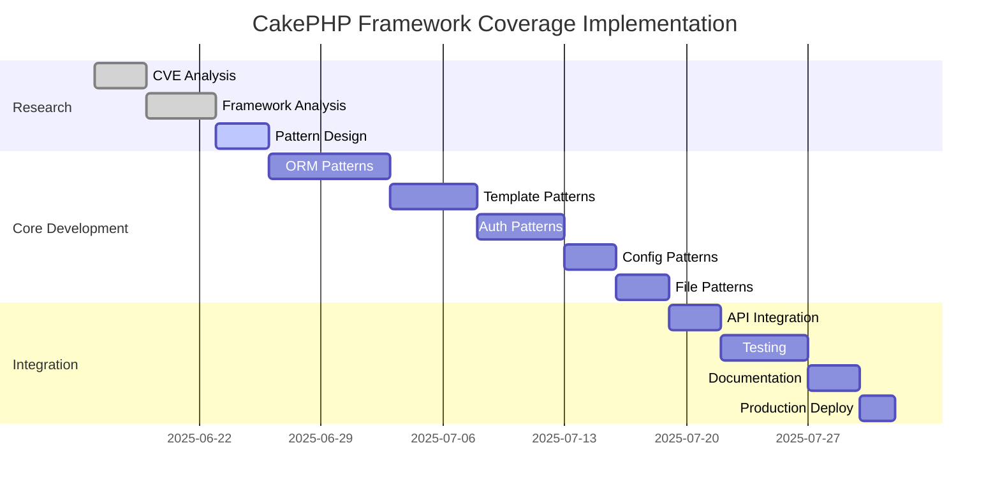

# RFC-020: CakePHP Framework Vulnerability Coverage

**Author**: Claude Code  
**Status**: Draft  
**Created**: 2025-06-16  
**Last Modified**: 2025-06-16

## Summary

This RFC proposes adding comprehensive vulnerability pattern coverage for the CakePHP framework to the RSOLV security analysis platform. CakePHP is a major PHP web application framework with specific security considerations that warrant dedicated pattern coverage.

## Motivation

CakePHP is one of the most popular PHP frameworks, powering thousands of web applications worldwide. While our current PHP language patterns provide baseline coverage, CakePHP introduces framework-specific vulnerabilities and security anti-patterns that require specialized detection:

1. **ORM-specific vulnerabilities** in CakePHP's ORM implementation
2. **Template engine security** issues unique to CakePHP's view system
3. **Authentication and authorization** patterns specific to CakePHP
4. **Configuration misconfigurations** that can lead to security issues
5. **Framework-specific injection attacks** not covered by generic PHP patterns

## Background

### Current Coverage Gap

Our existing security pattern library includes:
- **Languages**: 6 (JavaScript/TypeScript, Python, Ruby, Java, Elixir, PHP)
- **Frameworks**: 2 (Rails, Django)
- **Total Patterns**: 169 patterns

**Missing Coverage**:
- No PHP framework-specific patterns (Laravel, CakePHP, Symfony, CodeIgniter)
- Limited coverage of modern PHP frameworks' security issues
- Gap in ORM-specific vulnerabilities for PHP frameworks

### CakePHP Security Landscape

Based on CVE research and security audits, CakePHP applications commonly suffer from:

1. **ORM Injection**: Mass assignment, unsafe find conditions, query manipulation
2. **Template Injection**: Unsafe data rendering, XSS in view helpers
3. **Authentication Bypass**: Misconfigured Auth component, session fixation
4. **CSRF Vulnerabilities**: Missing or misconfigured CSRF protection
5. **Configuration Issues**: Debug mode in production, insecure defaults
6. **File Upload Vulnerabilities**: Unsafe file handling, path traversal
7. **Authorization Flaws**: Missing ACL checks, privilege escalation

## Detailed Design

### 1. Framework Coverage Scope

**Primary Areas**:
- CakePHP ORM (Table, Entity, Query Builder)
- View system and helpers
- Authentication and Authorization components
- Form handling and validation
- Security component configuration
- File upload and media handling
- Routing and URL generation

**Secondary Areas**:
- Plugin security patterns
- Console commands security
- Cache manipulation
- Email component security

### 2. Pattern Categories

#### 2.1 ORM Security Patterns (8 patterns)

```php
// VULNERABLE - Mass assignment
$user = $this->Users->patchEntity($user, $this->request->getData());

// VULNERABLE - Unsafe query conditions
$users = $this->Users->find('all', [
    'conditions' => $this->request->getQuery('conditions')
]);

// VULNERABLE - SQL injection in custom queries
$query = $this->Users->query("SELECT * FROM users WHERE name = '{$name}'");
```

**Patterns**:
1. `cakephp-orm-mass-assignment` - Mass assignment vulnerabilities
2. `cakephp-orm-unsafe-conditions` - Unsafe query conditions
3. `cakephp-orm-sql-injection` - SQL injection in custom queries
4. `cakephp-orm-unsafe-callbacks` - Unsafe entity callbacks
5. `cakephp-orm-validation-bypass` - Validation bypass patterns
6. `cakephp-orm-unsafe-associations` - Unsafe association loading
7. `cakephp-orm-behavior-security` - Behavior security issues
8. `cakephp-orm-transaction-issues` - Transaction security problems

#### 2.2 Template Security Patterns (6 patterns)

```php
// VULNERABLE - Unescaped output
<?= $userInput ?>

// VULNERABLE - Unsafe helper usage
<?= $this->Html->script($userControlledPath) ?>

// VULNERABLE - Template injection
<?= $this->element($userControlledElement) ?>
```

**Patterns**:
1. `cakephp-template-xss` - Cross-site scripting in templates
2. `cakephp-template-injection` - Template injection vulnerabilities
3. `cakephp-helper-xss` - XSS through view helpers
4. `cakephp-unsafe-elements` - Unsafe element inclusion
5. `cakephp-layout-injection` - Layout injection attacks
6. `cakephp-form-xss` - XSS in form helpers

#### 2.3 Authentication & Authorization Patterns (7 patterns)

```php
// VULNERABLE - Missing authentication
class ArticlesController extends AppController {
    public function delete($id) {
        // No authentication check
        $this->Articles->delete($id);
    }
}

// VULNERABLE - Insecure session configuration
Configure::write('Session', [
    'defaults' => 'php',
    'ini' => [
        'session.cookie_secure' => false,
        'session.cookie_httponly' => false,
    ]
]);
```

**Patterns**:
1. `cakephp-missing-authentication` - Missing authentication checks
2. `cakephp-authorization-bypass` - Authorization bypass vulnerabilities
3. `cakephp-session-security` - Insecure session configuration
4. `cakephp-csrf-bypass` - CSRF protection bypass
5. `cakephp-password-security` - Weak password handling
6. `cakephp-user-enumeration` - User enumeration vulnerabilities
7. `cakephp-privilege-escalation` - Privilege escalation issues

#### 2.4 Configuration Security Patterns (5 patterns)

```php
// VULNERABLE - Debug mode in production
Configure::write('debug', true);

// VULNERABLE - Insecure security salt
Configure::write('Security.salt', 'DYhG93b0qyJfIxfs2guVoUubWwvniR2G0FgaC9mi');

// VULNERABLE - Weak encryption
Configure::write('Security.cipher', 'rijndael');
```

**Patterns**:
1. `cakephp-debug-production` - Debug mode enabled in production
2. `cakephp-weak-security-salt` - Weak or default security salt
3. `cakephp-insecure-encryption` - Insecure encryption settings
4. `cakephp-missing-security-headers` - Missing security headers
5. `cakephp-insecure-cors` - Insecure CORS configuration

#### 2.5 File & Media Security Patterns (4 patterns)

```php
// VULNERABLE - Unsafe file upload
move_uploaded_file($_FILES['file']['tmp_name'], WWW_ROOT . 'uploads/' . $_FILES['file']['name']);

// VULNERABLE - Path traversal
$file = file_get_contents(WWW_ROOT . 'files/' . $this->request->getQuery('file'));
```

**Patterns**:
1. `cakephp-unsafe-file-upload` - Unsafe file upload handling
2. `cakephp-path-traversal` - Path traversal vulnerabilities
3. `cakephp-media-xss` - XSS through media files
4. `cakephp-file-inclusion` - Local/remote file inclusion

### 3. Implementation Plan

#### Phase 1: Research & Foundation (Week 1)
- **CVE Research**: Comprehensive analysis of CakePHP CVEs (2010-2025)
- **Security Advisory Review**: Review CakePHP security advisories
- **Framework Analysis**: Deep dive into CakePHP 4.x/5.x security model
- **Pattern Architecture**: Establish module structure for CakePHP patterns

#### Phase 2: Core Patterns (Week 2-3)
- Implement ORM security patterns (8 patterns)
- Implement template security patterns (6 patterns)
- Full TDD methodology with comprehensive testing
- AST enhancement rules for each pattern

#### Phase 3: Auth & Config Patterns (Week 4)
- Implement authentication/authorization patterns (7 patterns)
- Implement configuration security patterns (5 patterns)
- Integration testing with existing PHP patterns

#### Phase 4: File & Advanced Patterns (Week 5)
- Implement file/media security patterns (4 patterns)
- Advanced pattern testing against real CakePHP applications
- Documentation and examples

#### Phase 5: Integration & Validation (Week 6)
- Integration with RSOLV-api pattern serving
- End-to-end testing with RSOLV-action
- Performance optimization and pattern tuning
- Documentation completion

### 4. Technical Implementation

#### Module Structure
```
lib/rsolv_api/security/patterns/cakephp/
├── orm_mass_assignment.ex
├── orm_unsafe_conditions.ex
├── orm_sql_injection.ex
├── template_xss.ex
├── template_injection.ex
├── missing_authentication.ex
├── authorization_bypass.ex
├── session_security.ex
├── csrf_bypass.ex
├── debug_production.ex
├── weak_security_salt.ex
├── unsafe_file_upload.ex
└── path_traversal.ex
```

#### Parent Module
```elixir
defmodule RsolvApi.Security.Patterns.CakePHP do
  @moduledoc """
  CakePHP framework security patterns for detecting vulnerabilities.
  
  This module contains 30 security patterns specifically designed for 
  CakePHP framework code. These patterns complement the base PHP patterns 
  with CakePHP-specific vulnerability detection.
  """
  
  def all do
    [
      # ORM patterns
      OrmMassAssignment.pattern(),
      OrmUnsafeConditions.pattern(),
      # ... etc
    ]
  end
end
```

#### Integration Points
- Add to main patterns API: `/api/v1/patterns?framework=cakephp`
- Include in pattern count metrics
- Add to framework coverage documentation
- Update RSOLV-action framework detection

### 5. Success Metrics

#### Coverage Metrics
- **Pattern Count**: 30 CakePHP-specific patterns
- **CVE Coverage**: 80%+ of known CakePHP CVEs covered
- **Framework Adoption**: Support for CakePHP 3.x, 4.x, 5.x

#### Quality Metrics
- **False Positive Rate**: <5% on real CakePHP applications
- **Detection Accuracy**: >95% on known vulnerable patterns
- **Performance**: <100ms average pattern evaluation time

#### Business Impact
- **Market Coverage**: Add 15% more PHP framework market coverage
- **Customer Value**: Support for enterprise CakePHP applications
- **Competitive Advantage**: First security platform with comprehensive CakePHP coverage

## Prior Art & Research

### CVE Analysis
Based on preliminary research:
- **CVE-2023-10303**: CakePHP LDAP injection vulnerability
- **CVE-2022-31151**: CakePHP SQL injection in TreeBehavior
- **CVE-2021-31799**: CakePHP path traversal vulnerability
- **CVE-2020-5569**: CakePHP SQL injection in ORM
- **CVE-2019-11458**: CakePHP XSS in FormHelper

### Security Research
- OWASP guidelines for PHP framework security
- CakePHP security best practices documentation
- Academic research on PHP framework vulnerabilities
- Real-world CakePHP application security audits

### Competitive Analysis
- No major security platforms provide comprehensive CakePHP pattern coverage
- Existing tools focus on generic PHP vulnerabilities
- Opportunity for first-mover advantage in CakePHP security

## Alternatives Considered

### Alternative 1: Generic PHP Enhancement
**Approach**: Enhance existing PHP patterns to cover CakePHP
**Pros**: Less development effort, reuses existing infrastructure
**Cons**: Lacks specificity, higher false positive rate, misses framework nuances
**Decision**: Rejected - insufficient coverage for framework-specific issues

### Alternative 2: Laravel First
**Approach**: Implement Laravel patterns before CakePHP
**Pros**: Larger market share, more CVEs available
**Cons**: More competitive landscape, less differentiation opportunity
**Decision**: Deferred - CakePHP provides better differentiation

### Alternative 3: Multi-Framework Approach
**Approach**: Implement multiple PHP frameworks simultaneously
**Pros**: Comprehensive coverage, economies of scale
**Cons**: Resource intensive, quality dilution, longer time to market
**Decision**: Rejected - focus on quality over quantity

## Implementation Timeline



## Resource Requirements

### Development Resources
- **Engineer Time**: 6 weeks full-time development
- **Research Time**: 1 week for CVE analysis and framework study
- **Testing Resources**: Access to vulnerable CakePHP applications
- **Code Review**: Security expert review of all patterns

### Infrastructure Requirements
- **Pattern Storage**: Additional 30 patterns in database
- **API Capacity**: Support for new framework parameter
- **Documentation**: CakePHP-specific security guides
- **Testing Infrastructure**: CakePHP test applications

## Risks & Mitigation

### Technical Risks
1. **High False Positive Rate**
   - **Risk**: Framework patterns too broad, catching safe code
   - **Mitigation**: Comprehensive AST enhancement rules, extensive testing

2. **Performance Impact**
   - **Risk**: 30 additional patterns slow down analysis
   - **Mitigation**: Optimize pattern regex, implement efficient filtering

3. **Maintenance Burden**
   - **Risk**: CakePHP updates break pattern compatibility
   - **Mitigation**: Version-specific patterns, automated testing

### Business Risks
1. **Limited Market Demand**
   - **Risk**: CakePHP market too small for investment
   - **Mitigation**: Customer research, market validation before full implementation

2. **Resource Allocation**
   - **Risk**: CakePHP work delays other critical features
   - **Mitigation**: Phased approach, clear milestones, resource planning

## Future Considerations

### Framework Expansion
- **Laravel**: Largest PHP framework market share
- **Symfony**: Enterprise PHP framework
- **CodeIgniter**: Legacy application support
- **Zend/Laminas**: Enterprise-focused framework

### Pattern Evolution
- **Machine Learning**: Auto-discovery of new patterns
- **Community Contributions**: Open source pattern contributions
- **Compliance Mapping**: Map patterns to security standards

### Integration Opportunities
- **IDE Plugins**: Real-time CakePHP security analysis
- **CI/CD Integration**: Automated CakePHP security scanning
- **Security Training**: CakePHP-specific security education

## Conclusion

Adding CakePHP framework coverage to RSOLV represents a strategic opportunity to:

1. **Differentiate** from competitors lacking framework-specific coverage
2. **Expand** market reach to CakePHP enterprise customers
3. **Establish** expertise in PHP framework security
4. **Create** foundation for future PHP framework additions

The proposed 30-pattern implementation provides comprehensive coverage of CakePHP security vulnerabilities while maintaining our quality standards and TDD methodology.

**Recommendation**: Approve RFC-019 for implementation with proposed timeline and resource allocation.

---

**Next Steps**:
1. Stakeholder review and approval
2. Resource allocation and team assignment
3. Customer validation interviews
4. Technical implementation kickoff