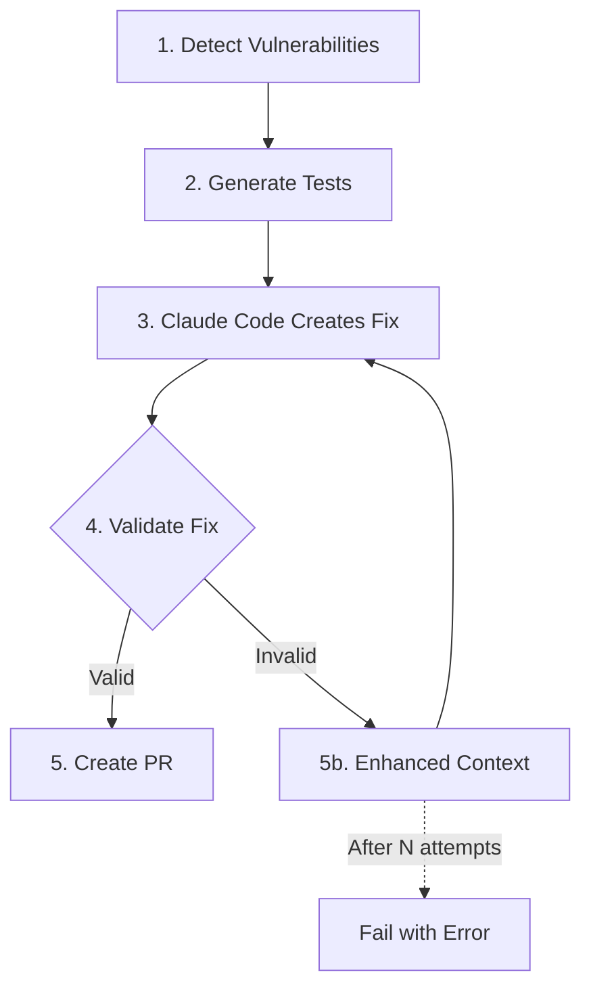

# RFC-028: Integrating Fix Validation with Generated Tests

## Status
- **Created**: 2025-06-24
- **Status**: Approved
- **Author**: RSOLV Team

## Summary

This RFC proposes integrating automated fix validation into the RSOLV-action workflow. The system will verify that Claude Code's generated fixes actually pass the intelligent tests before creating pull requests, with an iterative feedback loop for failed fixes.

## Motivation

Currently, RSOLV-action:
1. Detects vulnerabilities
2. Generates intelligent tests (red-green-refactor pattern)
3. Uses Claude Code to fix vulnerabilities
4. Creates a PR with the fix

However, we don't verify that the fix actually passes the generated tests. This RFC adds that critical validation step.

## Proposed Solution

### Integration Point

The validation step fits between fix generation and PR creation:

```
Current Flow:
1. Detect vulnerabilities
2. Generate tests  
3. Claude Code creates fix
4. Create PR

Proposed Flow:
1. Detect vulnerabilities
2. Generate tests
3. Claude Code creates fix
4. VALIDATE FIX
   ├─ If valid → 5. Create PR
   └─ If invalid → 5b. Return to step 3 with test failure context
```

The key innovation is that Step 5b loops back to Step 3, providing Claude Code with the test results and asking it to try again with this additional context.

### Implementation Details

#### 1. Update GitBasedProcessor

```typescript
// src/ai/git-based-processor.ts
import { TestGeneratingSecurityAnalyzer } from './test-generating-security-analyzer.js';
import { GitBasedTestValidator } from './git-based-test-validator.js';

export async function processIssueWithGit(
  issue: IssueContext,
  config: ActionConfig
): Promise<GitProcessingResult> {
  // ... existing steps 1-3 ...
  
  // Step 3.5: Generate tests for vulnerabilities
  const testAnalyzer = new TestGeneratingSecurityAnalyzer();
  const testResults = await testAnalyzer.analyzeWithTestGeneration(
    issue, 
    config,
    codebaseFiles
  );
  
  // Step 4: Execute Claude Code to make fixes
  let solution = await adapter.generateSolutionWithGit(issue, analysisData);
  let iteration = 0;
  const MAX_ITERATIONS = getMaxIterations(issue, config);
  
  // Step 4.5: Validation loop
  while (solution.success && testResults.generatedTests?.testSuite && iteration < MAX_ITERATIONS) {
    const validator = new GitBasedTestValidator();
    const beforeCommit = getLastCommitBeforeFix();
    
    const validation = await validator.validateFixWithTests(
      beforeCommit,
      solution.commitHash!,
      testResults.generatedTests.testSuite
    );
    
    if (validation.isValidFix) {
      // Fix is valid, proceed to PR creation
      break;
    }
    
    // Step 5b: Return to step 3 with enhanced context
    iteration++;
    logger.info(`Fix iteration ${iteration}: Previous fix failed validation`);
    
    // Reset to before the failed fix
    execSync(`git reset --hard ${beforeCommit}`);
    
    // Enhance issue context with test failure information
    const enhancedIssue = createEnhancedIssueWithTestFailure(
      issue,
      validation,
      testResults,
      iteration
    );
    
    // Loop back to Step 3: Try again with Claude Code
    solution = await adapter.generateSolutionWithGit(enhancedIssue, analysisData);
  }
  
  if (!solution.success || iteration >= MAX_ITERATIONS) {
    return {
      issueId: issue.id,
      success: false,
      message: `Fix validation failed after ${iteration} attempts`,
      error: solution.error || 'Maximum iterations reached'
    };
  }
  
  // Step 5: Create PR (only if validation passed)
  // ... existing PR creation ...
}
```

#### 2. Configurable Iteration Limits

```typescript
/**
 * Get maximum iterations based on configuration hierarchy
 */
function getMaxIterations(
  issue: IssueContext,
  config: ActionConfig
): number {
  // Priority order (first non-null wins):
  // 1. Issue-specific override (from labels or metadata)
  if (issue.labels.includes('fix-validation-max-5')) return 5;
  if (issue.labels.includes('fix-validation-max-1')) return 1;
  
  // 2. Vulnerability type specific (future enhancement)
  const vulnType = detectVulnerabilityType(issue);
  const vulnTypeConfig = config.fixValidation?.maxIterationsByType?.[vulnType];
  if (vulnTypeConfig !== undefined) return vulnTypeConfig;
  
  // 3. Customer tier specific (future enhancement)
  const customerTier = config.customerTier; // e.g., 'enterprise', 'pro', 'free'
  const tierConfig = config.fixValidation?.maxIterationsByTier?.[customerTier];
  if (tierConfig !== undefined) return tierConfig;
  
  // 4. Global configuration
  if (config.fixValidation?.maxIterations !== undefined) {
    return config.fixValidation.maxIterations;
  }
  
  // 5. Default fallback
  return 3;
}
```

#### 3. Enhanced Issue Context Function

```typescript
function createEnhancedIssueWithTestFailure(
  issue: IssueContext,
  validation: ValidationResult,
  testResults: AnalysisWithTestsResult,
  iteration: number
): IssueContext {
  // Create enhanced context for Claude Code with test failure details
  return {
    ...issue,
    body: `${issue.body}

## Previous Fix Attempt Failed

The previous fix did not pass the generated security tests:

### Test Results:
- Red Test (vulnerability should be fixed): ${validation.fixedCommit.redTestPassed ? '✅ PASSED' : '❌ FAILED'}
- Green Test (fix should work): ${validation.fixedCommit.greenTestPassed ? '✅ PASSED' : '❌ FAILED'}  
- Refactor Test (functionality maintained): ${validation.fixedCommit.refactorTestPassed ? '✅ PASSED' : '❌ FAILED'}

### Generated Test Code:
\`\`\`${testResults.generatedTests!.tests[0].framework}
${testResults.generatedTests!.tests[0].testCode}
\`\`\`

Please fix the vulnerability again, ensuring the fix passes all three tests.

### Why the Previous Fix Failed:
${explainTestFailure(validation)}

### Specific Requirements:
1. The vulnerability must be completely fixed (RED test must pass)
2. The fix must be correctly implemented (GREEN test must pass)  
3. Original functionality must be preserved (REFACTOR test must pass)

This is attempt ${iteration + 1} of ${maxIterations}.`
  };
}

function explainTestFailure(validation: ValidationResult): string {
  const failures = [];
  
  if (!validation.fixedCommit.redTestPassed) {
    failures.push('- The vulnerability still exists (RED test failed)');
  }
  if (!validation.fixedCommit.greenTestPassed) {
    failures.push('- The fix was not properly applied (GREEN test failed)');
  }
  if (!validation.fixedCommit.refactorTestPassed) {
    failures.push('- The fix broke existing functionality (REFACTOR test failed)');
  }
  
  return failures.join('\n');
}
```

#### 3. Enhanced Claude Code Prompts

Update the Claude Code adapter to include test validation context:

```typescript
// src/ai/adapters/claude-code-git.ts
private buildPromptWithTests(
  issue: IssueContext,
  analysis: AnalysisData,
  testCode?: string
): string {
  let prompt = this.buildPrompt(issue, analysis);
  
  if (testCode) {
    prompt += `

## Test Validation Requirements

The following tests have been generated to validate your fix:

\`\`\`javascript
${testCode}
\`\`\`

Your fix MUST ensure:
1. The RED test passes (vulnerability is fixed)
2. The GREEN test passes (fix is correctly applied)
3. The REFACTOR test passes (functionality is maintained)

The tests will be automatically run to validate your fix before the PR is created.
`;
  }
  
  return prompt;
}
```

### Benefits

1. **Quality Assurance**: Ensures fixes actually work before creating PRs
2. **Reduced Manual Review**: PRs are pre-validated with automated tests
3. **Iterative Improvement**: Claude Code gets feedback and can retry
4. **Test-Driven Development**: Enforces TDD principles in automated fixes
5. **Learning Loop**: Failed attempts provide context for better fixes

### Configuration

Add configuration options:

```yaml
# action.yml
fix-validation:
  enabled: true
  max-iterations: 3  # Global default
  max-iterations-by-type:  # Per vulnerability type (optional)
    sql-injection: 5      # More attempts for complex SQL fixes
    xss: 3
    command-injection: 4
  max-iterations-by-tier:  # Per customer tier (optional)
    enterprise: 10        # More attempts for paying customers
    pro: 5
    free: 2
  run-tests-in-container: false  # Use native test runners
  test-timeout: 300  # 5 minutes per test suite
```

### Override Mechanisms

1. **Issue Labels**: Add labels like `fix-validation-max-5` to override for specific issues
2. **Repository Settings**: `.rsolv/config.yml` can override defaults
3. **Environment Variables**: `RSOLV_FIX_VALIDATION_MAX_ITERATIONS=5`
4. **API Configuration**: Dynamic configuration from RSOLV API based on customer plan

### Workflow Example

```yaml
# .github/workflows/security.yml
- uses: rsolv/rsolv-action@v1
  with:
    fix-validation-enabled: true
    fix-validation-max-iterations: 3
```

### Flow Diagram



## Implementation Plan

### Phase 1: Core Integration (Week 1)
1. Update `processIssueWithGit` to include test generation
2. Add validation step after fix generation
3. Implement basic iteration logic with configurable limits
4. Update prompts to include test context
5. Add `getMaxIterations` function with basic hierarchy

### Phase 2: Enhanced Iteration (Week 2)
1. Improve error messages and feedback
2. Add test result analysis to iteration context
3. Implement rollback safety mechanisms
4. Add metrics and logging

### Phase 3: Container Support (Week 3)
1. Support running tests in containers
2. Handle different test frameworks
3. Add timeout and resource limits
4. Test with vulnerable-apps

## Future Extensibility

The configurable iteration system is designed to support future enhancements:

1. **ML-based iteration prediction**: Use historical data to predict optimal iterations
2. **Dynamic adjustment**: Increase iterations based on fix complexity
3. **Cost-based limits**: Different limits based on API usage costs
4. **Time-based limits**: Adjust based on SLA requirements
5. **Confidence scoring**: More iterations for low-confidence fixes

## Alternatives Considered

1. **Post-PR Validation**: Run tests after PR creation
   - Rejected: Creates noise with failing PRs
   
2. **Separate Validation Workflow**: Decouple from main flow
   - Rejected: Adds complexity and delays
   
3. **Manual Test Running**: Require human validation
   - Rejected: Defeats automation purpose
   
4. **Fixed iteration count**: Hard-code 3 attempts for all cases
   - Rejected: Not flexible enough for diverse use cases

## Success Metrics

- 95%+ of PRs pass their generated tests
- <5% of fixes require manual intervention
- Average iterations per fix: 1.2
- Validation adds <2 minutes to processing time
- Configuration flexibility used by 30%+ of enterprise customers

## Security Considerations

- Tests run in isolated environment
- No production credentials in test environment
- Rollback mechanism prevents repository corruption
- Commit signing maintained throughout iterations

## References

- Phase 5E: Intelligent Test Generation
- GitBasedTestValidator implementation
- RFC-008: Pattern Serving API
- ADR-012: Git-Based In-Place Editing