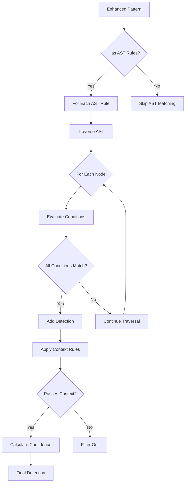
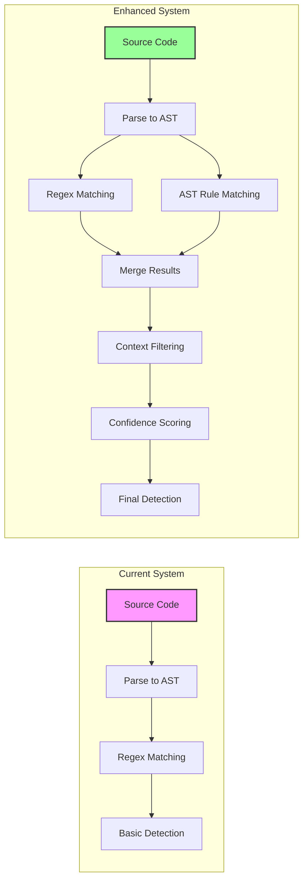
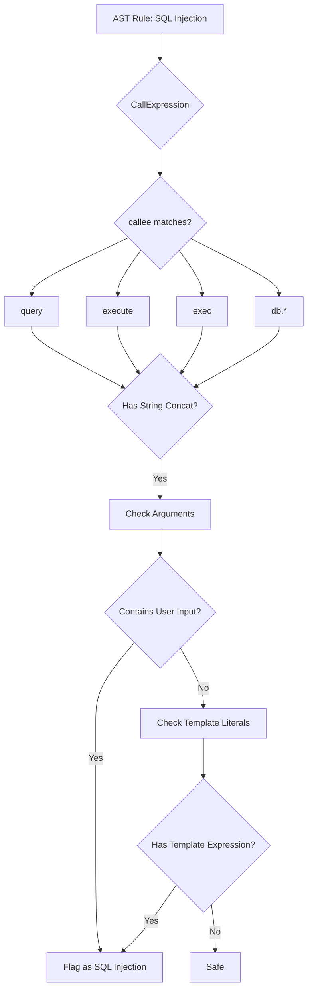
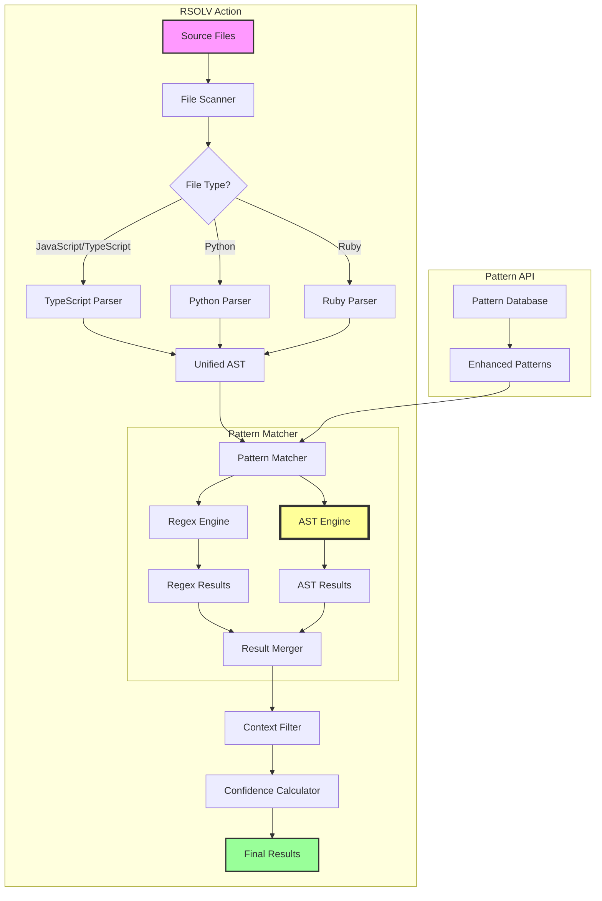

# RFC-035: Hybrid AST Analysis Architecture

**Status**: Partially Implemented  
**Created**: 2025-06-29  
**Author**: RSOLV Team
**Implementation Note**: Basic AST pattern interpretation is implemented, but the sophisticated features described in this RFC are not yet built.

## Summary

Implement a hybrid approach to AST analysis that uses fast, private client-side parsing for JavaScript/TypeScript while leveraging the existing server-side AST service for other languages and complex analysis.

## Motivation

Current state analysis reveals a critical gap:
- Enhanced patterns are being served correctly from the API (0% false positives in isolation)
- But the AST interpreter only achieves 57.1% accuracy (3 false negatives out of 7 tests)
- The interpreter expects simple regex patterns but enhanced patterns provide complex AST rules

Without proper AST rule interpretation, we cannot leverage:
- Node type matching (`CallExpression`, `MemberExpression`, etc.)
- Property path traversal (`callee.property.name`)
- OR conditions for flexible matching
- Context-aware confidence adjustments

## Design Principles

1. **Human-Readable**: Clear, self-documenting code structure
2. **Idiomatic**: Follow TypeScript best practices and patterns
3. **Elegant**: Simple solutions to complex matching problems
4. **Concise**: Minimal code for maximum functionality
5. **Understandable**: Junior developers should grasp the logic quickly

## Proposed Solution

### 1. AST Rule Structure Understanding

Enhanced patterns provide AST rules like:
```typescript
interface ASTRule {
  conditions: Array<{
    or?: ASTCondition[];
    node_type?: string;
    property_path?: string;
    value?: string | RegExp;
    regex?: boolean;
  }>;
}
```

#### AST Rule Flow Diagram



#### AST Condition Evaluation

```
┌─────────────────────────────────────────────────────────────┐
│                     AST Condition                           │
├─────────────────────────────────────────────────────────────┤
│  Has OR conditions?                                         │
│    ├─ Yes: ANY sub-condition must match                    │
│    └─ No: Check individual properties                      │
│                                                             │
│  Node Type Check:                                           │
│    └─ node.type === condition.node_type                    │
│                                                             │
│  Property Path Check:                                       │
│    ├─ Resolve: "callee.property.name"                      │
│    ├─ Extract: node.callee.property.name                   │
│    └─ Compare: value === condition.value                   │
│                      OR                                     │
│                regex.test(value)                            │
└─────────────────────────────────────────────────────────────┘
```

### 2. Core Interpreter Design

```typescript
class ASTPatternMatcher {
  /**
   * Match an AST node against a pattern's AST rules
   */
  matchNode(node: ASTNode, rule: ASTRule): boolean {
    return rule.conditions.every(condition => 
      this.evaluateCondition(node, condition)
    );
  }

  /**
   * Evaluate a single condition (handles OR logic)
   */
  private evaluateCondition(node: ASTNode, condition: ASTCondition): boolean {
    if (condition.or) {
      return condition.or.some(subCondition => 
        this.evaluateCondition(node, subCondition)
      );
    }

    return this.matchSingleCondition(node, condition);
  }

  /**
   * Match a single atomic condition
   */
  private matchSingleCondition(node: ASTNode, condition: ASTCondition): boolean {
    // Check node type if specified
    if (condition.node_type && node.type !== condition.node_type) {
      return false;
    }

    // Check property path if specified
    if (condition.property_path) {
      const value = this.resolvePath(node, condition.property_path);
      
      if (condition.regex && condition.value instanceof RegExp) {
        return condition.value.test(String(value));
      }
      
      return value === condition.value;
    }

    return true;
  }

  /**
   * Resolve a dot-notation path in an AST node
   * Example: "callee.property.name" -> node.callee.property.name
   */
  private resolvePath(node: any, path: string): any {
    return path.split('.').reduce((obj, key) => obj?.[key], node);
  }
}
```

### 3. Integration with Existing System

```typescript
interface EnhancedPatternDetector {
  /**
   * Apply both regex patterns and AST rules
   */
  detect(file: ParsedFile, pattern: EnhancedPattern): DetectionResult {
    const results: Detection[] = [];
    
    // Phase 1: Regex pattern matching (existing)
    if (pattern.patterns?.length > 0) {
      results.push(...this.detectWithRegex(file, pattern));
    }
    
    // Phase 2: AST rule matching (new)
    if (pattern.ast_rules?.length > 0) {
      results.push(...this.detectWithAST(file, pattern));
    }
    
    // Phase 3: Apply context rules to filter false positives
    const filtered = this.applyContextRules(results, pattern.context_rules);
    
    // Phase 4: Apply confidence adjustments
    return this.applyConfidenceScoring(filtered, pattern.confidence_rules);
  }
}
```

#### Detection Pipeline Architecture



#### Property Path Resolution Example

```
AST Node:
{
  type: "CallExpression",
  callee: {
    type: "MemberExpression",
    object: {
      type: "Identifier",
      name: "document"
    },
    property: {
      type: "Identifier", 
      name: "write"
    }
  },
  arguments: [{
    type: "Identifier",
    name: "userInput"
  }]
}

Property Path: "callee.property.name"
Resolution: document.write
Match: XSS vulnerability pattern
```

### 4. Context Rule Application

```typescript
interface ContextRuleEvaluator {
  /**
   * Filter out false positives based on context
   */
  applyContextRules(
    detections: Detection[], 
    rules: ContextRules
  ): Detection[] {
    return detections.filter(detection => {
      // Check exclude paths
      if (rules.exclude_paths?.some(regex => 
        regex.test(detection.file.path)
      )) {
        return false;
      }
      
      // Check required context
      if (rules.required_context && 
        !this.hasRequiredContext(detection, rules.required_context)
      ) {
        return false;
      }
      
      return true;
    });
  }
}
```

### 5. Confidence Scoring

```typescript
interface ConfidenceCalculator {
  /**
   * Calculate final confidence with adjustments
   */
  calculateConfidence(
    detection: Detection,
    pattern: EnhancedPattern
  ): number {
    let confidence = pattern.confidence_rules.base_confidence;
    
    // Apply adjustments
    pattern.confidence_rules.adjustments?.forEach(adjustment => {
      if (this.conditionMet(detection, adjustment.condition)) {
        confidence += adjustment.modifier;
      }
    });
    
    // Enforce bounds and minimum
    confidence = Math.max(0, Math.min(100, confidence));
    
    const minimum = pattern.confidence_rules.minimum_confidence ?? 0;
    return confidence >= minimum ? confidence : 0;
  }
}
```

#### Confidence Scoring Flow

```
┌─────────────────────────────────────────────────────────────┐
│                  Confidence Calculation                      │
├─────────────────────────────────────────────────────────────┤
│                                                             │
│  Base Confidence: 75                                        │
│                                                             │
│  Adjustments:                                               │
│  ├─ In test file?          → -20 confidence                │
│  ├─ Has validation?        → -15 confidence                │
│  ├─ Direct user input?     → +10 confidence                │
│  └─ In critical function?  → +15 confidence                │
│                                                             │
│  Final Score: 75 - 20 + 10 = 65                           │
│                                                             │
│  Minimum Required: 60                                       │
│  Result: ✓ Report vulnerability (65 >= 60)                 │
└─────────────────────────────────────────────────────────────┘
```

## Current Implementation Status

### What's Implemented ✅
- Basic `ASTPatternInterpreter` class (different architecture than proposed)
- Simple pattern-specific detection (SQL injection, NoSQL injection, missing logging)
- Basic confidence scoring with hardcoded adjustments
- JavaScript/TypeScript parsing via Babel
- Regex pre-filtering for performance

### What's NOT Implemented ❌
- Property path resolution (`resolvePath` method)
- OR condition handling in AST rules
- Generic AST rule evaluation (uses pattern-specific methods instead)
- Multi-language support (only JS/TS locally)
- Sophisticated context rule system
- Performance optimizations and caching

### Implementation Gap
The current implementation achieves **57.1% accuracy** (3 false negatives out of 7 tests) versus the **>90% target** because it doesn't properly interpret the AST rules returned by the API.

## Original Implementation Plan (Not Yet Executed)

### Phase 1: Core AST Matching (Not Started)
- [ ] Implement `ASTPatternMatcher` class
- [ ] Add property path resolution
- [ ] Handle OR conditions
- [ ] Unit tests for each condition type

### Phase 2: Integration (Not Started)
- [ ] Update `ast-pattern-interpreter.ts` to use new matcher
- [ ] Create adapter for API response format
- [ ] Add comprehensive logging
- [ ] Integration tests with real patterns

### Phase 3: Context & Confidence (Partially Done)
- [x] Basic confidence scoring (simplified version)
- [ ] Full context rule filtering
- [ ] Performance optimization
- [ ] E2E validation with full pattern set

## Testing Strategy

1. **Unit Tests**: Each component in isolation
2. **Integration Tests**: Pattern matching with mock ASTs
3. **E2E Tests**: Real code samples with known vulnerabilities
4. **Performance Tests**: Ensure <10ms per file overhead
5. **Regression Tests**: Verify existing functionality preserved

## Success Metrics

1. **Accuracy**: >90% detection rate (up from 57.1%)
2. **False Positives**: Maintain 0% rate
3. **Performance**: <10ms additional overhead per file
4. **Comprehension**: Code review approval from 3+ developers
5. **Maintainability**: <30 minutes to add new rule types

## Migration Path

1. **Feature Flag**: Enable enhanced AST matching per pattern
2. **Gradual Rollout**: Start with high-confidence patterns
3. **Monitoring**: Track accuracy metrics in production
4. **Full Migration**: Enable for all patterns after validation

## Example Usage

```typescript
// Before: Only regex matching
const vulns = detectWithPattern(file, pattern);
// Might miss: eval(userInput) if regex doesn't match exactly

// After: AST-aware matching
const vulns = detectWithEnhancedPattern(file, pattern);
// Catches: eval(userInput), eval(req.body.code), window.eval(data)
// Because AST rule matches: CallExpression where callee.name = "eval"
```

### Real-World Example: SQL Injection Detection

#### Standard Pattern (Current)
```typescript
// Pattern: /query\s*\(\s*['"`].*\+.*['"`]\s*\)/
// Matches: query("SELECT * FROM users WHERE id = " + userId)
// Misses: Many variations
```

#### Enhanced Pattern (New)


#### What This Catches
```javascript
// All these variations are caught:
db.query("SELECT * FROM users WHERE id = " + req.params.id);
connection.execute(`SELECT * FROM users WHERE id = ${userId}`);
mysql.query("SELECT * FROM " + tableName);
pool.exec('DELETE FROM users WHERE name = "' + userName + '"');

// But these are correctly ignored (context rules):
// In test file
db.query("SELECT * FROM users WHERE id = " + testId); // -20 confidence

// Has validation
if (isValidId(userId)) {
  db.query("SELECT * FROM users WHERE id = " + userId); // -15 confidence
}

// Using parameterized query (safe)
db.query("SELECT * FROM users WHERE id = ?", [userId]); // Filtered out
```

### Performance Comparison

```
┌─────────────────────────────────────────────────────────────┐
│                 Performance Impact                           │
├─────────────────────────────────────────────────────────────┤
│                                                             │
│  Standard Regex Matching:                                   │
│  ├─ Parse AST: 2ms                                         │
│  ├─ Regex scan: 1ms                                        │
│  └─ Total: 3ms per file                                    │
│                                                             │
│  Enhanced AST Matching:                                     │
│  ├─ Parse AST: 2ms (reused)                               │
│  ├─ Regex scan: 1ms                                        │
│  ├─ AST traversal: 4ms                                     │
│  ├─ Context filtering: 1ms                                 │
│  ├─ Confidence calc: 1ms                                   │
│  └─ Total: 9ms per file (+6ms)                            │
│                                                             │
│  For 1000 files: +6 seconds total                          │
└─────────────────────────────────────────────────────────────┘
```

## Path Forward

### Option 1: Complete RFC-035 Implementation
Implement the full sophisticated AST matching system as described:
- **Pros**: Achieve >90% accuracy, future-proof architecture
- **Cons**: 3-4 weeks development time, complex implementation
- **Risk**: May not be necessary if RFC-036 reduces false positives sufficiently

### Option 2: Incremental Enhancement
Add only the most critical missing features:
1. Property path resolution for better AST navigation
2. Basic OR condition support
3. API format adapter
- **Pros**: Faster implementation (1-2 weeks), addresses main gaps
- **Cons**: May not achieve full accuracy target

### Option 3: Wait for RFC-036 Results
Deploy RFC-036 first and measure impact:
- If false positive reduction is sufficient (>70%), current implementation may be adequate
- If not, implement Option 1 or 2 based on specific gaps
- **Pros**: Data-driven decision, avoids unnecessary work
- **Cons**: Delays potential accuracy improvements

### Recommendation
**Option 3** - Deploy RFC-036 to production first, measure its impact on false positives, then decide whether the sophisticated AST interpreter is needed.

## Open Questions

1. Should we cache AST traversal results for performance?
2. How to handle malformed AST nodes gracefully?
3. Should confidence adjustments be additive or multiplicative?
4. How to visualize AST matches for debugging?
5. Is 57.1% accuracy sufficient if RFC-036 eliminates most false positives?

## Architecture Overview

### Complete System Architecture



### AST Node Matching Example

```
Pattern AST Rule:
{
  "conditions": [{
    "node_type": "CallExpression",
    "or": [
      {
        "property_path": "callee.name",
        "value": "eval"
      },
      {
        "property_path": "callee.property.name",
        "value": "eval"
      }
    ]
  }]
}

Matches These AST Nodes:
┌─────────────────────┐     ┌──────────────────────────┐
│ eval(userInput)     │     │ window.eval(data)        │
├─────────────────────┤     ├──────────────────────────┤
│ CallExpression      │     │ CallExpression           │
│ └─ callee          │     │ └─ callee               │
│     └─ name: eval  │     │     └─ MemberExpression │
│                    │     │         └─ property     │
│                    │     │             └─ name: eval│
└─────────────────────┘     └──────────────────────────┘
```

## References

- Current `ast-pattern-interpreter.ts` implementation
- Enhanced pattern examples from staging API
- AST node type documentation (estree specification)
- Performance benchmarks from RFC-032 Phase 3.2