# RFC-049: Customer Management Cleanup and Admin Interface

**Status**: Draft (Revised)  
**Created**: 2025-09-03  
**Last Updated**: 2025-09-05 10:00 MDT
**Author**: Infrastructure Team  
**Related**: 
- ACCOUNT-STRUCTURE-FINDINGS.md
- ACCOUNT-CONSOLIDATION-TEST-PLAN.md
- RFC-054 (Distributed Rate Limiter) - Required for admin authentication

## Summary

Complete the partially-finished customer consolidation by cleaning up unused entities, implement an admin interface using Phoenix LiveView, and establish a path toward customer self-service. The migration is simpler than originally anticipated - billing fields are already consolidated, and we have no production users to migrate.

## Problem Statement

RSOLV has remnants of parallel customer systems that need cleanup:
1. `Customers.Customer` - **Already contains all billing fields** (consolidation partially done)
2. `Users` table - **Empty and unused** (0 records in production)
3. `Billing.Customer` schema - Duplicate code referencing same table
4. `LegacyAccounts` - Hardcoded test accounts with environment variables

### Current Architecture (Actual State in Production)

```mermaid
graph TD
    subgraph "Current State - Partially Consolidated"
        User[Users Table<br/>📭 EMPTY]
        CC[Customers Table<br/>✅ Has all fields]
        BC[Billing.Customer<br/>Schema only]
        LA[LegacyAccounts<br/>Hardcoded]
        
        User -.-> CC[FK exists but unused]
        CC --> Fields[✅ Billing fields<br/>✅ Trial fields<br/>✅ Usage tracking]
        BC -.-> CC[Same table]
        
        LA --> Hardcoded[5 test accounts]
    end
    
    style User fill:#ffcccc
    style BC fill:#ffeecc
    style LA fill:#ffcccc
```


Production data shows:
- 5 test customers (all internal/demo)
- 0 users (empty table with foreign key constraint)
- All billing fields already in customers table
- No real customer data to migrate

## Proposed Solution

### Target Architecture (Simplified)

```mermaid
graph TD
    subgraph "After Cleanup: Single Source of Truth"
        Customer[Customers Table<br/>✨ Single Entity]
        Customer --> CoreFields[Core Fields<br/>name, email, api_key]
        Customer --> AuthFields[Auth Fields<br/>password_hash, is_staff]
        Customer --> BillingFields[Billing Fields<br/>✅ Already present]
        
        Customer --> Auth[🔐 Dual Auth]
        Auth --> Web[Web Dashboard<br/>password-based]
        Auth --> API[CLI/CI<br/>API key-based]
        
        Customer --> Simple[Simple Relations]
        Simple --> Fixes[Fix Attempts]
        Simple --> Creds[Credentials]
    end
    
    style Customer fill:#90EE90
    style BillingFields fill:#98FB98
    
    Note[No User table ❌<br/>No duplicate schemas ❌<br/>No LegacyAccounts ❌]
    
    style Note fill:#FFE4E1
```


### Complexity Reduction


### Phase 0: CRITICAL - Consolidate Duplicate Schemas (MUST DO FIRST)

**Problem**: We have two Customer schemas pointing to the same table but with different fields:
- `Rsolv.Customers.Customer` - Has relationships but missing billing fields
- `Rsolv.Billing.Customer` - Has billing fields but missing relationships

**Solution**: Merge both schemas into one complete schema

```elixir
# lib/rsolv/customers/customer.ex - CONSOLIDATED VERSION
defmodule Rsolv.Customers.Customer do
  use Ecto.Schema
  import Ecto.Changeset
  
  schema "customers" do
    # Core fields (from Customers.Customer)
    field :name, :string
    field :email, :string
    field :api_key, :string
    field :monthly_limit, :integer, default: 100
    field :current_usage, :integer, default: 0
    field :active, :boolean, default: true
    field :metadata, :map, default: %{}
    field :github_org, :string
    field :plan, :string, default: "trial"
    
    # Billing fields (from Billing.Customer) - MUST ADD THESE!
    field :trial_fixes_used, :integer, default: 0
    field :trial_fixes_limit, :integer, default: 10
    field :trial_expired, :boolean, default: false
    field :trial_expired_at, :utc_datetime
    field :payment_method_added, :boolean, default: false
    field :payment_method_added_at, :utc_datetime
    field :stripe_customer_id, :string
    field :subscription_plan, :string, default: "pay_as_you_go"
    field :subscription_status, :string, default: "trial"
    field :monthly_fix_quota, :integer
    field :rollover_fixes, :integer, default: 0
    
    # Relationships (from Customers.Customer)
    belongs_to :user, Rsolv.Accounts.User
    has_many :api_keys, Rsolv.Customers.ApiKey
    has_many :fix_attempts, Rsolv.Billing.FixAttempt
    
    timestamps()
  end
end
```

**Actions**:
1. Update `lib/rsolv/customers/customer.ex` with ALL fields
2. Delete `lib/rsolv/billing/customer.ex` 
3. Update all references from `Rsolv.Billing.Customer` to `Rsolv.Customers.Customer`
4. Run tests to ensure nothing breaks

### Phase 1: TDD Red-Green-Refactor Approach

#### Red Phase: Write Failing Tests First (Day 1 Morning)

```elixir
# test/rsolv/customers_test.exs
defmodule Rsolv.CustomersTest do
  use Rsolv.DataCase
  
  describe "customer authentication" do
    test "customer can authenticate with password" do
      # This will fail - no password_hash field yet
      customer = customer_fixture(password: "secure_password123")
      assert Customers.authenticate_by_email_password(
        customer.email, 
        "secure_password123"
      )
    end
    
    test "customer can be marked as staff" do
      # This will fail - no is_staff field yet
      customer = customer_fixture(is_staff: true, admin_level: "admin")
      assert customer.is_staff == true
      assert customer.admin_level == "admin"
    end
  end
  
  describe "consolidated customer management" do
    test "no User dependency required" do
      # This will fail initially - create_customer still expects user
      {:ok, customer} = Customers.create_customer(%{
        email: "test@example.com",
        name: "Test Customer",
        password: "secure_password"
      })
      assert customer.email == "test@example.com"
    end
  end
end
```

#### Green Phase: Make Tests Pass (Day 1 Afternoon)

##### 1.1 Ecto Migration Best Practices Applied

```elixir
# priv/repo/migrations/20250904000001_add_customer_authentication_fields.exs
defmodule Rsolv.Repo.Migrations.AddCustomerAuthenticationFields do
  use Ecto.Migration
  
  # Disable lock for adding nullable columns (safe operation)
  @disable_migration_lock true
  @disable_ddl_transaction true

  def up do
    # SAFE: Adding nullable columns doesn't require table lock in Postgres
    alter table(:customers) do
      add_if_not_exists :password_hash, :string
      add_if_not_exists :customer_type, :string, default: "trial"
      add_if_not_exists :is_staff, :boolean, default: false
      add_if_not_exists :admin_level, :string, size: 20
      add_if_not_exists :company_name, :string
      add_if_not_exists :confirmed_at, :naive_datetime
    end
    
    # Flush changes before creating indexes
    flush()
    
    # Create indexes concurrently to avoid locking reads
    create_if_not_exists index(:customers, [:is_staff], concurrently: true)
    create_if_not_exists index(:customers, [:customer_type], concurrently: true)
    create_if_not_exists index(:customers, [:email], concurrently: true, unique: true)
  end
  
  def down do
    # Reverse operations for rollback
    drop_if_exists index(:customers, [:email])
    drop_if_exists index(:customers, [:customer_type])
    drop_if_exists index(:customers, [:is_staff])
    
    alter table(:customers) do
      remove_if_exists :confirmed_at, :naive_datetime
      remove_if_exists :company_name, :string
      remove_if_exists :admin_level, :string
      remove_if_exists :is_staff, :boolean
      remove_if_exists :customer_type, :string
      remove_if_exists :password_hash, :string
    end
  end
end
```

##### 1.2 Update Customer Schema

```elixir
# lib/rsolv/customers/customer.ex
defmodule Rsolv.Customers.Customer do
  use Ecto.Schema
  import Ecto.Changeset
  
  schema "customers" do
    # Existing fields
    field :name, :string
    field :email, :string
    field :api_key, :string
    field :active, :boolean, default: true
    field :metadata, :map, default: %{}
    
    # Billing fields (already present)
    field :trial_fixes_used, :integer, default: 0
    field :trial_fixes_limit, :integer, default: 10
    field :stripe_customer_id, :string
    
    # NEW: Auth fields replacing User
    field :password, :string, virtual: true
    field :password_hash, :string
    field :customer_type, :string, default: "trial"
    field :is_staff, :boolean, default: false
    field :admin_level, :string
    field :company_name, :string
    field :confirmed_at, :naive_datetime
    
    # Relationships
    has_many :fix_attempts, Rsolv.Billing.FixAttempt
    has_many :api_keys, Rsolv.Customers.ApiKey
    
    timestamps()
  end
  
  def changeset(customer, attrs) do
    customer
    |> cast(attrs, [:name, :email, :company_name, :customer_type, 
                    :is_staff, :admin_level, :password])
    |> validate_required([:name, :email])
    |> validate_email()
    |> maybe_hash_password()
  end
  
  defp maybe_hash_password(changeset) do
    if password = get_change(changeset, :password) do
      put_change(changeset, :password_hash, Bcrypt.hash_pwd_salt(password))
    else
      changeset
    end
  end
end
```

#### Refactor Phase: Clean Up Dependencies (Day 2)

##### 1.3 Safe Migration to Remove User Dependencies

```elixir
# priv/repo/migrations/20250904000002_remove_user_dependencies.exs
defmodule Rsolv.Repo.Migrations.RemoveUserDependencies do
  use Ecto.Migration
  
  # This migration manipulates constraints and drops tables
  # Keep it in a transaction for atomicity
  @disable_migration_lock false
  @disable_ddl_transaction false

  def up do
    # Step 1: Drop the foreign key constraint (safe, instant operation)
    drop_if_exists constraint(:customers, :customers_user_id_fkey)
    
    # Step 2: Remove the column (safe for empty column)
    alter table(:customers) do
      remove_if_exists :user_id, :bigint
    end
    
    # Step 3: Drop dependent tables first
    drop_if_exists table(:users_tokens)
    
    # Step 4: Drop the users table
    drop_if_exists table(:users)
    
    # Note: Using drop_if_exists makes this migration idempotent
    # Can be run multiple times safely
  end
  
  def down do
    # Recreate the structure if we need to rollback
    # This matches the original migration structure
    execute "CREATE EXTENSION IF NOT EXISTS citext", ""
    
    create_if_not_exists table(:users) do
      add :email, :citext, null: false
      add :hashed_password, :string, null: false
      add :confirmed_at, :naive_datetime
      timestamps(type: :utc_datetime)
    end
    
    create_if_not_exists unique_index(:users, [:email])
    
    create_if_not_exists table(:users_tokens) do
      add :user_id, references(:users, on_delete: :delete_all), null: false
      add :token, :binary, null: false
      add :context, :string, null: false
      add :sent_to, :string
      timestamps(updated_at: false, type: :utc_datetime)
    end
    
    create_if_not_exists index(:users_tokens, [:user_id])
    create_if_not_exists unique_index(:users_tokens, [:context, :token])
    
    # Re-add the user_id column to customers
    alter table(:customers) do
      add_if_not_exists :user_id, references(:users, on_delete: :restrict)
    end
    
    create_if_not_exists index(:customers, [:user_id])
  end
end
```

##### 1.4 Data Migration for Test Accounts (Separate from Schema)

```elixir
# priv/repo/migrations/20250904000003_migrate_test_accounts.exs
defmodule Rsolv.Repo.Migrations.MigrateTestAccounts do
  use Ecto.Migration
  import Ecto.Query
  
  # Data migrations should run in transactions
  @disable_migration_lock false
  @disable_ddl_transaction false
  
  def up do
    # Convert the 5 test accounts to have staff privileges
    # This is a data migration, kept separate from schema changes
    
    execute """
    UPDATE customers 
    SET is_staff = true, 
        admin_level = 'admin',
        customer_type = 'internal'
    WHERE api_key IN (
      'rsolv_enterprise_test_448patterns',
      'rsolv_test_e2e_full_2025',
      'rsolv_dogfood_key',
      'rsolv_demo_key_123',
      'rsolv_test_full_access_no_quota_2025'
    )
    """
  end
  
  def down do
    # Reverse the staff privileges
    execute """
    UPDATE customers 
    SET is_staff = false, 
        admin_level = NULL,
        customer_type = 'trial'
    WHERE api_key IN (
      'rsolv_enterprise_test_448patterns',
      'rsolv_test_e2e_full_2025',
      'rsolv_dogfood_key',
      'rsolv_demo_key_123',
      'rsolv_test_full_access_no_quota_2025'
    )
    """
  end
end
```

### Phase 2: Update Application Code

#### 2.1 Update Customers Context

```elixir
# lib/rsolv/customers.ex
defmodule Rsolv.Customers do
  # Remove User dependency from create_customer
  def create_customer(attrs \\ %{}) do
    %Customer{}
    |> Customer.changeset(attrs)
    |> Repo.insert()
  end
  
  # Add authentication functions
  def authenticate_by_email_password(email, password) do
    customer = Repo.get_by(Customer, email: email)
    if Customer.valid_password?(customer, password), do: {:ok, customer}, else: :error
  end
  
  # Clean up API key lookup - remove LegacyAccounts fallback
  def get_customer_by_api_key(api_key) when is_binary(api_key) do
    Repo.get_by(Customer, api_key: api_key, active: true) ||
    get_customer_by_api_key_table(api_key)
  end
  
  defp get_customer_by_api_key_table(api_key) do
    case Repo.get_by(ApiKey, key: api_key, active: true) do
      %ApiKey{customer_id: id} -> get_customer!(id)
      nil -> nil
    end
  end
end
```

#### 2.2 Simplify Accounts Context

```elixir
# lib/rsolv/accounts.ex
defmodule Rsolv.Accounts do
  # This module becomes a thin compatibility layer during transition
  # Eventually can be removed entirely
  
  # Redirect all customer operations to Customers context
  defdelegate get_customer_by_api_key(api_key), to: Rsolv.Customers
  defdelegate get_customer!(id), to: Rsolv.Customers
  defdelegate update_customer(customer, attrs), to: Rsolv.Customers
  
  # Remove all User-related functions
  # Remove register_user, get_user_by_email, etc.
end
```

### Phase 3: Admin UI with TDD

#### 3.1 Admin UI Tests First (Including Rate Limiting)

```elixir
# test/rsolv_web/live/admin/customer_live_test.exs
defmodule RsolvWeb.Admin.CustomerLiveTest do
  use RsolvWeb.ConnCase
  import Phoenix.LiveViewTest
  
  describe "authentication with rate limiting" do
    test "requires staff customer", %{conn: conn} do
      {:error, {:redirect, %{to: "/"}}} = live(conn, "/admin/customers")
    end
    
    test "allows staff access", %{conn: conn} do
      staff = customer_fixture(is_staff: true)
      conn = authenticate_customer(conn, staff)
      {:ok, _view, html} = live(conn, "/admin/customers")
      assert html =~ "Customer Management"
    end
    
    test "rate limits login attempts", %{conn: conn} do
      # Make 5 failed login attempts
      for _ <- 1..5 do
        post(conn, "/admin/login", %{email: "bad@example.com", password: "wrong"})
      end
      
      # 6th attempt should be rate limited
      conn = post(conn, "/admin/login", %{email: "bad@example.com", password: "wrong"})
      assert conn.status == 429
      assert get_resp_header(conn, "retry-after") != []
    end
  end
  
  describe "customer management" do
    setup %{conn: conn} do
      staff = customer_fixture(is_staff: true, admin_level: "admin")
      conn = authenticate_customer(conn, staff)
      {:ok, conn: conn}
    end
    
    test "lists all customers", %{conn: conn} do
      customer = customer_fixture(name: "Test Corp")
      {:ok, view, _html} = live(conn, "/admin/customers")
      assert has_element?(view, "#customer-#{customer.id}")
      assert render(view) =~ "Test Corp"
    end
    
    test "can create new customer", %{conn: conn} do
      {:ok, view, _html} = live(conn, "/admin/customers")
      
      view
      |> element("a", "New Customer")
      |> render_click()
      
      assert has_element?(view, "#customer-form")
      
      view
      |> form("#customer-form", customer: %{
        name: "New Corp",
        email: "new@example.com",
        plan: "trial"
      })
      |> render_submit()
      
      assert has_element?(view, "#customer-", "New Corp")
    end
  end
end
```

#### 3.2 Admin LiveView Implementation

```elixir
# lib/rsolv_web/live/admin/customer_live/index.ex
defmodule RsolvWeb.Admin.CustomerLive.Index do
  use RsolvWeb, :live_view
  alias Rsolv.Customers
  
  @impl true
  def mount(_params, session, socket) do
    if authorized?(session) do
      {:ok, assign(socket, customers: Customers.list_customers())}
    else
      {:ok, redirect(socket, to: "/")}
    end
  end
  
  defp authorized?(session) do
    # Check if current customer is staff
    case session["customer_id"] do
      nil -> false
      id ->
        customer = Customers.get_customer!(id)
        customer.is_staff == true
    end
  end
end
```

## Implementation Plan - TDD Approach

### Prerequisites
- [ ] **RFC-054**: Implement Distributed Rate Limiter first (1 week)
  - Required for admin authentication security
  - Provides foundation for preventing brute force attacks

### Phase 0: Consolidate Schemas - IMMEDIATE (Before Week 2)
- Fix duplicate Customer schemas issue
- Ensure all database fields are accessible
- Update all code references
- Run existing tests to verify nothing breaks

### Phase 1: Red (Write Failing Tests) - Week 2, Day 1 Morning
1. Write tests for customer authentication without User
2. Write tests for staff/admin capabilities
3. Write tests for API key lookups working post-consolidation
4. Write tests for admin UI access control
5. **Write tests for rate limiting on admin login**

### Phase 2: Green (Make Tests Pass) - Week 2, Day 1 Afternoon
1. Create Ecto migration for auth fields
2. Update Customer schema with password handling
3. Update Customers context to remove User dependency
4. Implement authentication functions
5. **Integrate rate limiter from RFC-054**

### Phase 3: Refactor (Clean Code) - Week 2, Day 2
1. Remove User dependencies via migration
2. Delete duplicate schemas (Billing.Customer)
3. Clean up LegacyAccounts usage
4. Extract common patterns

### Phase 4: Admin UI - Week 2, Day 2-3
1. TDD LiveView components
2. Test staff authentication with rate limiting
3. Deploy to staging

## Application Dependencies to Update

Based on code analysis, these components need updates:

### 1. Accounts Context
Currently delegates to multiple sources:
- `get_customer_by_api_key` → Customers → LegacyAccounts fallback
- `get_customer!` → LegacyAccounts
- User management functions → Will be removed

### 2. Authentication Flow
- No user registration endpoints exist (good!)
- Dashboard uses basic auth (separate from Customer)
- API uses API keys (working, needs cleanup)

### 3. Customer Creation
- `create_customer/2` expects a User (needs update)
- No web UI for customer creation (admin UI will add this)

### 4. Dependencies on User
- Foreign key constraint (will be removed)
- `user_id` field in customers (will be removed)
- User-based feature flags (convert to Customer-based)

## Why This is Simpler

1. **No data migration needed** - Billing fields already in customers table
2. **No real customers** - Only 5 test accounts to verify
3. **No user accounts** - Users table is empty
4. **Just cleanup** - Mostly deleting unused code
5. **Low risk** - Can test everything on staging first

## Success Metrics

- Clean codebase with single source of truth
- Admin can manage customers via UI
- All existing test API keys continue working
- No more duplicate customer schemas

## Key Architectural Decisions

### What We're Keeping
1. **Customer as root entity** - No separate User needed
2. **Hybrid authentication** - API keys + password support
3. **All existing fields** - Billing/trial fields already in place

### What We're Adding
1. **Separate admins table** - Clean separation of concerns (per discussion)
2. **Distributed rate limiting** - RFC-054 for brute force protection
3. **Admin dashboard** - LiveView-based management interface

### What We're Removing
1. **User entity** - Unnecessary abstraction for our business model
2. **Duplicate schemas** - One table should have one schema
3. **Hardcoded accounts** - Test fixtures are cleaner
4. **Complex relationships** - Direct Customer model is simpler

### Why This is Better
- **Simpler mental model** - Customer is the customer, Admin is admin
- **Less code to maintain** - Fewer bugs, easier onboarding
- **Matches business reality** - We sell to companies, not users
- **No risky migration** - Just cleanup, not transformation
- **Security first** - Rate limiting built in from day one

## Key Discoveries from Production Analysis

1. **Customers table already has billing fields** - Someone partially did the consolidation
2. **Users table is empty** - No users to migrate
3. **Only 5 test customers** - No real data at risk
4. **Critical: Duplicate schemas with missing fields**:
   - `Rsolv.Customers.Customer` - Missing billing fields (trial_fixes_used, stripe_customer_id, etc.)
   - `Rsolv.Billing.Customer` - Missing relationships (user, api_keys, fix_attempts)
   - Database has ALL fields, but each Elixir schema only has partial fields
   - **This breaks functionality** - Code can't access fields that exist in DB
5. **Migration is trivial** - Just consolidate schemas and delete unused code
6. **Database configuration issue (fixed)** - Was pointing to wrong database (rsolv_landing_prod instead of rsolv_api_prod)

## Production Configuration Notes

**Database**: Production uses `postgres-nfs` in `default` namespace
- Correct database: `rsolv_api_prod` (contains data)
- Wrong database: `rsolv_landing_prod` (empty, don't use)
- Connection: Use IP `10.43.203.125` due to cross-namespace DNS issues
- Future: Consider moving postgres-nfs to `rsolv-production` namespace

## References

- Internal: ACCOUNT-STRUCTURE-FINDINGS.md
- Internal: ACCOUNT-CONSOLIDATION-TEST-PLAN.md
- Production Database Analysis: 2025-09-03
- Database Configuration Fixed: 2025-09-09