# RFC-049: Customer Management Consolidation and Admin Interface

**Status**: Draft  
**Created**: 2025-09-03  
**Author**: Infrastructure Team  
**Related**: ACCOUNT-STRUCTURE-FINDINGS.md, ACCOUNT-CONSOLIDATION-TEST-PLAN.md

## Summary

Consolidate three parallel customer systems into a single authoritative schema with hybrid authentication (web dashboard + API), implement an admin interface using Phoenix LiveView, and establish a path toward customer self-service aligned with our success-based billing model.

## Problem Statement

RSOLV currently has three parallel customer management systems:
1. `Customers.Customer` - Primary system with User relationships
2. `Billing.Customer` - Duplicate schema for billing without User relationship
3. `LegacyAccounts` - Hardcoded test accounts with environment variables

### Current Architecture (Problematic)

```mermaid
graph TD
    subgraph "Current State - 3 Parallel Systems"
        User[User Entity]
        CC[Customers.Customer]
        BC[Billing.Customer]
        LA[LegacyAccounts]
        
        User --> CC
        CC --> APIKeys1[API Keys]
        CC --> Forge1[ForgeAccounts]
        
        BC --> Stripe[Stripe Fields]
        BC -.-> NoUser[❌ No User Link]
        
        LA --> Hardcoded[Hardcoded Keys]
        LA --> EnvVars[Environment Vars]
    end
    
    style LA fill:#ffcccc
    style BC fill:#ffeecc
    style NoUser fill:#ff6666
```


This causes:
- Data inconsistency and duplication
- No single source of truth for customer data
- Inability to create customers in production (scripts broken)
- No admin interface for customer management
- No path to customer self-service

## Proposed Solution

### Target Architecture


### Phase 1: Schema Consolidation (Immediate)

#### 1.1 Unified Customer Schema
Consolidate into single `Customers.Customer` with hybrid auth support:

```elixir
schema "customers" do
  # Core identity
  field :email, :string
  field :company_name, :string
  field :password_hash, :string  # For web dashboard login
  field :customer_type, :string  # "free", "trial", "pay_as_you_go", "teams", "enterprise", "internal"
  field :active, :boolean, default: true
  field :metadata, :map, default: %{}
  
  # Billing aligned with our model ($15/fix PAYG, $499/mo Teams)
  field :plan, :string, default: "trial"  # "trial", "pay_as_you_go", "teams", "enterprise"
  field :trial_fixes_used, :integer, default: 0
  field :trial_fixes_limit, :integer, default: 10  # First 10 free
  field :monthly_fixes_included, :integer, default: 0  # 60 for Teams plan
  field :rollover_fixes, :integer, default: 0  # Max 60 rollover
  field :additional_fix_price, :decimal  # $8 for Teams, $15 for PAYG
  field :stripe_customer_id, :string
  field :current_usage, :integer  # This month's billable fixes
  
  # Access control
  field :is_staff, :boolean, default: false  # RSOLV employees
  field :admin_level, :string  # nil, "support", "admin", "super"
  field :github_org, :string  # Primary forge organization
  
  # Relationships (no User entity needed)
  has_many :api_keys, Rsolv.Customers.ApiKey
  has_many :sessions, Rsolv.Customers.Session  # Web dashboard sessions
  has_many :forge_accounts, Rsolv.Phases.ForgeAccount
  has_many :fix_attempts, Rsolv.Billing.FixAttempt
  
  timestamps()
end
```

**Key Design Decisions:**
- **Eliminated User entity**: Customer is now the root auth entity
- **Hybrid auth**: Both password_hash (web) and API keys (CLI/CI)
- **Unified staff access**: RSOLV employees are customers with `is_staff: true`
- **Billing model encoded**: Fields match our success-based pricing

#### 1.2 Migration Strategy

```
Timeline:
=========
Day 1-2:  [Tests] Write failing tests for new behavior
Day 3-4:  [Schema] Add new fields to customers table
Day 5:    [Migrate] Move Billing.Customer data → Customer
Day 6:    [Migrate] Convert User records → Customer (staff)
Day 7:    [Update] Point all contexts to unified Customer
Day 8:    [Delete] Remove legacy tables and code
Day 9-10: [Admin] Basic UI operational
```

Migration Steps:
1. Add new fields to `customers` table (password_hash, customer_type, is_staff, etc.)
2. Migrate data from `Billing.Customer` records
3. Convert existing Users to Customers (staff accounts)
4. Update all contexts to use unified `Customers`
5. **Delete** `users` table, `Billing.Customer` schema, and `LegacyAccounts` module
6. Create seed data for RSOLV staff accounts

#### 1.3 Test Fixture Replacement
Replace hardcoded test accounts with database fixtures:
```elixir
# test/support/fixtures/customer_fixtures.ex
def test_customer_fixture(attrs \\ %{}) do
  {:ok, customer} = 
    attrs
    |> Enum.into(@default_test_attrs)
    |> Customers.create_customer()
  customer
end
```

### Phase 1B: Basic Admin Interface (Integrated with Schema Work)

#### 1B.1 Basic Admin Pages (MVP)
Minimal but functional admin UI for testing and initial operations:

```elixir
# Router configuration
scope "/admin", RsolvWeb do
  pipe_through [:browser, DashboardAuth]  # Reuse existing auth
  
  live "/customers", Admin.CustomerLive.Index, :index
  live "/customers/new", Admin.CustomerLive.New, :new
  live "/customers/:id", Admin.CustomerLive.Show, :show
  live "/customers/:id/edit", Admin.CustomerLive.Edit, :edit
end
```

**Rationale**: Separate LiveView pages provide maximum flexibility for forms and complex interactions. Can add LiveDashboard custom page later for read-only monitoring if desired.

#### 1B.2 MVP Admin Features
Comprehensive customer management:
- **List View**: Search, filter by plan/status, sort by usage
- **Create**: New customer with initial API key
- **Edit**: Update plan, limits, billing info
- **API Keys**: Generate, rotate, revoke with one-click actions
- **Usage View**: Current month, history, billable fixes
- **Quick Actions**: Send email, reset trial, toggle active

#### 1B.3 Lightweight Audit Trail
```elixir
# Simple audit fields on Customer
field :updated_by_staff_id, :integer
field :last_action, :string  # "created", "plan_changed", "key_rotated"
field :last_action_at, :utc_datetime
```
Full audit logging system deferred until needed.

#### 1B.4 Admin API Endpoints (Deferred)
Can add internal API later if needed for automation. For now, LiveView handles all admin operations.

### Phase 2: Customer Self-Service (Fast-Follow)

#### 2.1 Public Registration Flow
**Web-First Onboarding** (Based on research: 75% prefer self-serve, but enterprise needs sales touch):

1. **Self-Serve Signup** (`/signup`):
   ```elixir
   # Customer creates account with email/password
   # Immediate dashboard access for business buyers
   # Generate first API key from dashboard
   ```

2. **GitHub App Installation**:
   - Direct link from dashboard
   - Creates ForgeAccount automatically
   - No GitHub OAuth dependency for auth

3. **API Key Management** (Dashboard + CLI):
   ```bash
   # CLI for developers
   rsolv auth login --api-key rsolv_pk_xxx
   rsolv keys rotate
   rsolv keys list
   rsolv usage show
   ```

#### 2.2 Customer Portal
Self-service portal at `/portal`:
- View usage and limits
- Manage API keys
- Update billing information
- View fix history
- Download invoices

#### 2.3 Authentication Strategy


- Web dashboard for business buyers (email/password)
- API keys for developers and CI/CD
- No dependency on GitHub OAuth for auth

## Implementation Plan - TDD Approach

### Phase 1: Schema Consolidation + Basic Admin UI (Combined)

#### Red Phase (Write Tests First)
- [x] Document current state (ACCOUNT-STRUCTURE-FINDINGS.md)
- [x] Create test plan (ACCOUNT-CONSOLIDATION-TEST-PLAN.md)
- [ ] Write failing tests for:
  - Unified Customer schema behavior
  - Customer CRUD operations
  - API key management
  - Basic admin UI pages
  - Data migration from Billing.Customer

#### Green Phase (Make Tests Pass)
- [ ] Add new fields to customers table
- [ ] Create basic admin LiveView pages:
  - Customer list (searchable table)
  - New customer form (email, plan, generate API key)
  - Edit customer (change plan, toggle active)
  - API key management (list, create, revoke)
- [ ] Implement data migration
- [ ] Update contexts to use unified schema
- [ ] Delete legacy tables and code

#### Refactor Phase (Improve Quality)
- [ ] Extract common LiveView components
- [ ] Add input validation and error handling
- [ ] Optimize queries (prevent N+1)
- [ ] Add lightweight audit fields

### Phase 2: Enhanced Admin Features (Week 2)
- [ ] Advanced filtering and search
- [ ] Usage analytics views
- [ ] Bulk operations
- [ ] Email customer functionality
- [ ] Export capabilities

### Phase 3: Customer Self-Service (Week 3-4)
- [ ] Public registration flow
- [ ] Customer dashboard
- [ ] Self-serve API key management
- [ ] Usage tracking views
- [ ] Billing integration

## TDD Benefits for This Project

1. **Tests as Documentation**: Tests will document exact behavior before/after consolidation
2. **Safe Migration**: Can't accidentally break existing functionality
3. **Admin UI Testing**: LiveView tests ensure admin features work correctly
4. **Regression Protection**: Prevent reintroduction of duplicate schemas
5. **Confidence in Deletion**: Can safely delete legacy code knowing tests cover all cases

## Basic Admin UI - MVP Features

The basic admin UI serves as our testing harness during development:

```elixir
# Minimal feature set for Phase 1
defmodule RsolvWeb.Admin.CustomerLive.Index do
  # List all customers with search
  # Create new customer button
  # Link to edit each customer
end

defmodule RsolvWeb.Admin.CustomerLive.FormComponent do
  # Create/Edit customer form
  # Fields: email, company_name, plan, monthly_limit
  # Auto-generate API key on create
  # Show API key once (with copy button)
end

defmodule RsolvWeb.Admin.CustomerLive.Show do
  # View customer details
  # List API keys with revoke buttons
  # Generate new API key button
  # Quick actions: Toggle active, Reset trial
end
```

This basic UI helps us:
- Test schema changes immediately
- Verify migration works correctly
- Create test customers without console access
- Demonstrate progress to stakeholders

## Billing Integration

Based on our established billing philosophy ("we only succeed when you do"):

### Plans
- **Trial**: 10 free fixes, no credit card required
- **Pay As You Go**: $15 per deployed fix
- **Teams**: $499/month, 60 fixes included, $8 per additional
- **Enterprise**: Custom pricing
- **Free/OSS**: Permanent free tier for open source projects

### Billing Events
A fix becomes billable when:
- PR is merged (GitHub webhook)
- Changes deployed to production
- 7-day satisfaction window expires without revert

### Rollover Logic
- Teams plan: Up to 60 unused fixes roll over
- Calculated monthly, stored in `rollover_fixes`

## Security Considerations

1. **Hybrid Authentication**
   - Passwords: bcrypt with cost factor 12
   - Sessions: Phoenix.Token with 1-day expiry
   - API Keys: SHA256 hashed, shown once
   - 2FA optional for web dashboard

2. **Staff Access**
   - Separate `admin_level` permissions
   - Audit log for all admin actions
   - Required 2FA for staff accounts

3. **Multi-Forge Support**
   - Customer auth independent of forge
   - Each ForgeAccount linked separately
   - Supports GitHub, GitLab (future), Bitbucket (future)

## Rollback Plan

1. Keep `Billing.Customer` table intact (renamed to `legacy_billing_customers`)
2. Maintain audit log of all migrations
3. Rollback script ready:
   ```elixir
   mix rsolv.rollback_customer_consolidation
   ```
4. Feature flag to switch between old/new systems

## Success Metrics

- **Immediate**: 
  - Zero customer data loss during migration
  - Admin can create/manage customers via UI
  - All existing API keys continue working

- **Week 1 Post-Deploy**:
  - < 5ms p95 latency for customer lookups
  - Zero customer-impacting incidents
  - 100% of admin operations successful

- **Month 1**:
  - 50+ customers managed via admin UI
  - Self-service registration live in beta
  - 90% reduction in manual customer onboarding time

## Resolved Design Decisions

1. **User vs Customer**: Merged - Customer is the root entity
2. **Auth Strategy**: Hybrid - both web dashboard and API keys
3. **Staff Access**: Staff are customers with `is_staff: true`
4. **Billing Model**: Success-based per established terms
5. **OSS Support**: Free tier via `customer_type: "free"`

## Open Questions

1. **Stripe Integration Timing**: Phase 2 or Phase 3?
2. **GitLab/Bitbucket**: When to add support for other forges?
3. **SSO/SAML**: Required for enterprise from day 1?

## Future Considerations (Post-MVP)

1. **Multi-tenancy/Organizations**: Will add when actual enterprise customers need it. Current schema can easily extend with `organization_id` or separate Organizations table without breaking changes.

## Alternatives Considered

1. **Keep Systems Separate**: Maintain three systems with sync logic
   - Rejected: Too complex, error-prone
   
2. **Complete Rewrite**: Build new system from scratch
   - Rejected: Too risky, would break existing integrations
   
3. **GraphQL API**: Use GraphQL instead of REST
   - Deferred: Can add later if needed

## References

- [Phoenix LiveView Documentation](https://hexdocs.pm/phoenix_live_view)
- [Phoenix LiveDashboard](https://hexdocs.pm/phoenix_live_dashboard)
- [Stripe Elixir SDK](https://github.com/stripe/stripe-elixir)
- Internal: ACCOUNT-STRUCTURE-FINDINGS.md
- Internal: ACCOUNT-CONSOLIDATION-TEST-PLAN.md