# RFC-049: Customer Management Consolidation and Authentication

**Status**: Completed  
**Created**: 2025-09-03  
**Last Updated**: 2025-09-10 15:58 MDT  
**Completed**: 2025-09-10
**Author**: Infrastructure Team  
**Related**: 
- ACCOUNT-STRUCTURE-FINDINGS.md
- ACCOUNT-CONSOLIDATION-TEST-PLAN.md
- RFC-054 (Distributed Rate Limiter) - ✅ IMPLEMENTED
- RFC-055 (Customer Schema Consolidation) - ✅ IMPLEMENTED (replaces Phase 0)
- RFC-056 (Admin UI for Customer Management) - Split from this RFC

## Implementation Status

### ✅ Phase 1: Authentication Implementation (2025-09-10)
✅ COMPLETED
**Branch**: `feature/rfc-049-customer-consolidation`

**Completed Items**:
- ✅ Added authentication fields to Customer schema
  - `password_hash` - Bcrypt with work factor 12
  - `is_staff` - Boolean flag for admin access
  - `admin_level` - String field (read_only, limited, full)
- ✅ Implemented `register_customer/1` with strong password validation
  - Minimum 12 characters
  - Requires upper, lower, number, and special character
- ✅ Implemented `authenticate_customer_by_email_and_password/2`
  - Rate limited to 5 attempts per minute using Mnesia
  - Protection against timing attacks
- ✅ Removed User dependency
- ✅ Created comprehensive test suite (14 passing tests)
- ✅ Updated seed data with auth-aware customers

### ✅ Phase 2: Cleanup and Migration (2025-09-10)
✅ COMPLETED

**Completed Items**:
- ✅ Deleted `Billing.Customer` schema file
- ✅ Removed all references to `Billing.Customer`
- ✅ Deleted `LegacyAccounts` module completely
- ✅ Removed all `User` and `UserToken` schemas
- ✅ Cleaned up test files to remove User references
- ✅ Updated `Accounts` module to be a simple compatibility delegate
- ✅ Updated `DataCase` to remove LegacyAccounts references
- ✅ Fixed all test compilation errors

## Final Implementation Summary

### What Was Built

1. **Customer Authentication System**:
   - Password-based authentication with bcrypt (work factor 12)
   - Email-based login with rate limiting (5 attempts/minute)
   - Staff/admin designation fields
   - Strong password validation (12+ chars with complexity)
   - Protection against timing attacks

2. **Complete User Entity Removal**:
   - Removed `Accounts.User` and `Accounts.UserToken` schemas
   - Removed `Billing.Customer` duplicate schema
   - Removed `LegacyAccounts` module entirely
   - Updated all tests to work without User entity
   - Simplified `Accounts` to be a compatibility layer

3. **Test Coverage**:
   - 14 comprehensive tests for authentication
   - Tests follow BetterSpecs.org guidelines
   - TDD approach with red-green-refactor cycle
   - All customer tests passing

### Migration Notes

- Two migrations created:
  - `20250910213325_add_auth_fields_to_customers.exs`
  - `20250910213701_remove_user_dependency_from_customers.exs`
- Seeds file completely replaced with auth-aware fixtures
- No User tables remain in the system

### Next Steps

1. Deploy to staging for testing
2. Run full integration test suite
3. Create ADR documenting the implementation
4. Proceed with RFC-056 for Admin UI

### Lessons Learned

- TDD approach caught several issues early
- Rate limiting integration with Mnesia worked smoothly (RFC-054)
- Removing User entity simplified the entire system
- BetterSpecs.org guidelines improved test quality
  - Migration to drop user_id column
  - Updated Customer schema to remove `belongs_to :user`
  - Deprecated user-based create_customer function
- ✅ Created comprehensive seed data with test accounts
- ✅ All 14 tests passing following TDD red-green-refactor

**Security Implementation**:
- Password hashing: Bcrypt with 12 rounds (250-1000ms computation)
- Rate limiting: Mnesia-based distributed rate limiter (RFC-054)
- Timing attack prevention: `Bcrypt.no_user_verify()` for invalid inputs
- Testing standards: Following BetterSpecs.org guidelines

### 🔄 Phase 2: Cleanup Tasks (Pending)
- [ ] Delete `lib/rsolv/billing/customer.ex` schema file
- [ ] Remove LegacyAccounts module and environment variables
- [ ] Clean up any remaining User references in the codebase

### 📋 Phase 3: Admin UI (RFC-056)
- Moved to separate RFC for clearer scope separation
- Will implement Phoenix LiveView-based admin dashboard

## Summary

Complete the customer consolidation by adding authentication capabilities to the Customer model and removing the User entity entirely. This RFC focuses on the backend consolidation and authentication implementation, while the Admin UI has been moved to RFC-056 for clearer scope separation.

## Problem Statement

RSOLV has remnants of parallel customer systems that need cleanup:
1. `Customers.Customer` - **Already contains all billing fields** (consolidation partially done)
2. `Users` table - **Empty and unused** (0 records in production)
3. `Billing.Customer` schema - Duplicate code referencing same table
4. `LegacyAccounts` - Hardcoded test accounts with environment variables

### Current Architecture (Actual State in Production)

```mermaid
graph TD
    subgraph "Current State - Partially Consolidated"
        User[Users Table<br/>📭 EMPTY]
        CC[Customers Table<br/>✅ Has all fields]
        BC[Billing.Customer<br/>Schema only]
        LA[LegacyAccounts<br/>Hardcoded]
        
        User -.-> CC[FK exists but unused]
        CC --> Fields[✅ Billing fields<br/>✅ Trial fields<br/>✅ Usage tracking]
        BC -.-> CC[Same table]
        
        LA --> Hardcoded[5 test accounts]
    end
    
    style User fill:#ffcccc
    style BC fill:#ffeecc
    style LA fill:#ffcccc
```


Production data shows:
- 5 test customers (all internal/demo)
- 0 users (empty table with foreign key constraint)
- All billing fields already in customers table
- No real customer data to migrate

## Proposed Solution

### Target Architecture (Simplified)

```mermaid
graph TD
    subgraph "After Cleanup: Single Source of Truth"
        Customer[Customers Table<br/>✨ Single Entity]
        Customer --> CoreFields[Core Fields<br/>name, email, api_key]
        Customer --> AuthFields[Auth Fields<br/>password_hash, is_staff]
        Customer --> BillingFields[Billing Fields<br/>✅ Already present]
        
        Customer --> Auth[🔐 Dual Auth]
        Auth --> Web[Web Dashboard<br/>password-based]
        Auth --> API[CLI/CI<br/>API key-based]
        
        Customer --> Simple[Simple Relations]
        Simple --> Fixes[Fix Attempts]
        Simple --> Creds[Credentials]
    end
    
    style Customer fill:#90EE90
    style BillingFields fill:#98FB98
    
    Note[No User table ❌<br/>No duplicate schemas ❌<br/>No LegacyAccounts ❌]
    
    style Note fill:#FFE4E1
```


### Complexity Reduction


### Phase 0: ✅ COMPLETED via RFC-055

**Original Problem**: Two incomplete Customer schemas pointing to the same database table.

**Resolution**: RFC-055 was implemented on 2025-09-09 and successfully:
- Consolidated all billing fields into `Rsolv.Customers.Customer`
- Removed duplicate field definitions 
- Replaced `github_org` field with `forge_accounts` relationship (supports GitHub, GitLab, etc.)
- Removed `api_key` field in favor of `api_keys` relationship

**Current State**:
- ✅ Customer schema has all necessary fields
- ✅ ForgeAccount model handles multi-forge support
- ❌ `lib/rsolv/billing/customer.ex` file still exists but unused (cleanup needed)
- ❌ User dependency still present (will be removed in Phase 2)

## Testing Best Practices

Following [BetterSpecs](https://betterspecs.org) and ExUnit community standards:

1. **Modify existing test files** when updating existing modules
   - `test/rsolv/customers_test.exs` for Customer model changes
   - `test/rsolv/accounts_test.exs` for Accounts context updates
   
2. **Only create new test files** for:
   - Net new modules (e.g., new authentication module)
   - Integration tests for new feature flows
   
3. **Test organization**:
   - Use `describe` blocks to group related tests
   - Keep test names descriptive and focused on behavior
   - Use doctests where appropriate for documentation
   
4. **Leverage DataCase** for database tests instead of ExUnit.Case

5. **Test Fixtures and Factory Pattern**:
   - Update `test/support/fixtures/customers_fixtures.ex` with new fields
   - Ensure fixtures create valid, comprehensive test data
   - No reliance on migrated test accounts - create fresh data each time

### Phase 1: TDD Red-Green-Refactor Approach

#### 1.1 Red Phase: Define Expected Behavior Through Tests

```elixir
# test/rsolv/customers_test.exs - ADD to existing file
defmodule Rsolv.CustomersTest do
  use Rsolv.DataCase
  
  describe "customer authentication" do
    test "customer can authenticate with password" do
      # Define the behavior we want
      customer = customer_fixture(password: "secure_password123")
      assert {:ok, ^customer} = Customers.authenticate_by_email_password(
        customer.email, 
        "secure_password123"
      )
    end
    
    test "authentication fails with wrong password" do
      customer = customer_fixture(password: "secure_password123")
      assert :error = Customers.authenticate_by_email_password(
        customer.email,
        "wrong_password"
      )
    end
    
    test "customer can be marked as staff" do
      customer = customer_fixture(is_staff: true, admin_level: "admin")
      assert customer.is_staff == true
      assert customer.admin_level == "admin"
    end
  end
  
  describe "customer creation without User" do
    test "creates customer without user dependency" do
      attrs = %{
        email: "test@example.com",
        name: "Test Customer",
        password: "secure_password"
      }
      
      {:ok, customer} = Customers.create_customer(attrs)
      assert customer.email == "test@example.com"
      refute Map.has_key?(customer, :user_id)
    end
  end
end
```

#### 1.2 Green Phase: Iterative Implementation

**Goal**: Make tests pass with simplest implementation that works.

**Initial Implementation Attempt**:

##### 1.1 Ecto Migration Best Practices Applied

```elixir
# priv/repo/migrations/20250904000001_add_customer_authentication_fields.exs
defmodule Rsolv.Repo.Migrations.AddCustomerAuthenticationFields do
  use Ecto.Migration
  
  # Disable lock for adding nullable columns (safe operation)
  @disable_migration_lock true
  @disable_ddl_transaction true

  def up do
    # SAFE: Adding nullable columns doesn't require table lock in Postgres
    alter table(:customers) do
      add_if_not_exists :password_hash, :string
      add_if_not_exists :customer_type, :string, default: "trial"
      add_if_not_exists :is_staff, :boolean, default: false
      add_if_not_exists :admin_level, :string, size: 20
      add_if_not_exists :company_name, :string
      add_if_not_exists :confirmed_at, :naive_datetime
    end
    
    # Flush changes before creating indexes
    flush()
    
    # Create indexes concurrently to avoid locking reads
    create_if_not_exists index(:customers, [:is_staff], concurrently: true)
    create_if_not_exists index(:customers, [:customer_type], concurrently: true)
    create_if_not_exists index(:customers, [:email], concurrently: true, unique: true)
  end
  
  def down do
    # Reverse operations for rollback
    drop_if_exists index(:customers, [:email])
    drop_if_exists index(:customers, [:customer_type])
    drop_if_exists index(:customers, [:is_staff])
    
    alter table(:customers) do
      remove_if_exists :confirmed_at, :naive_datetime
      remove_if_exists :company_name, :string
      remove_if_exists :admin_level, :string
      remove_if_exists :is_staff, :boolean
      remove_if_exists :customer_type, :string
      remove_if_exists :password_hash, :string
    end
  end
end
```

##### 1.2 Initial Schema Update

```elixir
# lib/rsolv/customers/customer.ex - First attempt
# Add new fields to schema:
field :password, :string, virtual: true
field :password_hash, :string
field :is_staff, :boolean, default: false
field :admin_level, :string

# Update changeset to handle password
```

##### 1.3 Initial Context Update

```elixir
# lib/rsolv/customers.ex - First attempt
def authenticate_by_email_password(email, password) do
  # Implementation will evolve through iteration
  # Start simple, make it work, then improve
end

def create_customer(attrs \\ %{}) do
  # Remove User dependency
  # This will require multiple iterations to get right
end
```

**Iteration Process**:
1. Run tests, see failures
2. Fix one failure at a time
3. Run tests again
4. Repeat until all tests pass
5. Don't worry about perfect code yet - just make it work

#### 1.3 Refactor Phase: Improve Working Code

**Goals** (once tests are passing):
- Extract common patterns into helper functions
- Improve naming for clarity
- Remove duplication
- Ensure consistent error handling
- Add appropriate documentation
- Consider edge cases the tests might have missed

**Refactoring Principles**:
- Keep tests passing at all times
- Make small, incremental changes
- Commit after each successful refactor
- Focus on readability and maintainability
- Follow Elixir idioms and conventions

**Areas to Consider**:
- Password hashing logic - should it be in changeset or separate module?
- Authentication flow - how to handle rate limiting?
- Error messages - are they helpful and secure?
- Database queries - are they efficient?
- Module organization - does it follow single responsibility?

##### 1.3 Safe Migration to Remove User Dependencies

```elixir
# priv/repo/migrations/20250904000002_remove_user_dependencies.exs
defmodule Rsolv.Repo.Migrations.RemoveUserDependencies do
  use Ecto.Migration
  
  # This migration manipulates constraints and drops tables
  # Keep it in a transaction for atomicity
  @disable_migration_lock false
  @disable_ddl_transaction false

  def up do
    # Step 1: Drop the foreign key constraint (safe, instant operation)
    drop_if_exists constraint(:customers, :customers_user_id_fkey)
    
    # Step 2: Remove the column (safe for empty column)
    alter table(:customers) do
      remove_if_exists :user_id, :bigint
    end
    
    # Step 3: Drop dependent tables first
    drop_if_exists table(:users_tokens)
    
    # Step 4: Drop the users table
    drop_if_exists table(:users)
    
    # Note: Using drop_if_exists makes this migration idempotent
    # Can be run multiple times safely
  end
  
  def down do
    # Recreate the structure if we need to rollback
    # This matches the original migration structure
    execute "CREATE EXTENSION IF NOT EXISTS citext", ""
    
    create_if_not_exists table(:users) do
      add :email, :citext, null: false
      add :hashed_password, :string, null: false
      add :confirmed_at, :naive_datetime
      timestamps(type: :utc_datetime)
    end
    
    create_if_not_exists unique_index(:users, [:email])
    
    create_if_not_exists table(:users_tokens) do
      add :user_id, references(:users, on_delete: :delete_all), null: false
      add :token, :binary, null: false
      add :context, :string, null: false
      add :sent_to, :string
      timestamps(updated_at: false, type: :utc_datetime)
    end
    
    create_if_not_exists index(:users_tokens, [:user_id])
    create_if_not_exists unique_index(:users_tokens, [:context, :token])
    
    # Re-add the user_id column to customers
    alter table(:customers) do
      add_if_not_exists :user_id, references(:users, on_delete: :restrict)
    end
    
    create_if_not_exists index(:customers, [:user_id])
  end
end
```

##### 1.4 Test Data Strategy - Full Teardown and Rebuild

**No Migration of Test Accounts** - Instead, we'll:

1. **Delete existing test accounts** in production
2. **Create comprehensive seed data** that exercises all customer types
3. **Ensure seed data is sufficient** for all testing scenarios

```elixir
# priv/repo/seeds.exs - Comprehensive seed data
defmodule Rsolv.Seeds do
  alias Rsolv.Repo
  alias Rsolv.Customers.Customer
  
  def run do
    # Clear existing test data (if in dev/staging)
    if Mix.env() in [:dev, :staging] do
      Repo.delete_all(Customer)
    end
    
    # Create various customer types for testing
    create_staff_customer()
    create_trial_customer()
    create_paid_customer()
    create_enterprise_customer()
    create_inactive_customer()
  end
  
  defp create_staff_customer do
    %Customer{}
    |> Customer.changeset(%{
      name: "Admin User",
      email: "admin@rsolv.dev",
      password: System.get_env("ADMIN_PASSWORD") || "change_me_in_production",
      is_staff: true,
      admin_level: "admin",
      customer_type: "internal"
    })
    |> Repo.insert!()
  end
  
  # ... other customer types with realistic data
end
```

**Benefits**:
- Forces us to write proper seed data
- Ensures our creation functions work correctly
- No legacy cruft carried forward
- Clear separation between dev/staging/production data

### Phase 2: Remove User Dependencies (TDD)

#### 2.1 Red: Tests for User Removal

```elixir
# test/rsolv/customers_test.exs - ADD these tests
describe "user dependency removal" do
  test "create_customer does not require user" do
    # Should work without passing a user
    attrs = valid_customer_attributes()
    {:ok, customer} = Customers.create_customer(attrs)
    refute Map.has_key?(customer, :user_id)
  end
  
  test "customer changeset does not require user_id" do
    changeset = Customer.changeset(%Customer{}, %{
      name: "Test",
      email: "test@example.com"
    })
    assert changeset.valid?
  end
  
  test "API key lookup works without LegacyAccounts" do
    customer = customer_fixture()
    api_key = api_key_fixture(customer_id: customer.id)
    
    found = Customers.get_customer_by_api_key(api_key.key)
    assert found.id == customer.id
  end
end
```

#### 2.2 Green: Iterative User Removal

**Steps to iterate**:
1. Update `create_customer` to stop requiring User
2. Remove `:user_id` from required fields in changeset
3. Run migrations to drop FK constraints and columns
4. Update `get_customer_by_api_key` to remove LegacyAccounts
5. Each step should be tested independently

**Migration Strategy**:
- First migration: Drop FK constraint (safe, instant)
- Second migration: Remove user_id column (after code is updated)
- Third migration: Drop users table (after confirming no dependencies)

#### 2.3 Refactor: Clean Up Legacy Code

**Once tests pass**:
- Delete `lib/rsolv/billing/customer.ex`
- Delete `lib/rsolv/legacy_accounts.ex`
- Remove unused imports and aliases
- Update documentation to reflect new structure
- Consider creating a compatibility shim if needed

### Phase 3: Integration Testing

After completing authentication and user removal, write integration tests to verify the complete flow works correctly. These tests should be added to existing test files where possible.

## Implementation Plan - TDD Approach

### Prerequisites
- [x] **RFC-054**: ✅ IMPLEMENTED - Distributed Rate Limiter with Mnesia
- [x] **RFC-055**: ✅ IMPLEMENTED - Customer Schema Consolidation

### Pre-Implementation Requirements

1. **Ensure Green Test Suite**
   ```bash
   mix test  # Must be fully green before starting
   ```

2. **Create Feature Branch**
   ```bash
   git checkout -b feature/rfc-049-customer-consolidation
   ```

3. **Follow Testing Standards**
   - Reference [BetterSpecs](https://betterspecs.org) for all test writing
   - Use ExUnit best practices
   - Modify existing test files where possible

4. **API Compatibility Note**
   - We control both RSOLV-platform and RSOLV-action
   - No backwards compatibility constraints
   - Can make breaking changes if needed

### Phase 1: Add Customer Authentication (TDD)

**Red → Green → Refactor for each feature**

1. **Customer Password Authentication**
   - Red: Write tests for email/password login
   - Green: Iterate until tests pass (migration, schema, context)
   - Refactor: Improve code quality while keeping tests green

2. **Staff/Admin Capabilities**
   - Red: Write tests for is_staff and admin_level
   - Green: Add fields and logic iteratively
   - Refactor: Consider authorization patterns

3. **Rate Limiting Integration**
   - Red: Write tests for login rate limiting
   - Green: Integrate RFC-054's Mnesia implementation
   - Refactor: Extract reusable rate limiting helpers

### Phase 2: Remove User Dependencies (TDD)

**Each step follows Red → Green → Refactor**

1. **Customer Creation Without User**
   - Red: Test that create_customer works without user
   - Green: Update function signature and logic
   - Refactor: Clean up related code

2. **Database Cleanup**
   - Red: Test that no user_id is required
   - Green: Migrations to remove constraints and columns
   - Refactor: Remove User module and related code

3. **Legacy Code Removal**
   - Red: Test API key lookup without LegacyAccounts
   - Green: Update implementation
   - Refactor: Delete unused files

### Phase 3: Integration & Deployment

1. **Integration Testing**
   - Write end-to-end tests for complete auth flow
   - Verify all existing functionality still works
   - Test edge cases and error conditions

2. **Staging Deployment**
   - Deploy to staging environment
   - Run smoke tests
   - Monitor for issues

3. **Production Readiness**
   - Final code review
   - Update documentation
   - Plan rollback strategy

## Application Dependencies to Update

Based on code analysis, these components need updates:

### 1. Accounts Context
Currently delegates to multiple sources:
- `get_customer_by_api_key` → Customers → LegacyAccounts fallback
- `get_customer!` → LegacyAccounts
- User management functions → Will be removed

### 2. Authentication Flow
- No user registration endpoints exist (good!)
- Dashboard uses basic auth (separate from Customer)
- API uses API keys (working, needs cleanup)

### 3. Customer Creation
- `create_customer/2` expects a User (needs update)
- No web UI for customer creation (admin UI will add this)

### 4. Dependencies on User
- Foreign key constraint (will be removed)
- `user_id` field in customers (will be removed)
- User-based feature flags (convert to Customer-based)

## Why This is Simpler

1. **No data migration needed** - Billing fields already in customers table
2. **No real customers** - Only 5 test accounts in production
3. **No user accounts** - Users table is empty
4. **Just cleanup** - Mostly deleting unused code
5. **Low risk** - Can test everything on staging first

## Production Data Strategy

Since we only have 5 test accounts in production:

1. **Manual verification** of the 5 existing test accounts
2. **Delete them** after capturing any needed configuration
3. **Deploy new code** with proper seed data
4. **Run seeds** to create fresh test accounts with all new fields
5. **No migration of test data** - start fresh with proper structure

This approach ensures our seed data is comprehensive and tests our actual customer creation flow.

## Success Metrics

- Clean codebase with single Customer entity (no User dependency)
- Customer password authentication working with rate limiting
- All existing API key authentication continues working
- No duplicate schemas or legacy code remaining
- All tests passing with improved organization

## RSOLV-action Compatibility

Since we control both RSOLV-platform and RSOLV-action:

### No Impact Expected
- **API Key authentication** remains unchanged - RSOLV-action uses API keys
- **Credential vending** endpoints unchanged
- **Fix attempt tracking** unchanged
- **No User references** in RSOLV-action (it uses API keys only)

### If Changes Needed
- Can update both repositories simultaneously
- No backwards compatibility required
- Can coordinate deployment together

## Key Architectural Decisions

### What We're Keeping
1. **Customer as root entity** - No separate User needed
2. **Hybrid authentication** - API keys + password support
3. **All existing fields** - Billing/trial fields already in place

### What We're Adding
1. **Customer password authentication** - Customers can log in with email/password
2. **Staff/admin flags on Customer** - is_staff and admin_level fields for access control
3. **Rate limiting integration** - Use RFC-054's Mnesia implementation for login protection

### What We're Removing
1. **User entity** - Unnecessary abstraction for our business model
2. **Duplicate schemas** - One table should have one schema
3. **Hardcoded accounts** - Test fixtures are cleaner
4. **Complex relationships** - Direct Customer model is simpler

### Why This is Better
- **Simpler mental model** - Customer is the customer, Admin is admin
- **Less code to maintain** - Fewer bugs, easier onboarding
- **Matches business reality** - We sell to companies, not users
- **No risky migration** - Just cleanup, not transformation
- **Security first** - Rate limiting built in from day one

## Key Discoveries from Production Analysis

1. **Customers table already has billing fields** - Someone partially did the consolidation
2. **Users table is empty** - No users to migrate
3. **Only 5 test customers** - No real data at risk
4. **Critical: Duplicate schemas with missing fields**:
   - `Rsolv.Customers.Customer` - Missing billing fields (trial_fixes_used, stripe_customer_id, etc.)
   - `Rsolv.Billing.Customer` - Missing relationships (user, api_keys, fix_attempts)
   - Database has ALL fields, but each Elixir schema only has partial fields
   - **This breaks functionality** - Code can't access fields that exist in DB
5. **Migration is trivial** - Just consolidate schemas and delete unused code
6. **Database configuration issue (fixed)** - Was pointing to wrong database (rsolv_landing_prod instead of rsolv_api_prod)

## Production Configuration Notes

**Database**: Production uses `postgres-nfs` in `default` namespace
- Correct database: `rsolv_api_prod` (contains data)
- Wrong database: `rsolv_landing_prod` (empty, don't use)
- Connection: Use IP `10.43.203.125` due to cross-namespace DNS issues
- Future: Consider moving postgres-nfs to `rsolv-production` namespace

## References

- Internal: ACCOUNT-STRUCTURE-FINDINGS.md
- Internal: ACCOUNT-CONSOLIDATION-TEST-PLAN.md
- Production Database Analysis: 2025-09-03
- Database Configuration Fixed: 2025-09-09