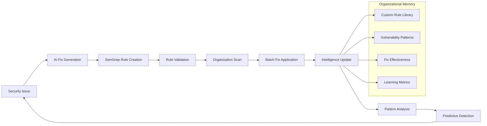

# RFC-014: Self-Improving Security Platform Architecture

**RFC Number**: 014  
**Title**: Self-Improving Security Platform Architecture  
**Status**: Proposed  
**Created**: June 6, 2025  
**Updated**: June 6, 2025  
**Author**: RSOLV Strategic Team  
**Depends On**: RFC-003 (Learning Security System)  
**Related To**: RFC-015 (Business Model), RFC-016 (Nx Implementation)  

## Summary

This RFC proposes transforming RSOLV from a reactive security fixing tool into the world's first **Self-Improving Security Platform** that learns from every fix to build organizational security intelligence. By combining our existing premium AI fix generation with enhanced rule generation capabilities, Elixir/Nx distributed learning infrastructure, and closed-loop improvement cycles, RSOLV will create an unassailable competitive moat through compound organizational knowledge accumulation.

**Core Innovation**: Every security fix generates both a code solution AND a custom security rule that improves detection and prevention for that specific codebase, creating exponential value growth and customer lock-in through accumulated organizational intelligence.

**Architectural Approach**: Hybrid model that extends our existing premium AI integration with distributed learning infrastructure, maintaining best-in-class fix quality while adding organizational learning capabilities.

## Motivation

### Market Gap Analysis

**Current Security Tool Landscape**:
- **Static Scanners** (Snyk, SemGrep): Find vulnerabilities but don't learn
- **AI Fixers** (GitHub Copilot, various tools): Generate fixes but don't accumulate knowledge  
- **Traditional Tools**: Same rules for everyone, no organizational learning

**RSOLV's Unique Position**: We already have:
- Premium AI fix generation capability (existing integration)
- Distributed infrastructure (Elixir/BEAM clustering)
- Multi-platform support (GitHub, Linear, Jira)
- Success-based billing model
- Vended credentials system for secure AI access

### The Learning Opportunity

**Fly.io Insight**: LLMs can generate SemGrep rules from fixes, enabling closed-loop systems that learn from their own improvements.

**Our Advantage**: Combine this with our existing premium AI capabilities and Elixir/Nx ecosystem to create:
1. **Premium AI rule generation** (extend existing AI integration)
2. **Fault-tolerant learning** (BEAM supervision trees)
3. **Distributed pattern analysis** (across cluster nodes)
4. **Semantic intelligence** (Nx tensors for pattern recognition)
5. **Real-time learning dashboards** (Phoenix LiveView)
6. **Organizational memory** (accumulated intelligence over time)

### Business Impact

**Traditional Security Tools**: Linear value (pay for scans/fixes)
**Learning Platform**: Exponential value (each fix compounds organizational intelligence)

**Customer Lock-in Mechanism**: After 6 months, switching costs become prohibitive due to accumulated organizational security knowledge.

## Proposed Solution

### 1. Learning Loop Architecture



### 2. Technical Stack Integration

#### A. Existing RSOLV Components
- **RSOLV-action**: GitHub Action for issue processing
- **RSOLV-api**: Elixir/Phoenix API with BEAM clustering
- **Premium AI Integration**: Existing high-quality fix generation
- **Vended Credentials**: Secure AI provider access

#### B. Enhanced Learning Components
```elixir
# Enhanced RSOLV-API Architecture
defmodule Rsolv.Learning do
  # Core learning orchestration
  defmodule OrchestrationEngine do
    @doc "Coordinates the complete learning cycle"
    def process_security_fix(issue, fix, context)
  end
  
  # AI-powered rule generation (extends existing AI integration)
  defmodule RuleGenerator do
    @doc "Coordinates rule generation using existing premium AI capabilities"
    def generate_rule_from_fix(original_code, fixed_code, vulnerability)
  end
  
  # Distributed rule validation
  defmodule RuleValidator do
    @doc "Tests rules across BEAM cluster with positive/negative controls"
    def validate_rule(rule, test_cases)
  end
  
  # Organization-specific intelligence
  defmodule IntelligenceBank do
    @doc "Stores and manages organizational security knowledge"
    def store_organizational_learning(org_id, learning_data)
  end
  
  # Nx-powered pattern analysis
  defmodule PatternAnalyzer do
    @doc "Uses Nx tensors for semantic code similarity analysis"
    def analyze_vulnerability_patterns(code_samples)
  end
  
  # Scholar ML for classification
  defmodule VulnerabilityClassifier do
    @doc "Classifies and clusters vulnerability types"
    def classify_vulnerability(code, context)
  end
end
```

### 3. Learning Workflow Implementation

#### Phase 1: Enhanced Fix-and-Learn Pipeline
```typescript
// Enhanced RSOLV-action integration
class LearningSecurityProcessor {
  async processIssueWithLearning(
    issue: Issue,
    context: IssueContext
  ): Promise<LearningResult> {
    // 1. Generate fix using existing premium AI integration
    const fix = await this.aiClient.generateFix(issue, context);
    
    // 2. NEW: Generate SemGrep rule using same AI system
    const rule = await this.aiClient.generateRule({
      originalCode: issue.vulnerableCode,
      fixedCode: fix.solution,
      vulnerability: issue.vulnerability,
      language: context.language
    });
    
    // 3. Apply fix and create PR
    const pr = await this.githubApi.createPR(fix);
    
    // 4. Trigger learning pipeline in RSOLV-API
    const learningResult = await this.rsolvApi.triggerLearning({
      orgId: issue.organization,
      fix: fix,
      rule: rule,
      context: context
    });
    
    // 5. Return combined result
    return {
      fix: pr,
      rule: rule,
      learning: learningResult,
      additionalFindings: learningResult.scanResults
    };
  }
}
```

#### Phase 2: Distributed Learning Engine
```elixir
# RSOLV-API Learning Implementation
defmodule Rsolv.Learning.OrchestrationEngine do
  use GenServer
  
  @doc "Process a security fix and trigger learning cycle"
  def process_security_fix(issue, fix, context) do
    # Use Task.Supervisor for distributed processing
    Task.Supervisor.async_stream(
      Rsolv.Learning.TaskSupervisor,
      [
        {:rule_validation, generated_rule, context},
        {:pattern_analysis, issue, fix, context},
        {:vulnerability_classification, issue, fix, context}
      ],
      &execute_learning_task/1,
      timeout: :infinity,
      max_concurrency: System.schedulers_online()
    )
    |> Enum.to_list()
    |> consolidate_learning_results()
  end
  
  defp execute_learning_task({:rule_validation, rule, context}) do
    # Validate and test the AI-generated rule
    Rsolv.Learning.RuleValidator.validate_rule(rule, context)
  end
  
  defp execute_learning_task({:pattern_analysis, issue, fix, context}) do
    # Analyze patterns using Nx tensors
    Rsolv.Learning.PatternAnalyzer.analyze_vulnerability_patterns([
      issue.original_code,
      fix.solution
    ])
  end
  
  defp execute_learning_task({:vulnerability_classification, issue, fix, context}) do
    # Classify using Scholar ML
    Rsolv.Learning.VulnerabilityClassifier.classify_vulnerability(
      issue.original_code,
      context
    )
  end
end
```

#### Phase 3: Intelligence Storage and Retrieval
```sql
-- Enhanced organization-specific learning storage
CREATE TABLE organizational_intelligence (
  id TEXT PRIMARY KEY,
  org_id TEXT NOT NULL,
  intelligence_type TEXT NOT NULL, -- 'rule', 'pattern', 'classification'
  content JSONB NOT NULL,
  effectiveness_score REAL DEFAULT 0.0,
  created_at TIMESTAMP DEFAULT CURRENT_TIMESTAMP,
  last_updated TIMESTAMP DEFAULT CURRENT_TIMESTAMP,
  version INTEGER DEFAULT 1,
  is_active BOOLEAN DEFAULT true
);

CREATE TABLE learning_metrics (
  id INTEGER PRIMARY KEY AUTOINCREMENT,
  org_id TEXT NOT NULL,
  metric_type TEXT NOT NULL, -- 'rules_generated', 'patterns_learned', 'fixes_applied'
  metric_value REAL NOT NULL,
  time_period TEXT NOT NULL, -- 'daily', 'weekly', 'monthly'
  recorded_at TIMESTAMP DEFAULT CURRENT_TIMESTAMP
);

CREATE TABLE organizational_scanning_results (
  id TEXT PRIMARY KEY,
  org_id TEXT NOT NULL,
  scan_trigger TEXT NOT NULL, -- 'new_rule', 'scheduled', 'manual'
  repositories_scanned INTEGER,
  vulnerabilities_found INTEGER,
  auto_fixes_applied INTEGER,
  scan_duration_ms INTEGER,
  rule_ids TEXT[], -- Array of rules used
  created_at TIMESTAMP DEFAULT CURRENT_TIMESTAMP
);
```

### 4. Real-time Learning Dashboard

#### Phoenix LiveView Intelligence Dashboard
```elixir
defmodule RsolvWeb.LearningDashboardLive do
  use RsolvWeb, :live_view
  
  def mount(_params, %{"org_id" => org_id}, socket) do
    # Subscribe to real-time learning events
    Phoenix.PubSub.subscribe(Rsolv.PubSub, "learning:#{org_id}")
    
    socket =
      socket
      |> assign(:org_id, org_id)
      |> assign(:learning_stats, load_learning_stats(org_id))
      |> assign(:recent_rules, load_recent_rules(org_id))
      |> assign(:intelligence_growth, load_intelligence_growth(org_id))
    
    {:ok, socket}
  end
  
  def handle_info({:learning_update, update}, socket) do
    # Real-time updates as learning happens
    socket =
      case update.type do
        :new_rule_generated ->
          update_recent_rules(socket, update.rule)
        :pattern_discovered ->
          update_pattern_stats(socket, update.pattern)
        :vulnerability_classified ->
          update_classification_stats(socket, update.classification)
      end
    
    {:noreply, socket}
  end
  
  def render(assigns) do
    ~H"""
    <div class="learning-dashboard">
      <div class="intelligence-metrics">
        <div class="metric-card">
          <h3>Rules Generated</h3>
          <div class="metric-value"><%= @learning_stats.total_rules %></div>
          <div class="metric-change">+<%= @learning_stats.rules_this_month %> this month</div>
        </div>
        
        <div class="metric-card">
          <h3>Patterns Learned</h3>
          <div class="metric-value"><%= @learning_stats.unique_patterns %></div>
          <div class="metric-change">+<%= @learning_stats.patterns_this_week %> this week</div>
        </div>
        
        <div class="metric-card">
          <h3>Additional Fixes</h3>
          <div class="metric-value"><%= @learning_stats.additional_fixes %></div>
          <div class="metric-change">Found by learning</div>
        </div>
      </div>
      
      <div class="real-time-learning">
        <h3>Learning in Progress</h3>
        <%= for rule <- @recent_rules do %>
          <div class="learning-event" phx-mounted={JS.transition("slide-in")}>
            <div class="event-type">Rule Generated</div>
            <div class="event-description"><%= rule.description %></div>
            <div class="event-impact">Found <%= rule.additional_matches %> similar issues</div>
          </div>
        <% end %>
      </div>
      
      <div class="intelligence-visualization">
        <canvas id="intelligence-growth-chart" phx-hook="IntelligenceChart" 
                data-growth={Jason.encode!(@intelligence_growth)}>
        </canvas>
      </div>
    </div>
    """
  end
end
```

### 5. Integration with Existing Infrastructure

#### Enhanced Vended Credentials for Learning
```elixir
# Extend existing credential vending for learning operations
defmodule Rsolv.Credentials.LearningCredentials do
  @doc "Vend credentials for learning operations"
  def vend_learning_credentials(org_id, operation_type) do
    case operation_type do
      :rule_generation ->
        # Local Bumblebee - no external credentials needed
        {:ok, :local_model}
      
      :external_validation ->
        # Vend temporary Claude credentials for validation
        Rsolv.Credentials.Manager.vend_temporary_key(
          provider: :anthropic,
          scope: :rule_validation,
          duration: :minutes_15
        )
      
      :repository_scanning ->
        # Vend GitHub credentials for organization scanning
        Rsolv.Credentials.Manager.vend_temporary_key(
          provider: :github,
          scope: :repository_read,
          duration: :hours_1
        )
    end
  end
end
```

## Benefits

### 1. Unprecedented Competitive Advantages

**Technical Moats**:
- **Organizational Memory**: Accumulated security intelligence unique to each customer
- **Learning Velocity**: Compound improvements over time
- **Fault-Tolerant Intelligence**: BEAM ensures learning never stops
- **Premium AI Integration**: Best-in-class fix and rule generation quality
- **Hybrid Architecture**: Combines premium AI with distributed learning infrastructure

**Business Moats**:
- **Customer Lock-in**: Switching costs increase exponentially over time
- **Network Effects**: More customers improve global intelligence
- **Category Creation**: First-mover in "Learning Security Platforms"
- **Pricing Power**: Value increases faster than costs

### 2. Customer Value Proposition

**Month 1**: Standard security fixes
**Month 3**: 50+ custom rules finding organization-specific vulnerabilities  
**Month 6**: 200+ rules providing 10x better coverage than generic tools
**Month 12**: Predictive security system preventing vulnerabilities before they're introduced

### 3. Operational Benefits

**Cost Optimization**:
- Premium AI efficiency improvements through learning
- Distributed processing scales linearly with customers
- Automated rule generation reduces manual security work
- Organizational intelligence reduces false positives over time

**Quality Improvement**:
- False positive rates decrease over time through learning
- Organization-specific rules provide higher accuracy
- Continuous feedback loop improves detection quality

## Risks and Mitigations

### Technical Risks

| Risk | Impact | Mitigation |
|------|--------|------------|
| Rule quality issues | High | Extensive validation, confidence scoring, human review |
| Performance degradation | Medium | Distributed processing, async operations, smart caching |
| Learning model drift | Medium | Regular validation, A/B testing, rollback capabilities |
| Storage scalability | Low | SQLite per-org, eventual migration to distributed storage |

### Business Risks

| Risk | Impact | Mitigation |
|------|--------|------------|
| Customer data privacy | High | Local processing, encrypted storage, audit trails |
| Competitive copying | Medium | 6+ month head start, network effects, accumulated data |
| Market education | Medium | Clear demos, measurable value, gradual rollout |
| Pricing complexity | Low | Simple tier structure, transparent value metrics |

## Success Metrics

### Technical Metrics
- **Rule Generation Latency**: <5 minutes from fix to validated rule
- **False Positive Rate**: <10% for generated rules
- **Learning Velocity**: 10+ new patterns per customer per month
- **System Uptime**: 99.9% with fault-tolerant architecture

### Business Metrics
- **Customer Retention**: >95% after 6 months (due to accumulated value)
- **Net Revenue Retention**: >150% (customers upgrade as system learns)
- **Time to Value**: <30 days (first learning visible immediately)
- **Customer Satisfaction**: NPS >70 (compound value appreciation)

### Learning Metrics
- **Rules per Organization**: 50+ after 3 months, 200+ after 12 months
- **Additional Vulnerabilities Found**: 5x baseline after 6 months
- **Learning Accuracy**: >90% rule effectiveness after validation
- **Intelligence Growth**: Exponential curve of organizational knowledge

## Implementation Plan

### Phase 1: Foundation (Weeks 1-2)
- [ ] Extend existing AI integration for rule generation capability
- [ ] Implement enhanced fix + rule pipeline
- [ ] Create organizational intelligence storage (SQLite)
- [ ] Build rule validation framework

### Phase 2: Learning Engine (Weeks 3-4)
- [ ] Implement distributed learning orchestration
- [ ] Add Nx-powered pattern analysis
- [ ] Create Scholar-based vulnerability classification
- [ ] Build cross-repository scanning capability

### Phase 3: Intelligence Platform (Weeks 5-6)
- [ ] Develop real-time learning dashboard (Phoenix LiveView)
- [ ] Implement organizational memory management
- [ ] Add learning metrics and analytics
- [ ] Create rule export functionality

### Phase 4: Production Polish (Weeks 7-8)
- [ ] Performance optimization and caching
- [ ] Enterprise security and compliance features
- [ ] API for CI/CD integration
- [ ] Customer onboarding and documentation

### Phase 5: Market Launch (Weeks 9-10)
- [ ] Beta customer validation
- [ ] Sales enablement and demo environments
- [ ] Marketing repositioning as "Learning Platform"
- [ ] Pricing model transition

## Open Questions

1. **Learning Perception**: At what point do customers perceive learning value? (5 fixes? 15? 30?)
2. **Rule Sharing**: Should anonymized rules be shareable across organizations?
3. **Local vs Cloud**: What balance of local vs cloud processing for enterprise customers?
4. **Industry Specialization**: Should we create industry-specific learning models?
5. **Compliance**: How to handle regulatory requirements for learning systems?

## Future Enhancements

### Year 1
- **Predictive Vulnerability Detection**: Identify potential vulnerabilities before they're exploited
- **Cross-Repository Learning**: Learn patterns across customer's entire organization
- **Industry Templates**: Pre-trained models for specific industries (fintech, healthcare, etc.)

### Year 2
- **Collaborative Intelligence**: Anonymized learning across customer base
- **AI-Powered Rule Synthesis**: Combine multiple patterns into meta-rules
- **Autonomous Security**: Self-healing codebases that prevent vulnerabilities

### Year 3
- **Security AI Marketplace**: Customer-generated rules and patterns
- **White-label Platform**: License learning technology to other security vendors
- **Global Security Intelligence**: Worldwide threat pattern recognition

## References

- [RFC-003: Learning Security System](RFC-003-LEARNING-SECURITY-SYSTEM.md)
- [RFC-015: Learning Security Intelligence Business Model](RFC-015-LEARNING-SECURITY-BUSINESS-MODEL.md)
- [RFC-016: Elixir/Nx Learning Engine Implementation](RFC-016-ELIXIR-NX-LEARNING-ENGINE.md)
- [Fly.io - Semgrep But For Real Now](https://fly.io/blog/semgrep-but-for-real-now/)
- [Elixir Nx Documentation](https://github.com/elixir-nx)
- [Bumblebee Documentation](https://github.com/elixir-nx/bumblebee)
- [Scholar Documentation](https://github.com/elixir-nx/scholar)

---

*This RFC represents a strategic transformation from "security fixer" to "learning security platform" - creating the first true AI moat in cybersecurity through compound organizational intelligence.*