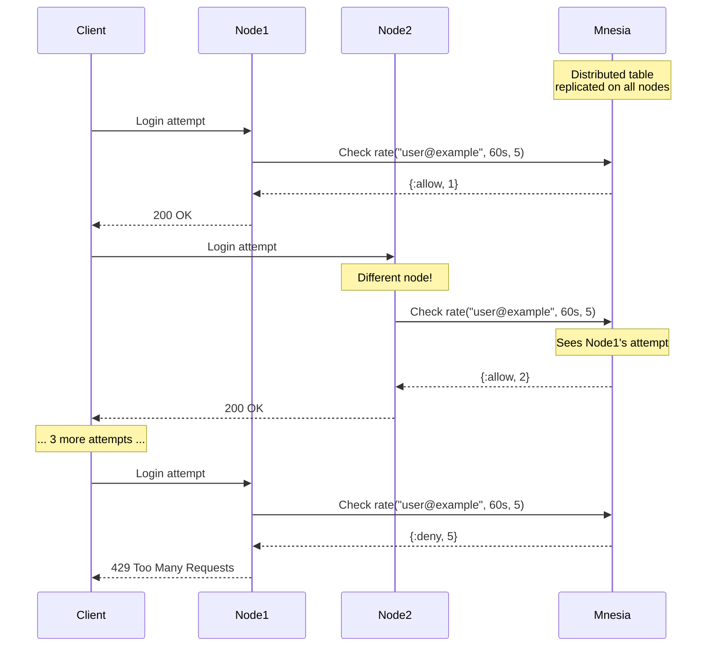

# RFC-054: Distributed Rate Limiter Migration from ETS to Mnesia

**Status**: Draft  
**Created**: 2025-09-05  
**Last Updated**: 2025-09-09
**Author**: Infrastructure Team  
**Related**: RFC-049 (Customer Management), clustering infrastructure

## Summary

Migrate our existing ETS-based rate limiter with manual cluster synchronization to a Mnesia-based solution for true distributed rate limiting across clustered BEAM nodes. The current implementation (`lib/rsolv/rate_limiter.ex`) has race conditions due to its 5-second sync intervals. This migration will provide immediate consistency while maintaining the same API.

## Current State

We have an existing rate limiter (`lib/rsolv/rate_limiter.ex`) that:
- Uses local ETS tables with periodic sync (every 5 seconds)
- Implements 60-second sliding windows with 100 request limits (hardcoded)
- Has race conditions during sync intervals
- Uses complex merge logic to reconcile divergent counts
- Already has telemetry integration
- Has existing tests in `test/rsolv/rate_limiter_test.exs`

### Current Usage
- **CredentialController**: `credential_exchange` action (API key exchange)
- **AstController**: `ast_analysis` action (AST vulnerability analysis)
- Both are **authenticated** endpoints (require API key)

### Configuration Issue to Fix (BUG)
- **BUG**: Config defines limits: `credential_exchange: {10, :minute}`
- **BUG**: But code ignores config and uses hardcoded 100/60s
- **MUST FIX during migration**: Make it actually use config
- This means production is currently allowing 10x more requests than configured!

## Problem Statement

The current ETS+sync approach has several issues:
- **Race conditions**: Requests between sync intervals can exceed limits
- **Split-brain**: Nodes can diverge during network partitions
- **Complexity**: Manual sync and merge logic is error-prone
- **Eventual consistency**: Not suitable for security-critical rate limiting

### Current Problem Visualization

```
Current: ETS with Periodic Sync (RACE CONDITIONS!)
═══════════════════════════════════════════════════

    Attacker makes 100 requests in 1 second
       │
    ┌──┼──────────────┐
    │  │              │
    ▼  ▼              ▼
┌──────┐         ┌──────┐         ┌──────┐
│Node A│         │Node B│         │Node C│
│ ETS  │         │ ETS  │         │ ETS  │
│100/60│         │100/60│         │100/60│
└──┬───┘         └──┬───┘         └──┬───┘
   │                │                │
   └────────┬───────┴───────┬────────┘
            │               │
         5 second      5 second
         sync delay    sync delay
            
Result: Can get 300 requests before sync!
```

## Proposed Solution

Simple, direct migration from ETS to Mnesia:
1. Keep exact same public API (`check_rate_limit/2`)
2. Delete all manual sync code (~100 lines)
3. Get immediate consistency across nodes
4. Keep telemetry unchanged
5. All existing tests must still pass
6. **Fix config usage** - actually read from config instead of hardcoded values

### What Changes (and What Doesn't)

```
BEFORE:                          AFTER:
═══════                          ══════
RateLimiter → ETS + Sync    →    RateLimiter → Mnesia
ValidationCache → ETS       →    ValidationCache → ETS (unchanged!)
AST caches → ETS           →    AST caches → ETS (unchanged!)
PatternServer → ETS        →    PatternServer → ETS (unchanged!)
FunWithFlags → ETS         →    FunWithFlags → ETS (unchanged!)
```

### Solution Architecture

```
With Distributed Rate Limiting (Mnesia):
════════════════════════════════════════

    Attacker
       │
    ┌──┼──────────────┐
    │  │              │
    ▼  ▼              ▼
┌──────┐         ┌──────┐         ┌──────┐
│Node A│◄────────►Node B│◄────────►Node C│
└──┬───┘         └──┬───┘         └──┬───┘
   │                │                │
   ▼                ▼                ▼
┌─────────────────────────────────────────┐
│         Distributed Mnesia Table        │
│         (Replicated on all nodes)       │
│              Total: 5/min               │
└─────────────────────────────────────────┘

Result: 5 attempts/minute (correct limit!)
```

## Rate Limit Configuration

### Current Configuration (in `config/runtime.exs`)
```elixir
config :rsolv, :rate_limits,
  credential_exchange: {10, :minute},  # API key exchange endpoint
  usage_report: {100, :minute},        # Usage reporting endpoint
  ast_analysis: {50, :minute}          # AST analysis endpoint (should add)
```

### How Rate Limits Work
- **Per customer**: Each customer ID has separate counters
- **Per action**: Different endpoints have different limits
- **Authenticated only**: All rate-limited endpoints require API key
- **Sliding window**: 60-second window that slides with time
- **Configurable**: Can adjust per endpoint in config

### What Gets Rate Limited
| Endpoint | Action | Current Limit | Authenticated |
|----------|--------|--------------|---------------|
| `/api/v1/credentials/exchange` | credential_exchange | 10/min (config) | Yes |
| `/api/v1/ast/analyze` | ast_analysis | 100/min (hardcoded) | Yes |

### Notes on Test Examples
- The "5 requests/minute" in examples is for **testing only**
- Production limits are defined in config
- Can temporarily lower limits for testing

## How It Works

### Data Flow Sequence



### Sliding Window Algorithm

```
Time Window Visualization:
══════════════════════════

Window: 60 seconds, Limit: 5 attempts

T=0s     T=20s    T=40s    T=60s    T=80s    T=100s
├────────┼────────┼────────┼────────┼────────┤
│   ●    │   ●●   │   ●    │        │   ●    │
│        │        │        │        │        │
└────────┴────────┴────────┴────────┴────────┘
         ← 60s window at T=80s →
         
At T=80s: Count = 4 (attempts in last 60s)
Result: {:allow, 5}

At T=81s: New attempt
         ← 60s window at T=81s →
Count = 5 (limit reached)
Next attempt: {:deny, 5}
```

## TDD Red-Green-Refactor Approach

### Phase 0: Red - Verify Current Tests Pass

Before touching any code:
1. Run all existing tests - they MUST pass
2. Document any quirks or race conditions we see
3. This is our baseline - if these break, we've failed

### Existing Usage Points

The rate limiter is currently used in:
- **CredentialController** (`lib/rsolv_web/controllers/credential_controller.ex`)
  - `check_rate_limit/1` called during credential exchange
  - Returns `:ok` or `{:error, :rate_limited}`
  - HTTP 429 response with "retry-after" header on rate limit

### Existing Test Coverage

#### Unit Tests (`test/rsolv/rate_limiter_test.exs`)
- ✅ Allows requests under the rate limit (100 per 60s)
- ✅ Blocks requests over the rate limit
- ✅ Uses separate counters per customer
- ✅ Uses separate counters per action
- ✅ Resets counter after 60 seconds
- ✅ Emits telemetry events
- ✅ Reset functionality
- ⚠️  Distributed sync test (manual, not multi-node)

#### Integration Tests (`test/rsolv_web/controllers/credential_controller_test.exs`)
- ✅ Rate limiter is configured and working
- ⚠️  Full rate limit test skipped (100 requests too high for unit test)

### Additional Tests to Write First (Red Phase)

- [ ] **Integration test that actually hits the rate limit**
  - Lower rate limit temporarily for testing
  - Make requests up to the limit
  - Verify 429 response with retry-after header
  - Ensure proper error message format
  
- [ ] **Performance benchmark test**
  - Measure current ETS implementation baseline
  - Test concurrent request handling
  - Document results for post-migration comparison
  
- [ ] **Telemetry monitoring test**
  - Verify events are emitted correctly
  - Check event metadata accuracy
  - Test under concurrent load
  
- [ ] **Document current behavior quirks**
  - 5-second sync delay allows temporary over-limit
  - Race conditions between nodes
  - Manual sync complexity
  - Config values being ignored (hardcoded limits)

## TDD Migration Plan

### Phase 0: Pre-Migration (NEW - MUST DO FIRST)

#### Run and Enhance Existing Tests
- [ ] Run full test suite, ensure all pass
- [ ] Add missing integration tests listed above
- [ ] Document current performance baseline
- [ ] Save test results for comparison

### Phase 1: Red - Write Tests That Define Behavior

#### 1.1 Adapt Existing Rate Limiter Tests

The existing test file (`test/rsolv/rate_limiter_test.exs`) will guide our migration. Key behaviors to maintain:

- **Single node rate limiting**: Requests under/over limit, sliding window, separate keys
- **Cleanup**: Removes old entries after expiration
- **Telemetry**: Events emitted correctly
- **Configuration**: Actually uses config values (fix the bug!)

These tests will initially fail when we switch to Mnesia - that's the "Red" phase. The implementation details will emerge as we make them pass.

#### 1.2 Write Distributed Tests

Create new distributed tests using LocalCluster library (not the deprecated `:slave` module):

**Key behaviors to test**:
- Rate limits are shared across nodes immediately
- New nodes joining the cluster get existing rate limit data
- System survives node failures gracefully
- No race conditions between nodes

**Setup**:
- Add `{:local_cluster, "~> 2.0", only: :test}` to mix.exs
- Use `async: false` for distributed tests
- Start multiple nodes and verify synchronization

The test structure will define what distributed behavior we need. The actual test code will be written during implementation, not pre-planned here.

### Phase 2: Green - Make Tests Pass

This is where we implement the minimal code to make our tests pass:

1. **Start with failing tests** - they define the behavior
2. **Write minimal code** - just enough to make tests green
3. **Don't optimize yet** - that comes in refactor phase
4. **Fix the config bug** - tests will ensure we read from config
5. **Replace ETS with Mnesia** - tests will guide the implementation

**Key Point**: The implementation emerges from making tests pass, not from upfront design!

### Phase 3: Refactor - Improve Design

After tests are green, we look at what we built and improve it:

- **Extract duplication** - DRY up repeated code
- **Improve naming** - Make intent clearer
- **Add telemetry** - If needed for monitoring
- **Optimize performance** - If tests show it's needed
- **Improve error handling** - Based on edge cases we discovered

**Remember**: Refactoring happens AFTER we have working code with passing tests!

## Integration Points

### Admin Authentication Rate Limiting

After the Mnesia migration, we'll need to:

1. **Create a rate limiting plug** that:
   - Integrates with the migrated RateLimiter
   - Returns 429 with retry-after header when limits exceeded
   - Uses appropriate keys (IP + path or customer ID)

2. **Apply to sensitive endpoints**:
   - Admin login attempts
   - API credential exchanges
   - AST analysis endpoints

3. **Behavior to maintain**:
   - Same HTTP status codes (429)
   - Same retry-after header format
   - Same telemetry events

**Note**: The actual implementation will emerge during the Green phase when we make tests pass.

## Testing Strategy

### Testing Best Practices (Following BetterSpecs & Elixir Community)

1. **BetterSpecs Structure Principles**:
   - **One assertion per test** - Each test should verify one behavior
   - **Use contexts to describe state**: "when rate limit exceeded", "with valid customer"
   - **Avoid "should" in descriptions** - Just describe what it does
   - **Test behavior, not implementation** - Don't test private functions
   - **Keep specs DRY** - Use shared examples for common behaviors
   - **Use `let` for lazy evaluation** - Only create data when needed

2. **Test Descriptions** (BetterSpecs style):
   ```elixir
   # BAD
   test "should deny when rate limit is exceeded" 
   
   # GOOD
   describe "when rate limit is exceeded" do
     test "denies the request" do
   ```

3. **Context Organization**:
   ```elixir
   describe "#check_rate_limit" do
     context "when under limit" do
       test "allows the request"
     end
     
     context "when at limit" do
       test "denies the request"
       test "returns retry-after header"
     end
   end
   ```

4. **Distributed Testing**:
   - Use LocalCluster library (not `:slave` module)
   - Add `{:local_cluster, "~> 2.0", only: :test}` to dependencies
   - Use `async: false` for distributed tests
   - Handle timing with `assert_receive`

5. **Edge Cases to Test**:
   - Rate limit boundary (exactly at limit)
   - Window expiration timing
   - Node failures during requests
   - Config changes during runtime
   - Multiple actions for same customer

### Test Coverage Pyramid

```
         ╱╲
        ╱  ╲       Distributed Tests
       ╱    ╲      - Multi-node sync
      ╱──────╲     - Failure recovery
     ╱        ╲    
    ╱  Integr. ╲   Integration Tests
   ╱   Tests    ╲  - Plug integration
  ╱──────────────╲ - Auth flow
 ╱                ╲
╱   Unit Tests     ╲ Unit Tests
────────────────────  - Rate limit logic
                      - Sliding window
                      - Cleanup
```

### Unit Tests
- Single node behavior
- Window sliding logic
- Cleanup functionality
- Error handling

### Integration Tests
- Multi-node synchronization
- Node failure recovery
- New node joining
- Network partition handling (future)

### Performance Testing

Write performance tests to ensure the migration doesn't degrade performance:
- Concurrent request handling
- Response time under load
- Memory usage patterns
- Cleanup efficiency

These tests will help us discover if refactoring is needed after the initial implementation works.

## Deployment Considerations

### Prerequisites
- **Clustering**: Already configured via `libcluster` with Kubernetes.DNS strategy
- **Node naming**: Handled by existing setup (`rsolv@POD_IP`)
- **Cluster module**: `Rsolv.Cluster` manages node connections
- **Mnesia**: Not currently used in codebase (greenfield for us)

### Mnesia Setup Notes
- Mnesia will auto-sync with our existing cluster
- RAM-only tables = no disk persistence needed
- Tables replicate automatically when nodes join
- If all nodes restart, rate limit data resets (that's OK)

### Infrastructure Changes Required
- **None!** Mnesia is built into Erlang/Elixir
- No new dependencies, no new services
- Works with existing Kubernetes deployment
- No changes to RSOLV-infrastructure needed

### Operational Documentation (for ADR)
After implementation, document:
- Current rate limits per endpoint
- How to adjust limits in config
- Monitoring rate limit metrics
- Debugging rate limit issues

### Cluster Formation Timeline

```
Node Startup & Table Replication:
══════════════════════════════════

T=0s: Node A starts
├─ Start Mnesia
├─ Create schema
├─ Create rate_limiter table
└─ Table ready ✓

T=30s: Node B starts
├─ Start Mnesia
├─ Connect to Node A (via libcluster)
├─ Copy rate_limiter table
├─ Sync existing data
└─ Table ready ✓

T=60s: Node C starts
├─ Start Mnesia
├─ Connect to cluster
├─ Copy from nearest node
└─ Table ready ✓

Result: All nodes share same rate limit data
```

### Memory Usage Projection

```
Storage Requirements:
═════════════════════

Per Entry: ~200 bytes
├─ Key: 50 bytes (email/IP)
├─ Timestamps: 8 bytes × 5 attempts = 40 bytes
├─ Mnesia overhead: ~110 bytes

For 1,000 active users:
1,000 × 200 bytes = 200 KB per node

For 10,000 active users:
10,000 × 200 bytes = 2 MB per node

Cleanup every 10 minutes keeps memory bounded
```

### Monitoring Dashboard

```
Rate Limiter Metrics:
═════════════════════

┌─────────────────────────────────────┐
│  Rate Limit Status (Last Hour)      │
├─────────────────────────────────────┤
│  Allowed:  ████████████░░░ 2,847    │
│  Denied:   ██░░░░░░░░░░░░░   142    │
│                                      │
│  Top Limited IPs:                   │
│  • 192.168.1.100  [47 attempts]     │
│  • 10.0.0.55      [23 attempts]     │
│                                      │
│  Cleanup Runs: 6                    │
│  Entries Removed: 1,234             │
│  Current Entries: 287               │
└─────────────────────────────────────┘
```

1. **Mnesia Schema**: Must be created before first use
2. **Node Names**: Must be consistent for Mnesia clustering
3. **Monitoring**: Add metrics for rate limit hits/misses
4. **Cleanup**: Adjust interval based on traffic volume

## Implementation Checklist (Simple TDD)

### Phase 0: Red - Run Existing Tests
- [ ] Add `{:local_cluster, "~> 2.0", only: :test}` to mix.exs dependencies
- [ ] Run tests - they pass (our baseline):
  ```bash
  mix test test/rsolv/rate_limiter_test.exs
  mix test test/rsolv_web/controllers/credential_controller_test.exs
  ```
- [ ] Add one integration test that actually hits the limit
- [ ] Write distributed tests using LocalCluster (not :slave module)
- [ ] Verify all tests pass with current ETS implementation

### Phase 1: Green - Direct Replacement
- [ ] Backup current `lib/rsolv/rate_limiter.ex` 
- [ ] Setup Mnesia (schema, table, ram_copies)
- [ ] Replace ETS calls with Mnesia transactions
- [ ] Keep `check_rate_limit/2` API exactly the same
- [ ] Delete all sync-related code (merge logic, sync process)
- [ ] Keep cleanup process (just change from ETS to Mnesia)
- [ ] **Fix config usage**: Read from `Application.get_env(:rsolv, :rate_limits)`
- [ ] Run tests - make them pass

### Phase 2: Refactor - Improve What We Built
- [ ] Look at the working code and identify what's messy
- [ ] Extract repeated patterns
- [ ] Improve readability based on what we learned
- [ ] Run tests after each refactor - ensure still passing
- [ ] **Note**: We'll discover what needs refactoring AFTER we make it work!

### Phase 3: Deploy
- [ ] Deploy to staging
- [ ] Monitor for 24 hours
- [ ] Deploy to production
- [ ] Done

### Rollback Plan
If anything goes wrong:
1. Git revert the commit
2. Deploy the reverted version
3. That's it - no feature flags to manage

## Success Criteria

### Pre-Migration
- [ ] All existing tests pass with current ETS implementation
- [ ] New integration tests added and passing
- [ ] Performance baseline documented

### Post-Migration
- [ ] All original tests pass with Mnesia implementation
- [ ] No breaking changes to public API
- [ ] Rate limiting still returns 429 with retry-after header
- [ ] Telemetry events unchanged
- [ ] Performance equal or better than ETS baseline
- [ ] No race conditions in distributed tests
- [ ] Zero downtime migration completed

## Implementation Timeline (3 Days Total)

```
Day 1: Red-Green
════════════════
AM: Run existing tests, add integration test
PM: Replace ETS with Mnesia, make tests pass

Day 2: Refactor & Stage
═══════════════════════
AM: Clean up code, verify tests
PM: Deploy to staging

Day 3: Production
═════════════════
Deploy and monitor
```

## Migration Path (Simple & Direct)

1. **Test** - Ensure all current tests pass
2. **Replace** - Swap ETS for Mnesia in RateLimiter ONLY
3. **Deploy** - Ship it

No feature flags. No parallel implementations. Just a straightforward replacement that maintains the exact same API.

**CRITICAL**: We are NOT removing ETS from the system! Only replacing it in RateLimiter.
- ValidationCache - stays on ETS
- AST subsystem caches - stay on ETS  
- PatternServer - stays on ETS
- FunWithFlags cache - stays on ETS
- **Only RateLimiter moves to Mnesia**

## Alternatives Considered

1. **Keep ETS with improved sync**: Rejected - fundamental race condition remains
2. **Hammer with Redis**: Rejected - adds infrastructure complexity
3. **Process Registry (pg)**: Rejected - more complex than Mnesia
4. **External service**: Rejected - unnecessary dependency
5. **Fix sync interval**: Rejected - reducing interval increases network traffic

## Critical Migration Constraints

### API Compatibility Requirements

The migration MUST maintain 100% backward compatibility:

1. **Public API** - `RateLimiter.check_rate_limit/2` signature unchanged
   - Input: `(customer_id, action)`
   - Output: `:ok` or `{:error, :rate_limited}`

2. **HTTP Behavior** - CredentialController responses unchanged
   - Success: 200 OK with credentials
   - Rate limited: 429 Too Many Requests
   - Headers: "retry-after: 60" on rate limit

3. **Telemetry Events** - Same events with same metadata
   - `[:rsolv, :rate_limiter, :request_allowed]`
   - `[:rsolv, :rate_limiter, :limit_exceeded]`

4. **Configuration** - Same environment variables
   - Rate limit: 100 requests per 60 seconds (configurable)
   - Actions tracked separately

### Testing Strategy

**Golden Rule**: If any existing test fails after migration, the migration has failed.

The migration is a direct replacement:
1. Replace ETS with Mnesia in the same file
2. Delete sync code
3. Deploy it
4. If it breaks, rollback the deployment (not a feature flag)

## References

- [Mnesia Documentation](https://www.erlang.org/doc/man/mnesia.html)
- [Testing Distributed Elixir](https://elixir-lang.org/getting-started/mix-otp/distributed-tasks.html)
- RFC-049: Customer Management Consolidation
- Existing Implementation: `lib/rsolv/rate_limiter.ex`
- Existing Tests: `test/rsolv/rate_limiter_test.exs`