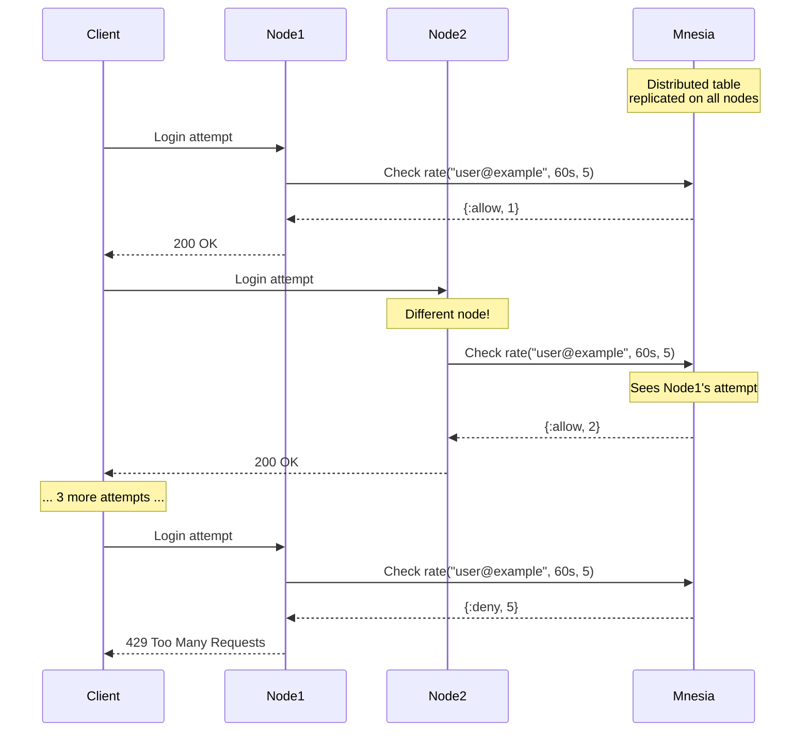

# RFC-054: Distributed Rate Limiter for Authentication

**Status**: Draft  
**Created**: 2025-09-05  
**Author**: Infrastructure Team  
**Related**: RFC-049 (Customer Management), clustering infrastructure

## Summary

Implement a distributed rate limiter using Mnesia to protect authentication endpoints across clustered BEAM nodes. This RFC focuses on a test-driven development approach to ensure the rate limiter works correctly in both single-node and multi-node scenarios.

## Problem Statement

Authentication endpoints need rate limiting to prevent brute force attacks. With our clustered BEAM deployment:
- Local ETS rate limiting would allow attackers to hit each node separately
- Adding Redis just for rate limiting introduces unnecessary infrastructure complexity
- We need a solution that works across all nodes in our cluster

### Current Problem Visualization

```
Without Distributed Rate Limiting:
═══════════════════════════════════

    Attacker
       │
    ┌──┼──────────────┐
    │  │              │
    ▼  ▼              ▼
┌──────┐         ┌──────┐         ┌──────┐
│Node A│         │Node B│         │Node C│
│5/min │         │5/min │         │5/min │
└──────┘         └──────┘         └──────┘
   ETS             ETS             ETS
   
Result: 15 attempts/minute (3x intended limit!)
```

## Proposed Solution

Use Mnesia (built into Erlang/Elixir) to create a distributed rate limiter that:
1. Works across all clustered nodes
2. Requires no additional infrastructure
3. Has a simple API similar to popular rate limiting libraries
4. Can be tested thoroughly in isolation

### Solution Architecture

```
With Distributed Rate Limiting (Mnesia):
════════════════════════════════════════

    Attacker
       │
    ┌──┼──────────────┐
    │  │              │
    ▼  ▼              ▼
┌──────┐         ┌──────┐         ┌──────┐
│Node A│◄────────►Node B│◄────────►Node C│
└──┬───┘         └──┬───┘         └──┬───┘
   │                │                │
   ▼                ▼                ▼
┌─────────────────────────────────────────┐
│         Distributed Mnesia Table        │
│         (Replicated on all nodes)       │
│              Total: 5/min               │
└─────────────────────────────────────────┘

Result: 5 attempts/minute (correct limit!)
```

## How It Works

### Data Flow Sequence



### Sliding Window Algorithm

```
Time Window Visualization:
══════════════════════════

Window: 60 seconds, Limit: 5 attempts

T=0s     T=20s    T=40s    T=60s    T=80s    T=100s
├────────┼────────┼────────┼────────┼────────┤
│   ●    │   ●●   │   ●    │        │   ●    │
│        │        │        │        │        │
└────────┴────────┴────────┴────────┴────────┘
         ← 60s window at T=80s →
         
At T=80s: Count = 4 (attempts in last 60s)
Result: {:allow, 5}

At T=81s: New attempt
         ← 60s window at T=81s →
Count = 5 (limit reached)
Next attempt: {:deny, 5}
```

## TDD Implementation Plan

### Phase 1: Red - Write Failing Tests

#### 1.1 Single Node Tests
```elixir
# test/rsolv/rate_limiter_test.exs
defmodule Rsolv.RateLimiterTest do
  use ExUnit.Case, async: false
  
  setup do
    # Start rate limiter for tests
    {:ok, _pid} = Rsolv.RateLimiter.start_link([])
    # Clear any existing data
    :mnesia.clear_table(:rate_limiter)
    :ok
  end
  
  describe "single node rate limiting" do
    test "allows requests under the limit" do
      # This will fail initially - no implementation yet
      assert {:allow, 1} = Rsolv.RateLimiter.check_rate("test_key", 60_000, 5)
      assert {:allow, 2} = Rsolv.RateLimiter.check_rate("test_key", 60_000, 5)
      assert {:allow, 3} = Rsolv.RateLimiter.check_rate("test_key", 60_000, 5)
    end
    
    test "denies requests over the limit" do
      # Make 5 requests (the limit)
      for i <- 1..5 do
        assert {:allow, ^i} = Rsolv.RateLimiter.check_rate("test_key", 60_000, 5)
      end
      
      # 6th request should be denied
      assert {:deny, 5} = Rsolv.RateLimiter.check_rate("test_key", 60_000, 5)
    end
    
    test "uses sliding window" do
      # Make 5 requests
      for i <- 1..5 do
        assert {:allow, ^i} = Rsolv.RateLimiter.check_rate("test_key", 1000, 5)
      end
      
      # Should be denied
      assert {:deny, 5} = Rsolv.RateLimiter.check_rate("test_key", 1000, 5)
      
      # Wait for window to pass
      Process.sleep(1100)
      
      # Should be allowed again
      assert {:allow, 1} = Rsolv.RateLimiter.check_rate("test_key", 1000, 5)
    end
    
    test "tracks different keys separately" do
      assert {:allow, 1} = Rsolv.RateLimiter.check_rate("key1", 60_000, 2)
      assert {:allow, 1} = Rsolv.RateLimiter.check_rate("key2", 60_000, 2)
      assert {:allow, 2} = Rsolv.RateLimiter.check_rate("key1", 60_000, 2)
      assert {:allow, 2} = Rsolv.RateLimiter.check_rate("key2", 60_000, 2)
      
      # key1 should be denied, key2 still allowed
      assert {:deny, 2} = Rsolv.RateLimiter.check_rate("key1", 60_000, 2)
      assert {:deny, 2} = Rsolv.RateLimiter.check_rate("key2", 60_000, 2)
    end
  end
  
  describe "cleanup" do
    test "removes old entries" do
      # Create an old entry
      now = System.system_time(:millisecond)
      old_time = now - :timer.hours(2)
      
      # Manually insert old data
      :mnesia.transaction(fn ->
        :mnesia.write({:rate_limiter, "old_key", [old_time]})
      end)
      
      # Trigger cleanup
      send(Rsolv.RateLimiter, :cleanup)
      Process.sleep(100)  # Let cleanup finish
      
      # Old entry should be gone
      {:atomic, result} = :mnesia.transaction(fn ->
        :mnesia.read(:rate_limiter, "old_key")
      end)
      assert result == []
    end
  end
end
```

#### 1.2 Distributed Tests
```elixir
# test/rsolv/rate_limiter_distributed_test.exs
defmodule Rsolv.RateLimiterDistributedTest do
  use ExUnit.Case, async: false
  
  @node1 :"node1@127.0.0.1"
  @node2 :"node2@127.0.0.1"
  
  setup do
    # Start two nodes for testing
    {:ok, _node1} = :net_kernel.start([@node1, :shortnames])
    :erlang.set_cookie(@node1, :test_cookie)
    
    {:ok, node2} = :slave.start_link('127.0.0.1', :node2, '-setcookie test_cookie')
    
    # Start rate limiter on both nodes
    :rpc.call(@node1, Rsolv.RateLimiter, :start_link, [[]])
    :rpc.call(node2, Rsolv.RateLimiter, :start_link, [[]])
    
    on_exit(fn ->
      :slave.stop(node2)
      :net_kernel.stop()
    end)
    
    {:ok, %{node2: node2}}
  end
  
  describe "distributed rate limiting" do
    test "rate limits are shared across nodes", %{node2: node2} do
      # Make 3 requests from node1
      for i <- 1..3 do
        assert {:allow, ^i} = Rsolv.RateLimiter.check_rate("shared_key", 60_000, 5)
      end
      
      # Make 2 requests from node2 - should continue counting
      assert {:allow, 4} = :rpc.call(node2, Rsolv.RateLimiter, :check_rate, 
                                      ["shared_key", 60_000, 5])
      assert {:allow, 5} = :rpc.call(node2, Rsolv.RateLimiter, :check_rate, 
                                      ["shared_key", 60_000, 5])
      
      # 6th request from either node should be denied
      assert {:deny, 5} = Rsolv.RateLimiter.check_rate("shared_key", 60_000, 5)
      assert {:deny, 5} = :rpc.call(node2, Rsolv.RateLimiter, :check_rate, 
                                     ["shared_key", 60_000, 5])
    end
    
    test "new nodes get existing rate limit data", %{node2: node2} do
      # Create rate limit data on node1
      for i <- 1..3 do
        assert {:allow, ^i} = Rsolv.RateLimiter.check_rate("test_key", 60_000, 5)
      end
      
      # Start a third node
      {:ok, node3} = :slave.start_link('127.0.0.1', :node3, '-setcookie test_cookie')
      :rpc.call(node3, Rsolv.RateLimiter, :start_link, [[]])
      
      # Node3 should see the existing count
      assert {:allow, 4} = :rpc.call(node3, Rsolv.RateLimiter, :check_rate, 
                                      ["test_key", 60_000, 5])
      
      :slave.stop(node3)
    end
    
    test "survives node failure", %{node2: node2} do
      # Create data on node1
      for i <- 1..3 do
        assert {:allow, ^i} = Rsolv.RateLimiter.check_rate("survivor", 60_000, 5)
      end
      
      # Stop node2
      :slave.stop(node2)
      
      # Node1 should still have the data and continue counting
      assert {:allow, 4} = Rsolv.RateLimiter.check_rate("survivor", 60_000, 5)
    end
  end
end
```

### Phase 2: Green - Make Tests Pass

#### 2.1 Basic Implementation
```elixir
# lib/rsolv/rate_limiter.ex
defmodule Rsolv.RateLimiter do
  use GenServer
  require Logger
  
  @table :rate_limiter
  @cleanup_interval :timer.minutes(10)
  
  # Client API
  
  def start_link(opts) do
    GenServer.start_link(__MODULE__, opts, name: __MODULE__)
  end
  
  def check_rate(key, window_ms, limit) do
    now = System.system_time(:millisecond)
    cutoff = now - window_ms
    
    case :mnesia.transaction(fn ->
      case :mnesia.read(@table, key, :write) do
        [{@table, ^key, attempts}] ->
          recent = Enum.filter(attempts, & &1 > cutoff)
          if length(recent) >= limit do
            {:deny, limit}
          else
            :mnesia.write({@table, key, [now | recent]})
            {:allow, length(recent) + 1}
          end
        [] ->
          :mnesia.write({@table, key, [now]})
          {:allow, 1}
      end
    end) do
      {:atomic, result} -> result
      {:aborted, reason} -> 
        Logger.error("Rate limit check failed: #{inspect(reason)}")
        {:error, reason}
    end
  end
  
  # Server Callbacks
  
  @impl true
  def init(_opts) do
    setup_mnesia()
    schedule_cleanup()
    {:ok, %{}}
  end
  
  @impl true
  def handle_info(:cleanup, state) do
    Task.start(fn -> cleanup_old_entries() end)
    schedule_cleanup()
    {:noreply, state}
  end
  
  # Private Functions
  
  defp setup_mnesia do
    # Ensure Mnesia is started
    :mnesia.start()
    
    nodes = [node() | Node.list()]
    
    # Create schema for all nodes if it doesn't exist
    case :mnesia.create_schema(nodes) do
      :ok -> Logger.debug("Mnesia schema created")
      {:error, {_, {:already_exists, _}}} -> Logger.debug("Mnesia schema exists")
      error -> Logger.error("Schema creation error: #{inspect(error)}")
    end
    
    # Create the table
    case :mnesia.create_table(@table,
      attributes: [:key, :attempts],
      ram_copies: nodes,
      type: :set
    ) do
      {:atomic, :ok} -> 
        Logger.info("Rate limiter table created")
      {:aborted, {:already_exists, @table}} ->
        # Ensure this node has a copy
        case :mnesia.add_table_copy(@table, node(), :ram_copies) do
          {:atomic, :ok} -> Logger.info("Added local copy of rate limiter table")
          {:aborted, {:already_exists, @table, _}} -> :ok
          error -> Logger.error("Failed to add table copy: #{inspect(error)}")
        end
      error ->
        Logger.error("Failed to create rate limiter table: #{inspect(error)}")
    end
  end
  
  defp cleanup_old_entries do
    cutoff = System.system_time(:millisecond) - :timer.hours(1)
    
    {:atomic, _} = :mnesia.transaction(fn ->
      keys = :mnesia.all_keys(@table)
      
      Enum.each(keys, fn key ->
        case :mnesia.read(@table, key, :write) do
          [{@table, ^key, attempts}] ->
            recent = Enum.filter(attempts, & &1 > cutoff)
            if recent == [] do
              :mnesia.delete(@table, key, :write)
            else
              :mnesia.write({@table, key, recent})
            end
          [] -> :ok
        end
      end)
    end)
    
    Logger.debug("Rate limiter cleanup completed")
  end
  
  defp schedule_cleanup do
    Process.send_after(self(), :cleanup, @cleanup_interval)
  end
end
```

### Phase 3: Refactor - Improve Design

#### 3.1 Extract Configuration
```elixir
defmodule Rsolv.RateLimiter do
  @default_cleanup_interval :timer.minutes(10)
  @default_retention_period :timer.hours(1)
  
  defp cleanup_interval do
    Application.get_env(:rsolv, :rate_limiter_cleanup_interval, @default_cleanup_interval)
  end
  
  defp retention_period do
    Application.get_env(:rsolv, :rate_limiter_retention_period, @default_retention_period)
  end
end
```

#### 3.2 Add Telemetry
```elixir
def check_rate(key, window_ms, limit) do
  start_time = System.monotonic_time()
  result = do_check_rate(key, window_ms, limit)
  
  :telemetry.execute(
    [:rsolv, :rate_limiter, :check],
    %{duration: System.monotonic_time() - start_time},
    %{key: key, result: elem(result, 0)}
  )
  
  result
end
```

## Integration with Admin Authentication

```elixir
defmodule RsolvWeb.Plugs.RateLimit do
  import Plug.Conn
  require Logger
  
  def init(opts) do
    %{
      window_ms: Keyword.get(opts, :window_ms, 60_000),
      limit: Keyword.get(opts, :limit, 5),
      key_fn: Keyword.get(opts, :key_fn, &default_key/1)
    }
  end
  
  def call(conn, %{window_ms: window, limit: limit, key_fn: key_fn}) do
    key = key_fn.(conn)
    
    case Rsolv.RateLimiter.check_rate(key, window, limit) do
      {:allow, _count} ->
        conn
        
      {:deny, _limit} ->
        Logger.warn("Rate limit exceeded: #{key}")
        conn
        |> put_status(429)
        |> put_resp_header("retry-after", "#{div(window, 1000)}")
        |> Phoenix.Controller.json(%{error: "Too many requests"})
        |> halt()
    end
  end
  
  defp default_key(conn) do
    "#{conn.remote_ip |> :inet.ntoa() |> to_string()}:#{conn.request_path}"
  end
end

# Usage in router
pipeline :rate_limited do
  plug RsolvWeb.Plugs.RateLimit, window_ms: 60_000, limit: 5
end

scope "/admin", RsolvWeb do
  pipe_through [:browser, :rate_limited]
  # ... admin routes
end
```

## Testing Strategy

### Test Coverage Pyramid

```
         ╱╲
        ╱  ╲       Distributed Tests
       ╱    ╲      - Multi-node sync
      ╱──────╲     - Failure recovery
     ╱        ╲    
    ╱  Integr. ╲   Integration Tests
   ╱   Tests    ╲  - Plug integration
  ╱──────────────╲ - Auth flow
 ╱                ╲
╱   Unit Tests     ╲ Unit Tests
────────────────────  - Rate limit logic
                      - Sliding window
                      - Cleanup
```

### Unit Tests
- Single node behavior
- Window sliding logic
- Cleanup functionality
- Error handling

### Integration Tests
- Multi-node synchronization
- Node failure recovery
- New node joining
- Network partition handling (future)

### Performance Tests
```elixir
test "handles concurrent requests efficiently" do
  tasks = for i <- 1..100 do
    Task.async(fn ->
      Rsolv.RateLimiter.check_rate("perf_#{i}", 60_000, 10)
    end)
  end
  
  results = Task.await_many(tasks)
  assert Enum.all?(results, fn {status, _} -> status in [:allow, :deny] end)
end
```

## Deployment Considerations

### Cluster Formation Timeline

```
Node Startup & Table Replication:
══════════════════════════════════

T=0s: Node A starts
├─ Start Mnesia
├─ Create schema
├─ Create rate_limiter table
└─ Table ready ✓

T=30s: Node B starts
├─ Start Mnesia
├─ Connect to Node A (via libcluster)
├─ Copy rate_limiter table
├─ Sync existing data
└─ Table ready ✓

T=60s: Node C starts
├─ Start Mnesia
├─ Connect to cluster
├─ Copy from nearest node
└─ Table ready ✓

Result: All nodes share same rate limit data
```

### Memory Usage Projection

```
Storage Requirements:
═════════════════════

Per Entry: ~200 bytes
├─ Key: 50 bytes (email/IP)
├─ Timestamps: 8 bytes × 5 attempts = 40 bytes
├─ Mnesia overhead: ~110 bytes

For 1,000 active users:
1,000 × 200 bytes = 200 KB per node

For 10,000 active users:
10,000 × 200 bytes = 2 MB per node

Cleanup every 10 minutes keeps memory bounded
```

### Monitoring Dashboard

```
Rate Limiter Metrics:
═════════════════════

┌─────────────────────────────────────┐
│  Rate Limit Status (Last Hour)      │
├─────────────────────────────────────┤
│  Allowed:  ████████████░░░ 2,847    │
│  Denied:   ██░░░░░░░░░░░░░   142    │
│                                      │
│  Top Limited IPs:                   │
│  • 192.168.1.100  [47 attempts]     │
│  • 10.0.0.55      [23 attempts]     │
│                                      │
│  Cleanup Runs: 6                    │
│  Entries Removed: 1,234             │
│  Current Entries: 287               │
└─────────────────────────────────────┘
```

1. **Mnesia Schema**: Must be created before first use
2. **Node Names**: Must be consistent for Mnesia clustering
3. **Monitoring**: Add metrics for rate limit hits/misses
4. **Cleanup**: Adjust interval based on traffic volume

## Success Criteria

- [ ] All tests pass on single node
- [ ] All tests pass on multiple nodes
- [ ] No performance regression in auth endpoints
- [ ] Cleanup prevents unbounded memory growth
- [ ] Works with existing libcluster setup

## Implementation Timeline

```
Week 1: Foundation
══════════════════
Mon: Write failing unit tests (Red)
Tue: Implement basic rate limiter (Green)
Wed: Write distributed tests (Red)
Thu: Make distributed tests pass (Green)
Fri: Refactor and optimize

Week 2: Integration
═══════════════════
Mon: Integrate with admin auth
Tue: Add monitoring/metrics
Wed: Performance testing
Thu: Documentation
Fri: Deploy to staging
```

## Migration Path

This is a new component with no existing system to migrate from. Can be deployed immediately once tests pass.

## Alternatives Considered

1. **Hammer with Redis**: Rejected - adds infrastructure complexity
2. **Local ETS only**: Rejected - doesn't work across nodes
3. **Process Registry (pg)**: Rejected - more complex than Mnesia
4. **External service**: Rejected - unnecessary dependency

## References

- [Mnesia Documentation](https://www.erlang.org/doc/man/mnesia.html)
- [Testing Distributed Elixir](https://elixir-lang.org/getting-started/mix-otp/distributed-tasks.html)
- RFC-049: Customer Management Consolidation