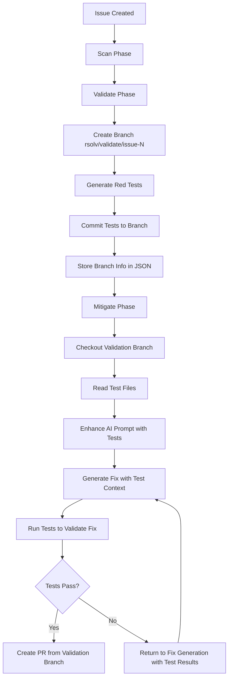

# RFC-058: Validation Branch Persistence for Test-Aware Fix Generation

## Status
- **Created**: 2025-09-18
- **Status**: Implemented → [ADR-025](../ADRs/ADR-025-VALIDATION-BRANCH-PERSISTENCE.md)
- **Author**: RSOLV Team
- **Implementation**: Completed
- **Target ADR**: ADR-025-VALIDATION-BRANCH-PERSISTENCE.md

## Summary

This RFC proposes enhancing the three-phase vulnerability fixing workflow (Scan → Validate → Mitigate) by implementing branch-based persistence of validation tests. Currently, red tests generated during the validation phase are deleted after validation, making them unavailable to the AI agent during the mitigation phase. This RFC outlines a solution where validation tests are committed to feature branches, enabling the mitigation phase to access and run these tests.

## Motivation

### Current Problem

The existing three-phase workflow has a critical gap:

1. **Scan Phase**: Detects vulnerabilities using AST analysis
2. **Validate Phase**: Generates red tests to prove vulnerabilities exist
3. **Mitigate Phase**: Uses Claude Code to generate fixes

**The Gap**: Tests generated in Step 2 are not available to the AI in Step 3.

Current validation phase behavior in `git-based-test-validator.ts:50-75`:
```typescript
// Tests are written temporarily
const testPath = path.join(this.workDir, 'validation.test.js');
fs.writeFileSync(testPath, testCode);

// Run tests
const result = await this.runTestCommand(testPath);

// Clean up - TESTS ARE DELETED
try {
  unlinkSync(testPath);
  rmSync(this.workDir, { recursive: true, force: true });
} catch (e) {
  // Ignore cleanup errors
}
```

### Impact

This gap reduces fix quality because:

1. **No Test Context**: AI cannot read test specifications to understand vulnerability patterns
2. **No Local Validation**: AI cannot run tests during fix development
3. **Behavioral Blindness**: AI lacks visibility into expected vs. actual behavior
4. **Limited Iteration**: No feedback loop between failed tests and fix attempts

### Supporting Evidence

From our test-aware fix generation implementation (`docs/test-aware-fix-generation-summary.md`), we've proven that providing behavioral constraints to AI before fix generation prevents issues like:
- Changing function parameters (e.g., `arg` → `environment`)
- Modifying callback signatures (e.g., `done()` → `done(true/false)`)
- Breaking platform compatibility
- Rewriting instead of incremental fixing

## Proposed Solution

### Architecture Overview

Replace the current ephemeral test storage with persistent branch-based storage:

```
Current Flow:
1. Scan: Detect vulnerabilities
2. Validate: Generate tests → Run tests → Delete tests → Store JSON results
3. Mitigate: Read JSON results → Generate fix → Create PR

Proposed Flow:
1. Scan: Detect vulnerabilities
2. Validate: Create branch → Generate tests → Commit tests → Store branch info
3. Mitigate: Checkout validation branch → Read tests → Generate fix → Create PR
```

### Branch Naming Convention

Use a predictable, programmatic naming pattern:
```
rsolv/validate/issue-{issueNumber}
```

Examples:
- `rsolv/validate/issue-123` - Validation branch for issue #123
- `rsolv/validate/issue-456` - Validation branch for issue #456

### Implementation Details

#### 1. Validation Phase Changes

Modify `ValidationMode` class to create and commit to branches:

```typescript
class ValidationMode {
  async createValidationBranch(issue: IssueContext): Promise<string> {
    const branchName = `rsolv/validate/issue-${issue.number}`;

    // Create and checkout branch
    execSync(`git checkout -b ${branchName}`, { cwd: this.repoPath });

    return branchName;
  }

  async commitTestsToBranch(testContent: string, branchName: string): Promise<void> {
    // Create test directory structure
    const testDir = path.join(this.repoPath, '.rsolv', 'tests');
    fs.mkdirSync(testDir, { recursive: true });

    // Write test file
    const testPath = path.join(testDir, 'validation.test.js');
    fs.writeFileSync(testPath, testContent);

    // Commit to branch
    execSync('git add .rsolv/tests/', { cwd: this.repoPath });
    execSync(`git commit -m "Add validation tests for issue #${issue.number}"`, { cwd: this.repoPath });

    // Push branch to remote
    execSync(`git push -u origin ${branchName}`, { cwd: this.repoPath });
  }

  async storeValidationResultWithBranch(
    issue: IssueContext,
    testResults: any,
    validationResult: any,
    branchName: string
  ): Promise<void> {
    const data = {
      issueId: issue.number,
      issueTitle: issue.title,
      branchName: branchName,  // NEW: Store branch reference
      validated: true,
      testResults: testResults,
      validationResult: validationResult,
      timestamp: new Date().toISOString(),
      commitHash: this.getCurrentCommitHash()
    };

    // Store in .rsolv/validation/issue-{number}.json
    const storageDir = path.join(this.repoPath, '.rsolv', 'validation');
    fs.mkdirSync(storageDir, { recursive: true });
    fs.writeFileSync(
      path.join(storageDir, `issue-${issue.number}.json`),
      JSON.stringify(data, null, 2)
    );
  }
}
```

#### 2. Mitigation Phase Changes

Modify `MitigationMode` class to checkout validation branches:

```typescript
class MitigationMode {
  async checkoutValidationBranch(issue: IssueContext): Promise<boolean> {
    // Read validation results
    const validationPath = path.join(this.repoPath, '.rsolv', 'validation', `issue-${issue.number}.json`);

    if (!fs.existsSync(validationPath)) {
      console.log('No validation results found, staying on current branch');
      return false;
    }

    const validationData = JSON.parse(fs.readFileSync(validationPath, 'utf-8'));

    if (!validationData.branchName) {
      console.log('No validation branch found, staying on current branch');
      return false;
    }

    try {
      // Checkout the validation branch
      execSync(`git checkout ${validationData.branchName}`, { cwd: this.repoPath });
      console.log(`Checked out validation branch: ${validationData.branchName}`);
      return true;
    } catch (error) {
      console.warn(`Failed to checkout validation branch: ${error}`);
      return false;
    }
  }

  async getValidationTests(issue: IssueContext): Promise<string[]> {
    const testDir = path.join(this.repoPath, '.rsolv', 'tests');

    if (!fs.existsSync(testDir)) {
      return [];
    }

    // Return all test files in the validation branch
    return fs.readdirSync(testDir)
      .filter(file => file.endsWith('.test.js'))
      .map(file => path.join(testDir, file));
  }
}
```

#### 3. Enhanced AI Context

Provide test content to Claude Code during fix generation:

```typescript
// Enhanced prompt with test specifications
const testFiles = await this.getValidationTests(issue);
const testContents = testFiles.map(file => ({
  path: file,
  content: fs.readFileSync(file, 'utf-8')
}));

const enhancedPrompt = `
${originalPrompt}

VALIDATION TESTS AVAILABLE:
The following tests define the expected behavior and vulnerability patterns.
These tests currently FAIL on the vulnerable code and should PASS after your fix:

${testContents.map(test => `
File: ${test.path}
\`\`\`javascript
${test.content}
\`\`\`
`).join('\n')}

REQUIREMENTS:
1. Your fix must make these tests pass
2. Preserve all existing behavioral contracts tested
3. Make minimal, incremental changes
4. You can run these tests locally to validate your fix
`;
```

### Data Flow Architecture



### Branch Cleanup Strategy

```typescript
// After successful PR merge, clean up validation branch
async cleanupValidationBranch(issue: IssueContext): Promise<void> {
  const branchName = `rsolv/validate/issue-${issue.number}`;

  // Switch to main before deleting
  execSync('git checkout main', { cwd: this.repoPath });

  // Delete local branch
  execSync(`git branch -D ${branchName}`, { cwd: this.repoPath });

  // Delete remote branch
  execSync(`git push origin --delete ${branchName}`, { cwd: this.repoPath });
}
```

## Benefits

### 1. Enhanced AI Context
- **Test Specifications**: AI can read test code to understand vulnerability patterns
- **Behavioral Contracts**: Tests define expected vs. vulnerable behavior
- **Local Validation**: AI can run tests during fix development

### 2. Improved Fix Quality
- **Test-Driven Fixes**: AI generates fixes to pass specific tests
- **Incremental Changes**: Tests guide minimal, focused modifications
- **Behavioral Preservation**: Existing tests prevent breaking changes

### 3. Better Debugging
- **Reproducible Tests**: Tests persist for analysis and iteration
- **Fix History**: Git history shows test evolution and fix attempts
- **Failure Analysis**: Test output provides specific guidance for retries

### 4. Workflow Continuity
- **Seamless Handoff**: Tests flow naturally from validation to mitigation
- **Consistent Context**: Same repository state across phases
- **Audit Trail**: Complete record of validation → fix process

## Tradeoffs and Considerations

### Advantages
✅ **Test Persistence**: Tests available for AI to read and run
✅ **Better Fix Quality**: AI has complete context for generating fixes
✅ **Workflow Continuity**: Seamless handoff between phases
✅ **Debugging Support**: Tests available for analysis and iteration
✅ **Minimal Complexity**: Builds on existing git workflows

### Disadvantages
⚠️ **Branch Proliferation**: One branch per issue/vulnerability
⚠️ **Storage Overhead**: Test files stored in git history
⚠️ **Cleanup Required**: Branches must be deleted after PR merge
⚠️ **Git Dependency**: Requires git operations in validation phase

### Risk Mitigation

1. **Branch Cleanup**: Automated cleanup after successful PR merge
2. **Storage Limits**: Test files are typically small (<10KB each)
3. **Naming Conflicts**: Use predictable, unique naming convention
4. **Error Handling**: Graceful fallback to current behavior if branch operations fail

## Implementation Plan

### Current Implementation Status

**Status**: ✅ RFC Approved, 🔄 TDD Implementation In Progress

**Implementation Tracking**:
- [x] Complete RFC-058 documentation and approval
- [x] Write failing test suite for branch persistence functionality
- [x] Implement ValidationMode.createValidationBranch() method
- [x] Implement ValidationMode.commitTestsToBranch() method
- [x] Implement ValidationMode.storeValidationResultWithBranch() method
- [x] Implement MitigationMode.checkoutValidationBranch() method
- [x] Implement MitigationMode.getValidationTests() method
- [x] Run validation branch persistence tests (all passing)
- [x] Wire up new methods in actual workflow orchestration
- [x] Update AI prompt enhancement with test content
- [x] Ensure PRs branch from validation branch to include tests + fixes
- [x] Run integration tests and fix any issues (all passing)
- [x] Write ADR-025-VALIDATION-BRANCH-PERSISTENCE.md

**✅ IMPLEMENTATION COMPLETE - All tasks finished successfully**

### Phase 1: Foundation (Week 1)
- [x] Write comprehensive test suite for branch operations
- [ ] Implement `createValidationBranch()` method
- [ ] Implement `commitTestsToBranch()` method
- [ ] Update validation storage to include branch names

### Phase 2: Integration (Week 2)
- [ ] Implement `checkoutValidationBranch()` method
- [ ] Implement `getValidationTests()` method
- [ ] Enhance AI prompt construction with test content
- [ ] Add error handling and fallback mechanisms

### Phase 3: Testing & Validation (Week 3)
- [ ] End-to-end testing with real vulnerability scenarios
- [ ] Performance impact assessment
- [ ] Security review of branch operations
- [ ] Documentation and training materials

### Phase 4: Deployment (Week 4)
- [ ] Gradual rollout with feature flag
- [ ] Monitor branch creation and cleanup
- [ ] Gather metrics on fix quality improvement
- [ ] Full production deployment

## Success Metrics

### Technical Metrics
- **Test Availability**: 100% of mitigation phases have access to validation tests
- **Fix Quality**: Reduction in behavioral contract violations
- **Test Pass Rate**: Improvement in first-attempt fix success rate
- **Performance**: Branch operations complete within 5 seconds

### Process Metrics
- **Debugging Time**: Reduced time to diagnose and fix validation failures
- **Iteration Cycles**: Fewer rounds of fix → test → retry cycles
- **AI Context Quality**: Measurable improvement in Claude Code's understanding

## Alternative Approaches Considered

### 1. Shared File System Storage
Store tests in a shared directory instead of git branches.

**Pros**: Simpler than git operations
**Cons**: No version control, harder to track, cleanup complexity

### 2. Database Storage
Store test content in the validation results JSON.

**Pros**: Simple storage model
**Cons**: Large JSON files, no git integration, harder to read/run tests

### 3. Temporary Branch Per Workflow
Create a single branch for the entire workflow.

**Pros**: Fewer branches
**Cons**: Conflicts between concurrent workflows, harder isolation

### 4. Test Artifact Registry
Upload tests to an external registry.

**Pros**: Clean separation from git
**Cons**: Additional infrastructure, complexity, no local test running

**Decision**: Git branches provide the best balance of simplicity, integration, and functionality.

## Security Considerations

### Branch Access Control
- Validation branches follow repository access controls
- No additional permissions required
- Branch names are predictable but not sensitive

### Test Content Security
- Tests contain vulnerability examples (expected)
- No secrets or credentials in test files
- Same security model as existing code

### Git History
- Validation branches are ephemeral
- Cleanup removes test content from remote
- Local git history may retain content (acceptable)

## Testing Strategy

### Unit Tests
- Branch creation and deletion operations
- Test file commit and retrieval
- Error handling for git failures
- JSON storage with branch references

### Integration Tests
- End-to-end validation → mitigation workflow
- Multiple concurrent issues with separate branches
- Branch cleanup after PR merge
- Fallback behavior when branches are missing

### Performance Tests
- Branch creation time under load
- Git operations with large test files
- Memory usage during test content processing
- Concurrent branch operations

## Documentation Requirements

### Developer Documentation
- API documentation for new methods
- Error handling patterns and fallbacks
- Testing guidelines for branch-based features
- Troubleshooting guide for git issues

### Operational Documentation
- Branch monitoring and cleanup procedures
- Storage usage tracking and limits
- Rollback procedures if issues arise
- Metrics collection and analysis

## Future Enhancements

### Test Evolution Tracking
Track how tests change across fix iterations to improve validation.

### Parallel Branch Testing
Run tests in parallel across multiple fix attempts for faster iteration.

### Test Quality Metrics
Analyze which test patterns lead to better fixes and improve generation.

### Cross-Issue Test Sharing
Identify common vulnerability patterns and share test templates.

## Conclusion

Implementing validation branch persistence addresses a critical gap in our three-phase workflow by ensuring test specifications flow seamlessly from validation to mitigation. This enhancement will significantly improve fix quality by providing AI agents with complete context about vulnerability patterns and expected behaviors.

The proposed architecture builds on existing git workflows, minimizes complexity, and provides clear benefits for both automated fix generation and human debugging. With proper implementation and testing, this change will advance our goal of fully automated, high-quality vulnerability remediation.

## Related RFCs

- **RFC-028**: Fix Validation Integration (implemented foundation)
- **RFC-030**: Universal Test Framework Detection (test generation improvements)
- **Test-Aware Fix Generation Summary**: Existing behavioral contract work

## Appendix: Example Workflow

### Issue #123: SQL Injection in user-service.js

#### Validation Phase
```bash
# Create validation branch
git checkout -b rsolv/validate/issue-123

# Generate and commit tests
mkdir -p .rsolv/tests
cat > .rsolv/tests/validation.test.js << 'EOF'
describe('SQL Injection Protection', () => {
  it('should reject malicious SQL in user input', () => {
    const maliciousInput = "'; DROP TABLE users; --";
    expect(() => getUserById(maliciousInput)).toThrow('Invalid input');
  });

  it('should safely handle normal user IDs', () => {
    expect(getUserById('123')).toEqual({ id: 123, name: 'Test User' });
  });
});
EOF

git add .rsolv/tests/
git commit -m "Add validation tests for issue #123"
git push -u origin rsolv/validate/issue-123

# Store validation results
echo '{
  "issueId": 123,
  "branchName": "rsolv/validate/issue-123",
  "validated": true,
  "timestamp": "2025-09-18T10:00:00Z"
}' > .rsolv/validation/issue-123.json
```

#### Mitigation Phase
```bash
# Checkout validation branch
git checkout rsolv/validate/issue-123

# AI reads test files and generates fix
# Tests are available at .rsolv/tests/validation.test.js

# AI creates fix with test context:
# - Knows to prevent SQL injection
# - Knows to preserve normal ID handling
# - Can run tests locally to validate fix

# After successful fix and PR
git checkout main
git branch -D rsolv/validate/issue-123
git push origin --delete rsolv/validate/issue-123
```