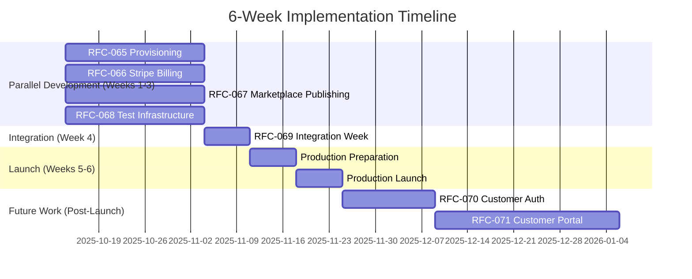
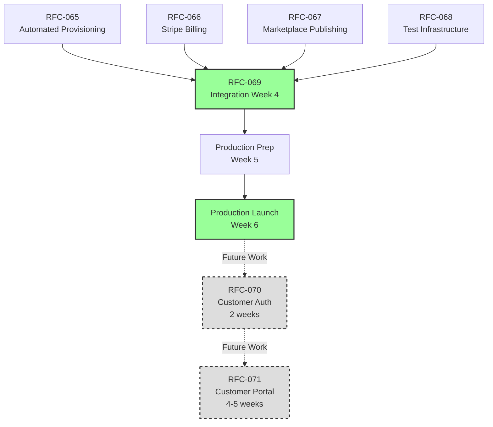

# RFC-064: Billing & Provisioning Master Plan

**Status**: Active
**Created**: 2025-10-12
**Timeline**: 6 weeks (parallel execution)
**Purpose**: Coordinate automated customer provisioning and Stripe billing implementation

## Executive Summary

Transform RSOLV from manual provisioning to fully automated billing in 6 weeks through 4 parallel workstreams. Current state: manual customer creation, no payment processing. Target state: instant provisioning, automated billing, GitHub Marketplace presence.

## Current State → Target State

### What We Have
- ✅ Production platform, customer/API models, webhooks, admin dashboard

### What's Missing
- ❌ Stripe integration, automated provisioning, payment processing, marketplace, self-service

## Test-Driven Development Methodology

**ALL features MUST follow RED-GREEN-REFACTOR cycle:**

### RED: Write Failing Tests First
Write failing test(s) that **fully describe the desired behavior** you'll implement. This may be multiple tests, not just one. The goal is to comprehensively specify what "passing" means before writing any implementation code.

**Key Principle:** True TDD works iteratively in unit-test-sized phases. While larger chunks are acceptable, the tests must fully describe the behavior being implemented.

### GREEN: Minimal Code to Pass
Implement the feature with minimal code to make all tests pass. This phase only works if the RED phase fully described the desired behavior through comprehensive tests.

### REFACTOR: Clean Up, Keeping Tests Green
Improve code quality - making it more readable and idiomatic - while keeping all tests green. In alternating refactor phases, improve the tests themselves (changing only tests OR implementation at a time, never both).

### Elixir-Specific Testing Practices

**Doctests:** Use doctests liberally when appropriate - they provide executable documentation and ensure examples stay current:
```elixir
@doc """
Calculates credit balance after signup.

## Examples

    iex> Billing.signup_credits()
    5

    iex> Billing.signup_credits() + Billing.billing_added_credits()
    10
"""
def signup_credits, do: 5
```

**Type System (Elixir 1.19+):** Leverage the enhanced type system for compile-time bug detection:
- Type inference for anonymous functions and function captures
- Protocol dispatch and implementation type checking
- String interpolation and for-comprehension type checking
- Let the compiler find bugs before tests run

**Integration with RFC-068:** Test infrastructure and patterns are provided by RFC-068, but actual test implementation happens during TDD cycles within each feature RFC (065, 066, 067).

Each RFC includes specific test requirements. No feature is complete without tests.

## Implementation Strategy

### Timeline View



### Dependency Flow



## Customer Portal: Future Work After RFC-064

**Decision:** Customer authentication and portal (originally RFC-070) split into two sequential RFCs to be implemented AFTER RFC-064 completes.

**Rationale:** Scope analysis revealed customer portal requires:
1. **Customer authentication layer** (registration, login, password reset) - 2 weeks
2. **Portal UI** (dashboard, billing, API keys, onboarding) - 4-5 weeks

This is ~7 weeks of work that has hard dependencies on RFC-065 (provisioning) and RFC-066 (Stripe). Running in parallel would violate the "do it right once" principle.

**Future RFCs:**
- **RFC-070**: Customer Authentication (2 weeks, starts after RFC-064 production launch)
- **RFC-071**: Customer Portal UI (4-5 weeks, starts after RFC-070 completes)

## Week-by-Week Tasks

### Week 1: Foundation
#### Provisioning (RFC-065)
- [ ] Build provisioning pipeline
- [ ] Add email validation
- [ ] Create customer from signup
- [ ] Generate initial API key

#### Billing (RFC-066)
- [ ] Add stripity_stripe dependency
- [ ] Create Stripe service module
- [ ] Set up webhook endpoint
- [ ] Implement customer creation

#### Marketplace (RFC-067)
- [ ] Update action.yml metadata
- [ ] Create 500x500 logo
- [ ] Improve documentation
- [ ] Prepare screenshots

#### Testing (RFC-068)
- [ ] Set up Docker Compose
- [ ] Configure Stripe CLI
- [ ] Create test factories
- [ ] Write initial tests

### Week 2: Core Features

#### Provisioning
- [ ] Build customer dashboard LiveView
- [ ] Usage statistics display
- [ ] GitHub workflow generator

**Note:** API key management UI is admin-only for MVP (already exists in admin dashboard). Customer self-service key management will be added in RFC-071 (Customer Portal) as a fast follow.

#### Billing
- [ ] Payment method management
- [ ] Subscription creation and renewal
- [ ] Subscription cancellation (immediate and end-of-period)
- [ ] Usage-based billing logic
- [ ] Invoice generation

**Note:** Invoice generation requires:
- **RSOLV company info** configured once in Stripe account settings (business name, address, contact details)
- **Customer billing info** collected when adding payment method (name, email, billing address) - stored in Stripe Customer object
- Collect only email at signup; require full billing address only when adding payment method (smooth onboarding)

#### Marketplace
- [ ] Submit to GitHub for review
- [ ] Create demo video
- [ ] Test installation flow
- [ ] Prepare launch materials

#### Testing
- [ ] Integration test suites
- [ ] CI/CD pipeline setup
- [ ] Staging deployment
- [ ] Load testing scripts

### Week 3: Polish
All streams complete features and prepare for integration.

### Week 4: Integration (RFC-069)
- **Monday**: Connect provisioning + billing
- **Tuesday**: Integrate marketplace + billing
- **Wednesday**: Full stack testing
- **Thursday**: Staging deployment
- **Friday**: Production prep

### Week 5: Production Preparation
- Final staging verification (24+ hours stable)
- E2E test suite implementation (full flow: signup → scan → billing → usage)
- Load testing and performance validation
- Deployment runbooks and rollback procedures tested
- Support documentation complete

### Week 6: Production Launch
- E2E tests passing (launch gate)
- Deploy to production with feature flags
- Marketing announcement (Marketplace, Mastodon, content)
- Monitor launch metrics closely
- Daily review for first week

## Risk Management

| Risk | Impact | Mitigation |
|------|--------|------------|
| Stripe delays | High | Use test mode longer |
| Integration complexity | High | Week 4 focus, early testing |
| Marketplace rejection | Medium | Multiple submissions |
| Launch issues | Medium | Feature flags, close monitoring, rollback ready |

### Critical Path
1. Stripe account setup (blocks billing)
2. Week 4 integration (blocks launch)
3. Marketplace approval (affects discovery)

## Success Metrics

### Development Metrics

**Target:** All 4 RFCs implemented with high quality

| Metric | Target | Measurement Mechanism |
|--------|--------|----------------------|
| RFCs Implemented | 4/4 (065, 066, 067, 070) | GitHub PR merge status + deployment verification |
| Test Coverage | ≥ 90% | ExCoveralls report in CI (`mix coveralls.html`) |
| Customer Onboarding Speed | < 5 seconds | Telemetry timing from signup → API key generation |
| Integration Tests | 100% passing | CI pipeline status (GitHub Actions) |

**How to Measure:**
```bash
# Test coverage
mix coveralls.html
open cover/excoveralls.html

# Customer onboarding timing (via telemetry)
:telemetry.attach("customer-onboarding-timer",
  [:rsolv, :customer_onboarding, :complete],
  &measure_duration/4, nil)

# Verify in Grafana dashboard: "Customer Onboarding Performance"
```

### Launch Metrics (Week 5-6)

**Target:** Successful production launch with monitoring and observability

| Metric | Target | Measurement Mechanism |
|--------|--------|----------------------|
| Initial Customers | 10-25 in first month | Database query: `SELECT COUNT(*) FROM customers WHERE auto_provisioned = true AND inserted_at > ^launch_date` |
| Payment Success | 100% | Stripe webhook events: `payment_intent.succeeded` / total attempts |
| Marketplace Status | Approved | GitHub Marketplace listing status |
| Onboarding Time | < 10 minutes | Telemetry: signup → first scan completion |

**Customer Acquisition Strategy** (see RFC-067 for details):
- **GitHub Marketplace**: Primary discovery channel (target: 15-30 installs in 30 days)
- **Community Engagement**: Mastodon (@rsolv@infosec.exchange), Bluesky, LinkedIn
- **Content Marketing**: Technical blog posts, case studies on dev.to
- **Launch Channels**: Hacker News Show HN, developer newsletters, publications

**How to Measure:**
```elixir
# New customer count (post-launch)
Repo.one(from c in Customer,
  where: c.auto_provisioned == true and c.inserted_at > ^launch_date,
  select: count(c.id))

# Payment success rate
Repo.one(from e in BillingEvent,
  where: e.event_type == "payment_intent.succeeded",
  select: count(e.id)) /
Repo.one(from e in BillingEvent,
  where: e.event_type in ["payment_intent.succeeded", "payment_intent.failed"],
  select: count(e.id))

# Track in Stripe Dashboard: Payments → Success rate
# Track in Grafana: "Billing Success Metrics" dashboard
```

### Business Metrics (Post-Launch, Ongoing)

**Target:** Sustainable growth and retention

| Metric | Target | Measurement Mechanism | Tracking Frequency |
|--------|--------|----------------------|-------------------|
| Trial → Paid Conversion | ≥ 15% | Customers who upgrade from trial to paid plan | Weekly |
| Monthly Churn Rate | < 5% | Cancelled subscriptions / active subscriptions | Monthly |
| New Customers | 10-25 in first month | Customer signups via auto-provisioning | Daily |
| Customer Lifetime Value | > $300 | Average revenue per customer over lifetime | Monthly |
| Monthly Recurring Revenue | Growth trend | Stripe MRR tracking | Monthly |

**Rationale:** Conservative targets based on early-stage B2B SaaS benchmarks:
- **Trial → Paid 15%**: Bottom of B2B SaaS range (14-25%) for new products, industry average 12-18%
- **Churn < 5%**: Early-stage SaaS realistic monthly target, benchmark 3-5% for early stage
- **10-25 customers**: Cold start with no existing audience, marketplace-driven discovery
- **CLV > $300**: Mixed PAYG ($29/fix) and Pro ($599/month) customer base with 5% churn
- Targets will be adjusted as real data accumulates

**How to Measure:**

```elixir
# Trial to paid conversion rate
defmodule Rsolv.Analytics.Conversion do
  def trial_to_paid_rate(period \\ 30) do
    started_trial = Repo.one(from c in Customer,
      where: c.subscription_type == "trial" and
             c.inserted_at > ago(^period, "day"),
      select: count(c.id))

    converted = Repo.one(from c in Customer,
      where: c.subscription_type in ["pay_as_you_go", "pro"] and
             c.inserted_at > ago(^period, "day"),
      select: count(c.id))

    converted / started_trial * 100
  end
end

# Monthly churn rate
defmodule Rsolv.Analytics.Churn do
  def monthly_churn_rate do
    start_of_month = Timex.beginning_of_month(Timex.now())

    active_start = Repo.one(from c in Customer,
      where: c.active == true and c.inserted_at < ^start_of_month,
      select: count(c.id))

    churned = Repo.one(from c in Customer,
      where: c.active == false and
             c.updated_at >= ^start_of_month,
      select: count(c.id))

    churned / active_start * 100
  end
end

# Daily customer signups
defmodule Rsolv.Analytics.Growth do
  def daily_signups(date \\ Date.utc_today()) do
    Repo.one(from c in Customer,
      where: fragment("DATE(?)", c.inserted_at) == ^date,
      select: count(c.id))
  end
end
```

**Dashboard & Reporting:**
- **Stripe Dashboard**: MRR, churn, revenue metrics
- **Grafana**: Custom dashboards for conversion, growth, churn
- **Weekly Reports**: Automated email with key metrics
- **Monthly Review**: Business metrics review meeting

**Telemetry Events to Emit:**
```elixir
# In provisioning flow
:telemetry.execute([:rsolv, :customer, :signup], %{duration: duration},
  %{source: "auto_provisioning", plan: "trial"})

# In billing flow
:telemetry.execute([:rsolv, :customer, :converted], %{amount: amount},
  %{from_plan: "trial", to_plan: "pay_as_you_go"})

# In subscription management
:telemetry.execute([:rsolv, :customer, :churned], %{lifetime_value: value},
  %{reason: "payment_failed", tenure_days: days})

# In subscription cancellation
:telemetry.execute([:rsolv, :subscription, :cancelled], %{credits_remaining: credits},
  %{cancel_type: "immediate", subscription_type: "pro"})

# In subscription renewal
:telemetry.execute([:rsolv, :subscription, :renewed], %{amount: 59900},
  %{subscription_type: "pro", credits_granted: 60})
```

**Automated Alerts:**
```elixir
# config/runtime.exs - Add alerting thresholds
config :rsolv, :alerts,
  churn_threshold: 5.0,  # Alert if monthly churn > 5%
  conversion_threshold: 15.0,  # Alert if conversion < 15%
  payment_failure_threshold: 10.0  # Alert if payment failures > 10%
```

## Next Actions

### Immediate
1. Assign RFC owners
2. Set up Stripe test environment
3. Create development branches
4. Schedule kickoff meeting

### By End of Week 1
- All streams started
- First features working
- Dependencies identified
- Test infrastructure operational

## References
- RFC-065: Automated Customer Provisioning
- RFC-066: Stripe Billing Integration
- RFC-067: GitHub Marketplace Publishing
- RFC-068: Billing Testing Infrastructure
- RFC-069: Integration Week