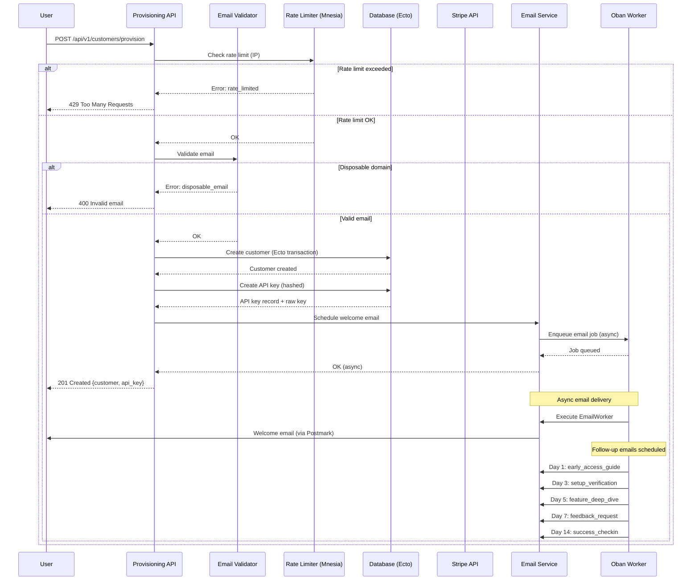

# RFC-065: Automated Customer Provisioning

**Status**: Draft
**Created**: 2025-10-12
**Updated**: 2025-10-20
**Timeline**: 3 weeks
**Dependencies**: None (can start immediately)

## Related RFCs

**Coordinated by:**
- RFC-064 (Billing & Provisioning Master Plan) - Coordinates this implementation

**Provides foundation for:**
- RFC-070 (Customer Authentication) - Customer login/registration (future work)
- RFC-071 (Customer Portal UI) - Customer-facing dashboard UI (future work)

**Works with:**
- RFC-066 (Stripe Billing Integration) - Billing backend
- RFC-068 (Billing Testing Infrastructure) - Testing patterns
- RFC-069 (Integration Week) - Integration coordination

**Enables future work:**
- RFC-072 (OAuth Integration) - GitHub/GitLab SSO
- RFC-073 (Team Management) - Team invitations
- RFC-074 (CLI Provisioning) - Command-line customer setup
- RFC-075 (Signup Webhooks) - Event-driven integrations

## Quick Start

**Current State**: Manual, brittle provisioning process requiring significant debugging
**Target State**: Automated API-first provisioning with web form as client

**Files to Create:**
- `lib/rsolv/provisioning.ex` - Core provisioning service (API-ready module)
- `lib/rsolv_web/controllers/api/v1/customer_provisioning_controller.ex` - REST API endpoint
- `lib/rsolv/admin/customer_admin.ex` - Admin override functions (RPC-compatible)
- `priv/repo/migrations/*_add_provisioning_fields.exs` - Ecto migration

**Files to Modify:**
- `lib/rsolv_web/live/early_access_live.ex` - Call provisioning API/module
- `lib/rsolv/customers/api_key.ex` - Add SHA256 hashing
- `lib/rsolv_web/router.ex` - Add provisioning API route

**Trial Limits**:
- **5 free fixes** on signup
- **+5 additional fixes** (total 10) when customer adds payment method
- After 10 fixes → PAYG at $15/fix (with transparent credit tracking)

## Summary

Transform manual customer provisioning into fully automated, API-first self-service system. Replace current early access signup flow with production-ready customer creation that serves as the long-term signup mechanism.

**Architecture Decision**: API-first design where provisioning logic lives in a self-contained module callable via REST API or directly. Web forms are clients of this API.

## Problem

### Current Manual Process (Brittle and Non-Scalable)

**Workflow:**
1. Customer submits email via early access form
2. Admin receives notification
3. **Admin manually creates customer** (error-prone)
4. **Admin debugs customer creation failures**
5. Admin generates API key manually
6. **Admin manually adds workflow files to customer repo**
7. **Admin test-runs workflow, debugs issues**
8. Admin emails credentials
9. Customer manually configures GitHub

**Issues:**
- **Hours of delay** between signup and usability
- **Extensive manual debugging** required at multiple steps
- **Poor first impression** for customers
- **Unsustainable operational burden** as we scale
- **No programmatic API** for automated provisioning
- **Early access flow is separate** from long-term customer management

**Impact**: Cannot scale beyond beta without automation.

## Solution

### API-First Architecture

**Design Principle**: Provisioning is a self-contained service with clear input/output contracts, callable from anywhere (API endpoint, web form, admin tools, future integrations).

```elixir
# lib/rsolv/provisioning.ex
defmodule Rsolv.Provisioning do
  @moduledoc """
  Customer provisioning service. API-ready design with no web dependencies.

  Can be called from:
  - REST API endpoint
  - LiveView forms
  - Admin RPC commands
  - Future integrations (webhooks, CLI, etc.)
  """

  @doc """
  Provisions a new customer from signup data.

  ## Parameters
  - attrs: %{email: string, name: string, ...}

  ## Returns
  - {:ok, %{customer: Customer.t(), api_key: string}} - Success with raw API key
  - {:error, reason} - Validation or processing failure

  ## Example
      iex> Provisioning.provision_customer(%{
      ...>   email: "user@example.com",
      ...>   name: "Jane Developer"
      ...> })
      {:ok, %{
        customer: %Customer{id: 123, ...},
        api_key: "rsolv_abc123..." # Returned once, hashed in DB
      }}
  """
  def provision_customer(attrs) do
    with {:ok, validated} <- validate_signup(attrs),
         {:ok, customer} <- create_customer(validated),
         {:ok, api_key_data} <- create_api_key(customer),
         {:ok, _} <- start_email_sequence(customer, api_key_data.raw_key) do
      {:ok, %{
        customer: customer,
        api_key: api_key_data.raw_key,
        api_key_record: api_key_data.record
      }}
    else
      {:error, %Ecto.Changeset{} = changeset} ->
        {:error, {:validation_failed, changeset}}

      {:error, reason} ->
        {:error, reason}
    end
  end

  defp create_customer(params) do
    %{
      email: params.email,
      name: params.name,
      subscription_plan: "trial",
      trial_fixes_limit: 5,  # 5 on signup, +5 when billing added
      trial_fixes_used: 0,
      auto_provisioned: true,
      wizard_preference: "auto"  # auto/hidden/shown
    }
    |> Customers.create_customer()
  end

  defp create_api_key(customer) do
    # Returns {:ok, %{record: api_key, raw_key: "rsolv_..."}}
    # Raw key returned once, hash stored in DB
    ApiKeys.create_for_customer(customer)
  end

  defp start_email_sequence(customer, raw_api_key) do
    # Async via Oban, doesn't block provisioning
    EmailSequence.start_early_access_onboarding_sequence(
      customer.email,
      customer.name
    )
    # Note: API key included in welcome email
    {:ok, :scheduled}
  end
end
```

### REST API Endpoint

```elixir
# lib/rsolv_web/controllers/api/v1/customer_provisioning_controller.ex
defmodule RsolvWeb.API.V1.CustomerProvisioningController do
  use RsolvWeb, :controller
  use OpenApiSpex.ControllerSpecs

  alias Rsolv.Provisioning

  plug OpenApiSpex.Plug.CastAndValidate, json_render_error_v2: true
  tags ["Provisioning"]

  operation(:provision,
    summary: "Provision new customer account",
    description: """
    Creates a new customer account with API key and triggers onboarding sequence.

    **Rate Limiting:** 10 requests per IP per hour (via existing Mnesia rate limiter)

    Returns customer record and raw API key (only time key is available unencrypted).
    """,
    request_body: {"Customer signup data", "application/json", ProvisioningRequest},
    responses: [
      created: {"Customer provisioned", "application/json", ProvisioningResponse},
      bad_request: {"Invalid request", "application/json", ErrorResponse},
      too_many_requests: {"Rate limit exceeded", "application/json", RateLimitError},
      unprocessable_entity: {"Validation failed", "application/json", ValidationErrorResponse}
    ]
  )

  def provision(conn, params) do
    # Rate limit check (reuses existing Mnesia-based limiter)
    case check_provisioning_rate_limit(conn) do
      :ok ->
        case Provisioning.provision_customer(params) do
          {:ok, result} ->
            conn
            |> put_status(:created)
            |> json(%{
              customer: serialize_customer(result.customer),
              api_key: result.api_key  # Only time this is returned!
            })

          {:error, {:validation_failed, changeset}} ->
            conn
            |> put_status(:unprocessable_entity)
            |> json(%{errors: translate_errors(changeset)})

          {:error, reason} ->
            conn
            |> put_status(:bad_request)
            |> json(%{error: inspect(reason)})
        end

      {:error, :rate_limited} ->
        conn
        |> put_status(:too_many_requests)
        |> json(%{error: "Rate limit exceeded. Try again later."})
    end
  end
end
```

### Automated Flow Diagrams

**ASCII Flow (Quick Reference):**
```
Signup → Validate → Create Customer → Generate Key → Send Email → Dashboard Access
         ↓ (fail)
      Rate Limited/Invalid → Reject with message
```

**Mermaid Sequence Diagram (Definitive):**


### Customer Dashboard Behavior

**Note:** Full customer dashboard UI is specified in **RFC-071 (Customer Portal UI)** (future work after RFC-064). Customer authentication is specified in **RFC-070 (Customer Authentication)** (prerequisite for RFC-071). This RFC provides the backend provisioning that enables the dashboard.

**Dashboard shows:**
- View/regenerate API keys
- **Dynamic usage stats** based on subscription plan:
  - Trial: "**3/5** free fixes remaining" (before billing)
  - Trial + Billing: "**7/10** free fixes remaining" (after billing added)
  - PAYG: "Used **12** fixes this month ($180)"
  - Teams: "**45/60** included fixes used ($0 overage)"
- Download GitHub workflow file (manual copy/paste required)
- Setup instructions with step-by-step guide
- Recent fix attempts table

**Transparent Credit Tracking (Critical for User Trust):**
- Prominent display: "**8/10 free fixes remaining**"
- Warning at fix #9: "⚠️ 1 free fix remaining. After that, $15/fix on PAYG."
- **Explicit opt-in** before fix #11: "You've used all 10 free fixes. Continue with PAYG at $15/fix? [Yes] [Pause Scanning]"
- Easy "Pause scanning" button to stop before charges

**Setup Wizard:**
```elixir
# Show wizard if:
# - No scans completed (automatic detection)
# - OR manually re-entered (user clicks "Show setup guide")
# - UNLESS manually dismissed (user clicks "Hide setup guide")

def show_wizard?(customer) do
  case customer.wizard_preference do
    "hidden" -> false           # User dismissed
    "shown" -> true            # User re-entered
    _ -> !has_completed_scan?(customer)  # Auto-detect
  end
end

def has_completed_scan?(customer) do
  # First scan = wizard complete
  Repo.exists?(
    from f in FixAttempt,
    where: f.customer_id == ^customer.id
  )
end
```

**UI Controls:**
- "Dismiss setup guide" → sets `wizard_preference = "hidden"`
- "Show setup guide" → sets `wizard_preference = "shown"`
- Completing first scan → auto-hides wizard (unless manually shown)

See RFC-070 (authentication) and RFC-071 (portal) for complete customer-facing specification and UX design.

### Database Changes (Ecto Migrations)

**IMPORTANT:** All database changes MUST use Ecto migrations. No manual SQL execution.

```elixir
# priv/repo/migrations/20251020_add_provisioning_fields.exs
defmodule Rsolv.Repo.Migrations.AddProvisioningFields do
  use Ecto.Migration

  def up do
    # Add provisioning tracking fields to customers
    alter table(:customers) do
      add :auto_provisioned, :boolean, default: false
      add :wizard_preference, :string, default: "auto"  # auto/hidden/shown
      add :first_scan_at, :utc_datetime
    end

    # Modify API keys table to store hashed keys
    alter table(:api_keys) do
      # Rename 'key' to 'key_hash' to be explicit
      # Migration strategy: generate hash for existing keys (if any)
      add :key_hash, :string
    end

    # Backfill existing keys (hash them)
    execute """
    UPDATE api_keys
    SET key_hash = ENCODE(SHA256(key::bytea), 'hex')
    WHERE key_hash IS NULL
    """

    # Make key_hash non-nullable and indexed
    alter table(:api_keys) do
      modify :key_hash, :string, null: false
    end

    create unique_index(:api_keys, [:key_hash])

    # Remove old plaintext key column (after backfill)
    alter table(:api_keys) do
      remove :key
    end

    # Create provisioning events table for audit trail
    create table(:provisioning_events, primary_key: false) do
      add :id, :binary_id, primary_key: true
      add :customer_id, references(:customers, on_delete: :delete_all)
      add :event_type, :string, null: false  # "customer_created", "api_key_generated", etc.
      add :status, :string, null: false      # "success", "failed", "retrying"
      add :metadata, :map                    # JSONB for additional context

      timestamps(type: :utc_datetime)
    end

    create index(:provisioning_events, [:customer_id])
    create index(:provisioning_events, [:event_type])
    create index(:provisioning_events, [:inserted_at])
  end

  def down do
    # Cannot safely restore plaintext keys (data loss)
    # This migration is intentionally non-reversible for security
    raise "Cannot reverse API key hashing migration - keys are one-way hashed"
  end
end
```

**Migration Safety Checklist** (per CLAUDE.md):
```bash
# Before committing
mix credo priv/repo/migrations/20251020_add_provisioning_fields.exs

# Check for:
# ✅ No adding columns with defaults on large tables
# ✅ Indexes added with algorithm: :concurrently (if needed)
# ✅ Foreign keys added with validate: false (if needed)
# ✅ down/0 function exists (or explicitly raises for irreversible changes)
```

## TDD Implementation Tasks

### Week 1: Core Provisioning & API (RED-GREEN-REFACTOR)

#### API-First Foundation
- [ ] **RED**: Write test: "POST /api/v1/customers/provision with valid data creates customer"
- [ ] **GREEN**: Create `Rsolv.Provisioning` module with `provision_customer/1`
- [ ] **GREEN**: Create `CustomerProvisioningController` with OpenAPI spec
- [ ] **GREEN**: Add route to `router.ex`
- [ ] **REFACTOR**: Extract validation logic to separate function

#### Email Validation
- [ ] **RED**: Write test: "rejects disposable email domains (e.g., mailinator.com)"
- [ ] **GREEN**: Add `burnex` dependency to `mix.exs` (5k+ disposable domains)
- [ ] **GREEN**: Implement `validate_email/1` with disposable domain check
- [ ] **REFACTOR**: Reuse existing `EmailValidator` module patterns
- [ ] **NOTE**: GitHub OAuth SSO deferred to RFC-072

#### Rate Limiting
- [ ] **RED**: Write test: "enforces rate limits (10 per IP per hour)"
- [ ] **GREEN**: Add rate limit check using **existing Mnesia-based `RateLimiter`**
- [ ] **GREEN**: Reference: `lib/rsolv/rate_limiter.ex` (already implemented)
- [ ] **REFACTOR**: Extract rate limit config to `config/runtime.exs`
- [ ] **NOTE**: Reuse patterns from RFC-054 (Distributed Rate Limiter) and ADR-025

#### API Key Generation with Hashing
- [ ] **RED**: Write test: "generates unique secure API keys"
- [ ] **RED**: Write test: "stores hashed API key in database (SHA256)"
- [ ] **RED**: Write test: "returns raw API key only once on creation"
- [ ] **RED**: Write test: "can authenticate with raw API key against hash"
- [ ] **GREEN**: Implement SHA256 hashing in `ApiKey.changeset/2`
- [ ] **GREEN**: Return `{:ok, %{record: api_key, raw_key: string}}`
- [ ] **REFACTOR**: Add test helper for creating API keys with known raw values
- [ ] **NOTE**: Use Phoenix API auth patterns (hexdocs.pm/phoenix/api_authentication.html)

#### Database Migration (Ecto)
- [ ] **RED**: Write test: "migration adds auto_provisioned, wizard_preference fields"
- [ ] **GREEN**: Create Ecto migration (as specified above)
- [ ] **GREEN**: Run `mix ecto.migrate`
- [ ] **GREEN**: Verify with `mix credo priv/repo/migrations/*.exs`
- [ ] **REFACTOR**: Ensure `down/0` function exists or raises appropriately

#### Provisioning Events (Audit Trail)
- [ ] **RED**: Write test: "logs provisioning events to audit table"
- [ ] **GREEN**: Create `provisioning_events` table via Ecto migration
- [ ] **GREEN**: Log events: "customer_created", "api_key_generated", "email_sent"
- [ ] **REFACTOR**: Extract event logging to `ProvisioningEvents` context

### Week 2: Email Sequence & Error Handling (TDD)

#### Email Drip Campaign Integration
- [ ] **RED**: Write test: "sends welcome email immediately on provisioning"
- [ ] **GREEN**: Call `EmailSequence.start_early_access_onboarding_sequence/2`
- [ ] **GREEN**: Reuse existing infrastructure: `lib/rsolv_web/services/email_sequence.ex`
- [ ] **RED**: Write test: "schedules follow-up emails via Oban"
- [ ] **GREEN**: Verify Oban jobs created (Day 1, 3, 5, 7, 14)
- [ ] **REFACTOR**: Note missing `early_access_guide` template needs implementation
- [ ] **NOTE**: Email templates in `lib/rsolv/emails.ex`, timing in `EmailSequence`

**Existing Drip Campaign Sequence:**
- Day 0: `early_access_welcome` ✅ (immediate via Postmark)
- Day 1: `early_access_guide` ⚠️ (template not implemented in EmailWorker yet)
- Day 3: `setup_verification` ✅
- Day 5: `feature_deep_dive` ✅
- Day 7: `feedback_request` ✅
- Day 14: `success_checkin` ✅

#### Error Handling with Oban Retry (Option B - Partial Success + Async Retry)
- [ ] **RED**: Write test: "Stripe customer creation fails → queues retry job"
- [ ] **RED**: Write test: "Email delivery fails → queues retry job (max 3 attempts)"
- [ ] **RED**: Write test: "Core provisioning (customer + API key) rolls back on failure"
- [ ] **GREEN**: Wrap Stripe calls in `try/rescue`, queue `StripeRetryWorker` on failure
- [ ] **GREEN**: Wrap email calls in error handling, leverage `EmailWorker` max_attempts: 3
- [ ] **GREEN**: Use Ecto.Multi for atomic customer + API key creation
- [ ] **REFACTOR**: Extract retry logic to shared worker pattern

**Error Handling Strategy:**
```elixir
def provision_customer(attrs) do
  Ecto.Multi.new()
  |> Ecto.Multi.insert(:customer, customer_changeset)
  |> Ecto.Multi.insert(:api_key, api_key_changeset)
  |> Repo.transaction()
  |> case do
    {:ok, %{customer: customer, api_key: api_key}} ->
      # Core succeeded, now try non-critical async operations
      schedule_stripe_customer_creation(customer)  # Retry via Oban if fails
      schedule_welcome_email(customer, api_key.raw_key)  # Retry via Oban if fails
      {:ok, %{customer: customer, api_key: api_key.raw_key}}

    {:error, _failed_operation, changeset, _changes} ->
      {:error, {:validation_failed, changeset}}
  end
end
```

#### Admin Override Capabilities (RPC-Compatible)
- [ ] **RED**: Write test: "admin can reset trial limits via RPC"
- [ ] **RED**: Write test: "admin can resend welcome email via RPC"
- [ ] **RED**: Write test: "admin can manually mark onboarding complete via RPC"
- [ ] **GREEN**: Create `lib/rsolv/admin/customer_admin.ex` module
- [ ] **GREEN**: Implement functions: `reset_trial/2`, `resend_welcome/1`, `complete_onboarding/1`
- [ ] **REFACTOR**: Document RPC usage in module docs

**Admin Module (Production-Safe):**
```elixir
# lib/rsolv/admin/customer_admin.ex
defmodule Rsolv.Admin.CustomerAdmin do
  @moduledoc """
  Admin override functions for customer provisioning.

  ## Usage (Production via RPC)

      bin/rsolv rpc "Rsolv.Admin.CustomerAdmin.reset_trial('user@example.com', 20)"
      bin/rsolv rpc "Rsolv.Admin.CustomerAdmin.resend_welcome('user@example.com')"
  """

  def reset_trial(email, new_limit) do
    # Implementation with audit logging
  end

  def resend_welcome(email) do
    # Re-trigger welcome email sequence
  end

  def complete_onboarding(email) do
    # Manually mark wizard as complete
  end
end
```

#### Connection Pool Testing
- [ ] **RED**: Write test: "100 concurrent signups don't exhaust connection pool"
- [ ] **RED**: Write test: "connection pool recovers after spike"
- [ ] **RED**: Write test: "no connection timeout errors under load"
- [ ] **GREEN**: Configure adequate pool size in `config/runtime.exs`
- [ ] **GREEN**: Run k6/Artillery load test script
- [ ] **REFACTOR**: Document pool size calculation (connections = 2x expected concurrent users)

**Configuration:**
```elixir
# config/runtime.exs
config :rsolv, Rsolv.Repo,
  pool_size: String.to_integer(System.get_env("POOL_SIZE") || "20")
  # Rule of thumb: pool_size >= 2 * expected_concurrent_provisioning_requests
  # Staging: 10, Production: 20-50 depending on scale
```

### Week 3: Dashboard, Monitoring & Polish (TDD)

#### Setup Wizard Logic
- [ ] **RED**: Write test: "shows wizard if no scans completed"
- [ ] **RED**: Write test: "hides wizard after first scan completes"
- [ ] **RED**: Write test: "manual dismiss sets wizard_preference = 'hidden'"
- [ ] **RED**: Write test: "manual re-enter sets wizard_preference = 'shown'"
- [ ] **GREEN**: Implement `show_wizard?/1` logic
- [ ] **GREEN**: Add "Dismiss setup guide" / "Show setup guide" buttons
- [ ] **REFACTOR**: Extract to `DashboardHelpers` module

#### Monitoring and Alerting
- [ ] **RED**: Write test: "emits telemetry on provisioning success"
- [ ] **RED**: Write test: "emits telemetry on provisioning failure"
- [ ] **GREEN**: Add telemetry events (follow RFC-060 patterns)
- [ ] **GREEN**: Create `lib/rsolv/prom_ex/provisioning_plugin.ex`
- [ ] **GREEN**: Set up Grafana dashboard for provisioning metrics
- [ ] **REFACTOR**: Ensure consistent tag structure

**Telemetry Events:**
```elixir
:telemetry.execute(
  [:rsolv, :provisioning, :complete],
  %{duration: duration, count: 1},
  %{status: "success", customer_id: customer.id, source: "api"}
)

:telemetry.execute(
  [:rsolv, :provisioning, :failed],
  %{count: 1},
  %{reason: reason, source: "api"}
)
```

#### Integration Testing
- [ ] **RED**: Write test: "complete signup to first scan flow"
- [ ] **GREEN**: Integration test with all components
- [ ] **GREEN**: Verify email delivery (check Oban queue)
- [ ] **GREEN**: Verify API key works for authentication
- [ ] **REFACTOR**: Clean up test database after each run

## Testing Requirements

### Unit Tests (Written During TDD)
```elixir
# Provisioning Module
test "provisions customer from valid signup"
test "rejects disposable emails (mailinator.com, temp-mail.org, etc.)"
test "enforces rate limits (10 per IP per hour)"
test "handles duplicate signups gracefully (email uniqueness constraint)"
test "generates unique secure API keys (rsolv_<base64>)"
test "stores hashed API key (SHA256) in database"
test "returns raw API key only once on creation"

# API Key Authentication
test "authenticates valid API key (hash comparison)"
test "rejects invalid API key"
test "rejects inactive API key"

# Error Handling
test "rolls back customer creation on API key generation failure"
test "queues Stripe retry job on Stripe API failure"
test "queues email retry job on Postmark failure (max 3 attempts)"

# Admin Overrides
test "admin can reset trial limits via RPC"
test "admin can resend welcome email"
test "admin can manually complete onboarding"

# Setup Wizard
test "shows wizard when no scans completed"
test "hides wizard after first scan"
test "respects manual dismiss/show preferences"
```

### Integration Tests
```elixir
test "complete signup to dashboard flow (API → DB → Email)"
test "API key works immediately after provisioning"
test "onboarding emails delivered in sequence (Oban jobs)"
test "first scan marks wizard complete automatically"
```

### Load Tests (k6 or Artillery)

**Success Criteria:**
- ✅ 100 concurrent signups complete within 10 seconds
- ✅ No connection pool timeout errors
- ✅ Connection pool recovers after spike
- ✅ Rate limiter allows 10/IP/hour, blocks 11th
- ✅ Database connections stay below pool_size limit
- ✅ Memory usage stable (no leaks)

**Load Test Script Example (k6):**
```javascript
import http from 'k6/http';
import { check } from 'k6';

export let options = {
  stages: [
    { duration: '10s', target: 100 },  // Ramp to 100 concurrent
    { duration: '30s', target: 100 },  // Hold at 100
    { duration: '10s', target: 0 }     // Ramp down
  ],
  thresholds: {
    http_req_duration: ['p(95)<5000'],  // 95% under 5s
    http_req_failed: ['rate<0.01']      // <1% failures
  }
};

export default function() {
  let res = http.post('http://staging.rsolv.dev/api/v1/customers/provision',
    JSON.stringify({
      email: `test-${__VU}-${__ITER}@example.com`,
      name: 'Load Test User'
    }),
    { headers: { 'Content-Type': 'application/json' } }
  );

  check(res, {
    'status 201': (r) => r.status === 201,
    'has api_key': (r) => JSON.parse(r.body).api_key !== undefined
  });
}
```

### Connection Pool Tests
```elixir
test "database connection pool configuration adequate" do
  pool_size = Application.get_env(:rsolv, Rsolv.Repo)[:pool_size]
  assert pool_size >= 20, "Pool size should be at least 20 for production"
end

test "100 concurrent provisioning requests succeed" do
  tasks = for i <- 1..100 do
    Task.async(fn ->
      Provisioning.provision_customer(%{
        email: "test-#{i}-#{:rand.uniform(9999)}@example.com",
        name: "Test User #{i}"
      })
    end)
  end

  results = Task.await_many(tasks, 10_000)
  success_count = Enum.count(results, fn
    {:ok, _} -> true
    _ -> false
  end)

  # Should succeed for most (some may be rate limited)
  assert success_count >= 90
end
```

## Security Measures

### 1. Email Validation
- **Format validation**: RFC 5322 compliance via `EmailValidator`
- **Disposable domains**: Block via `burnex` library (5k+ domains)
- **DNS verification**: Optional MX record check (future enhancement)

### 2. Rate Limiting (Reuse Existing Mnesia Implementation)
- **Per-IP limits**: 10 provisioning requests per hour
- **Per-email limits**: 3 provisioning requests per day
- **Implementation**: `Rsolv.RateLimiter` (RFC-054, ADR-025)
- **Storage**: Distributed Mnesia (cluster-aware)
- **Reference**: `lib/rsolv/rate_limiter.ex` lines 200-261

### 3. API Keys (SHA256 Hashing)
- **Generation**: Cryptographically secure random (`:crypto.strong_rand_bytes/1`)
- **Format**: `rsolv_<base64>` (43 chars base64 = 32 bytes entropy)
- **Storage**: SHA256 hash only (one-way, no decryption possible)
- **Algorithm**: SHA256 (fast, suitable for random tokens, not passwords)
- **Reference**: Phoenix API Auth guide (hexdocs.pm/phoenix/api_authentication.html)

**Why SHA256 (not Bcrypt/Argon2)?**
- API keys are random, not user-chosen (no dictionary attacks)
- Fast hashing is acceptable (no need for memory-hard functions)
- Bcrypt/Argon2 designed for weak passwords, unnecessary overhead here

### 4. Dashboard (Reuse Existing CSRF Protection)
- **Session-based auth**: Phoenix session cookies (RFC-070)
- **CSRF protection**: Phoenix built-in `get_csrf_token/0`
- **Implementation**: `lib/rsolv_web.ex` lines 70-74 imports `get_csrf_token`
- **Cookie security**: httpOnly, secure (HTTPS), sameSite=lax

### 5. Database Connection Security
- **Pool isolation**: Separate pools for web/background jobs
- **Connection limits**: Enforced via pool_size config
- **Prepared statements**: Ecto prevents SQL injection by default

### 6. Audit Logging
- **Provisioning events**: Logged to `provisioning_events` table
- **Failed attempts**: Tracked with reason and metadata
- **Admin actions**: All RPC commands logged

## Success Metrics

**Note**: These are target metrics. Actual measurement begins post-launch with active customers.

### Technical Metrics
- **Provisioning Time**: < 5 seconds (p95)
- **Success Rate**: > 99% (excluding rate-limited requests)
- **API Response Time**: < 200ms (p95)
- **Email Delivery**: > 98% within 1 minute

**Measurement Mechanism:**
```elixir
# Telemetry timing
:telemetry.execute(
  [:rsolv, :provisioning, :complete],
  %{duration: duration},
  %{customer_id: customer.id}
)

# Grafana dashboard: "Provisioning Performance"
# Query: histogram_quantile(0.95, rsolv_provisioning_complete_duration)
```

### User Engagement Metrics
- **Dashboard Activation**: > 80% within 24h of signup
- **First Scan**: > 60% within 24h of signup
- **Setup Wizard Completion**: > 70% complete first scan

**Measurement Mechanism:**
```elixir
# Database query
Repo.one(from c in Customer,
  where: c.inserted_at > ago(1, "day"),
  select: {
    count(c.id),
    count(c.first_scan_at)
  })
```

### Support Metrics
- **Support Tickets**: < 5% of signups require assistance
- **Provisioning Failures Requiring Manual Intervention**: < 1%

## Risks & Mitigation

| Risk | Impact | Mitigation | Implementation |
|------|--------|------------|----------------|
| Spam signups | High | Rate limiting (Mnesia), CAPTCHA if needed | `RateLimiter.check_rate_limit/2` with 10/IP/hour limit |
| Email delivery failures | Medium | Oban retry (3 attempts), admin can resend via RPC | `EmailWorker` with `max_attempts: 3`, `CustomerAdmin.resend_welcome/1` |
| Provisioning failures | High | Ecto.Multi for atomicity, Oban retry for Stripe/email, admin RPC overrides, monitoring alerts | `Ecto.Multi` transaction, `StripeRetryWorker`, `CustomerAdmin` module, Grafana alerts on failure rate >1% |
| Database connection exhaustion | Medium | Adequate pool size (20+), load testing, connection pool monitoring | `pool_size: 20` in runtime.exs, k6 load tests, Grafana pool usage dashboard |
| API key collision | Low | Cryptographically secure random, uniqueness constraint | 32 bytes entropy (~10^77 combinations), DB unique constraint on `key_hash` |
| Rate limiter false positives | Low | Generous limits, clear error messages, admin can whitelist IP | 10/IP/hour (permits legitimate retries), `CustomerAdmin.whitelist_ip/1` (future) |

**Admin Alert Strategy (Provisioning Failures):**
```elixir
# In PromEx plugin
counter(
  [:rsolv, :provisioning, :failed, :total],
  event_name: [:rsolv, :provisioning, :failed],
  description: "Total provisioning failures",
  tags: [:reason]
)

# Alert configuration (Grafana)
# Alert when: rate(rsolv_provisioning_failed_total[5m]) > 0.01
# Notification: Slack #engineering-alerts
# Runbook: "Check provisioning_events table, run CustomerAdmin RPC if needed"
```

## Rollout Plan

### Phase 1: Internal Testing (2 days)
- Deploy to staging environment
- Team members test signup flow
- Verify email delivery, API key authentication
- Load test with k6 (100 concurrent signups)

### Phase 2: Beta Users (3 days)
- Select 10 beta customers (existing waitlist)
- Monitor provisioning success rate
- Collect feedback on wizard, email clarity
- Rapid iteration on issues

### Phase 3: General Availability (Ongoing)
- Enable for all new signups
- Replace early access form with full provisioning
- Monitor metrics daily (first week)
- Weekly review (first month)

**Rollback Strategy:**
- Feature flag: `FunWithFlags.enabled?(:automated_provisioning)`
- If disabled, fall back to manual provisioning queue
- Database migration irreversible (API key hashing) - no rollback

## Future Enhancements (Track as New RFCs)

These enhancements are out of scope for RFC-065 but should be tracked as follow-up RFCs:

- **RFC-072: OAuth Integration (GitHub/GitLab)**
  - GitHub OAuth SSO for signup
  - Auto-fill name, email from GitHub profile
  - Verified email benefit

- **RFC-073: Team Management**
  - Team invitations
  - Multi-user accounts
  - Role-based permissions

- **RFC-074: CLI Provisioning**
  - `npx rsolv init` command
  - Auto-detect framework, create workflow
  - Add secret to GitHub via CLI

- **RFC-075: Signup Webhooks**
  - Event-driven integrations
  - Webhook on customer provisioned
  - Third-party CRM integration

- **RFC-076: GitHub App for Workflow Installation**
  - GitHub App (separate from Action)
  - Programmatic file creation via GitHub API
  - One-click workflow installation (no manual copy/paste)
  - OAuth, permissions, installation flow

## Next Steps

### Immediate (Week 0)
1. Review and approve this RFC
2. Create feature branch: `feature/rfc-065-provisioning`
3. Set up staging environment variables
4. Add `burnex` dependency to `mix.exs`

### Week 1 Kickoff
1. Create `lib/rsolv/provisioning.ex` module (TDD)
2. Create provisioning API endpoint (OpenAPI spec)
3. Write Ecto migrations for database changes
4. Implement API key hashing (SHA256)

### Week 2-3
1. Integrate email sequence (reuse existing Oban workers)
2. Implement error handling with retry logic
3. Build admin override module (RPC-compatible)
4. Load testing and connection pool tuning

### Deployment
1. Deploy to staging (end of Week 3)
2. Internal testing (2 days)
3. Beta testing (3 days)
4. Production deployment (Week 4)
