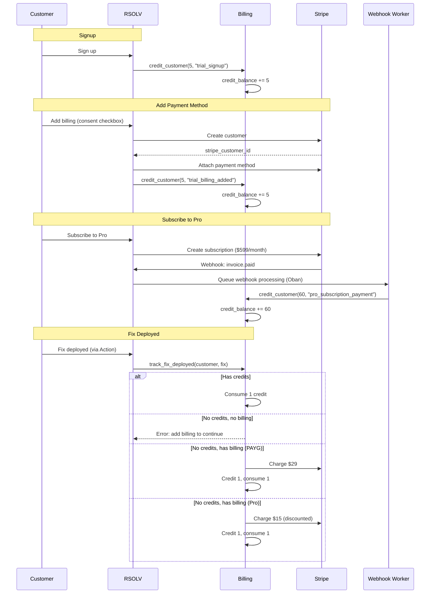
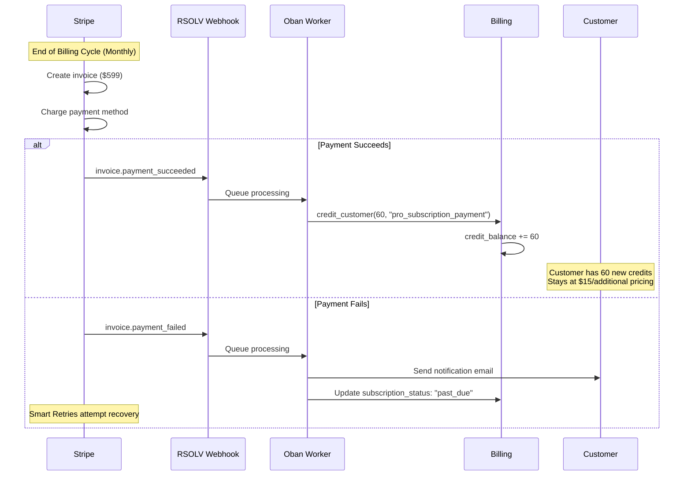
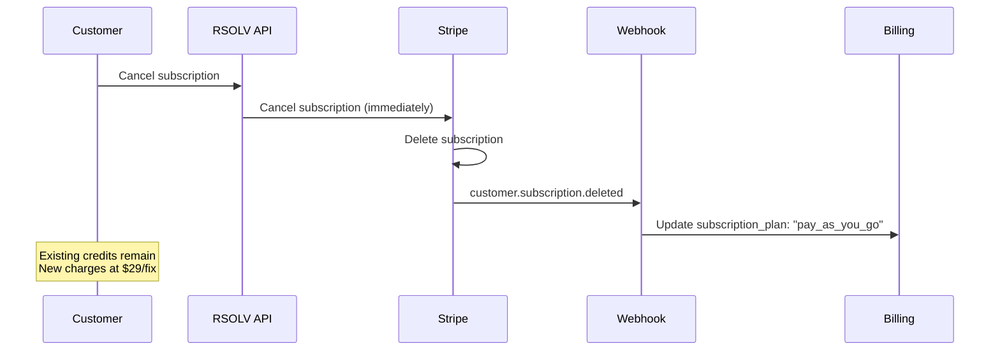
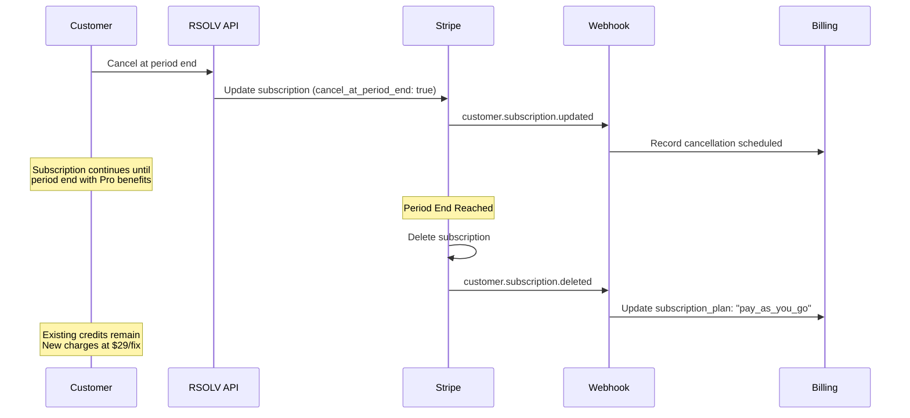

# RFC-066: Stripe Billing Integration

**Status**: Draft
**Created**: 2025-10-12
**Updated**: 2025-10-21
**Timeline**: 3 weeks
**Dependencies**: Stripe account (have credentials)

## Related RFCs

**Coordinated by:**
- RFC-064 (Billing & Provisioning Master Plan) - Coordinates this implementation

**Provides billing backend for:**
- RFC-070 (Customer Authentication) - Customer login/registration (future work)
- RFC-071 (Customer Portal UI) - Customer-facing billing UI (future work)

**Works with:**
- RFC-065 (Automated Customer Provisioning) - Customer creation
- RFC-068 (Billing Testing Infrastructure) - Testing patterns
- RFC-069 (Integration Week) - Integration coordination

## Quick Start

**Stripe Test Keys** (ready to use):
- Publishable: `pk_Prw2ZQauqnSEnJNq7BR7ZsbychP2t`
- Secret: `sk_test_7upzEpVpOJlEJr4HwfSHObSe`

**⚠️ CRITICAL: Production Keys**
- NEVER commit production keys to git
- Store in `.env` (gitignored)
- Rotate immediately if accidentally exposed
- Use separate keys for test/staging/production

**Pricing** (configurable for A/B testing):
- PAYG: $29/fix
- Pro: $599/month (60 fixes included)
- Additional discounted: $15/fix after 60

**Credit System** (see RFC-065):
- Signup: +5 credits (trial)
- Add billing info: +5 credits (total 10)
- Pro subscription: +60 credits immediately on payment
- Out of credits + no billing → Block, prompt for billing
- Out of credits + has billing → Charge → Credit → Consume

**Libraries**:
- `stripity_stripe` ~> 3.2 - Stripe API client (community standard)
- `ex_money` ~> 5.23 - Safe currency handling (Martin Fowler Money pattern)
- `decimal` ~> 2.0 - Arbitrary precision (dependency of ex_money)

**Files to Create/Modify**:
- `lib/rsolv/billing/stripe_service.ex` - Stripe API wrapper
- `lib/rsolv/billing.ex` - Billing context (credit system)
- `lib/rsolv/billing/credit_ledger.ex` - Credit transactions
- `lib/rsolv/billing/pricing.ex` - Configurable pricing
- `lib/rsolv_web/controllers/webhook_controller.ex` - Stripe webhooks
- `lib/rsolv/workers/stripe_webhook_worker.ex` - Async webhook processing
- `priv/repo/migrations/XXXXXX_create_billing_tables.exs` - Database schema
- `mix.exs` - Add dependencies

## Summary

Implement credit-based billing system with Stripe integration for payment processing, subscription management, and usage-based charging. Uses unified credit system where all fixes consume credits, eliminating separate trial tracking logic.

## Integration Notes

### RFC-060 Amendment 001 (Validation Changes)
**Integration Point:** The `track_fix_deployed()` function is triggered after the VALIDATE/MITIGATE phases complete successfully.

**Key Considerations:**
- The validation test location changes (from `.rsolv/tests/` to framework-specific directories) do NOT affect billing
- PhaseDataClient must confirm successful fix deployment before billing usage is tracked
- This is the ONLY touchpoint between the validation and billing workstreams
- Both RFCs can proceed in parallel without conflicts

**Action Required:** When implementing `track_fix_deployed()`, ensure it receives confirmation from PhaseDataClient that the fix was successfully deployed and validated.

### RFC-065 Integration (Customer Provisioning)

**Provisioning → Billing Flow:**

1. **Signup** (RFC-065):
   - Customer created: `subscription_plan: "trial"`
   - `Billing.credit_customer(customer, 5, source: "trial_signup")`
   - No Stripe customer created yet

2. **Add Billing Info** (RFC-066):
   - Customer provides payment method (explicit consent checkbox)
   - Create Stripe customer
   - Attach payment method
   - `Billing.credit_customer(customer, 5, source: "trial_billing_added")`
   - Total credits: 10

3. **Subscribe to Pro** (RFC-066):
   - Create Stripe subscription ($599/month, no trial period)
   - Charge immediately
   - `Billing.credit_customer(customer, 60, source: "pro_subscription_payment")`
   - Customer has 60 credits to use

4. **Fix Deployed** (RFC-060 → RFC-066):
   - RSOLV Action completes VALIDATE/MITIGATE
   - PhaseDataClient reports success
   - `Billing.track_fix_deployed(customer, fix)`
   - Credits > 0: Consume 1 credit
   - Credits = 0, no billing: Block with error
   - Credits = 0, has billing: Charge → Credit → Consume

## Problem

Cannot collect payments or convert trial users. Tracking trial usage separately from paid usage creates complexity. Manual billing unsustainable. Need transparent, auditable system for credits and charges.

## Solution

### Core Architecture



**ASCII Diagram:**

```
Customer Signup
   ↓
Create Customer (trial, credit_balance: 5)
   ↓
Add Billing Info (consent checkbox)
   ↓
Create Stripe Customer → stripe_customer_id
   ↓
Credit +5 (total: 10)
   ↓
[Optional] Subscribe to Pro
   ↓
Charge $599 → Stripe Subscription
   ↓
Webhook: invoice.paid → Oban Worker
   ↓
Credit +60
   ↓
Fix Deployed
   ↓
Has credits? → Consume 1 credit
   ↓
No credits? → Has billing?
   ↓
Yes → Charge (rate based on plan) → Credit 1 → Consume 1
   ↓
No → Block, prompt for billing
```

### Subscription Renewal Flow

**What Stripe Manages Automatically:**
- Creates invoice at end of billing cycle (monthly)
- Charges customer's saved payment method
- Finalizes and sends invoice within ~1 hour
- Manages subscription status (active, past_due, canceled, etc.)
- Retries failed payments (if Smart Retries enabled)

**What We Handle Explicitly:**
- Credit customer account when payment succeeds
- Maintain Pro pricing tier ($15/additional) while subscription active
- Handle payment failures (notify customer, mark past_due)
- Revert to PAYG pricing on cancellation

**Monthly Renewal Cycle:**



**Key Points:**
- Renewal happens **automatically every month** via Stripe
- `invoice.payment_succeeded` webhook fires for **every successful renewal**
- System credits 60 credits each month upon successful payment
- Customer maintains Pro pricing ($15/additional) while subscription is active
- Payment failures trigger dunning process and customer notifications

### Subscription Cancellation Flow

**Immediate Cancellation** (cancel_at_period_end: false):



**End-of-Period Cancellation** (cancel_at_period_end: true):



**Graceful Cancellation Handling:**
1. **Credits preserved**: Unused Pro credits remain in customer account
2. **Pricing reverts**: Additional charges switch from $15 → $29 (PAYG rate)
3. **No data loss**: All transaction history and audit trail maintained
4. **Resubscribe allowed**: Customer can resubscribe at any time

### Pricing Configuration

```elixir
# lib/rsolv/billing/pricing.ex
defmodule Rsolv.Billing.Pricing do
  @moduledoc """
  Configurable pricing for A/B testing and future changes.

  All prices in cents to avoid float arithmetic.
  Uses ex_money for type-safe currency operations.
  """

  use Money

  @pricing_config Application.compile_env(:rsolv, :billing_pricing, %{
    payg_per_fix: 2900,        # $29.00 in cents
    pro_monthly: 59900,        # $599.00 in cents
    pro_included_fixes: 60,
    pro_additional_per_fix: 1500  # $15.00 in cents (discounted)
  })

  def payg_per_fix_cents, do: @pricing_config.payg_per_fix
  def pro_monthly_cents, do: @pricing_config.pro_monthly
  def pro_included_fixes, do: @pricing_config.pro_included_fixes
  def pro_additional_per_fix_cents, do: @pricing_config.pro_additional_per_fix

  @doc """
  Returns Money struct for display and calculations.
  """
  def payg_per_fix do
    Money.new(:USD, payg_per_fix_cents())
  end

  def pro_monthly do
    Money.new(:USD, pro_monthly_cents())
  end

  def pro_additional_per_fix do
    Money.new(:USD, pro_additional_per_fix_cents())
  end

  @doc """
  Calculate charge amount based on customer's plan.
  Returns cents as integer for Stripe.
  """
  def calculate_charge_amount(%{subscription_plan: "pay_as_you_go"}), do: payg_per_fix_cents()
  def calculate_charge_amount(%{subscription_plan: "pro"}), do: pro_additional_per_fix_cents()
  def calculate_charge_amount(_), do: 0
end
```

**Configuration** (`config/config.exs`):

```elixir
config :rsolv, :billing_pricing,
  payg_per_fix: 2900,           # $29.00
  pro_monthly: 59900,           # $599.00
  pro_included_fixes: 60,
  pro_additional_per_fix: 1500  # $15.00
```

### Credit Ledger

```elixir
# lib/rsolv/billing/credit_ledger.ex
defmodule Rsolv.Billing.CreditLedger do
  @moduledoc """
  Manages credit transactions with full audit trail.

  Every credit addition/consumption is recorded with:
  - Amount (positive for credit, negative for debit)
  - Balance after transaction
  - Source/reason
  - Metadata (Stripe IDs, fix IDs, etc.)

  ## Examples

      # Credit customer account
      iex> customer = %Customer{id: 1, credit_balance: 5}
      iex> {:ok, txn} = CreditLedger.credit(customer, 10, source: "trial_signup")
      iex> txn.amount
      10
      iex> txn.balance_after
      15

      # Debit customer account
      iex> customer = %Customer{id: 1, credit_balance: 15}
      iex> {:ok, txn} = CreditLedger.debit(customer, 3, source: "consumed")
      iex> txn.amount
      -3
      iex> txn.balance_after
      12

      # Consume with insufficient balance
      iex> customer = %Customer{id: 1, credit_balance: 0}
      iex> CreditLedger.consume(customer, 1, reason: "fix_deployed")
      {:error, :insufficient_credits}
  """

  import Ecto.Query
  alias Rsolv.Repo
  alias Rsolv.Billing.CreditTransaction
  alias Rsolv.Customers.Customer

  @doc """
  Credit customer account. Returns {:ok, transaction} or {:error, reason}.

  ## Examples

      iex> customer = %Customer{id: 1, credit_balance: 5}
      iex> {:ok, txn} = CreditLedger.credit(customer, 60, source: "pro_subscription_payment")
      iex> txn.amount
      60
      iex> txn.balance_after
      65
      iex> txn.source
      "pro_subscription_payment"

  ## Parameters

    * `customer` - Customer struct with id and credit_balance
    * `amount` - Positive integer of credits to add
    * `opts` - Keyword list with:
      * `:source` (required) - Source of credit (e.g., "trial_signup", "pro_subscription_payment")
      * `:metadata` (optional) - Map of additional data (e.g., Stripe IDs)
  """
  def credit(customer, amount, opts \\ []) when is_integer(amount) and amount > 0 do
    source = Keyword.fetch!(opts, :source)
    metadata = Keyword.get(opts, :metadata, %{})

    create_transaction(customer, amount, source, metadata)
  end

  @doc """
  Debit customer account. Returns {:ok, transaction} or {:error, reason}.

  Does NOT check balance - use `consume/3` if you need balance validation.

  ## Examples

      iex> customer = %Customer{id: 1, credit_balance: 10}
      iex> {:ok, txn} = CreditLedger.debit(customer, 5, source: "consumed")
      iex> txn.amount
      -5
      iex> txn.balance_after
      5

  ## Parameters

    * `customer` - Customer struct with id and credit_balance
    * `amount` - Positive integer of credits to remove
    * `opts` - Keyword list with:
      * `:source` (required) - Source of debit (e.g., "consumed", "adjustment")
      * `:metadata` (optional) - Map of additional data
  """
  def debit(customer, amount, opts \\ []) when is_integer(amount) and amount > 0 do
    source = Keyword.fetch!(opts, :source)
    metadata = Keyword.get(opts, :metadata, %{})

    create_transaction(customer, -amount, source, metadata)
  end

  @doc """
  Consume customer credit with balance validation.

  Returns {:ok, transaction} or {:error, :insufficient_credits}.

  ## Examples

      iex> customer = %Customer{id: 1, credit_balance: 10}
      iex> {:ok, txn} = CreditLedger.consume(customer, 1, reason: "fix_deployed", metadata: %{fix_id: 42})
      iex> txn.amount
      -1
      iex> txn.balance_after
      9
      iex> txn.metadata.reason
      "fix_deployed"

      iex> customer = %Customer{id: 1, credit_balance: 0}
      iex> CreditLedger.consume(customer, 1, reason: "fix_deployed")
      {:error, :insufficient_credits}

  ## Parameters

    * `customer` - Customer struct with id and credit_balance
    * `amount` - Positive integer of credits to consume
    * `opts` - Keyword list with:
      * `:reason` (required) - Reason for consumption (e.g., "fix_deployed")
      * `:metadata` (optional) - Map of additional data (merged with reason)
  """
  def consume(customer, amount, opts \\ []) when is_integer(amount) and amount > 0 do
    reason = Keyword.fetch!(opts, :reason)
    metadata = Keyword.get(opts, :metadata, %{})

    if customer.credit_balance < amount do
      {:error, :insufficient_credits}
    else
      debit(customer, amount,
        source: "consumed",
        metadata: Map.put(metadata, :reason, reason)
      )
    end
  end

  @doc """
  Get credit transaction history for customer.

  ## Examples

      iex> customer = %Customer{id: 1}
      iex> transactions = CreditLedger.list_transactions(customer, limit: 10)
      iex> length(transactions) <= 10
      true

  ## Parameters

    * `customer` - Customer struct with id
    * `opts` - Keyword list with:
      * `:limit` (optional) - Max transactions to return (default: 100)
  """
  def list_transactions(customer, opts \\ []) do
    limit = Keyword.get(opts, :limit, 100)

    CreditTransaction
    |> where([t], t.customer_id == ^customer.id)
    |> order_by([t], desc: t.inserted_at)
    |> limit(^limit)
    |> Repo.all()
  end

  # Private: Shared transaction creation logic
  defp create_transaction(customer, signed_amount, source, metadata) do
    Ecto.Multi.new()
    |> Ecto.Multi.run(:lock_customer, fn repo, _ ->
      # Lock customer row to prevent race conditions
      customer = repo.get!(Customer, customer.id, lock: "FOR UPDATE")
      {:ok, customer}
    end)
    |> Ecto.Multi.run(:create_transaction, fn repo, %{lock_customer: customer} ->
      new_balance = customer.credit_balance + signed_amount

      %CreditTransaction{}
      |> CreditTransaction.changeset(%{
        customer_id: customer.id,
        amount: signed_amount,
        balance_after: new_balance,
        source: source,
        metadata: metadata
      })
      |> repo.insert()
    end)
    |> Ecto.Multi.run(:update_balance, fn repo, %{lock_customer: customer, create_transaction: txn} ->
      customer
      |> Ecto.Changeset.change(%{credit_balance: txn.balance_after})
      |> repo.update()
    end)
    |> Repo.transaction()
    |> case do
      {:ok, %{create_transaction: txn}} -> {:ok, txn}
      {:error, _operation, reason, _changes} -> {:error, reason}
    end
  end
end
```

### Billing Context

```elixir
# lib/rsolv/billing.ex
defmodule Rsolv.Billing do
  @moduledoc """
  Billing context managing credits, payments, and subscriptions.

  Credit-based system:
  - All fixes consume 1 credit
  - Signup: +5 credits
  - Add billing: +5 credits (total 10)
  - Pro subscription: +60 credits on payment
  - Out of credits: charge based on plan, then credit and consume

  ## Examples

      # Credit customer on signup
      iex> customer = %Customer{id: 1, credit_balance: 0}
      iex> {:ok, txn} = Billing.credit_customer(customer, 5, source: "trial_signup")
      iex> txn.balance_after
      5

      # Consume credit for fix deployment
      iex> customer = %Customer{id: 1, credit_balance: 10}
      iex> {:ok, txn} = Billing.consume_credit(customer, 1, reason: "fix_deployed")
      iex> txn.balance_after
      9

      # Track fix deployment with credits available
      iex> customer = %Customer{id: 1, credit_balance: 5}
      iex> fix = %Fix{id: 42}
      iex> {:ok, :consumed} = Billing.track_fix_deployed(customer, fix)

      # Track fix deployment with no credits, charges customer
      iex> customer = %Customer{id: 1, credit_balance: 0, stripe_customer_id: "cus_123"}
      iex> fix = %Fix{id: 42}
      iex> {:ok, :charged_and_consumed} = Billing.track_fix_deployed(customer, fix)
  """

  alias Rsolv.Billing.{CreditLedger, StripeService, Pricing}
  alias Rsolv.Customers

  @doc """
  Credit customer account.

  ## Examples

      iex> customer = %Customer{id: 1, credit_balance: 5}
      iex> {:ok, txn} = Billing.credit_customer(customer, 60, source: "pro_subscription_payment")
      iex> txn.balance_after
      65
  """
  defdelegate credit_customer(customer, amount, opts), to: CreditLedger, as: :credit

  @doc """
  Consume customer credit.

  ## Examples

      iex> customer = %Customer{id: 1, credit_balance: 10}
      iex> {:ok, txn} = Billing.consume_credit(customer, 1, reason: "fix_deployed")
      iex> txn.balance_after
      9

      iex> customer = %Customer{id: 1, credit_balance: 0}
      iex> Billing.consume_credit(customer, 1, reason: "fix_deployed")
      {:error, :insufficient_credits}
  """
  defdelegate consume_credit(customer, amount, opts), to: CreditLedger, as: :consume

  # INTEGRATION POINT: RFC-060 Amendment 001
  # This function is called after validation/mitigation phases complete.
  @doc """
  Track fix deployment and consume credit or charge customer.

  Flow:
  1. Has credits? → Consume 1 credit
  2. No credits, no billing → Error (block)
  3. No credits, has billing → Charge → Credit 1 → Consume 1

  ## Examples

      # Has credits - consume directly
      iex> customer = %Customer{id: 1, credit_balance: 10}
      iex> fix = %Fix{id: 42}
      iex> {:ok, txn} = Billing.track_fix_deployed(customer, fix)
      iex> txn.balance_after
      9

      # No credits, no billing - block
      iex> customer = %Customer{id: 1, credit_balance: 0, stripe_customer_id: nil}
      iex> fix = %Fix{id: 42}
      iex> Billing.track_fix_deployed(customer, fix)
      {:error, :no_billing_info}

      # No credits, has billing - charge then consume
      iex> customer = %Customer{id: 1, credit_balance: 0, stripe_customer_id: "cus_123", subscription_plan: "pay_as_you_go"}
      iex> fix = %Fix{id: 42}
      iex> {:ok, :charged_and_consumed} = Billing.track_fix_deployed(customer, fix)
  """
  def track_fix_deployed(customer, fix) do
    customer = Customers.get_customer!(customer.id) # Reload for current balance

    cond do
      has_credits?(customer) ->
        consume_fix_credit(customer, fix)

      not has_billing_info?(customer) ->
        {:error, :no_billing_info}

      has_billing_info?(customer) ->
        charge_and_consume(customer, fix)
    end
  end

  # Pattern: Credits available
  defp consume_fix_credit(customer, fix) do
    CreditLedger.consume(customer, 1,
      reason: "fix_deployed",
      metadata: %{fix_id: fix.id}
    )
  end

  # Pattern: No credits, must charge
  defp charge_and_consume(customer, fix) do
    amount_cents = Pricing.calculate_charge_amount(customer)

    Ecto.Multi.new()
    |> Ecto.Multi.run(:charge, fn _repo, _ ->
      StripeService.create_charge(customer, amount_cents, %{
        description: "Fix deployment",
        metadata: %{fix_id: fix.id}
      })
    end)
    |> Ecto.Multi.run(:credit, fn _repo, %{charge: charge} ->
      CreditLedger.credit(customer, 1,
        source: "purchased",
        metadata: %{
          stripe_charge_id: charge.id,
          amount_cents: amount_cents
        }
      )
    end)
    |> Ecto.Multi.run(:consume, fn _repo, _ ->
      CreditLedger.consume(customer, 1,
        reason: "fix_deployed",
        metadata: %{fix_id: fix.id}
      )
    end)
    |> Repo.transaction()
    |> case do
      {:ok, _} -> {:ok, :charged_and_consumed}
      {:error, _operation, reason, _changes} -> {:error, reason}
    end
  rescue
    e in Stripe.Error ->
      # Queue Oban retry for transient Stripe errors
      {:error, {:stripe_error, e.message}}
  end

  defp has_credits?(%{credit_balance: balance}) when balance > 0, do: true
  defp has_credits?(_), do: false

  defp has_billing_info?(%{stripe_customer_id: id}) when not is_nil(id), do: true
  defp has_billing_info?(_), do: false

  @doc """
  Add payment method to customer account.

  Flow:
  1. Create Stripe customer (if not exists)
  2. Attach payment method
  3. Credit +5 (trial billing added)
  4. Return updated customer

  Requires billing_consent_given: true (from UI checkbox).

  ## Examples

      # Add payment method with consent
      iex> customer = %Customer{id: 1, credit_balance: 5, email: "test@example.com"}
      iex> {:ok, updated_customer} = Billing.add_payment_method(customer, "pm_test_123", consent_given: true)
      iex> updated_customer.credit_balance
      10
      iex> updated_customer.billing_consent_given
      true

      # Missing consent raises error
      iex> customer = %Customer{id: 1}
      iex> Billing.add_payment_method(customer, "pm_test_123")
      ** (ArgumentError) billing_consent_given required
  """
  def add_payment_method(customer, payment_method_token, opts \\ []) do
    unless opts[:consent_given] do
      raise ArgumentError, "billing_consent_given required"
    end

    Ecto.Multi.new()
    |> Ecto.Multi.run(:stripe_customer, fn _repo, _ ->
      StripeService.create_or_get_customer(customer)
    end)
    |> Ecto.Multi.run(:attach_payment, fn _repo, %{stripe_customer: stripe_customer} ->
      StripeService.attach_payment_method(stripe_customer.id, payment_method_token)
    end)
    |> Ecto.Multi.run(:update_customer, fn _repo, %{stripe_customer: stripe_customer, attach_payment: pm} ->
      Customers.update_customer(customer, %{
        stripe_customer_id: stripe_customer.id,
        stripe_payment_method_id: pm.id,
        billing_consent_given: true,
        billing_consent_at: DateTime.utc_now()
      })
    end)
    |> Ecto.Multi.run(:credit, fn _repo, %{update_customer: updated_customer} ->
      CreditLedger.credit(updated_customer, 5, source: "trial_billing_added")
    end)
    |> Repo.transaction()
    |> case do
      {:ok, %{update_customer: updated_customer}} ->
        {:ok, updated_customer}
      {:error, _operation, reason, _changes} ->
        {:error, reason}
    end
  end

  @doc """
  Subscribe customer to Pro plan.

  Flow:
  1. Create Stripe subscription ($599/month, no trial)
  2. Charge immediately
  3. Webhook processes invoice.paid → credits customer
  4. Return subscription

  ## Examples

      # Subscribe with billing info
      iex> customer = %Customer{id: 1, stripe_customer_id: "cus_123"}
      iex> {:ok, subscription} = Billing.subscribe_to_pro(customer)
      iex> subscription.plan
      "pro"

      # Error when no billing info
      iex> customer = %Customer{id: 1, stripe_customer_id: nil}
      iex> Billing.subscribe_to_pro(customer)
      {:error, :no_billing_info}
  """
  def subscribe_to_pro(customer) do
    unless has_billing_info?(customer) do
      return {:error, :no_billing_info}
    end

    case StripeService.create_subscription(customer, %{
      plan: "pro",
      price_id: pro_price_id(),
      trial_period_days: 0  # No Stripe trial, we have our own credit system
    }) do
      {:ok, subscription} ->
        # Update customer record with subscription ID
        Customers.update_customer(customer, %{
          stripe_subscription_id: subscription.id,
          subscription_plan: "pro"
        })
        {:ok, subscription}

      {:error, reason} ->
        {:error, reason}
    end
  end

  @doc """
  Cancel subscription (immediate or at period end).

  Options:
  - cancel_at_period_end: false (default) - Cancel immediately, preserve credits
  - cancel_at_period_end: true - Cancel at end of current period

  Flow:
  1. Update/delete Stripe subscription
  2. Webhook processes customer.subscription.updated or .deleted
  3. System updates customer to PAYG pricing
  4. Existing credits are preserved

  ## Examples

      # Cancel immediately
      iex> customer = %Customer{id: 1, stripe_subscription_id: "sub_123", credit_balance: 45}
      iex> {:ok, _} = Billing.cancel_subscription(customer)
      # Credits remain: 45, pricing switches to PAYG

      # Cancel at period end
      iex> customer = %Customer{id: 1, stripe_subscription_id: "sub_123"}
      iex> {:ok, _} = Billing.cancel_subscription(customer, cancel_at_period_end: true)
      # Pro benefits continue until period end

      # Error when no active subscription
      iex> customer = %Customer{id: 1, stripe_subscription_id: nil}
      iex> Billing.cancel_subscription(customer)
      {:error, :no_active_subscription}
  """
  def cancel_subscription(customer, opts \\ []) do
    cancel_at_period_end = Keyword.get(opts, :cancel_at_period_end, false)

    unless customer.stripe_subscription_id do
      return {:error, :no_active_subscription}
    end

    if cancel_at_period_end do
      StripeService.update_subscription(customer.stripe_subscription_id, %{
        cancel_at_period_end: true
      })
    else
      StripeService.cancel_subscription(customer.stripe_subscription_id)
    end
  end

  defp pro_price_id do
    Application.fetch_env!(:rsolv, :stripe_pro_price_id)
  end

  @doc """
  Get usage summary for customer portal (RFC-071).

  Returns:
  - Credit balance
  - Recent transactions
  - Current plan
  - Warning messages (low credits, etc.)

  ## Examples

      # Customer with credits
      iex> customer = %Customer{id: 1, credit_balance: 10, subscription_plan: "pay_as_you_go"}
      iex> summary = Billing.get_usage_summary(customer)
      iex> summary.credit_balance
      10
      iex> summary.subscription_plan
      "pay_as_you_go"

      # Customer with low credits
      iex> customer = %Customer{id: 1, credit_balance: 1, subscription_plan: "trial", stripe_customer_id: nil}
      iex> summary = Billing.get_usage_summary(customer)
      iex> summary.warning
      "⚠️ 1 credit remaining. After that, $29.00/fix on PAYG."

      # Customer out of credits, no billing
      iex> customer = %Customer{id: 1, credit_balance: 0, subscription_plan: "trial", stripe_customer_id: nil}
      iex> summary = Billing.get_usage_summary(customer)
      iex> summary.warning
      "⚠️ Out of credits. Add billing info to continue."
  """
  def get_usage_summary(customer) do
    %{
      credit_balance: customer.credit_balance,
      subscription_plan: customer.subscription_plan,
      has_billing: has_billing_info?(customer),
      recent_transactions: CreditLedger.list_transactions(customer, limit: 10),
      warning: calculate_warning(customer)
    }
  end

  defp calculate_warning(customer) do
    cond do
      customer.credit_balance == 0 and not has_billing_info?(customer) ->
        "⚠️ Out of credits. Add billing info to continue."

      customer.credit_balance == 1 ->
        case customer.subscription_plan do
          "trial" -> "⚠️ 1 credit remaining. After that, #{format_price(Pricing.payg_per_fix())}/fix on PAYG."
          "pay_as_you_go" -> "⚠️ 1 credit remaining. Next fix will charge #{format_price(Pricing.payg_per_fix())}."
          "pro" -> "⚠️ 1 credit remaining. Additional fixes charged at #{format_price(Pricing.pro_additional_per_fix())}/fix."
        end

      true -> nil
    end
  end

  defp format_price(money) do
    Money.to_string(money)
  end
end
```

### Stripe Service

```elixir
# lib/rsolv/billing/stripe_service.ex
defmodule Rsolv.Billing.StripeService do
  @moduledoc """
  Wrapper for Stripe API via stripity_stripe.

  Handles:
  - Customer creation
  - Payment method management
  - Subscription creation
  - Charging customers

  All Stripe calls wrapped for error handling and retry.

  ## Examples

      # Create Stripe customer
      iex> customer = %Customer{id: 1, email: "test@example.com", name: "Test User"}
      iex> {:ok, stripe_customer} = StripeService.create_or_get_customer(customer)
      iex> stripe_customer.email
      "test@example.com"

      # Retrieve existing customer
      iex> customer = %Customer{id: 1, stripe_customer_id: "cus_123"}
      iex> {:ok, stripe_customer} = StripeService.create_or_get_customer(customer)
      iex> stripe_customer.id
      "cus_123"
  """

  @doc """
  Create or retrieve existing Stripe customer.

  ## Examples

      iex> customer = %Customer{id: 1, email: "new@example.com", name: "New User"}
      iex> {:ok, stripe_customer} = StripeService.create_or_get_customer(customer)
      iex> stripe_customer.metadata.rsolv_customer_id
      1
  """
  def create_or_get_customer(customer) do
    if customer.stripe_customer_id do
      Stripe.Customer.retrieve(customer.stripe_customer_id)
    else
      Stripe.Customer.create(%{
        email: customer.email,
        name: customer.name,
        metadata: %{rsolv_customer_id: customer.id}
      })
    end
  end

  @doc """
  Attach payment method to customer and set as default.

  ## Examples

      iex> {:ok, pm} = StripeService.attach_payment_method("cus_123", "pm_test_visa")
      iex> pm.customer
      "cus_123"
  """
  def attach_payment_method(stripe_customer_id, payment_method_token) do
    with {:ok, pm} <- Stripe.PaymentMethod.attach(%{
           customer: stripe_customer_id,
           payment_method: payment_method_token
         }),
         {:ok, _} <- Stripe.Customer.update(stripe_customer_id, %{
           invoice_settings: %{default_payment_method: pm.id}
         }) do
      {:ok, pm}
    end
  end

  @doc """
  Create Pro subscription.

  ## Examples

      iex> customer = %Customer{stripe_customer_id: "cus_123"}
      iex> {:ok, sub} = StripeService.create_subscription(customer, %{plan: "pro", price_id: "price_pro", trial_period_days: 0})
      iex> sub.metadata.plan
      "pro"
  """
  def create_subscription(customer, opts) do
    Stripe.Subscription.create(%{
      customer: customer.stripe_customer_id,
      items: [%{price: opts.price_id}],
      trial_period_days: opts[:trial_period_days] || 0,
      metadata: %{
        rsolv_customer_id: customer.id,
        plan: opts.plan
      }
    })
  end

  @doc """
  Create one-time charge for PAYG or Pro additional fixes.

  ## Examples

      iex> customer = %Customer{stripe_customer_id: "cus_123"}
      iex> {:ok, charge} = StripeService.create_charge(customer, 2900, %{description: "Fix deployment"})
      iex> charge.amount
      2900
      iex> charge.description
      "Fix deployment"
  """
  def create_charge(customer, amount_cents, opts \\ %{}) do
    Stripe.Charge.create(%{
      amount: amount_cents,
      currency: "usd",
      customer: customer.stripe_customer_id,
      description: opts[:description] || "Fix deployment",
      metadata: opts[:metadata] || %{}
    })
  end

  @doc """
  Update subscription (for cancel_at_period_end).
  """
  def update_subscription(stripe_subscription_id, attrs) do
    Stripe.Subscription.update(stripe_subscription_id, attrs)
  end

  @doc """
  Cancel subscription immediately.
  """
  def cancel_subscription(stripe_subscription_id) do
    Stripe.Subscription.delete(stripe_subscription_id)
  end
end
```

### Webhook Handler with Async Processing

```elixir
# lib/rsolv_web/controllers/webhook_controller.ex
defmodule RsolvWeb.WebhookController do
  use RsolvWeb, :controller

  alias Rsolv.Workers.StripeWebhookWorker

  @doc """
  Stripe webhook endpoint: POST /webhooks/stripe

  Verifies signature, then queues async processing via Oban.
  Returns 200 immediately (Stripe requires response within ~30s).

  ## Error Handling Strategy

  **Return 200 for all valid signatures** - This acknowledges receipt to Stripe
  and prevents unnecessary retries. Oban handles async processing with retries
  (max_attempts: 3) for transient failures.

  **Return non-200 ONLY for:**
  - Invalid/missing signature → 400 (security issue, not retryable)

  **Return 200 even when:**
  - Database is down → Oban will retry
  - Payment processing fails → Oban will retry
  - Invalid event data → Log and ignore (idempotency prevents duplicates)

  This approach ensures Stripe doesn't retry unnecessarily while allowing our
  internal retry logic (Oban) to handle transient failures with backoff.
  """
  def stripe(conn, _params) do
    payload = conn.assigns.raw_body
    signature = get_req_header(conn, "stripe-signature") |> List.first()

    case verify_signature(payload, signature) do
      {:ok, event} ->
        queue_webhook_processing(event)
        send_resp(conn, 200, "OK")

      {:error, :invalid_signature} ->
        send_resp(conn, 400, "Invalid signature")
    end
  end

  defp verify_signature(payload, signature) do
    webhook_secret = Application.fetch_env!(:rsolv, :stripe_webhook_secret)
    Stripe.Webhook.construct_event(payload, signature, webhook_secret)
  end

  defp queue_webhook_processing(event) do
    %{
      stripe_event_id: event.id,
      event_type: event.type,
      event_data: event.data
    }
    |> StripeWebhookWorker.new()
    |> Oban.insert()
  end
end
```

```elixir
# lib/rsolv/workers/stripe_webhook_worker.ex
defmodule Rsolv.Workers.StripeWebhookWorker do
  use Oban.Worker,
    queue: :webhooks,
    max_attempts: 3  # Retry pattern from RFC-065

  alias Rsolv.Billing
  alias Rsolv.Billing.WebhookProcessor

  @impl Oban.Worker
  def perform(%Oban.Job{args: args}) do
    WebhookProcessor.process_event(args)
  end
end
```

```elixir
# lib/rsolv/billing/webhook_processor.ex
defmodule Rsolv.Billing.WebhookProcessor do
  @moduledoc """
  Process Stripe webhook events with idempotency.

  Idempotency: stripe_event_id unique constraint prevents duplicate processing.
  """

  alias Rsolv.Repo
  alias Rsolv.Billing.{BillingEvent, CreditLedger}
  alias Rsolv.Customers

  def process_event(%{"stripe_event_id" => event_id, "event_type" => type, "event_data" => data}) do
    case Repo.get_by(BillingEvent, stripe_event_id: event_id) do
      nil ->
        # First time seeing this event
        handle_event(type, data)
        record_event(event_id, type, data)

      %BillingEvent{} ->
        # Already processed (Stripe sends duplicates)
        Logger.info("Duplicate webhook received", stripe_event_id: event_id)
        {:ok, :duplicate}
    end
  end

  # Pattern match on event types
  defp handle_event("invoice.paid", %{"object" => invoice}) do
    customer = find_customer_by_stripe_id(invoice["customer"])

    # Pro subscription payment → Credit 60 fixes
    if invoice["lines"]["data"] |> Enum.any?(&pro_subscription?/1) do
      CreditLedger.credit(customer, 60,
        source: "pro_subscription_payment",
        metadata: %{
          stripe_invoice_id: invoice["id"],
          amount_cents: invoice["amount_paid"]
        }
      )
    end

    {:ok, :processed}
  end

  defp handle_event("invoice.payment_failed", %{"object" => invoice}) do
    customer = find_customer_by_stripe_id(invoice["customer"])

    # TODO: Send email notification, trigger dunning process
    Logger.warning("Payment failed for customer",
      customer_id: customer.id,
      stripe_invoice_id: invoice["id"]
    )

    {:ok, :processed}
  end

  defp handle_event("customer.subscription.deleted", %{"object" => subscription}) do
    customer = find_customer_by_stripe_id(subscription["customer"])

    # Downgrade to PAYG, preserve existing credits
    Customers.update_customer(customer, %{
      subscription_plan: "pay_as_you_go",
      subscription_status: nil,
      stripe_subscription_id: nil
    })

    Logger.info("Subscription canceled, downgraded to PAYG",
      customer_id: customer.id,
      stripe_subscription_id: subscription["id"],
      credits_remaining: customer.credit_balance
    )

    {:ok, :processed}
  end

  defp handle_event("customer.subscription.updated", %{"object" => subscription}) do
    customer = find_customer_by_stripe_id(subscription["customer"])

    # Handle cancel_at_period_end scheduling
    attrs = %{subscription_status: subscription["status"]}

    attrs = if subscription["cancel_at_period_end"] do
      Logger.info("Subscription scheduled for cancellation at period end",
        customer_id: customer.id,
        period_end: subscription["current_period_end"]
      )

      Map.put(attrs, :subscription_cancel_at_period_end, true)
    else
      attrs
    end

    Customers.update_customer(customer, attrs)

    {:ok, :processed}
  end

  defp handle_event(_type, _data) do
    # Ignore unknown event types
    {:ok, :ignored}
  end

  defp record_event(event_id, type, data) do
    %BillingEvent{}
    |> BillingEvent.changeset(%{
      stripe_event_id: event_id,
      event_type: type,
      customer_id: extract_customer_id(data),
      amount_cents: extract_amount(data),
      metadata: data
    })
    |> Repo.insert()
  end

  defp pro_subscription?(line_item) do
    line_item["price"]["metadata"]["plan"] == "pro"
  end

  defp find_customer_by_stripe_id(stripe_customer_id) do
    Customers.get_customer_by_stripe_id!(stripe_customer_id)
  end

  defp extract_customer_id(%{"object" => %{"customer" => stripe_id}}) do
    customer = find_customer_by_stripe_id(stripe_id)
    customer.id
  end
  defp extract_customer_id(_), do: nil

  defp extract_amount(%{"object" => %{"amount_paid" => amount}}), do: amount
  defp extract_amount(_), do: nil
end
```

### Database Schema (Ecto Migrations)

```elixir
# priv/repo/migrations/20251021_create_billing_tables.exs
defmodule Rsolv.Repo.Migrations.CreateBillingTables do
  use Ecto.Migration

  def up do
    # Add billing fields to customers table
    alter table(:customers) do
      add :credit_balance, :integer, default: 0, null: false
      add :stripe_customer_id, :string
      add :stripe_payment_method_id, :string
      add :stripe_subscription_id, :string
      add :billing_consent_given, :boolean, default: false, null: false
      add :billing_consent_at, :utc_datetime
      add :subscription_status, :string  # active, past_due, canceled, unpaid
      add :subscription_cancel_at_period_end, :boolean, default: false, null: false
    end

    create unique_index(:customers, [:stripe_customer_id])

    # Credit transactions ledger
    create table(:credit_transactions, primary_key: false) do
      add :id, :binary_id, primary_key: true
      add :customer_id, references(:customers, on_delete: :delete_all), null: false
      add :amount, :integer, null: false  # positive = credit, negative = debit
      add :balance_after, :integer, null: false
      add :source, :string, null: false  # trial_signup, trial_billing_added, pro_subscription_payment, purchased, consumed
      add :metadata, :map, default: %{}

      timestamps(type: :utc_datetime)
    end

    create index(:credit_transactions, [:customer_id])
    create index(:credit_transactions, [:inserted_at])

    # Pro subscriptions
    create table(:subscriptions, primary_key: false) do
      add :id, :binary_id, primary_key: true
      add :customer_id, references(:customers, on_delete: :delete_all), null: false
      add :stripe_subscription_id, :string, null: false
      add :plan, :string, null: false  # "pro"
      add :status, :string, null: false  # active, past_due, canceled, unpaid
      add :current_period_start, :utc_datetime
      add :current_period_end, :utc_datetime
      add :cancel_at_period_end, :boolean, default: false

      timestamps(type: :utc_datetime)
    end

    create unique_index(:subscriptions, [:stripe_subscription_id])
    create index(:subscriptions, [:customer_id])

    # Billing events (webhook idempotency + audit)
    create table(:billing_events, primary_key: false) do
      add :id, :binary_id, primary_key: true
      add :customer_id, references(:customers, on_delete: :nilify_all)
      add :stripe_event_id, :string, null: false
      add :event_type, :string, null: false
      add :amount_cents, :integer
      add :metadata, :map, default: %{}

      timestamps(type: :utc_datetime)
    end

    create unique_index(:billing_events, [:stripe_event_id])  # Idempotency
    create index(:billing_events, [:customer_id])
    create index(:billing_events, [:event_type])
  end

  def down do
    drop table(:billing_events)
    drop table(:subscriptions)
    drop table(:credit_transactions)

    alter table(:customers) do
      remove :credit_balance
      remove :stripe_customer_id
      remove :stripe_payment_method_id
      remove :stripe_subscription_id
      remove :billing_consent_given
      remove :billing_consent_at
      remove :subscription_status
      remove :subscription_cancel_at_period_end
    end
  end
end
```

**Migration Safety Checklist:**

```bash
# Run migration safety checks before committing
mix credo priv/repo/migrations/*.exs

# Checks for:
# - Adding columns with defaults (locks table on large tables)
# - Adding indexes non-concurrently (locks table)
# - Missing reversible down/0 functions
# - Dangerous operations (removing columns, changing types)
```

### Schemas

```elixir
# lib/rsolv/billing/credit_transaction.ex
defmodule Rsolv.Billing.CreditTransaction do
  use Ecto.Schema
  import Ecto.Changeset

  @primary_key {:id, :binary_id, autogenerate: true}
  @foreign_key_type :binary_id

  schema "credit_transactions" do
    belongs_to :customer, Rsolv.Customers.Customer
    field :amount, :integer
    field :balance_after, :integer
    field :source, :string
    field :metadata, :map

    timestamps(type: :utc_datetime)
  end

  def changeset(transaction, attrs) do
    transaction
    |> cast(attrs, [:customer_id, :amount, :balance_after, :source, :metadata])
    |> validate_required([:customer_id, :amount, :balance_after, :source])
    |> validate_inclusion(:source, [
      "trial_signup",
      "trial_billing_added",
      "pro_subscription_payment",
      "purchased",
      "consumed"
    ])
  end
end
```

```elixir
# lib/rsolv/billing/billing_event.ex
defmodule Rsolv.Billing.BillingEvent do
  use Ecto.Schema
  import Ecto.Changeset

  @primary_key {:id, :binary_id, autogenerate: true}
  @foreign_key_type :binary_id

  schema "billing_events" do
    belongs_to :customer, Rsolv.Customers.Customer
    field :stripe_event_id, :string
    field :event_type, :string
    field :amount_cents, :integer
    field :metadata, :map

    timestamps(type: :utc_datetime)
  end

  def changeset(event, attrs) do
    event
    |> cast(attrs, [:customer_id, :stripe_event_id, :event_type, :amount_cents, :metadata])
    |> validate_required([:stripe_event_id, :event_type])
    |> unique_constraint(:stripe_event_id)
  end
end
```

## TDD Implementation Tasks

### Week 1: Core Integration (RED-GREEN-REFACTOR)

**Setup:**
- [ ] **RED**: Write test: "ex_money formats currency correctly"
- [ ] **GREEN**: Add `{:ex_money, "~> 5.23"}` to mix.exs
- [ ] **GREEN**: Add `{:stripity_stripe, "~> 3.2"}` to mix.exs
- [ ] **GREEN**: Configure Stripe API keys in runtime.exs
- [ ] **GREEN**: Configure pricing in config/config.exs

**Database:**
- [ ] **RED**: Write test: "migration creates credit_transactions table"
- [ ] **RED**: Write test: "migration creates billing_events table"
- [ ] **GREEN**: Create migration `20251021_create_billing_tables.exs`
- [ ] **GREEN**: Run `mix ecto.migrate`
- [ ] **GREEN**: Verify with `mix credo priv/repo/migrations/*.exs`
- [ ] **REFACTOR**: Ensure down/0 function exists and is tested

**Credit Ledger:**
- [ ] **RED**: Write test: "credits customer account atomically"
- [ ] **RED**: Write test: "prevents negative balance on consume"
- [ ] **RED**: Write test: "records transaction with source and metadata"
- [ ] **GREEN**: Implement `CreditLedger.credit/3`
- [ ] **GREEN**: Implement `CreditLedger.consume/3`
- [ ] **REFACTOR**: Extract common Multi patterns

**Stripe Service:**
- [ ] **RED**: Write test: "creates Stripe customer with metadata"
- [ ] **RED**: Write test: "handles Stripe API errors gracefully"
- [ ] **GREEN**: Create `lib/rsolv/billing/stripe_service.ex`
- [ ] **GREEN**: Implement customer creation with error handling
- [ ] **REFACTOR**: Add logging and telemetry

### Week 2: Payment & Subscription Management (TDD)

**Payment Methods:**
- [ ] **RED**: Write test: "adds payment method to customer"
- [ ] **RED**: Write test: "requires billing consent checkbox"
- [ ] **RED**: Write test: "credits +5 when billing added"
- [ ] **GREEN**: Implement `Billing.add_payment_method/3`
- [ ] **REFACTOR**: Extract Ecto.Multi patterns

**Pro Subscriptions:**
- [ ] Create Pro plan in Stripe dashboard
- [ ] **RED**: Write test: "creates Pro subscription without trial"
- [ ] **RED**: Write test: "charges $599 immediately"
- [ ] **RED**: Write test: "stores stripe_subscription_id on customer"
- [ ] **GREEN**: Implement `Billing.subscribe_to_pro/1`
- [ ] **GREEN**: Store `stripe_pro_price_id` in config

**Subscription Cancellation:**
- [ ] **RED**: Write test: "cancels subscription immediately"
- [ ] **RED**: Write test: "schedules cancellation at period end"
- [ ] **RED**: Write test: "returns error when no active subscription"
- [ ] **RED**: Write test: "preserves credits after cancellation"
- [ ] **RED**: Write test: "allows resubscribe after cancellation"
- [ ] **GREEN**: Implement `Billing.cancel_subscription/2`
- [ ] **GREEN**: Implement `StripeService.cancel_subscription/1`
- [ ] **GREEN**: Implement `StripeService.update_subscription/2`

**Webhooks:**
- [ ] **RED**: Write test: "verifies webhook signatures"
- [ ] **RED**: Write test: "queues webhook processing via Oban"
- [ ] **RED**: Write test: "returns 200 immediately"
- [ ] **GREEN**: Add webhook endpoint at `/webhooks/stripe`
- [ ] **GREEN**: Implement signature verification
- [ ] **GREEN**: Create `StripeWebhookWorker`
- [ ] **REFACTOR**: Add error handling

**Webhook Processing:**
- [ ] **RED**: Write test: "processes invoice.paid idempotently"
- [ ] **RED**: Write test: "credits 60 for Pro subscription initial payment"
- [ ] **RED**: Write test: "credits 60 for Pro subscription renewal (month 2)"
- [ ] **RED**: Write test: "credits 60 for Pro subscription renewal (month 3)"
- [ ] **RED**: Write test: "maintains pro_additional pricing during active subscription"
- [ ] **RED**: Write test: "handles invoice.payment_failed"
- [ ] **RED**: Write test: "sends notification email on payment failure"
- [ ] **RED**: Write test: "updates subscription_status to past_due on failure"
- [ ] **RED**: Write test: "downgrades to PAYG on subscription.deleted (immediate)"
- [ ] **RED**: Write test: "preserves existing credits on cancellation"
- [ ] **RED**: Write test: "handles cancel_at_period_end subscription.updated"
- [ ] **RED**: Write test: "maintains Pro pricing until period end when cancel_at_period_end"
- [ ] **RED**: Write test: "allows resubscribe after cancellation"
- [ ] **GREEN**: Implement `WebhookProcessor.process_event/1`
- [ ] **GREEN**: Implement idempotency via unique constraint
- [ ] **REFACTOR**: Extract pattern matching functions

### Week 3: Fix Tracking & Portal Integration (TDD)

**Fix Deployment:**
- [ ] **RED**: Write test: "consumes credit when available"
- [ ] **RED**: Write test: "blocks when no credits and no billing"
- [ ] **RED**: Write test: "charges PAYG rate ($29) when out of credits"
- [ ] **RED**: Write test: "charges discounted rate ($15) for Pro additional"
- [ ] **RED**: Write test: "credits then consumes after charge"
- [ ] **GREEN**: Implement `Billing.track_fix_deployed/2`
- [ ] **REFACTOR**: Extract pattern matching for credit/charge logic

**Usage Summary (for RFC-071):**
- [ ] **RED**: Write test: "returns credit balance and plan"
- [ ] **RED**: Write test: "includes recent transactions"
- [ ] **RED**: Write test: "calculates warning messages"
- [ ] **GREEN**: Implement `Billing.get_usage_summary/1`
- [ ] **REFACTOR**: Extract warning calculation

**Pricing Configuration:**
- [ ] **RED**: Write test: "uses configured PAYG price"
- [ ] **RED**: Write test: "uses configured Pro price"
- [ ] **RED**: Write test: "calculates charge based on plan"
- [ ] **GREEN**: Implement `Pricing` module
- [ ] **REFACTOR**: Add Money formatting helpers

**Integration Testing:**
- [ ] **RED**: Write test: "complete signup → billing → Pro flow"
- [ ] **RED**: Write test: "fix deployment consumes credits correctly"
- [ ] **RED**: Write test: "webhook credits Pro subscription"
- [ ] **GREEN**: Use Stripe test cards to verify end-to-end
- [ ] **REFACTOR**: Extract test helpers

## Testing Requirements

### Test Cards

```
Success: 4242 4242 4242 4242
Decline: 4000 0000 0000 0002
3D Secure: 4000 0025 0000 3155
```

### Unit Tests

```elixir
# Credit Ledger
test "credits customer account"
test "consumes customer credit"
test "prevents negative balance"
test "records transaction history"

# Stripe Service
test "creates Stripe customer with metadata"
test "attaches payment method"
test "creates Pro subscription without trial"
test "handles Stripe API errors"

# Billing Context
test "adds payment method with consent"
test "subscribes to Pro plan"
test "stores stripe_subscription_id on subscription"
test "cancels subscription immediately"
test "schedules cancellation at period end"
test "resubscribes after cancellation"
test "tracks fix deployed with credits"
test "charges when out of credits"
test "blocks when no billing info"

# Webhooks
test "verifies webhook signatures"
test "processes invoice.paid idempotently"
test "credits Pro subscription initial payment"
test "credits Pro subscription renewal (month 2, 3, etc.)"
test "maintains Pro pricing during active subscription"
test "handles payment failures"
test "sends notification on payment failure"
test "updates subscription_status to past_due"
test "downgrades to PAYG on immediate cancellation"
test "preserves credits on cancellation"
test "handles cancel_at_period_end"
test "maintains Pro pricing until period end"
test "allows resubscribe after cancellation"

# Pricing
test "returns configured prices"
test "calculates charge based on plan"
```

### Integration Tests

```elixir
test "complete signup → add billing → subscribe → deploy fix flow"
test "subscription renewal credits customer monthly"
test "subscription cancellation downgrades pricing gracefully"
test "cancel_at_period_end maintains Pro benefits until period end"
test "resubscribe after cancellation restores Pro pricing"
test "credit system tracks balance correctly across operations"
test "webhook processing credits customer asynchronously"
test "payment failure triggers dunning and notifications"
test "Stripe API integration with test mode"
```

## Security Measures

1. **PCI Compliance**: Use Stripe Checkout/Elements, never touch card data
2. **Webhook Security**: Verify signatures, implement idempotency (unique constraint)
3. **API Keys**:
   - Environment variables only
   - Separate test/staging/production keys
   - **NEVER commit production keys**
   - Rotate immediately if exposed
4. **Audit Trail**: All credit transactions logged with metadata
5. **Explicit Consent**: Checkbox required before storing billing info
6. **Rate Limiting**: Use existing `Rsolv.RateLimiter` (RFC-054, ADR-025)

## Success Metrics

**Note:** These are target metrics. Actual measurement begins post-launch with beta customers (Week 5-6 of RFC-064).

- **Payment Success**: > 95%
- **Webhook Processing**: < 1 second (p95)
- **Failed Payment Recovery**: > 50%
- **Zero Security Incidents**
- **Credit Ledger Consistency**: 100% (balance always matches sum of transactions)

## Risks & Mitigation

| Risk | Impact | Mitigation |
|------|--------|------------|
| Payment failures | High | Oban retry (3 attempts), dunning process, email notifications |
| Webhook downtime | High | Oban queue with retry, monitoring, alerts |
| Overcharging | Critical | Extensive testing, ex_money for currency safety, audit trail |
| Race conditions | Medium | Database locks (FOR UPDATE), Ecto.Multi transactions |
| Stripe API changes | Medium | Pin stripity_stripe version, monitor changelog |

## Rollout Plan

**Simplified** (no real customers yet):

1. **Test Mode**: Complete integration with test keys (Week 1-2)
2. **Staging Deploy**: Deploy to staging with test keys (Week 2)
3. **Production Deploy**: Switch to production keys, enable for all (Week 3)
4. **Monitor**: Track success metrics, payment failures, webhook processing

## Next Steps

1. Add stripity_stripe and ex_money to dependencies
2. Configure test API keys and pricing
3. Create Ecto migration for billing tables
4. Implement credit ledger with TDD
5. Implement Stripe service wrapper
6. Deploy webhook endpoint to staging
7. Test end-to-end with Stripe test cards

## References

- [Stripe API Documentation](https://stripe.com/docs/api)
- [stripity_stripe on Hex](https://hex.pm/packages/stripity_stripe)
- [ex_money on Hex](https://hex.pm/packages/ex_money)
- [Stripe Webhooks Guide](https://stripe.com/docs/webhooks)
- [Stripe Subscription Webhooks](https://stripe.com/docs/billing/subscriptions/webhooks)
