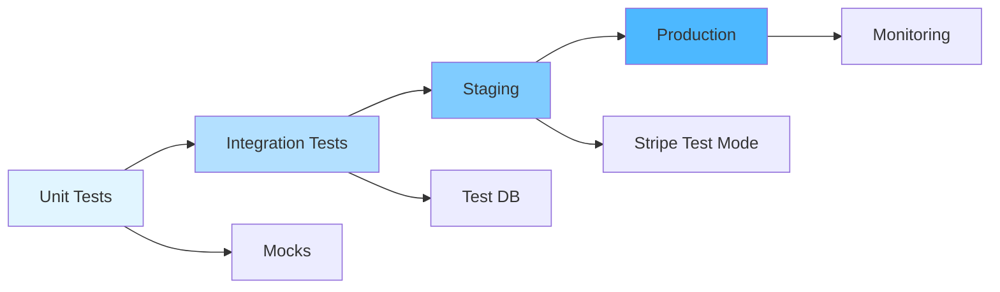

# RFC-068: Billing Testing Infrastructure

**Status**: Draft
**Created**: 2025-10-12
**Timeline**: Parallel with development
**Purpose**: Ensure billing reliability through comprehensive testing

## Quick Start

**⚠️ CRITICAL: Production Credentials**
- NEVER commit production credentials to git
- Test credentials below are safe to commit
- Store production keys in `.env` (gitignored)
- Rotate immediately if accidentally exposed

**Stripe Test Credentials**:
- API Key: `sk_test_7upzEpVpOJlEJr4HwfSHObSe`
- Publishable: `pk_Prw2ZQauqnSEnJNq7BR7ZsbychP2t`

**Test Cards**:
- Success: `4242 4242 4242 4242`
- Decline: `4000 0000 0000 0002`
- 3D Secure: `4000 0025 0000 3155`

**Additional test card codes**: See [Stripe Testing Documentation](https://stripe.com/docs/testing)

## Summary

Provide testing infrastructure, standards, and patterns to support billing system development. Enables TDD practices in RFCs 065, 066, and 067 by providing test databases, mock services, staging environments, and testing patterns.

**Scope:** This RFC provides the infrastructure and standards. Actual test implementation occurs during TDD cycles within feature RFCs (065-Provisioning, 066-Billing, 067-Marketplace).

## Testing Architecture

### ASCII Diagram

```
Unit Tests → Integration Tests → Staging → Production
     ↓              ↓                ↓          ↓
  Mocks         Test DB         Stripe Test   Monitoring
```

### Flow Diagram



**Infrastructure Layer:** Docker Compose, test databases, Stripe CLI, mock services
**Standards Layer:** Coverage requirements, telemetry patterns, test factories
**Implementation Layer:** *(Tests written during TDD in RFCs 065/066/067)*

## Monitoring & Telemetry Testing Patterns

Following patterns established in RFC-060-MONITORING-COMPLETION-REPORT:

### Test Pattern Examples

These patterns should be followed when writing telemetry tests in feature RFCs:

```elixir
# Examples of telemetry tests to implement during TDD in RFCs 065/066
test "emits telemetry on subscription creation"
test "emits telemetry on subscription renewal"
test "emits telemetry on subscription cancellation"
test "emits telemetry on payment success"
test "emits telemetry on payment failure"
test "tracks usage in Prometheus metrics"
test "Grafana dashboard displays billing metrics"
test "billing event metrics have correct tags"
```

**Note:** These are pattern examples. Actual tests are written during TDD cycles in feature RFCs.

### Implementation Pattern

Use the same `:telemetry.execute/3` pattern established for test integration:

```elixir
:telemetry.execute(
  [:rsolv, :billing, :subscription_created],
  %{amount: amount, duration: duration},
  %{customer_id: customer.id, plan: plan, status: "success"}
)

:telemetry.execute(
  [:rsolv, :billing, :payment_processed],
  %{amount_cents: amount, duration: duration},
  %{customer_id: customer.id, status: status, payment_method: method}
)

:telemetry.execute(
  [:rsolv, :billing, :usage_tracked],
  %{quantity: quantity},
  %{customer_id: customer.id, plan: plan, resource_type: "fix"}
)
```

### Metric Definition Pattern

Create `lib/rsolv/prom_ex/billing_plugin.ex` following the structure in `validation_plugin.ex`:

```elixir
defmodule Rsolv.PromEx.BillingPlugin do
  use PromEx.Plugin

  @impl true
  def event_metrics(_opts) do
    Event.build(:billing_metrics, [
      counter(
        [:rsolv, :billing, :subscription_created, :total],
        event_name: [:rsolv, :billing, :subscription_created],
        description: "Total subscriptions created",
        tags: [:customer_id, :plan, :status]
      ),
      distribution(
        [:rsolv, :billing, :payment_processed, :amount, :cents],
        event_name: [:rsolv, :billing, :payment_processed],
        measurement: :amount_cents,
        description: "Payment amounts processed",
        tags: [:customer_id, :status, :payment_method],
        reporter_options: [buckets: [100, 500, 1500, 5000, 10_000, 50_000]]
      )
    ])
  end
end
```

### Dashboard Creation

See `/tmp/rfc060-test-integration-dashboard.json` for Grafana dashboard JSON structure. Create similar dashboard for billing with panels:
- Subscription creation rate
- Payment success/failure rate
- Revenue by plan
- Usage tracking metrics
- Customer conversion funnel

### Test Coverage Requirements

**Billing telemetry tests must achieve:**
- 100% coverage of telemetry emission points
- Verification that all billing events emit telemetry
- Validation of tag completeness and correctness
- Prometheus metric collection verification

**Reference Implementation:** `lib/rsolv_web/controllers/api/v1/test_integration_controller.ex` lines 89-134 for telemetry emission patterns.

## 1. Docker Compose Setup

```yaml
# docker-compose.test.yml
version: '3.8'
services:
  postgres_test:
    image: postgres:16-alpine  # Matches production postgres version
    environment:
      POSTGRES_DB: rsolv_test
      POSTGRES_USER: postgres
      POSTGRES_PASSWORD: postgres
    ports: ["5434:5432"]  # Avoid conflicts with dev (5433) and landing (5432)
    healthcheck:
      test: ["CMD-SHELL", "pg_isready -U postgres"]
      interval: 5s
      timeout: 5s
      retries: 5

  stripe_cli:
    image: stripe/stripe-cli
    command: listen --forward-to host.docker.internal:4000/webhooks/stripe
    environment:
      STRIPE_API_KEY: sk_test_7upzEpVpOJlEJr4HwfSHObSe
```

**Email Testing**: We use `bamboo_postmark` with test mode. No need for mailcatcher - Bamboo provides test adapters that capture emails in-memory during testing.

## 2. Testing Standards & Patterns

### Test Categories and Coverage Standards

**Unit Tests** (implemented in feature RFCs during TDD):
- Coverage: 95% for billing modules, 100% for webhook handlers
- Focus: Single function/module behavior
- Pattern: Arrange-Act-Assert with mocks

**Integration Tests** (implemented in feature RFCs during TDD):
- Coverage: All critical user journeys
- Focus: Multi-component interactions
- Pattern: Full stack with test database

**Load Tests** (infrastructure provided here):
- Targets: 100 concurrent requests, 1000 webhooks/minute
- Tools: k6 or Artillery scripts
- Environment: Staging with monitoring

**Security Tests** (infrastructure and patterns provided here):
- PCI compliance validation (no card data in logs)
- SQL injection prevention (parameterized queries)
- Webhook signature verification
- Rate limiting enforcement
- Data encryption validation

### Testing Principles

1. **TDD Compliance**: Tests written BEFORE implementation (RED-GREEN-REFACTOR)
2. **Isolation**: Unit tests use mocks, integration tests use test database
3. **Idempotency**: Webhook tests verify duplicate handling
4. **Observability**: All tests emit telemetry for validation

## 3. Stripe Mock Service

```elixir
defmodule Rsolv.StripeMock do
  def create_customer(%{email: "fail@test.com"}), do: {:error, "Card declined"}
  def create_customer(_), do: {:ok, customer_fixture()}

  def create_subscription(%{customer: "cus_no_payment"}), do: {:error, "No payment method"}
  def create_subscription(_), do: {:ok, subscription_fixture()}
end
```

## 4. Staging Environment

### Test Customer States

Test customers in various states using factory traits or seed data:
- Trial customer, no billing (3 credits remaining)
- Trial customer, billing added (7 credits remaining)
- Trial expired (0 credits, no billing info)
- PAYG active (0 credits, charges per fix)
- Pro active (45 credits remaining)
- Pro past due (payment failure)
- Pro cancelled (immediate, credits preserved)
- Pro cancel scheduled (cancel_at_period_end, Pro benefits until period end)
- Pro renewed (month 2+ of subscription)

**Note:** Credit system: 5 credits on signup, +5 when billing added (total 10), +60 for Pro plan payment. See RFC-066 for credit system details.

### Factory Traits / Seed Data Strategy

**Goal**: Easy setup and teardown for dev, test, CI, and staging environments.

**Implementation**:
```elixir
# test/support/factories/customer_factory.ex
defmodule Rsolv.CustomerFactory do
  use ExMachina.Ecto, repo: Rsolv.Repo

  def customer_factory do
    %Rsolv.Customers.Customer{
      email: sequence(:email, &"customer-#{&1}@test.com"),
      name: "Test Customer",
      credit_balance: 0,
      subscription_plan: "trial"
    }
  end

  def with_trial_credits(customer) do
    %{customer | credit_balance: 3}
  end

  def with_billing_added(customer) do
    %{customer |
      credit_balance: 7,
      stripe_customer_id: "cus_test_#{System.unique_integer()}",
      billing_consent_given: true
    }
  end

  def with_pro_plan(customer) do
    %{customer |
      credit_balance: 45,
      subscription_plan: "pro",
      stripe_customer_id: "cus_test_#{System.unique_integer()}",
      billing_consent_given: true
    }
  end
end

# Usage in tests:
insert(:customer) |> with_trial_credits()
insert(:customer) |> with_billing_added()
insert(:customer) |> with_pro_plan()
```

**Staging Environment Reset**:
```bash
# Reset staging data (safe for shared environments)
mix run priv/repo/seeds_staging.exs

# Or via mix task
mix staging.reset_data
```

**Data Pollution Prevention**: All test customers should use `test.com` email domain and be easily identifiable/deletable.

## 5. Coverage Requirements

| Module | Required | Priority |
|--------|----------|----------|
| Billing.Stripe | 95% | Critical |
| Webhook Handlers | 100% | Critical |
| Usage Tracking | 95% | Critical |
| Provisioning | 95% | Critical |

## Implementation Tasks

### Week 1: Infrastructure Foundation
- [ ] Set up docker-compose.test.yml (Postgres, Stripe CLI, Mailcatcher)
- [ ] Create test factories and fixtures (customer_fixture, subscription_fixture)
- [ ] Implement StripeMock service for unit testing
- [ ] Configure test environment variables (.env.test)
- [ ] Set up coverage reporting (ExCoveralls configuration)
- [ ] Create test helper modules (TestHelpers, StripeTestHelpers)

### Week 2: CI/CD & Tooling
- [ ] Configure CI pipeline for parallel test execution
- [ ] Set up test database management (create/migrate/seed)
- [ ] Implement load testing scripts (k6 or Artillery)
- [ ] Create security testing checklist and tools
- [ ] Add Stripe webhook simulation scripts
- [ ] Configure test monitoring dashboards

### Week 3: Staging & Patterns
- [ ] Deploy staging environment with Stripe test mode
- [ ] Create staging test data fixtures (various customer states)
- [ ] Implement telemetry testing patterns (PromEx plugins)
- [ ] Add alerting for test failures in CI
- [ ] Document testing patterns and standards
- [ ] Create example TDD workflow guide

**Note:** Actual test writing happens in RFCs 065/066/067 during feature development using this infrastructure.

## Success Metrics

- **Coverage**: 95% for billing, 100% for webhooks
- **CI Speed**: < 5 minutes
- **Test Reliability**: < 1% flakiness
- **Staging Uptime**: 99.9%

## Infrastructure Readiness Checklist

Before enabling billing features in production:
- [ ] Test infrastructure operational (Docker Compose, test DB, Stripe CLI)
- [ ] Mock services available for unit testing
- [ ] Staging environment deployed with Stripe test mode
- [ ] CI/CD pipeline configured and running
- [ ] Coverage reporting enabled
- [ ] Test monitoring dashboards active
- [ ] Security testing patterns documented
- [ ] Load testing scripts ready

**Feature-specific test completion** is tracked in individual RFCs (065, 066, 067).

## Next Steps

1. Create docker-compose.test.yml with required services
2. Implement StripeMock service module
3. Set up staging environment with Stripe test mode
4. Document testing patterns for TDD workflows
5. Deploy test monitoring infrastructure