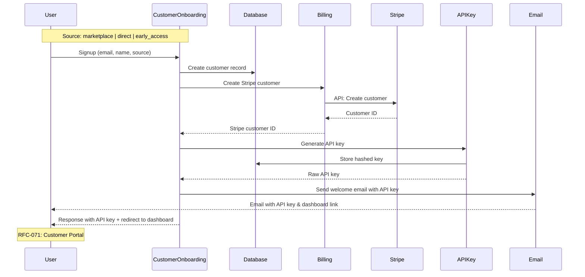
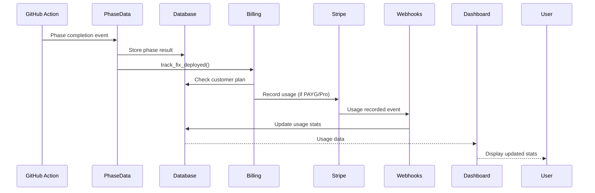

# RFC-069: Integration Week Plan

**Status**: Draft
**Created**: 2025-10-12
**Timeline**: Week 4 (Nov 4-10, 2025)
**Prerequisites**: RFCs 065-068 at 80% complete

## Summary

Critical week where four parallel workstreams (Provisioning, Billing, Marketplace, Testing) converge into unified billing system. Highest-risk phase requiring continuous coordination and communication.

## Pre-Integration Checklist

### Must Complete by End of Week 3

**Provisioning (RFC-065)**:
- [ ] Automated provisioning working from multiple sources (direct, marketplace, early access)
- [ ] Customer credit system functional (5 signup, +5 billing added)
- [ ] API key generation functional

**Billing (RFC-066)**:
- [ ] Stripe integration complete (test mode)
- [ ] Webhook endpoint responding and processing events
- [ ] Pro plan creation working ($599/month, 60 credits on payment)
- [ ] Credit ledger tracking all transactions
- [ ] Payment method addition with consent

**Marketplace (RFC-067)**:
- [ ] Submission complete or in review
- [ ] Documentation ready (README, action.yml updated)
- [ ] E2E testing with NodeGoat/RailsGoat/real OSS complete

**Testing (RFC-068)**:
- [ ] Test infrastructure running (Docker Compose, Stripe CLI)
- [ ] Staging environment deployed with test Stripe keys
- [ ] Factory traits for various customer states

## Integration Data Flow

### Customer Onboarding Flow

**Multiple Acquisition Sources** (RFC-067):
- Direct signup at rsolv.dev/register (RFC-070)
- GitHub Marketplace installation → signup redirect
- Early access form (legacy, to be replaced)

#### ASCII Sequence Diagram

```sequence
Title: New Customer Onboarding Flow (All Sources)

User->CustomerOnboarding: Signup (email, name, source)
Note right of CustomerOnboarding: source: "marketplace" | "direct" | "early_access"
CustomerOnboarding->Database: Create customer record
CustomerOnboarding->Billing: Create Stripe customer
Billing->Stripe: API: Create customer
Stripe-->Billing: Customer ID
Billing-->CustomerOnboarding: Stripe customer ID
CustomerOnboarding->APIKey: Generate API key
APIKey->Database: Store hashed key
APIKey-->CustomerOnboarding: Raw API key
CustomerOnboarding->Email: Send welcome email with API key
Email-->User: Email with API key & dashboard link
CustomerOnboarding-->User: Response with API key + redirect to dashboard
Note right of User: RFC-071: Customer Portal
```

#### Mermaid Sequence Diagram



### Usage Tracking Flow

#### ASCII Sequence Diagram

```sequence
Title: Fix Deployment & Billing Flow

GitHub Action->PhaseData: Phase completion event
PhaseData->Database: Store phase result
PhaseData->Billing: track_fix_deployed()
Billing->Database: Check customer plan
Billing->Stripe: Record usage (if PAYG/Pro)
Stripe->Webhooks: Usage recorded event
Webhooks->Database: Update usage stats
Database-->Dashboard: Usage data
Dashboard-->User: Display updated stats
```

#### Mermaid Sequence Diagram



## Data Contracts

**Note**: These contracts should ideally be expressed programmatically using OpenAPI specifications or similar, allowing test generation from the schema. Consider adding OpenAPI docs for these internal APIs (see CLAUDE.md for OpenAPI guidelines).

### Customer Onboarding → Billing
```elixir
%{
  customer_id: integer,
  email: string,
  name: string,
  subscription_type: :trial | :pay_as_you_go | :pro,
  subscription_state: string | nil
  # Note: subscription_type tracks pricing tier. "trial" is the initial state (5-10 free credits).
  # subscription_state is null for trial/PAYG, Stripe states ("active", "past_due", etc.) for Pro.
  # Customers upgrade to :pay_as_you_go or :pro when they add billing and choose a plan.
}
```

**Future**: Consider OpenAPI spec:
```yaml
# openapi/internal/customer_onboarding_to_billing.yaml
components:
  schemas:
    CustomerOnboardingData:
      type: object
      required: [customer_id, email, name, subscription_type]
      properties:
        customer_id: {type: integer}
        email: {type: string, format: email}
        name: {type: string}
        subscription_type: {type: string, enum: [trial, pay_as_you_go, pro]}
        subscription_state: {type: string, nullable: true, enum: [null, active, past_due, canceled, unpaid, incomplete, trialing, paused]}
```

### Billing → Customer Onboarding
```elixir
%{
  stripe_customer_id: string,
  subscription_type: string,    # trial, pay_as_you_go, pro
  subscription_state: string | nil,  # null for trial/PAYG, Stripe states for Pro
  credit_balance: integer,      # Current credit balance
  can_use_service: boolean      # true if credits > 0 OR billing info present
}
```

## Continuous Integration Plan (TDD Focus)

**Note**: While organized by day for clarity, integration work is continuous. Work proceeds iteratively through test-driven development cycles.

### Monday: Connect Systems
**Morning**:
- 9:00 AM - Kickoff meeting
- Write integration tests FIRST (RED)
- Deploy all branches to staging
- Fix interface contracts until tests pass (GREEN)

**Afternoon**:
- Refactor interfaces (REFACTOR)
- Verify data flow with tests
- Update integration tests
- 4:00 PM - Day review

**Tests to Write First** (following BetterSpecs guidelines):
```elixir
# Specific, descriptive test names with context
describe "CustomerOnboarding.provision_customer/1" do
  test "creates Stripe customer and credits 5 trial credits" do
    # Arrange: Customer params
    # Act: Call provision_customer
    # Assert: Stripe customer created, credit_balance = 5, transaction recorded
  end
end

describe "Billing.check_status/1" do
  test "returns can_use_service: true when customer has credits" do
    # Arrange: Customer with credit_balance = 3
    # Act: Call check_status
    # Assert: can_use_service == true
  end

  test "returns can_use_service: false when no credits and no billing" do
    # Arrange: Customer with credit_balance = 0, stripe_customer_id = nil
    # Act: Call check_status
    # Assert: can_use_service == false
  end
end

describe "Billing.track_fix_deployed/2" do
  test "creates credit_transaction with source='consumed' when fix deployed" do
    # Arrange: Customer with credit_balance = 5, fix record
    # Act: Call track_fix_deployed
    # Assert: CreditTransaction created with amount = -1, source = "consumed"
  end
end

describe "CustomerDashboard.usage_stats/1" do
  test "returns credit balance and last 10 transactions" do
    # Arrange: Customer with 15 transactions
    # Act: Query usage_stats
    # Assert: Returns credit_balance and most recent 10 transactions ordered by inserted_at DESC
  end
end
```

### Tuesday: Happy Path (TDD)
**Goal**: Complete customer journey works

**Write Tests First**:
```elixir
test "trial signup to first fix"
test "trial to paid conversion"
test "marketplace installation flow" do
  # RFC-067: Marketplace user → signup redirect → provisioning → first scan
  # Verifies: GitHub Actions workflow install, API key delivery, dashboard access
end
test "payment method addition"
test "Pro subscription creation and first renewal"
test "subscription cancellation (immediate)"
test "subscription cancellation (end-of-period)"
```
Then implement until all pass.

### Wednesday: Error Handling (TDD)
**Goal**: System handles failures gracefully

**Write Failure Tests First**:
```elixir
test "recovers from stripe API failures"
test "retries payment failures"
test "handles duplicate webhooks"
test "prevents race conditions"
test "handles subscription renewal payment failure"
test "preserves credits on subscription cancellation"
test "maintains Pro pricing until period end when cancel_at_period_end"
```
Then add error handling until tests pass.

### Thursday: Load Testing
**Goal**: System performs under load

**Tools**: Use existing load testing libraries instead of writing custom tests:
- **k6** (JavaScript-based, recommended): `brew install k6`
- **Artillery** (Node.js-based): `npm install -g artillery`
- **Locust** (Python-based): For more complex scenarios

**Example k6 Script**:
```javascript
// load_tests/signup_test.js
import http from 'k6/http';
import { check, sleep } from 'k6';

export let options = {
  stages: [
    { duration: '2m', target: 100 }, // Ramp up to 100 users
    { duration: '5m', target: 100 }, // Stay at 100 users
    { duration: '2m', target: 0 },   // Ramp down
  ],
};

export default function () {
  let response = http.post('https://staging.rsolv.dev/api/v1/customers', {
    email: `test-${__VU}-${__ITER}@test.com`,
    name: 'Load Test User',
  });

  check(response, {
    'status is 200': (r) => r.status === 200,
    'response time < 500ms': (r) => r.timings.duration < 500,
  });

  sleep(1);
}
```

**Run**: `k6 run load_tests/signup_test.js`

**Tests**:
```bash
# Using k6
k6 run --vus 100 --duration 30s load_tests/signup_test.js
k6 run --vus 1000 --duration 1m load_tests/webhook_test.js

# Verify rate limits hold
k6 run --vus 200 --duration 10s load_tests/api_rate_limit_test.js

# Memory/CPU monitoring during load (using existing monitoring stack)
# Check Grafana dashboards during load test execution
```

### Friday: Production Preparation
**Morning**:
- Final test run in staging
- Verify all success criteria met
- Review deployment checklist

**Afternoon**:
- Deploy to production (feature-flagged if needed)
- Smoke test in production
- Verify monitoring and alerting
- Support documentation ready

**No Beta**: We launch directly to production. We don't have sufficient customer base for a meaningful beta program.

## Critical Integration Points

### 1. Signup → Billing

#### Flow Diagram

```sequence
Title: Signup to Stripe Customer Creation

CustomerOnboarding->Customers: create_customer(params)
Customers->Database: INSERT customer
Database-->Customers: Customer record
Customers-->CustomerOnboarding: {:ok, customer}
CustomerOnboarding->Billing: create_stripe_customer(customer)
Billing->Stripe: API: Create customer
Stripe-->Billing: Stripe customer ID
Billing-->CustomerOnboarding: {:ok, stripe_id}
CustomerOnboarding->Customers: update_customer(stripe_id)
Customers->Database: UPDATE stripe_customer_id
Database-->Customers: Updated
Customers-->CustomerOnboarding: {:ok, customer}
CustomerOnboarding-->User: Customer onboarded
```

#### Implementation

```elixir
# In CustomerOnboarding module
def provision_customer(params) do
  with {:ok, customer} <- create_customer(params),
       {:ok, stripe_id} <- Billing.create_stripe_customer(customer),
       {:ok, _} <- update_customer(customer, stripe_id) do
    {:ok, customer}
  end
end
```

### 2. Payment → Status Update

#### Flow Diagram

```sequence
Title: Payment Method Addition

Dashboard->Billing: add_payment_method(customer, token)
Billing->Stripe: API: Attach payment method
Stripe-->Billing: Payment method attached
Billing->Customers: update_customer_status("active")
Customers->Database: UPDATE status, can_use_service
Database-->Customers: Updated
Customers-->Billing: {:ok, customer}
Billing-->Dashboard: {:ok, :payment_added}
Dashboard->Dashboard: Show success message
Dashboard->Dashboard: Enable "Run First Scan" button
```

#### Implementation

```elixir
def add_payment_method(customer, token) do
  with {:ok, _} <- Stripe.attach_payment(customer, token),
       {:ok, _} <- update_customer_status(customer, "active") do
    {:ok, :payment_added}
  end
end
```

### 3. Usage → Billing

#### Flow Diagram

```sequence
Title: Fix Deployment Usage Tracking

Action->Billing: track_fix(customer, fix)
Billing->Database: check_limits(customer)
Database-->Billing: Limits OK
Billing->Database: Check credit balance
Database-->Billing: Balance returned
alt Has credits
    Billing->Database: Consume 1 credit
    Billing-->Action: {:ok, :consumed_credit}
else No credits, has billing
    alt PAYG Customer
        Billing->Stripe: Charge $29
        Stripe-->Billing: Payment success
        Billing->Database: Credit 1, consume 1
    else Pro Customer
        Billing->Stripe: Charge $15 (discounted)
        Stripe-->Billing: Payment success
        Billing->Database: Credit 1, consume 1
    end
    Billing-->Action: {:ok, :charged}
else No credits, no billing
    Billing-->Action: {:error, :no_billing_info}
end
```

#### Implementation

```elixir
def track_fix(customer, fix) do
  with :ok <- check_limits(customer),
       {:ok, _} <- record_usage(customer, 1),
       {:ok, _} <- maybe_charge(customer) do
    {:ok, :tracked}
  end
end
```

### 4. Phase Completion → Usage Tracking (RFC-060-AMENDMENT-001 Integration)

#### Event-Driven Billing Integration

```sequence
Title: Phase Completion to Billing Flow

GitHub Action->PhaseData: POST /api/v1/phase-data
Note right of PhaseData: Stores result,\nemits event
PhaseData->EventBus: Publish phase_completed
EventBus->BillingService: phase_completed event
BillingService->Database: Get customer
BillingService->BillingService: Check if billable_event?
alt Mitigate Success
    BillingService->Billing: track_fix_deployed()
    Billing->Database: Check credit balance
    alt Has credits
        Billing->Database: Consume 1 credit
    else No credits, has billing (PAYG)
        Billing->Stripe: Charge $29 + credit 1 + consume 1
    else No credits, has billing (Pro)
        Billing->Stripe: Charge $15 + credit 1 + consume 1
    else No credits, no billing
        Billing->Billing: Block and return error
    end
    Stripe-->Billing: Success
    Billing->Database: Update billing record
else Not Billable
    BillingService->BillingService: Ignore event
end
```

#### Implementation Pattern

```elixir
# PhaseDataClient receives completion signal from GitHub Action
# This is the integration point where validation/mitigation phases connect to billing
def handle_phase_completion(%{phase: :mitigate, status: :success} = result) do
  customer = Customers.get_customer(result.customer_id)

  # This triggers billing for the successful fix
  Billing.track_fix_deployed(customer, result)
end

# Alternative implementation via PubSub:
def handle_info({:phase_completed, phase_result}, state) do
  if billable_event?(phase_result) do
    process_billing(phase_result)
  end
  {:noreply, state}
end

defp billable_event?(%{phase: :mitigate, status: :success}), do: true
defp billable_event?(_), do: false
```

#### Integration Notes

**1. Test Integration API (VALIDATE Phase) Happens Earlier:**
   - POST /api/v1/test-integration/analyze (scores test files)
   - POST /api/v1/test-integration/generate (integrates tests)
   - By the time `track_fix_deployed()` is called, tests have already been created and run

**2. Billing Only Cares About Final Deployment Success:**
   - Billing doesn't care HOW tests were generated (AST vs string matching)
   - Billing doesn't care WHERE tests are located (spec/ vs .rsolv/tests/)
   - Billing only cares: "Did a fix get successfully deployed?"

**3. PhaseDataClient Acts as Integration Hub:**
   - Receives completion signals from GitHub Action
   - Stores phase results in database
   - Emits events that trigger billing
   - Provides loose coupling between phases and billing

**4. Loose Coupling Benefit:**
This event-driven architecture means billing happens in response to phase completion EVENTS (received via PhaseDataClient), not directly from the GitHub Action. The test integration API (RFC-060-AMENDMENT-001) and billing (RFC-066) are loosely coupled through the event-driven phase completion mechanism. Changes to validation (like test location or integration method) don't affect the billing interface.

## Rollback Strategy

### Feature Flags
```elixir
if FunWithFlags.enabled?(:automated_customer_onboarding) do
  auto_provision(customer)
else
  manual_queue(customer)
end
```

### Database Backups (Use Ecto!)

**IMPORTANT**: Always use Ecto for database operations, including backups and migrations.

```elixir
# Use Ecto migration rollback instead of raw SQL
mix ecto.rollback --step 1
mix ecto.rollback --to 20251021

# For data snapshots, use Ecto queries to export/import
defmodule Rsolv.Backup do
  def export_customers_snapshot do
    customers = Repo.all(Customer)
    File.write!("backup_customers_#{Date.utc_today()}.json", Jason.encode!(customers))
  end

  def restore_customers_snapshot(file) do
    {:ok, data} = File.read(file)
    {:ok, customers} = Jason.decode(data)

    Repo.transaction(fn ->
      Enum.each(customers, fn customer_data ->
        %Customer{}
        |> Customer.changeset(customer_data)
        |> Repo.insert!()
      end)
    end)
  end
end
```

**Database Backups** (via Kubernetes/infrastructure, not manual):
```bash
# Automated backups via CloudNativePG (already configured)
kubectl get backups -n rsolv-production

# Restore from backup (if catastrophic failure)
# See rsolv-infrastructure/DEPLOYMENT.md
```

### Kill Switches
```yaml
# runtime.exs
config :rsolv,
  billing_enabled: env("BILLING_ENABLED") != "false",
  auto_provision: env("AUTO_PROVISION") != "false"
```

## Risk Areas & Mitigation

| Risk | Impact | Mitigation |
|------|--------|------------|
| **Customers don't show up** | **Highest** | **Multi-channel GTM (RFC-067): Marketplace, Mastodon/Bluesky, content marketing, email list building. Success metrics: 15-30 marketplace installs in 30 days. Pivot criteria: If <10 signups in first 30 days, reassess customer acquisition strategy.** |
| Webhook race conditions | High | Queue and process async via Oban with idempotency (unique stripe_event_id) |
| Payment during provisioning | Medium | Database row locks (FOR UPDATE) during provisioning |
| API validation performance | High | Cache with 60s TTL |
| Interface mismatches | High | Day 1 validation tests with comprehensive data contracts |
| Stripe API failures | Medium | Oban retry with exponential backoff (max 3 attempts) |
| Data inconsistency (credit balance) | High | Ecto.Multi transactions, credit ledger audit trail |

## Communication Plan

**Note**: This is a two-person operation (Dylan and Claude). Formal communication plan not needed.

**Working Agreement**:
- Continuous async communication via Claude Code sessions
- Status updates tracked in RFC documents and git commits
- Issues documented in GitHub issues or RFC amendments
- Decision log maintained in ADRs when implementation deviates from RFCs

## Success Criteria

### Must Have (Production Blockers)
- [ ] Automated signup → API key flow working for all sources (direct, marketplace, early access)
- [ ] Payment method addition works with explicit consent
- [ ] Pro plan creation successful ($599/month, 60 credits)
- [ ] Credit system tracking accurate (ledger balance matches customer balance)
- [ ] Fix deployment billing works (consume credits or charge correctly)
- [ ] All tests passing (>90% coverage)
- [ ] Staging stable for 24 hours with no critical errors
- [ ] Monitoring and alerting operational
- [ ] Rollback procedure tested

### Should Have
- [ ] Load tests pass
- [ ] Monitoring complete
- [ ] Rollback tested

## Integration Week Checklist

**Note**: "Week 4" refers to the 4th week of the 6-week RFC-064 timeline. This is the integration phase when all parallel workstreams converge.

### Monday
- [ ] All systems connected
- [ ] Interface tests pass
- [ ] Data flows correctly

### Tuesday
- [ ] Happy path works end-to-end
- [ ] Customer journey smooth

### Wednesday
- [ ] Error handling verified
- [ ] Recovery procedures work

### Thursday
- [ ] Load tests pass
- [ ] Performance acceptable

### Friday
- [ ] Production deployment ready
- [ ] Monitoring and alerting active
- [ ] Documentation complete (support docs, API docs, runbooks)

## Next Steps

### Week 3 (Preparation)
1. Complete prerequisites from checklist (80% completion on RFCs 065-068)
2. Set up staging environment with test Stripe keys
3. Verify all factory traits and seed data working
4. Review this RFC and adjust timeline if needed

### Monday Morning (Integration Week Start)
1. Deploy all feature branches to staging
2. Begin interface validation tests
3. Start continuous integration process