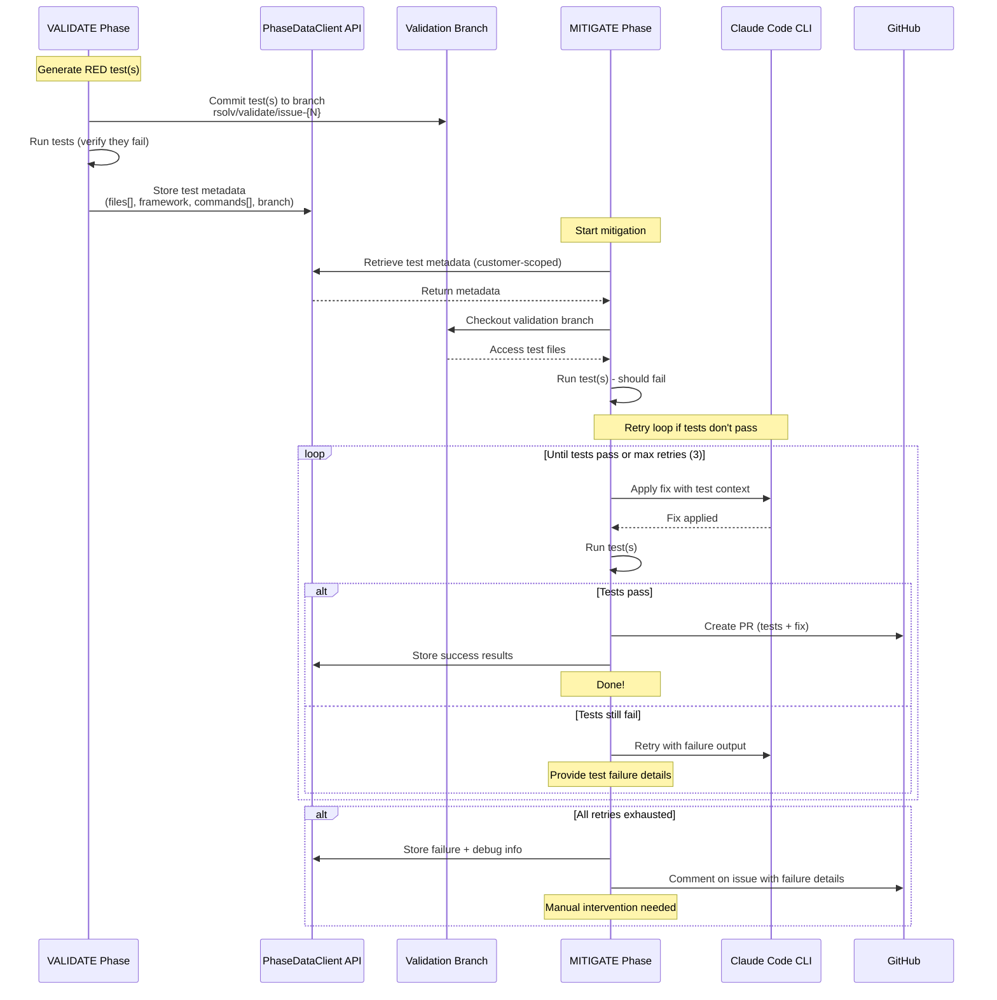

# RFC-060: Executable Validation Test Integration

**Status:** Under Review
**Created:** 2025-09-24
**Updated:** 2025-09-30
**Author:** RSOLV Team
**Reviewers:** Dylan (2025-09-30)

## Abstract

This RFC proposes a fundamental shift from JSON-based test definitions to directly executable test files that integrate with existing test frameworks. Building on RFC-058 (Validation Branch Persistence), this approach generates RED tests that prove vulnerabilities exist, integrates them into existing test suites, and validates that they actually fail before proceeding to mitigation.

## Background

### Current Implementation

The VALIDATE phase currently:
1. Generates RED/GREEN/REFACTOR tests for each vulnerability
2. Creates branches named `rsolv/validate/issue-{number}` when `RSOLV_TESTING_MODE=true`
3. Stores tests as JSON in `.rsolv/tests/validation.test.js`
4. Commits and pushes tests to validation branches

### Observed Challenges

1. **JSON Format**: Current JSON test definitions are not directly executable
2. **Test Isolation**: Tests stored separately from existing test suites
3. **Framework Discovery**: No automatic detection of which test framework to use
4. **Test Validation**: Tests not verified to actually fail before mitigation
5. **Metadata Management**: No clear path for passing context between phases

## Proposal

### 1. Core Principles

- **No JSON**: Generate directly executable test files only
- **RED Tests Only**: Focus on proving vulnerability exists (VALIDATE phase)
- **Framework Integration**: Tests integrate into existing test suites
- **Auto-Discovery**: Detect test framework automatically before any test generation
- **Test Validation**: Run tests to ensure they actually fail
- **Backend Persistence**: Use PhaseDataClient API for all metadata storage and retrieval

### 2. Test Framework Discovery

**Existing Implementation**: We already have a comprehensive `test-framework-detector.ts` in RSOLV-action that detects frameworks across multiple languages.

**Language Coverage Alignment**: Test framework detection must support all languages with AST detection patterns in RSOLV-platform:

| Language | AST Pattern Support | Test Framework Support |
|----------|-------------------|----------------------|
| **JavaScript** | ✅ 40+ patterns | ✅ Jest, Mocha, Jasmine, Vitest, Karma, Cypress, Playwright, AVA, Tape, QUnit, Bun |
| **Python** | ✅ 15+ patterns | ✅ pytest, unittest, nose2, doctest, hypothesis |
| **Ruby** | ✅ 23+ patterns | ✅ RSpec, Minitest, Test::Unit, Cucumber, Capybara |
| **Rails** | ✅ 20+ patterns | ✅ RSpec-Rails (variant), Minitest (Rails integration) |
| **PHP** | ✅ 25+ patterns | ✅ PHPUnit, Pest, Codeception, PHPSpec, Behat |
| **Java** | ✅ 16+ patterns | ✅ JUnit, TestNG, Mockito, Spock |
| **Elixir** | ✅ 26+ patterns | ✅ ExUnit, ESpec |
| **Django** | ✅ 18+ patterns | ✅ pytest-django, unittest (Python frameworks) |

```typescript
// Leverages existing src/ai/test-framework-detector.ts
import { TestFrameworkDetector } from '../ai/test-framework-detector';

export class ValidationMode {
  private detector: TestFrameworkDetector;

  async processIssue(issue: IssueContext): Promise<void> {
    // Use existing detector that covers all AST-supported languages
    const frameworks = await this.detector.detectFrameworks(this.repoPath);
    const primaryFramework = frameworks[0]; // Already sorted by confidence

    if (!primaryFramework) {
      await this.labelNoFramework(issue);
      return;
    }

    // Continue with test generation...
  }
}
```

### 3. Backend Persistence for Test Metadata

**Existing Infrastructure**: We already have backend API persistence through the PhaseDataClient and platform endpoints:

```typescript
// Uses existing PhaseDataClient for metadata storage
import { PhaseDataClient } from '../modes/phase-data-client';

export class ValidationMode {
  private phaseClient: PhaseDataClient;

  async storeTestMetadata(issue: IssueContext, testFile: string): Promise<void> {
    // Store test metadata in backend using existing API
    const validationData = {
      validated: true,
      redTests: {
        file: testFile,
        framework: this.detectedFramework,
        command: this.getTestCommand(testFile),
        branch: `rsolv/validate/issue-${issue.number}`
      },
      testResults: {
        ranSuccessfully: false, // RED test should fail
        executionTime: this.testDuration
      },
      timestamp: new Date().toISOString()
    };

    // Uses POST /api/v1/phases/store endpoint
    await this.phaseClient.storePhaseResults('validate', {
      validate: {
        [`issue-${issue.number}`]: validationData
      }
    }, {
      repo: this.repo,
      issueNumber: issue.number,
      commitSha: this.commitSha
    });
  }
}
```

### 4. Executable RED Test Generation

Generate framework-specific executable tests that prove vulnerabilities:

#### Jest Example (JavaScript)
```javascript
// __tests__/security/rsolv-issue-1036.test.js
// RSOLV RED Test - Proves ReDoS vulnerability exists
// Issue: #1036
// Expected: This test should fail (timeout) on vulnerable code

const { describe, test, expect } = require('@jest/globals');
const { validateInput } = require('../../src/utils/validator');

describe('[RSOLV] Issue #1036 - ReDoS Vulnerability', () => {
  test('should detect exponential backtracking in regex', async () => {
    const attackString = 'a'.repeat(30) + 'b';
    const startTime = Date.now();

    // This should cause exponential backtracking in vulnerable code
    const result = await validateInput(attackString);
    const duration = Date.now() - startTime;

    // RED test: Fails if vulnerable (takes > 1000ms)
    expect(duration).toBeLessThan(100);
    expect(result).toBe(false);
  }, 2000); // 2 second timeout
});
```

#### RSpec Example (Ruby)
```ruby
# spec/security/rsolv_issue_1037_spec.rb
# RSOLV RED Test - Proves XSS vulnerability exists
# Issue: #1037
# Expected: This test should fail on vulnerable code

require 'rails_helper'

RSpec.describe '[RSOLV] Issue #1037 - XSS Vulnerability', type: :request do
  describe 'GET /users/profile' do
    it 'properly escapes user input to prevent XSS' do
      # Attack vector - following betterspecs.org guidelines
      malicious_username = "</script><script>alert('XSS')</script>"

      get user_profile_path, params: { username: malicious_username }

      # RED test: Fails if XSS vulnerability exists
      # Use explicit expectation per betterspecs.org
      expect(response.body).not_to include('<script>alert')
      expect(response.body).to include(CGI.escapeHTML(malicious_username))
    end
  end
end
```

#### Pytest Example (Python)
```python
# tests/security/test_rsolv_issue_1038.py
# RSOLV RED Test - Proves SQL injection vulnerability exists
# Issue: #1038
# Expected: This test should fail on vulnerable code

import pytest
from app.models import User
import sqlalchemy

def test_sql_injection_vulnerability():
    """RED test: Detects SQL injection in user search"""
    # Attack vector that won't cause actual damage
    malicious_input = "' OR '1'='1"

    # RED test: Should detect unsafe query construction
    results = User.search(malicious_input)

    # If vulnerable, this will return all users (not just matching ones)
    # This assertion fails if SQL injection is present
    assert len(results) <= 1, "SQL injection detected: query returned too many results"

    # Alternative: Check for query sanitization
    with pytest.raises(sqlalchemy.exc.DataError):
        # Malformed input should be rejected if properly sanitized
        User.search("'; SELECT * FROM users; --")
```

### 5. Metadata Flow

**Backend API Persistence**: Use existing phase data infrastructure for metadata storage and retrieval:



#### VALIDATE Phase - Store Test Metadata
```typescript
// validation-mode.ts
export class ValidationMode {
  private phaseClient: PhaseDataClient;

  async processIssue(issue: IssueContext): Promise<void> {
    // ... generate test(s) ...
    // Note: May generate multiple RED tests to fully exercise vulnerability

    const testFiles = [
      'spec/security/rsolv_issue_123_xss_spec.rb',
      'spec/security/rsolv_issue_123_sanitization_spec.rb'
    ];

    // Store in backend (works in production and act)
    await this.phaseClient.storePhaseResults('validate', {
      validate: {
        [`issue-${issue.number}`]: {
          validated: true,
          redTests: {
            files: testFiles, // Array to support multiple tests
            framework: framework.name,
            commands: testFiles.map(f => framework.getTestCommand(f)),
            branch: `rsolv/validate/issue-${issue.number}`
          },
          testResults: {
            allFailed: testResults.every(r => r.failed), // All must fail for valid RED tests
            results: testResults, // Individual test results
            timestamp: new Date().toISOString()
          }
        }
      }
    }, {
      repo: this.repo,
      issueNumber: issue.number,
      commitSha: this.commitSha
    });
  }
}
```

#### Claude Code CLI Test Execution Capability

**VERIFIED**: Claude Code CLI has built-in Bash tool that can execute test commands autonomously.

**Programmatic Proof** (verified 2025-09-30):
```bash
$ which claude
/home/dylan/.asdf/installs/nodejs/24.3.0/bin/claude

$ echo "Can you run the command: echo 'test output'" | claude --print --permission-mode bypassPermissions
test output

$ echo "Run a test and provide feedback on failure" | claude --print --permission-mode bypassPermissions
# Claude executes the test, reads output, and provides fix guidance
```

**How It Works**:
- Claude Code CLI has access to the **Bash tool** as part of its standard toolset
- When given a prompt with test context, Claude can autonomously:
  1. Execute test commands (`npm test`, `bundle exec rspec`, etc.)
  2. Read and parse test output
  3. Iterate on fixes based on test failures
  4. Re-run tests to verify fixes work
- **No external test orchestration needed** - Claude handles this internally

**Implementation Pattern**:
```typescript
// RSOLV-action calls Claude Code CLI with test-aware prompt
const prompt = `
Fix the security vulnerability in ${file}.

VALIDATION TESTS AVAILABLE:
${testFiles.map(f => fs.readFileSync(f, 'utf-8')).join('\n')}

INSTRUCTIONS:
1. Use the Bash tool to run these tests: ${testCommands.join(', ')}
2. The tests should FAIL initially (proving vulnerability exists)
3. Apply your fix
4. Re-run the tests - they should PASS
5. If tests still fail, iterate on your fix
6. You have 3 attempts to get all tests passing
`;

// Claude Code CLI autonomously executes tests and iterates
```

#### MITIGATE Phase - Retrieve Test Metadata & Retry Logic

**Note**: Retry logic handled BY Claude Code CLI with verification (see RFC-061 for detailed analysis).

**Phase 1 Implementation**: Hybrid Verification approach
- Claude iterates autonomously (maxTurns: 3)
- Structured output for visibility
- External verification of final state
- Trust score tracking (Claude claims vs actual results)

```typescript
// mitigation-mode.ts - Phase 1: Hybrid Verification (RFC-061)
export class MitigationMode {
  private phaseClient: PhaseDataClient;

  async processIssue(issue: IssueContext): Promise<void> {
    // Retrieve test metadata from backend API
    const phaseData = await this.phaseClient.retrievePhaseResults(
      this.repo,
      issue.number,
      this.commitSha
    );

    const validationData = phaseData.validate?.[`issue-${issue.number}`];
    if (!validationData?.redTests) {
      logger.warn(`No validation test found for issue ${issue.number}`);
      return;
    }

    const { files, framework, commands, branch } = validationData.redTests;

    // Checkout validation branch (contains the actual test files)
    await this.checkoutBranch(branch);

    // Pre-verification: ensure tests fail before fix
    const preVerification = await this.runTests(commands);
    if (!preVerification.allFailed) {
      logger.error('[Mitigation] Tests passed before fix - vulnerability may not exist');
      await this.storeResults({ success: false, reason: 'pre_verification_failed' });
      return;
    }

    // Build test-aware prompt with structured output requirement
    const testContents = files.map(f => fs.readFileSync(f, 'utf-8'));
    const prompt = `
Fix the security vulnerability in issue #${issue.number}: ${issue.title}

${issue.body}

VALIDATION TESTS:
${testContents.map((content, i) => `
File: ${files[i]}
\`\`\`
${content}
\`\`\`
`).join('\n')}

INSTRUCTIONS:
1. Run tests FIRST using Bash tool: ${commands.join('; ')}
2. Tests should FAIL initially (proving vulnerability exists)
3. Apply your fix
4. Re-run tests - they should PASS
5. If tests fail, iterate (max 3 attempts total)
6. DO NOT modify the tests

RESPOND WITH:
\`\`\`json
{
  "attempts": <number>,
  "finalStatus": "PASS|FAIL",
  "testExecutions": [{"attempt": 1, "before": "...", "after": "..."}]
}
\`\`\`
`;

    // Call Claude Code CLI with structured output
    const claudeResult = await this.callClaudeCodeCLI(prompt, {
      maxTurns: 3,
      parseJson: true
    });

    // Post-verification: verify Claude's claims
    const postVerification = await this.runTests(commands);
    const actuallyPassed = postVerification.allPassed;

    // Calculate trust score (RFC-061)
    const claudeClaimed = claudeResult.finalStatus === 'PASS';
    const trustScore = claudeClaimed === actuallyPassed ? 1.0 : 0.0;

    // Store comprehensive results
    await this.phaseClient.storePhaseResults('mitigate', {
      mitigate: {
        [`issue-${issue.number}`]: {
          success: actuallyPassed,
          claude: {
            reportedAttempts: claudeResult.attempts,
            reportedStatus: claudeResult.finalStatus,
            testExecutions: claudeResult.testExecutions
          },
          verification: {
            testsPassed: actuallyPassed,
            testOutputs: postVerification.outputs
          },
          trustScore, // Track for RFC-061 monitoring
          timestamp: new Date().toISOString()
        }
      }
    }, {
      repo: this.repo,
      issueNumber: issue.number,
      commitSha: this.commitSha
    });

    if (actuallyPassed) {
      await this.createPR(issue, branch);
    } else {
      await this.commentOnIssue(issue, {
        message: 'Fix generation failed - tests still failing',
        attempts: claudeResult.attempts,
        testOutputs: postVerification.outputs
      });
    }
  }
}
```

### 6. Workflow Integration

**IMPORTANT**: Current implementation in mitigation-mode.ts still reads from local JSON files instead of using PhaseDataClient. This must be fixed to align with backend persistence approach.

#### VALIDATE Phase Enhancements

```typescript
// validation-mode.ts
export class ValidationMode {
  private frameworkDiscovery: TestFrameworkDiscovery;

  async processIssue(issue: IssueContext): Promise<void> {
    // 1. Detect test framework
    const framework = await this.frameworkDiscovery.detectFramework(
      this.repoPath,
      issue.vulnerableFile
    );

    if (!framework) {
      await this.labelNoFramework(issue);
      return;
    }

    // 2. Find appropriate test location
    const testLocation = await this.findTestLocation(issue, framework);

    // 3. Generate executable RED test
    const testContent = await this.generateRedTest(issue, framework);

    // 4. Write test to existing suite
    await this.integrateTest(testLocation, testContent);

    // 5. Run test to validate it fails
    const testResult = await this.runTest(testLocation, framework);

    if (!testResult.failed) {
      logger.warn(`RED test did not fail as expected for issue ${issue.number}`);
      await this.labelTestInvalid(issue);
      return;
    }

    // 6. Commit to validation branch
    const branchName = await this.createValidationBranch(issue);
    await this.commitTest(branchName, testLocation);

    // 7. Update metadata
    await this.updateIssueWithTestMetadata(issue, testLocation);
  }

  private async runTest(testFile: string, framework: TestFramework): Promise<TestResult> {
    const command = framework.getTestCommand(testFile);
    const result = await exec(command);

    return {
      failed: result.exitCode !== 0,
      output: result.stdout + result.stderr
    };
  }
}
```

#### MITIGATE Phase Enhancements

**CURRENT ISSUE**: The existing mitigation-mode.ts (lines 36-46) reads validation data from local JSON files. This must be replaced with PhaseDataClient API calls.

```typescript
// mitigation-mode.ts - PROPOSED IMPLEMENTATION
export class MitigationMode {
  async processIssue(issue: IssueContext): Promise<void> {
    // 1. Retrieve test metadata from issue or local file
    const metadata = await this.getTestMetadata(issue);

    if (!metadata || !metadata.test_file) {
      logger.warn(`No validation test found for issue ${issue.number}`);
      return;
    }

    // 2. Checkout validation branch
    const branchName = `rsolv/validate/issue-${issue.number}`;
    await this.checkoutBranch(branchName);

    // 3. Run RED test - should fail on vulnerable code
    const beforeFix = await this.runTest(metadata.test_file, metadata.framework);

    if (!beforeFix.failed) {
      logger.error(`RED test passed before fix - vulnerability may not exist`);
      return;
    }

    // 4. Apply fix to vulnerable code
    await this.applyFix(issue);

    // 5. Run RED test again - should pass after fix
    const afterFix = await this.runTest(metadata.test_file, metadata.framework);

    if (afterFix.failed) {
      logger.warn(`RED test still failing after fix - fix may be incomplete`);
      // Continue anyway, but note in PR
    }

    // 6. Create PR with fix
    await this.createPullRequest(issue, {
      testResult: afterFix,
      testFile: metadata.test_file
    });
  }

  // REMOVED: getTestMetadata method - all metadata now retrieved via PhaseDataClient
  // The PhaseDataClient handles both production (API) and local (file) storage transparently
  // This ensures consistent data flow and eliminates duplicate code paths
}
```

### 7. Benefits

1. **No JSON Transformation**: Direct executable tests, no parsing needed
2. **Framework Integration**: Tests integrate into existing test suites
3. **Immediate Validation**: Tests run to verify they actually fail
4. **Reduced Complexity**: No separate test storage, uses existing structure
5. **Better Developer Experience**: Standard test files, familiar tooling
6. **TDD Workflow**: Natural RED/GREEN cycle for vulnerability fixes

### 8. Critical Implementation Blockers

#### Blocker 1: Mitigation Mode Local File Dependency

**Current Issue**: The mitigation-mode.ts currently reads validation data from local JSON files instead of using the PhaseDataClient API:

```typescript
// CURRENT PROBLEMATIC CODE (mitigation-mode.ts lines 36-46)
async checkoutValidationBranch(issue: IssueContext): Promise<boolean> {
  // ❌ PROBLEM: Reading from local file system
  const validationPath = path.join(this.repoPath, '.rsolv', 'validation', `issue-${issue.number}.json`);

  if (!fs.existsSync(validationPath)) {
    logger.info('No validation results found, staying on current branch');
    return false;
  }

  const validationData = JSON.parse(fs.readFileSync(validationPath, 'utf-8'));
  // ...
}
```

**Required Fix**:
```typescript
// ✅ SOLUTION: Use PhaseDataClient API
async checkoutValidationBranch(issue: IssueContext): Promise<boolean> {
  // Retrieve from backend API
  const phaseData = await this.phaseClient.retrievePhaseResults(
    this.repo,
    issue.number,
    this.commitSha
  );

  const validationData = phaseData?.validate?.[`issue-${issue.number}`];
  if (!validationData?.branchName) {
    logger.info('No validation branch found in API, staying on current branch');
    return false;
  }
  // ...
}
```

This blocker must be resolved before implementing executable tests, as it breaks the backend persistence model.

### 9. Feature Flag Strategy

**No progressive rollout needed** - we have no active customers. Deploy directly once ready.

Implement feature flag `RSOLV_EXECUTABLE_TESTS` for development/testing and rollback capability.

**Configuration**: `maxTurns` (RFC-061) is configurable via:
- Action input: `claude_max_turns` (default: 3)
- Environment variable: `CLAUDE_MAX_TURNS`
- Range: 1-30 (3 recommended for test-fix-verify cycle)

```typescript
// validation-mode.ts
export class ValidationMode {
  private useExecutableTests: boolean;

  constructor(config: ActionConfig) {
    // Default ON once feature is ready
    this.useExecutableTests =
      process.env.RSOLV_EXECUTABLE_TESTS !== 'false' &&
      config.experimentalFeatures?.executableTests !== false;
  }

  async generateTests(issue: IssueContext): Promise<void> {
    if (this.useExecutableTests) {
      // New: Generate executable RED test files
      await this.generateExecutableRedTest(issue);
    } else {
      // Legacy: Generate JSON test definitions (for rollback only)
      await this.generateJsonTestDefinition(issue);
    }
  }
}
```

#### Deployment Strategy:

1. **Development & Testing**
   - Use `RSOLV_EXECUTABLE_TESTS=false` to test legacy behavior if needed
   - Test with nodegoat, discourse, django-DefectDojo

2. **Production Deploy**
   - Deploy with feature enabled by default
   - Keep flag for emergency rollback: `RSOLV_EXECUTABLE_TESTS=false`
   - Monitor for issues, roll back if critical problems found

#### Monitoring (Post-Deploy):

- Test generation success rate
- Fix success rate (tests passing after mitigation)
- Observability for failure cases (stored in phase data for debugging)

### 10. Security Considerations

#### PhaseDataClient API Security

**Note**: Much of the infrastructure already exists. This RFC focuses on evolving from JSON to executable tests after fixing critical blockers.

#### Phase 1: Enhance Test Generation (Priority)
- Modify validation-mode.ts to generate executable test files
- Create framework-specific templates for RED tests
- Integrate with existing test-framework-detector.ts
- Store test metadata in PhaseDataClient

#### Phase 2: Test Execution Integration
- Add test runner to verify RED test fails
- Store test results in phase data
- Handle test execution timeouts gracefully
- Log detailed test output for debugging

#### Phase 3: MITIGATE Phase Updates
- Retrieve test metadata from backend API
- Checkout validation branch with test
- Run test before and after fix
- Include test results in PR description

#### Phase 4: Testing & Rollout
- TDD approach throughout development
- Test targets:
  - **JavaScript**: nodegoat-vulnerability-demo (Jest, deliberately vulnerable)
  - **Ruby**: discourse (RSpec, large Rails app) or gitlab-foss (RSpec-Rails)
  - **Python**: django-DefectDojo (pytest-django) or flask-vulnerable-app (pytest)
- Feature flag: `RSOLV_EXECUTABLE_TESTS=true`
- Monitor success rate and adjust templates

### 12. TDD Implementation Roadmap

**Development Methodology**: Test-Driven Development (TDD) with RED-GREEN-REFACTOR cycle

#### Phase 1: Framework Detection & Test Generation [Week 1]

##### Day 1-2: Test Framework Auto-Discovery
**RED Tests** (write failing tests first):
```typescript
// __tests__/framework-detection.test.ts
describe('TestFrameworkDetector', () => {
  test('detects test framework before any test generation');
  test('handles missing test framework gracefully');
  test('supports minitest in Rails contexts');
  test('detects multiple frameworks and selects primary');
});
```

**GREEN Implementation**:
- Enhance `test-framework-detector.ts` to run early in VALIDATE phase
- Add Rails-specific minitest detection
- Implement framework priority scoring

**REFACTOR**:
- Extract framework patterns to configuration
- Optimize detection performance

##### Day 3-4: Executable Test Generation
**RED Tests**:
```typescript
describe('ExecutableTestGenerator', () => {
  test('generates .test.js file instead of JSON', () => {
    const result = generator.generate(issue, 'jest');
    expect(result.filePath).toMatch(/\.test\.js$/);
    expect(result.content).not.toContain('JSON.parse');
  });

  test('creates Jest syntax for JavaScript projects', () => {
    const result = generator.generate(sqlInjectionIssue, 'jest');
    expect(result.content).toContain('describe(');
    expect(result.content).toContain('test(');
    expect(result.content).toContain('expect(');
  });

  test('creates RSpec syntax for Ruby projects', () => {
    const result = generator.generate(xssIssue, 'rspec');
    expect(result.content).toContain('RSpec.describe');
    expect(result.content).toContain('it ');
    expect(result.content).toContain('expect(');
  });
});
```

**GREEN Implementation**:
- Create `ExecutableTestGenerator` class
- Implement framework-specific templates
- Generate tests that integrate with existing suites

##### Day 5: Backend Persistence Integration
**RED Tests**:
```typescript
describe('ValidationPhaseDataPersistence', () => {
  test('stores test metadata via PhaseDataClient');
  test('includes framework, file location, and command');
  test('handles API failures with local fallback');
});
```

**GREEN Implementation**:
- Integrate PhaseDataClient in validation-mode.ts
- Store comprehensive test metadata
- Implement fallback for local development

#### Phase 2: Test Execution & Validation [Week 2]

##### Day 1-2: Test Runner Integration
**RED Tests**:
```typescript
describe('TestRunner', () => {
  test('executes Jest test command', async () => {
    const result = await runner.runTest('__tests__/security/issue-123.test.js', 'jest');
    expect(result.executed).toBe(true);
    expect(result.exitCode).toBeDefined();
  });

  test('returns failure when RED test fails on vulnerable code', async () => {
    const result = await runner.runTest(redTestFile, 'jest');
    expect(result.failed).toBe(true);
    expect(result.output).toContain('FAIL');
  });

  test('enforces 30 second timeout', async () => {
    const start = Date.now();
    await runner.runTest(infiniteLoopTest, 'jest');
    expect(Date.now() - start).toBeLessThan(31000);
  });
});
```

**GREEN Implementation**:
- Create `TestRunner` class with framework-specific commands
- Implement timeout handling (default 30s)
- Capture and parse test output

##### Day 3-4: Test Validation & Metadata Storage
**RED Tests**:
```typescript
describe('TestValidation', () => {
  test('marks invalid if RED test passes');
  test('stores test results in phase data');
  test('includes execution time and output');
});
```

**GREEN Implementation**:
- Validate RED tests fail as expected
- Store comprehensive test results via API
- Label issues appropriately based on results

#### Phase 3: Mitigation Phase Enhancement [Week 3]

##### Day 1-2: API-Based Metadata Retrieval
**RED Tests**:
```typescript
describe('MitigationMetadataRetrieval', () => {
  test('retrieves test metadata from PhaseDataClient only');
  test('does NOT use GitHub issue comments');
  test('does NOT read local metadata files');
  test('handles missing metadata gracefully');
});
```

**GREEN Implementation**:
- Remove `getTestMetadata` method completely
- Use PhaseDataClient.retrievePhaseResults exclusively
- Implement proper error handling

##### Day 3-4: Test-Aware Fix Generation
**RED Tests**:
```typescript
describe('TestAwareFix', () => {
  test('includes test content in AI prompt');
  test('runs test before applying fix');
  test('runs test after applying fix');
  test('stores mitigation results back to API');
});
```

**GREEN Implementation**:
- Enhance AI prompt with test specifications
- Implement before/after test execution
- Store mitigation phase data via API

##### Day 5: Dead Code Removal & DRY
**RED Tests**:
```typescript
describe('CodeCleanup', () => {
  test('no duplicate phase handling code');
  test('no unused metadata methods');
  test('consistent API usage across phases');
});
```

**REFACTOR**:
- Remove duplicate phase handling code
- Extract common patterns to shared utilities
- Ensure consistent PhaseDataClient usage

#### Phase 4: Integration Testing [Week 4]

##### Day 1-2: End-to-End Workflow
**RED Tests**:
```typescript
describe('ThreePhaseIntegration', () => {
  test('SCAN creates issues with metadata');
  test('VALIDATE generates executable RED tests');
  test('VALIDATE stores metadata via API');
  test('MITIGATE retrieves metadata from API');
  test('MITIGATE generates test-aware fixes');
});
```

**GREEN Implementation**:
- Full workflow testing with nodegoat
- Verify data flow through all phases
- Ensure no data loss between phases

##### Day 3-4: Multi-Language Testing
**RED Tests**:
```typescript
describe('MultiLanguageSupport', () => {
  test('JavaScript/Jest with nodegoat');
  test('Ruby/RSpec with discourse');
  test('Python/pytest with django-DefectDojo');
});
```

**GREEN Implementation**:
- Test with real repositories
- Verify framework detection accuracy
- Validate test generation quality

##### Day 5: Observability & Debugging
**RED Tests**:
```typescript
describe('Observability', () => {
  test('stores failure details when tests dont pass');
  test('includes test output in mitigation results');
  test('logs retry attempts');
});
```

**GREEN Implementation**:
- Store failure reasons in phase data for debugging
- Log test execution details
- Track retry attempts and outcomes

#### Success Criteria

**Test Coverage Requirements**:
- Unit tests: 90% coverage for new code
- Integration tests: Full three-phase workflow
- E2E tests: Real repository validation

**Quality Gates**:
- All RED tests must be written before implementation
- No implementation without failing test
- All tests must pass before moving to next phase
- Refactoring only after tests pass

#### Testing Commands

```bash
# Run all tests
npm test

# Run specific phase tests
npm test -- --grep "ValidationPhase"
npm test -- --grep "MitigationPhase"

# Run integration tests
npm run test:integration

# Run with coverage
npm run test:coverage

# Run E2E with real repos
RSOLV_TEST_REPOS=true npm run test:e2e
```

### 9. Security Considerations

#### PhaseDataClient API Security

**Authentication Model**:
- All phase data endpoints (`/api/v1/phases/store` and `/api/v1/phases/retrieve`) require X-API-Key header
- Authentication handled by `RsolvWeb.Plugs.ApiAuthentication`
- API keys are customer-scoped via `api_key_id` foreign key in phase tables

**Data Isolation**:
- Phase data (scan, validation, mitigation) is strictly scoped to the customer who owns the API key
- `Phases.store_*` functions enforce customer ownership:
  ```elixir
  # lib/rsolv/phases.ex:23-27
  def store_scan(attrs, %ApiKey{} = api_key) do
    with {:ok, customer} <- get_customer_from_api_key(api_key),
         {:ok, repository} <- Repositories.find_or_create(repo_attrs, customer) do
      # Creates scan_execution with api_key_id for isolation
  ```
- No cross-customer data leakage possible - queries filter by `api_key_id`
- Repository associations ensure customers only access their own repos

**No PII Storage**:
- Phase data contains:
  - Test metadata (file paths, framework names, test commands)
  - Validation results (pass/fail status, timestamps)
  - Repository identifiers (owner/name, commit SHAs)
- Does NOT store:
  - Source code (handled separately via encrypted transmission)
  - Personal information
  - Credentials or secrets

#### Test Execution Safety
- Test execution runs in GitHub Actions environment (already sandboxed)
- Attack vectors in RED tests are safe demonstrations (e.g., `' OR '1'='1` for SQL injection)
- Tests prove vulnerability exists without causing actual damage

### 10. Observability & Monitoring

**Integration**: Prometheus/Grafana (existing infrastructure at prometheus.rsolv.dev / grafana.rsolv.dev)

#### PromEx Custom Plugin

Create `lib/rsolv/prom_ex/validation_plugin.ex`:

**Key Metrics**:
- `rsolv_validation_attempt_total` - Counter (by language, framework, vulnerability_type)
- `rsolv_validation_test_generation_total` - Counter (by status: success|failure)
- `rsolv_validation_test_execution_duration` - Histogram (test execution time)
- `rsolv_mitigation_attempt_total` - Counter
- `rsolv_mitigation_retry_total` - Counter (by attempt_number, reason)
- `rsolv_mitigation_outcome_total` - Counter (by status, attempts_used)
- `rsolv_mitigation_duration` - Histogram (full mitigation time)
- `rsolv_mitigation_trust_score` - Gauge (RFC-061: agreement between Claude claims and verification)

#### Telemetry Events

```elixir
# lib/rsolv/phases.ex
def store_validation(attrs, %ApiKey{} = api_key) do
  # ... create validation execution

  :telemetry.execute(
    [:rsolv, :validation, :test_generated],
    %{count: 1},
    %{
      language: attrs[:data]["language"],
      framework: attrs[:data]["redTests"]["framework"],
      status: "success"
    }
  )
end

def store_mitigation(attrs, %ApiKey{} = api_key) do
  start_time = System.monotonic_time()
  # ... create mitigation execution
  duration_ms = System.convert_time_unit(System.monotonic_time() - start_time, :native, :millisecond)

  :telemetry.execute(
    [:rsolv, :mitigation, :completed],
    %{count: 1, duration: duration_ms},
    %{
      status: if(attrs[:data]["success"], do: "success", else: "failure"),
      attempts_used: attrs[:data]["attempts"] || "unknown",
      trust_score: attrs[:data]["trustScore"] || 0.0
    }
  )
end
```

#### Grafana Dashboards

**Panels**:
1. **Success Rate Gauge** - `rate(rsolv_mitigation_outcome_total{status="success"}[5m]) / rate(rsolv_mitigation_outcome_total[5m])`
2. **Test Generation Success Graph** - `sum(rate(rsolv_validation_test_generation_total[5m])) by (status)`
3. **Retry Distribution Bar Chart** - `sum(rsolv_mitigation_outcome_total) by (attempts_used)`
4. **Mitigation Duration Heatmap** - `histogram_quantile(0.95, sum(rate(rsolv_mitigation_duration_bucket[5m])) by (le))`
5. **Trust Score Gauge** - `avg(rsolv_mitigation_trust_score)` (see RFC-061)
6. **Test Execution Time by Framework** - `histogram_quantile(0.95, sum(rate(rsolv_validation_test_execution_duration_bucket[5m])) by (le, framework))`

#### Prometheus Alerts

```yaml
groups:
  - name: rsolv_validation
    rules:
      - alert: LowMitigationSuccessRate
        expr: |
          sum(rate(rsolv_mitigation_outcome_total{status="success"}[5m]))
          / sum(rate(rsolv_mitigation_outcome_total[5m])) < 0.5
        for: 10m
        annotations:
          summary: "Mitigation success rate below 50%"

      - alert: HighTestGenerationFailureRate
        expr: |
          sum(rate(rsolv_validation_test_generation_total{status="failure"}[5m]))
          / sum(rate(rsolv_validation_test_generation_total[5m])) > 0.3
        for: 5m
        annotations:
          summary: "Test generation failing frequently"
```

#### Debug Data Storage

**Primary**: PostgreSQL `mitigation_executions.data` JSONB field
- Failure reasons, test outputs, retry details
- Queryable via GIN index for pattern analysis

**Secondary**: GitHub issue comments for user visibility

**Real-time**: Prometheus metrics for alerting and dashboards

**Trust Score Alert** (RFC-061):
```yaml
- alert: LowClaudeTrustScore
  expr: avg(rsolv_mitigation_trust_score) < 0.8
  for: 1d
  annotations:
    summary: "Claude claims not matching verification - may need RFC-061 Phase 2"
```

### 11. Follow-up Tracking & Support Work

**CRITICAL**: This RFC implements Phase 1 (Hybrid Verification) from RFC-061. Ongoing monitoring required.

#### Trust Score Monitoring (Required)

**Monitor for 2 weeks post-deployment**:
- Track `rsolv_mitigation_trust_score` metric
- Calculate % agreement between Claude's claims and verification
- Review mitigation failure patterns in PostgreSQL

**Decision Points**:
- **Trust Score >80%**: Phase 1 sufficient, continue monitoring
- **Trust Score 70-80%**: Implement RFC-061 Phase 2 (Observability Hooks)
- **Trust Score <70%**: Implement RFC-061 Phase 3 (Full External Orchestration)

#### Observability Requirements

**Must implement** (Section 10):
1. PromEx ValidationPlugin with all metrics
2. Grafana dashboard (6 panels minimum)
3. Prometheus alerts (3 minimum: success rate, test generation, trust score)
4. Telemetry events in `lib/rsolv/phases.ex`

**Success Metrics**:
- Test generation success rate >85%
- Mitigation success rate >70%
- Trust score >80%
- P95 mitigation duration <5 minutes

#### Potential Follow-up Work

**If trust scores indicate issues**:
- [ ] Implement RFC-061 Phase 2: Add `.claude/hooks/post-tool-use.sh` for tool observability
- [ ] Implement RFC-061 Phase 3: External retry orchestration (fallback)
- [ ] Enhanced prompt engineering based on failure patterns
- [ ] Framework-specific retry strategies

**For scale/performance**:
- [ ] Optimize test execution (parallel test runs)
- [ ] Cache test framework detection results
- [ ] Batch mitigation operations

**Documentation needs**:
- [ ] Troubleshooting guide for common test failures
- [ ] Best practices for writing RED tests per framework
- [ ] Integration guide for new test frameworks

### 12. Key Architectural Decisions

Based on our investigation and review:

1. **Leverage Existing Infrastructure**:
   - Use existing `test-framework-detector.ts` for comprehensive framework detection
   - Use existing `PhaseDataClient` for backend persistence
   - Use existing `/api/v1/phases/store` and `/api/v1/phases/retrieve` endpoints

2. **Test Strategy**:
   - Generate only RED tests that prove vulnerability exists
   - No GREEN/REFACTOR tests - that's the MITIGATE phase's job to make them pass
   - Tests must integrate into existing test suites
   - Run test in VALIDATE to verify it fails
   - Run test in MITIGATE to verify fix works
   - Support multiple RED tests per vulnerability when needed to fully exercise the attack surface

3. **Metadata Persistence**:
   - Use backend API, not local .rsolv.toml files
   - Works seamlessly in production and act environments
   - No GitHub issue comments needed for metadata

4. **Error Handling**:
   - Label issue as `rsolv:no-test-framework` if framework missing
   - Continue with manual fix if test generation fails
   - Log warnings but don't block workflow

## References

- **RFC-061**: Claude CLI Retry Reliability (defines Phases 1-3, trust scores)
- RFC-058: Validation Branch Persistence
- RFC-041: Three-Phase Architecture
- RFC-059: Local Testing with Act
- ADR-025: Validation Branch Persistence (implementation of RFC-058)
- ADR-007: Pattern Storage Architecture (TDD approach precedent)

## Summary of Changes from Review

Following comprehensive review, this RFC has been updated to:

1. **Exclusive Backend Persistence**: Removed all references to GitHub issue comments and local file fallbacks. All metadata flows through PhaseDataClient API.

2. **Test Framework Detection Placement**: Keeping test-framework-detector.ts in RSOLV-action is optimal due to:
   - Need for immediate file system access during GitHub Actions
   - Avoiding network roundtrips for package file analysis
   - Auto-discovery must occur before any backend calls

3. **Minitest Support**: Added explicit Rails integration support for minitest alongside plain Ruby support.

4. **RSpec Best Practices**: Updated examples to follow betterspecs.org guidelines with proper test types and explicit expectations.

5. **API Test Coverage**: Confirmed existing PhaseDataClient tests provide adequate coverage.

6. **Dead Code Removal**: Identified that mitigation-mode.ts still uses local JSON files (lines 36-46) instead of PhaseDataClient - this needs fixing.

7. **Specific Test Targets**: Added concrete repository targets for Phase 4 testing:
   - nodegoat-vulnerability-demo (JavaScript/Jest)
   - discourse or gitlab-foss (Ruby/RSpec)
   - django-DefectDojo or flask-vulnerable-app (Python/pytest)

8. **TDD Roadmap**: Added comprehensive 4-week implementation plan with specific RED-GREEN-REFACTOR cycles for each component.

### Review Session 2025-09-30

9. **PhaseDataClient Security Documentation**: Added comprehensive security section (§9) with:
   - Authentication model (X-API-Key header, customer-scoped)
   - Data isolation proof (code references to api_key_id enforcement)
   - PII analysis (only metadata stored, no source code or credentials)

10. **Claude Code CLI Test Execution - PROGRAMMATICALLY VERIFIED**:
    - Verified Claude Code CLI can execute bash commands and run tests autonomously
    - Added proof via actual CLI command execution
    - Simplified MITIGATE phase architecture - Claude handles retry logic internally
    - RSOLV-action only builds test-aware prompts and verifies final results

11. **Multi-Test Validation Support**: Updated metadata structure to support multiple RED tests per vulnerability:
    - `files: string[]` instead of single file
    - `commands: string[]` for multiple test commands
    - Enhanced sequence diagram showing retry loop and PR creation

12. **Feature Flag Simplified**: Removed progressive rollout phases (no active customers) - deploy directly when ready with rollback capability only

13. **Observability Focus**: Changed "Performance & Monitoring" to "Observability & Debugging" focused on failure diagnosis, not premature optimization

14. **Concrete TDD Examples**: Replaced high-level test descriptions with actual TypeScript test code containing real expect() statements

## Conclusion

This RFC represents a fundamental shift in how RSOLV handles validation tests:

**From**: JSON test definitions that require transformation
**To**: Directly executable RED tests integrated into existing test suites

Key improvements:
- **Simplicity**: No JSON parsing or transformation needed
- **Integration**: Tests live alongside existing tests, not in isolation
- **Validation**: Tests are verified to actually fail before proceeding
- **Developer Experience**: Standard test files work with existing tooling
- **TDD Workflow**: Natural RED/GREEN cycle for fixing vulnerabilities

By focusing solely on RED tests that prove vulnerabilities exist and integrating them into existing test frameworks, we create a more maintainable and effective validation system that follows industry-standard TDD practices.

**Next Steps**:
1. Fix mitigation-mode.ts to use PhaseDataClient instead of local JSON files
2. Begin Phase 1 TDD implementation with test framework auto-discovery
3. Create feature flag `RSOLV_EXECUTABLE_TESTS=true` for gradual rollout
4. Set up monitoring for API persistence performance metrics