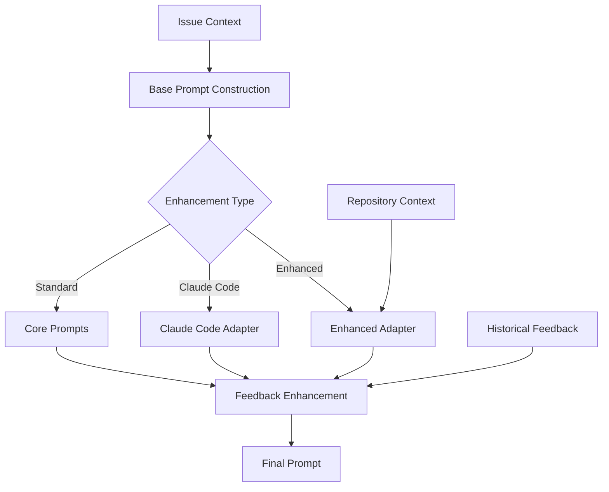

# RSOLV Prompts Architecture

This document describes how RSOLV constructs and manages prompts sent to AI providers.

## Overview

RSOLV uses a dynamic prompt construction system that adapts based on:
- Issue context and type
- Repository characteristics
- Historical feedback
- Configuration settings
- AI provider capabilities

## Prompt Locations

### 1. Core Prompts (`src/ai/prompts.ts`)

The main prompt functions that generate standard prompts:

```typescript
// Initial issue analysis
buildAnalysisPrompt(issue: IssueContext): string

// Solution generation with file contents
buildSolutionPrompt(issue: IssueContext, analysisData: any, fileContents: Record<string, string>): string

// PR description generation
buildPrDescriptionPrompt(issue: IssueContext, analysisData: any, changes: Record<string, string>): string

// Issue type-specific templates
getIssueTypePromptTemplate(issueType: IssueType): string
```

### 2. Claude Code Adapter (`src/ai/adapters/claude-code.ts`)

Constructs prompts specifically for Claude Code CLI:

```typescript
private constructPrompt(
  issueContext: IssueContext, 
  analysis: IssueAnalysis,
  enhancedPrompt?: string
): string
```

Features:
- Context directives (depth, breadth)
- Include/exclude patterns
- JSON response format specification

### 3. Enhanced Claude Code (`src/ai/adapters/claude-code-enhanced.ts`)

Advanced prompt construction with deep context:

```typescript
// Repository analysis prompt
private buildContextGatheringPrompt(
  issueContext: IssueContext,
  options: DeepContextOptions
): string

// Solution generation with context
private buildEnhancedSolutionPrompt(
  issueContext: IssueContext,
  analysis: IssueAnalysis,
  deepContext: RepositoryContext,
  existingPrompt?: string
): string
```

Features:
- Ultra-think mode support
- Comprehensive repository analysis
- Context-aware solution generation

### 4. Feedback Enhancement (`src/feedback/enhancer.ts`)

Dynamic prompt enhancement based on historical feedback:

```typescript
public enhancePrompt(
  basePrompt: string, 
  enhancementContext: PromptEnhancementContext
): string
```

Adds:
- Patterns to avoid (from negative feedback)
- Recommended approaches (from positive feedback)
- Successful solution examples

## Prompt Construction Flow



## Prompt Templates

### 1. Issue Analysis Prompt
```
I need you to analyze the following software issue and provide a technical assessment.

Issue Title: [title]
Issue Description: [body]
Repository: [fullName]
Primary Language: [language]

Please provide:
1. Issue type determination
2. Files likely to need modification
3. Complexity estimation
4. Suggested approach

Focus on technical details and be specific.
```

### 2. Context Gathering Prompt (Enhanced)
```
[ultrathink]

I need you to perform a comprehensive analysis of this repository...

Please analyze:
1. Architecture and Design Patterns
2. Code Conventions and Style
3. Testing Framework and Patterns
4. Dependencies and External Libraries
5. Related Components

Explore comprehensively...
```

### 3. Solution Generation Prompt
```
I need you to generate a solution for the following software issue:

[Issue details]
[Analysis results]
[File contents]

Please provide your solution in the following format:
--- filename.ext ---
```language
[complete file content]
```

Include:
1. Explanation of changes
2. Why this addresses the issue
3. Assumptions or limitations
```

### 4. PR Description Prompt
```
I need you to generate a clear, professional pull request description...

Issue: [title] (#[number])
Type: [issueType]
Files: [files]
Approach: [approach]

Generate:
1. Clear title
2. Detailed description
3. Testing instructions
4. Issue references
```

## Dynamic Enhancement

### Feedback Enhancement Structure
```
[Base Prompt]

### Patterns to Avoid
Based on previous feedback, avoid these patterns:
- [negative pattern 1]
- [negative pattern 2]

### Recommended Approaches
Based on successful solutions, consider:
- [positive pattern 1]
- [positive pattern 2]

### Successful Solution Examples
These approaches worked well:
- Issue: [id], What worked: [feedback]
```

### Context Enhancement
When using enhanced mode, prompts include:
- Architecture patterns discovered
- Code conventions identified
- Testing patterns found
- Related components mapped

## Configuration Impact

Different configurations affect prompt construction:

### Standard Mode
- Basic issue analysis
- File-based solution generation
- Simple PR descriptions

### Claude Code Mode
- Context directives
- Include/exclude patterns
- Structured JSON responses

### Enhanced Mode
- Ultra-think prefixes
- Deep context analysis
- Repository-aware solutions
- Pattern-based recommendations

## Best Practices

1. **Keep prompts focused**: Each prompt has a specific purpose
2. **Include context progressively**: Build from basic to detailed
3. **Use structured formats**: Specify expected output format
4. **Leverage feedback**: Incorporate historical patterns
5. **Adapt to provider**: Different AI providers may need different prompts

## Extending Prompts

To add new prompt types:

1. Add to `src/ai/prompts.ts` for standard prompts
2. Extend adapter classes for provider-specific prompts
3. Use enhancer for feedback-based modifications
4. Document the prompt structure and purpose

## Performance Considerations

- Prompt length affects token usage and cost
- Enhanced prompts may increase processing time
- Feedback enhancement adds computational overhead
- Context gathering can be time-intensive

## Future Enhancements

1. **Template System**: Externalize prompts to templates
2. **Prompt Versioning**: Track prompt effectiveness over time
3. **A/B Testing**: Compare prompt variations
4. **Language Support**: Prompts in multiple languages
5. **Domain-Specific**: Industry-specific prompt templates