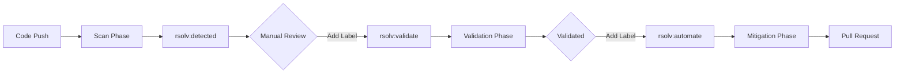

# RSOLV Three-Phase Label Strategy

## Overview

RSOLV uses a label-based workflow system to control the progression through its three security phases. Each label triggers specific GitHub Actions workflows that perform different stages of the vulnerability management process.

## Label Workflow



## Labels

### 1. `rsolv:detected`
- **Applied by**: Scan phase (automatically)
- **Purpose**: Marks issues containing detected vulnerabilities
- **Next step**: Manual review to determine if validation is needed

### 2. `rsolv:validate`
- **Applied by**: Human reviewer or automation
- **Purpose**: Triggers AST validation to reduce false positives
- **Workflow**: `rsolv-validate.yml`
- **Next step**: Review validation results, add `rsolv:automate` if fix needed

### 3. `rsolv:automate`
- **Applied by**: Human reviewer or automation
- **Purpose**: Triggers automatic fix generation
- **Workflow**: `rsolv-fix-issues.yml`
- **Result**: Creates pull request with security fixes

## Demo Mode

When running in demo mode, the scan phase can automatically apply both `rsolv:detected` AND `rsolv:automate` labels to enable end-to-end automation without human intervention.

```yaml
env:
  RSOLV_DEMO_MODE: 'true'  # Auto-applies rsolv:automate label
```

## Workflow Templates

### Scan Workflow (Phase 1)
Triggers on push/PR, detects vulnerabilities, creates issues with `rsolv:detected` label.

### Validation Workflow (Phase 2)
Triggers on `rsolv:validate` label, performs AST analysis, updates issue with results.

### Mitigation Workflow (Phase 3)
Triggers on `rsolv:automate` label, generates fixes, creates pull requests.

## Implementation Examples

### Manual Progression
1. Push code → Scan creates issue with `rsolv:detected`
2. Engineer reviews → Adds `rsolv:validate` label
3. Validation completes → Engineer adds `rsolv:automate` label
4. Fix generated → Pull request created

### Automated Demo
1. Push code with `RSOLV_DEMO_MODE=true`
2. Scan creates issue with `rsolv:detected` + `rsolv:automate`
3. Fix workflow triggers automatically
4. Pull request created without manual intervention

## Configuration

### Enable Demo Mode in Workflow
```yaml
- name: Run RSOLV Security Scan
  uses: RSOLV-dev/rsolv-action@main
  env:
    RSOLV_DEMO_MODE: 'true'  # Enables automatic progression
```

### Custom Label Names
Labels can be customized via action inputs:
```yaml
with:
  issue_label: 'custom:fix'  # Changes rsolv:automate trigger
```

## Best Practices

1. **Production**: Use manual label progression for review control
2. **Demo/Testing**: Enable demo mode for automatic progression
3. **CI/CD**: Configure specific branches for automatic vs manual modes
4. **Security**: Review all generated fixes before merging

## Related Documentation

- [Three-Phase Security Workflow](./RSOLV-THREE-PHASE-WORKFLOW.md)
- [ADR-011: Three-Phase Architecture](../../ADRs/ADR-011-THREE-PHASE-ARCHITECTURE.md)
- [RFC-043: Enhanced Three-Phase Validation](../../RFCs/RFC-043-ENHANCED-THREE-PHASE-VALIDATION.md)