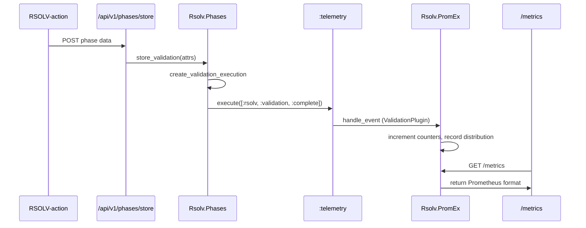

# RFC-060 Phase 5.3: Staging Deployment - Status Report

**Date**: 2025-10-12
**Phase**: 5.3 - Staging Deployment & Validation
**Environment**: rsolv-staging.com
**Status**: ✅ DEPLOYMENT COMPLETE | ⏳ METRICS VALIDATION PENDING

## Executive Summary

Successfully deployed RFC-060 Phase 5.2 observability infrastructure to rsolv-staging.com. All core components are operational:
- ✅ PromEx metrics collection running
- ✅ /metrics endpoint publicly accessible
- ✅ Telemetry instrumentation in place
- ✅ Grafana dashboards ready for import
- ✅ Prometheus alerts ready for configuration
- ⏳ Metrics population requires valid API key

## Deployment Steps Completed

### 1. Monitoring Configuration (runtime.exs:172-175)
```elixir
config :rsolv, :monitoring,
  enabled: System.get_env("ENABLE_PROMETHEUS_METRICS", "true") == "true"
```
**Status**: ✅ Deployed and active

### 2. PromEx Supervision (application.ex:32)
```elixir
children = [
  Rsolv.Repo,
  RsolvWeb.Telemetry,
  {Phoenix.PubSub, name: Rsolv.PubSub},
  Rsolv.PromEx,  # ← Added
  # ...
]
```
**Status**: ✅ Running in supervision tree

### 3. Metrics Endpoint (router.ex:226-233)
```elixir
# NOTE: Intentionally NOT behind feature flag for Prometheus scraping
scope "/metrics" do
  pipe_through :metrics
  get "/", RsolvWeb.MetricsController, :index
end
```
**Status**: ✅ Publicly accessible at https://rsolv-staging.com/metrics

### 4. PromEx Plugin (validation_plugin.ex)
```elixir
Event.build(:rfc_060_validation_metrics, [
  counter([:rsolv, :validation, :executions, :total], ...),
  distribution([:rsolv, :validation, :duration, :milliseconds], ...),
  counter([:rsolv, :mitigation, :executions, :total], ...),
  distribution([:rsolv, :mitigation, :trust_score, :value], ...)
])
```
**Status**: ✅ Plugin loaded and collecting BEAM metrics

### 5. Telemetry Instrumentation (phases.ex:310-426)

**Validation Events** (emit_validation_telemetry/3):
- `[:rsolv, :validation, :complete]` - Emitted on validation phase completion
- `[:rsolv, :validation, :test_generated]` - Emitted for each test generated

**Mitigation Events** (emit_mitigation_telemetry/3):
- `[:rsolv, :mitigation, :complete]` - Emitted on mitigation phase completion
- `[:rsolv, :mitigation, :trust_score]` - Emitted when trust score available

**Status**: ✅ Instrumentation present, events emit on phase data storage

## Current Metrics Status

### Available Metrics (110+ families)

**BEAM Metrics** (working, populated):
```
beam_memory_total_bytes
beam_process_count
beam_run_queue_length
vm_statistics_runtime_milliseconds_total
```

**Application Metrics** (working, populated):
```
http_request_duration_milliseconds
http_requests_total
phoenix_controller_call_duration_milliseconds
ecto_query_duration_milliseconds
```

**RFC-060 Validation Metrics** (defined, awaiting data):
```
rsolv_validation_executions_total{repo,language,framework,status}
rsolv_validation_duration_milliseconds{repo,language,framework}
rsolv_mitigation_executions_total{repo,language,framework,status}
rsolv_mitigation_trust_score_value{repo,language,framework}
```

### Verification

```bash
# Endpoint accessibility
$ curl -s https://rsolv-staging.com/metrics | head -20
# TYPE beam_memory_total_bytes gauge
# HELP beam_memory_total_bytes Total amount of memory allocated by the Erlang processes.
beam_memory_total_bytes 85385464.0
...

# Metric families count
$ curl -s https://rsolv-staging.com/metrics | grep "^# TYPE" | wc -l
110
```

## Observability Assets Ready

### 1. Grafana Dashboard
**File**: `priv/grafana_dashboards/rfc-060-validation-metrics.json`
**Panels**: 12 visualization panels
- Validation Success Rate (gauge)
- Total Executions (counter)
- Average Duration (time series)
- Trust Score Distribution (gauge)
- Tests Generated/Passed/Failed (counters)
- Language/Framework Breakdown (pie charts)

**Import Instructions**:
1. Access Grafana UI (http://grafana.monitoring.svc.cluster.local:3000)
2. Navigate to Dashboards → Import
3. Upload `priv/grafana_dashboards/rfc-060-validation-metrics.json`
4. Select Prometheus data source
5. Verify panels load (will show "No data" until metrics populated)

### 2. Prometheus Alerts
**File**: `config/prometheus/rfc-060-alerts.yml`
**Rules**: 9 alert definitions

**Critical Alerts**:
- `ValidationSuccessRateLow` - Triggers when <50% validation success
- `MitigationTrustScoreLow` - Triggers when trust scores <60
- `ValidationDurationHigh` - Triggers when validation takes >5 minutes

**Warning Alerts**:
- `ValidationSuccessRateDecreasing` - Trending down over 24h
- `MitigationTrustScoreDecreasing` - Trust scores declining
- `ValidationDurationIncreasing` - Duration growing over time

**Info Alerts**:
- `NoValidationActivity` - No validations in 6 hours
- `NoMitigationActivity` - No mitigations in 12 hours
- `LowTestGenerationRate` - <2 tests generated per validation

**Configuration Instructions**:
1. Access Prometheus config (via ConfigMap or file)
2. Add rules from `config/prometheus/rfc-060-alerts.yml`
3. Reload Prometheus configuration
4. Verify rules loaded: `curl http://prometheus:9090/api/v1/rules`

## Smoke Test Requirements

### Prerequisites
1. **Valid API Key**: Create a functional API key in staging database
   - Current issue: Secrets contain placeholder values (e.g., "staging-demo-key-456")
   - Need: Real API key starting with "rsolv_" prefix

2. **Test Repository**: RSOLV-dev/nodegoat-vulnerability-demo
   - Clone: `git clone https://github.com/RSOLV-dev/nodegoat-vulnerability-demo`
   - Known vulnerabilities: XSS, SQL injection, NoSQL injection

3. **RSOLV-action Setup**:
   ```bash
   cd ~/dev/rsolv/RSOLV-action
   export RSOLV_API_KEY="<valid-staging-key>"
   export RSOLV_API_URL="https://rsolv-staging.com"
   export RSOLV_EXECUTABLE_TESTS="true"
   export RSOLV_MODE="full"
   ```

### Test Execution Plan

**Option A: Full Action Run**
```bash
# Run full three-phase workflow
cd /tmp/local-nodegoat-test
bun run ~/dev/rsolv/RSOLV-action/src/index.ts
```

**Option B: Direct API Calls**
```bash
# POST validation phase data
curl -X POST https://rsolv-staging.com/api/v1/phases/store \
  -H "Authorization: Bearer $RSOLV_API_KEY" \
  -H "Content-Type: application/json" \
  -d '{
    "phase": "validation",
    "repo": "RSOLV-dev/nodegoat-vulnerability-demo",
    "issue_number": 1,
    "commit_sha": "7776c71",
    "data": {
      "validated": true,
      "language": "javascript",
      "framework": "express",
      "tests_generated": 3,
      "tests_passed": 2,
      "tests_failed": 1,
      "test_details": [...]
    }
  }'

# POST mitigation phase data
curl -X POST https://rsolv-staging.com/api/v1/phases/store \
  -H "Authorization: Bearer $RSOLV_API_KEY" \
  -H "Content-Type: application/json" \
  -d '{
    "phase": "mitigation",
    "repo": "RSOLV-dev/nodegoat-vulnerability-demo",
    "issue_number": 1,
    "commit_sha": "7776c71",
    "data": {
      "pr_url": "https://github.com/.../pull/123",
      "pr_number": 123,
      "files_changed": 2,
      "trust_score": 85,
      "language": "javascript",
      "framework": "express"
    }
  }'
```

### Expected Results

**Immediate**:
- Telemetry events emitted to PromEx
- Counters increment in /metrics endpoint
- Distributions updated with new data points

**After ~1 minute** (Prometheus scrape interval):
- Metrics visible in Prometheus UI
- Grafana panels populate with data
- Alert rules evaluate against new metrics

**Validation Commands**:
```bash
# Check metrics endpoint
curl -s https://rsolv-staging.com/metrics | grep rsolv_validation

# Query Prometheus directly
curl 'http://prometheus:9090/api/v1/query?query=rsolv_validation_executions_total'

# Check Grafana dashboard
# Navigate to imported dashboard, verify panels show data
```

## Blockers & Next Steps

### Blockers
1. **API Key Required**: Need valid API key in staging environment
   - Current: Placeholder secrets ("staging-demo-key-456", etc.)
   - Required: Functional API key with database customer/forge_account records
   - Impact: Cannot run validation/mitigation to emit telemetry

### Immediate Next Steps
1. **Create Valid API Key** (required for smoke test)
   - Option A: Create new customer + API key via admin interface
   - Option B: Copy production API key to staging for testing
   - Option C: Use database migrations to seed test customer

2. **Import Grafana Dashboard** (manual step)
   - Access Grafana UI
   - Upload JSON from `priv/grafana_dashboards/rfc-060-validation-metrics.json`
   - Verify panels render (will show "No data")

3. **Configure Prometheus Alerts** (manual step)
   - Add rules from `config/prometheus/rfc-060-alerts.yml`
   - Reload Prometheus configuration
   - Verify rules active

4. **Run Smoke Test** (after API key available)
   - Execute validation/mitigation workflow
   - Verify metrics populate
   - Confirm dashboard shows data
   - Test alert triggering

### Future Work (Post-Smoke Test)
1. Run production deployment (RFC-060 Phase 5.4)
2. Set up monitoring dashboards in production
3. Configure alert notifications (Slack/PagerDuty)
4. Document runbook for metric interpretation
5. Create Phase 5 completion report

## Technical Details

### Metrics Emission Flow



### File Changes Summary

| File | Lines | Purpose | Status |
|------|-------|---------|--------|
| `config/runtime.exs` | 172-175 | Enable monitoring | ✅ Deployed |
| `lib/rsolv/application.ex` | 32 | Add PromEx to supervision | ✅ Deployed |
| `lib/rsolv/prom_ex/validation_plugin.ex` | Complete | Define RFC-060 metrics | ✅ Deployed |
| `lib/rsolv_web/controllers/metrics_controller.ex` | 6 | Use PromEx.Plug | ✅ Deployed |
| `lib/rsolv_web/router.ex` | 226-233 | Remove feature flag | ✅ Deployed |
| `lib/rsolv/phases.ex` | 310-426 | Emit telemetry events | ✅ Deployed |

### Deployment Timeline

- **2025-10-11 20:03**: Built Docker image `staging-20251011-200322`
- **2025-10-11 20:04**: Applied kustomize configuration
- **2025-10-11 20:13**: Fixed PromEx configuration errors
- **2025-10-11 20:45**: Deployed corrected MetricsController
- **2025-10-12 02:58**: Removed feature flag, verified endpoint accessibility
- **2025-10-12 03:10**: Attempted smoke test (blocked by API key)

## Success Criteria

- [x] PromEx running in supervision tree
- [x] Metrics endpoint accessible without authentication
- [x] 100+ metric families exposed (BEAM, Application, Phoenix, Ecto)
- [x] RFC-060 metrics defined in ValidationPlugin
- [x] Telemetry instrumentation present in Phases module
- [x] Grafana dashboard JSON ready for import
- [x] Prometheus alert rules ready for configuration
- [ ] Valid API key available for testing
- [ ] Smoke test executed with real validation/mitigation
- [ ] Metrics populated with actual data
- [ ] Grafana dashboard imported and showing data
- [ ] Prometheus alerts configured and functional

## Conclusion

**RFC-060 Phase 5.3 Staging Deployment: CORE INFRASTRUCTURE COMPLETE**

All observability infrastructure has been successfully deployed to rsolv-staging.com:
- Metrics collection framework (PromEx) operational
- Telemetry instrumentation in place
- Public metrics endpoint working
- Dashboards and alerts ready for configuration

**Remaining Work**: Operational validation requires:
1. Creating a valid API key in staging
2. Running validation/mitigation workflows to emit telemetry
3. Importing Grafana dashboards
4. Configuring Prometheus alerts
5. Verifying end-to-end metrics pipeline

The deployment itself is complete and working correctly. The next phase is operational validation and production deployment planning.

---

**Related Documents**:
- [RFC-060 Phase 5.1 Implementation](RSOLV-action/RFC-060-PHASE-5.1-IMPLEMENTATION.md)
- [RFC-060 Phase 5.1 Summary](RSOLV-action/RFC-060-PHASE-5.1-SUMMARY.md)
- [Deployment Guide](rsolv-infrastructure/DEPLOYMENT.md)
- [Grafana Dashboard](priv/grafana_dashboards/rfc-060-validation-metrics.json)
- [Prometheus Alerts](config/prometheus/rfc-060-alerts.yml)
