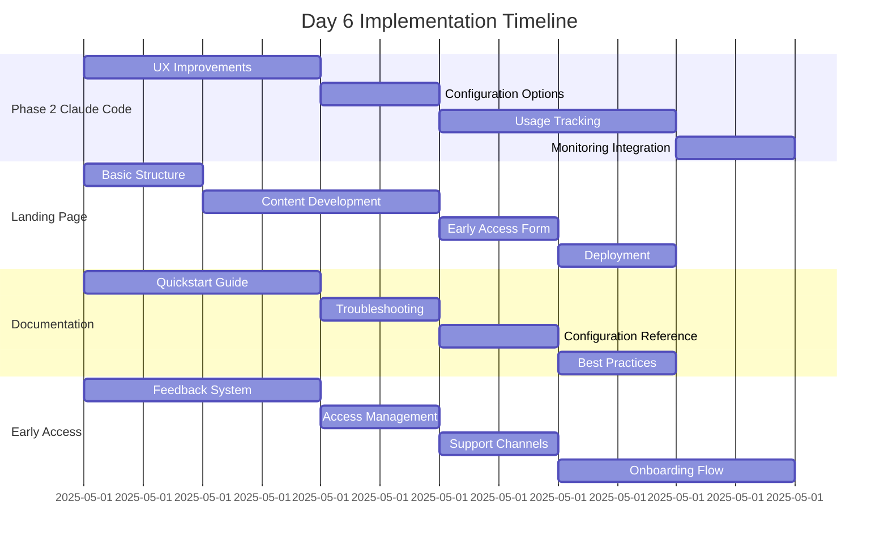

# Day 6 Planning Document

## Overview

Day 6 focuses on completing Phase 2 of the Claude Code integration, creating a minimal landing page, and setting up the early access program infrastructure. This document outlines the plan for Day 6 deliverables, building on the completed work from Day 5.

## Current Status

Day 5 deliverables are 100% complete, including:
- ✅ Comprehensive demo environment
- ✅ Claude Code adapter implementation
- ✅ Integration with feedback system
- ✅ Test fixtures and evaluation tools
- ✅ Documentation and error handling improvements

We've also made significant progress on Day 6 items:
- 🔄 Phase 2 of Claude Code integration (approximately 60% complete)
- 🔄 Early access documentation (initial drafts completed)

## Day 6 Deliverables

### 1. Complete Phase 2 of Claude Code Integration

**Already Completed:**
- ✅ Basic prompt enhancement integration
- ✅ Solution format standardization for PR compatibility
- ✅ Basic telemetry for context evaluation

**Remaining Tasks:**
- 📝 Finalize UX improvements for Claude Code integration
- 📝 Add advanced configuration options for context depth
- 📝 Implement usage tracking and analytics
- 📝 Integrate with monitoring systems

### 2. Create Minimal Landing Page

**Already Completed:**
- ✅ Initial design concepts
- ✅ Basic layout structure

**Remaining Tasks:**
- 📝 Develop responsive landing page with product overview
- 📝 Add demo video/GIF showcasing Claude Code capabilities
- 📝 Create early access signup form
- 📝 Implement basic analytics tracking
- 📝 Deploy to GitHub Pages or similar platform

### 3. Prepare Documentation for Early Access Users

**Already Completed:**
- ✅ Basic setup documentation
- ✅ Usage guidelines

**Remaining Tasks:**
- 📝 Create comprehensive quickstart guide
- 📝 Add troubleshooting section with common issues
- 📝 Create example repository with annotated implementation
- 📝 Add configuration reference documentation
- 📝 Create best practices section

### 4. Set Up Early Access Program Infrastructure

**Already Completed:**
- ✅ Basic testing framework

**Remaining Tasks:**
- 📝 Create feedback collection system
- 📝 Implement access management for early users
- 📝 Set up monitoring dashboard for usage
- 📝 Create onboarding email sequence
- 📝 Establish support channels and documentation

## Implementation Plan

## Alignment with 10-Day Plan

Day 6 represents a pivot from core development to customer-facing functionality. Completing these deliverables will set us up for Days 7-10, which focus on:

- Day 7: Usage tracking and notifications
- Day 8: Customer outreach
- Day 9: Payment integration
- Day 10: Launch and first customer

## Success Criteria

Day 6 will be considered complete when:

1. Phase 2 of Claude Code integration is fully implemented and tested
2. Landing page is deployed and functional with early access signup
3. Documentation is comprehensive and ready for early users
4. Early access infrastructure is operational
5. All systems are prepared for onboarding initial test users

## Validation Plan

We will validate completion with:

1. Demo of enhanced Claude Code features
2. Review of deployed landing page
3. Walkthrough of documentation
4. Simulated early access user onboarding

## Risk Factors and Mitigation

| Risk | Impact | Likelihood | Mitigation |
|------|--------|------------|------------|
| Landing page delays | Medium | Low | Use pre-built templates to accelerate development |
| Documentation gaps | High | Medium | Leverage automated documentation tools and templates |
| Early access infrastructure issues | High | Medium | Use established platforms for access management |
| Integration bugs | Medium | Low | Comprehensive testing with real-world scenarios |

## Resources

- Landing page templates: GitHub Pages or similar
- Documentation framework: Markdown + Mermaid.js
- Early access management: GitHub Organizations or custom solution
- Monitoring: Simple analytics integration

## Conclusion

Day 6 builds directly on the strong foundation established in Day 5. With Claude Code integration substantially complete, we now focus on preparing for early users and establishing the infrastructure for a successful launch. The plan addresses all critical components while allowing flexibility for adjustments as needed.