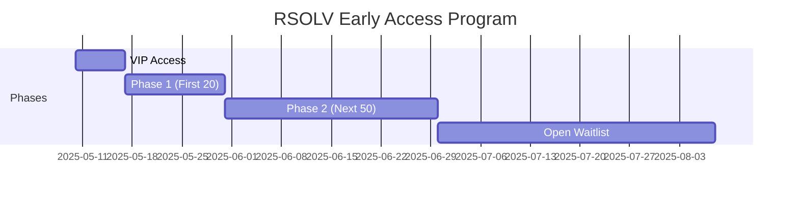

# RSOLV Early Access Program Guide

Welcome to the RSOLV Early Access Program! This guide explains what to expect during early access, how to get started, and how to provide valuable feedback that will shape the future of RSOLV.

## Program Overview

The RSOLV Early Access Program gives you exclusive access to our AI-powered GitHub Action that automatically addresses issues in your repository's backlog. As an early access participant, you'll:

- Try RSOLV before its general release
- Provide input that shapes the product
- Receive priority support and assistance
- Secure special pricing when we launch

### Program Timeline

The Early Access Program runs for approximately 90 days with a phased rollout:



### Available Features

| Feature | Description | Availability |
|---------|-------------|--------------|
| Core automation | Automatic PR generation for tagged issues | All participants |
| GitHub integration | Seamless GitHub workflow integration | All participants |
| Multiple language support | JS, TS, Python, Ruby, Go, Java, C# | All participants |
| Advanced analytics | Detailed usage metrics | VIP & Phase 1 |
| Custom templates | Personalized PR templates | VIP & Phase 1 |
| Team collaboration | Multi-user features | VIP only |
| API access | Programmatic integration | VIP only |
| Priority support | Fast-track support | VIP & Phase 1 & 2 |

## Getting Started

### Prerequisites
- GitHub repository with issues
- Admin access to the repository
- GitHub Actions enabled

### Quick Setup

1. **Install the GitHub Action**

   Create a new file at `.github/workflows/rsolv.yml` with the following content:

   ```yaml
   name: RSOLV Backlog Automation
   on:
     schedule:
       - cron: '0 0 * * *'  # Run daily at midnight
     workflow_dispatch:     # Allow manual triggers
     
   jobs:
     autofix:
       runs-on: ubuntu-latest
       steps:
         - uses: actions/checkout@v3
           with:
             fetch-depth: 0
         
         - name: Run RSOLV
           uses: rsolv/autofix-action@v1
           with:
             api-key: ${{ secrets.RSOLV_API_KEY }}
             issue-label: "rsolv"  # Customize this label if needed
   ```

2. **Set Up Your API Key**

   - Go to your repository → Settings → Secrets and variables → Actions
   - Add a new repository secret named `RSOLV_API_KEY` with the value from your welcome email

3. **Tag Issues for RSOLV**

   Add the `rsolv` label (or your custom label) to issues you want RSOLV to address.

4. **Trigger Your First Run**

   - Go to your repository → Actions tab
   - Select "RSOLV Backlog Automation" workflow
   - Click "Run workflow"
   - Wait for the action to complete (typically 2-5 minutes)

### Best Practices

RSOLV works best with the following types of issues:

- **Bug fixes**: Issues with clear reproduction steps and expected outcomes
- **Feature implementations**: Well-defined feature requests with clear acceptance criteria
- **Refactoring tasks**: Specific refactoring goals with clear scope
- **Documentation updates**: Adding or improving documentation in the codebase
- **Testing improvements**: Adding or enhancing test coverage for existing code

For optimal results, ensure your issues include:
- Clear description of the problem or feature
- Relevant context (e.g., file paths, error messages)
- Expected outcome or acceptance criteria

## Support Resources

We provide multiple support channels during the Early Access Program:

- **Email**: support@rsolv.dev (24-hour response time on business days)
- **Discord**: [Join our Discord server](https://discord.gg/rsolv)
- **Office Hours**: Tuesday & Thursday, 10am-12pm PT
- **GitHub Discussions**: Access to our [Early Access Discussions](https://github.com/rsolv/early-access/discussions)

## Providing Feedback

Your feedback is crucial during this Early Access phase. We encourage you to share your experiences through:

1. **GitHub Discussions**: Join our [Early Access Discussions](https://github.com/rsolv/early-access/discussions)
2. **Direct Email**: Send feedback to early-access@rsolv.dev
3. **Issue Comments**: Leave comments on RSOLV-generated PRs
4. **Feedback Form**: Use the in-app feedback form at `/early-access-feedback`
5. **Scheduled Check-ins**: Participate in your scheduled check-in calls

When providing feedback, please include:
- What worked well
- What could be improved
- Any unexpected behavior
- Ideas for new features or capabilities

We review all feedback weekly and use it to prioritize improvements.

## Security and Privacy

RSOLV is designed with security and privacy in mind:

- Your code never leaves your GitHub Actions environment
- API keys and secrets are securely managed through GitHub Actions secrets
- We maintain SOC 2 compliance for our API services
- All communications are encrypted using industry-standard protocols

For more information, please review our [Security FAQ](/docs/user/security-faq.md).

## Terms and Conditions

Participation in the RSOLV Early Access Program is subject to our [Early Access Terms and Conditions](/docs/user/early-access-terms.md). Key points include:

- The program is free of charge during the Early Access period
- You retain full ownership of all code generated by RSOLV
- We collect usage data to improve the service
- You can leave the program at any time without penalty
- Early access participants receive a 20% discount on their first year's subscription

## Roadmap and Upcoming Features

During the Early Access Program, we plan to release:

- **Language Support**: Additional programming language specialization
- **IDE Integration**: Visual Studio Code and JetBrains plugins
- **Self-Hosted Option**: For organizations with strict security requirements
- **Automated Testing**: Pre-PR testing of generated solutions
- **Custom Workflows**: Support for custom CI/CD integration

---

Thank you for participating in our Early Access Program! Your feedback will help shape RSOLV into an indispensable tool for development teams everywhere.

For detailed technical documentation, visit our [Documentation Portal](https://docs.rsolv.dev).