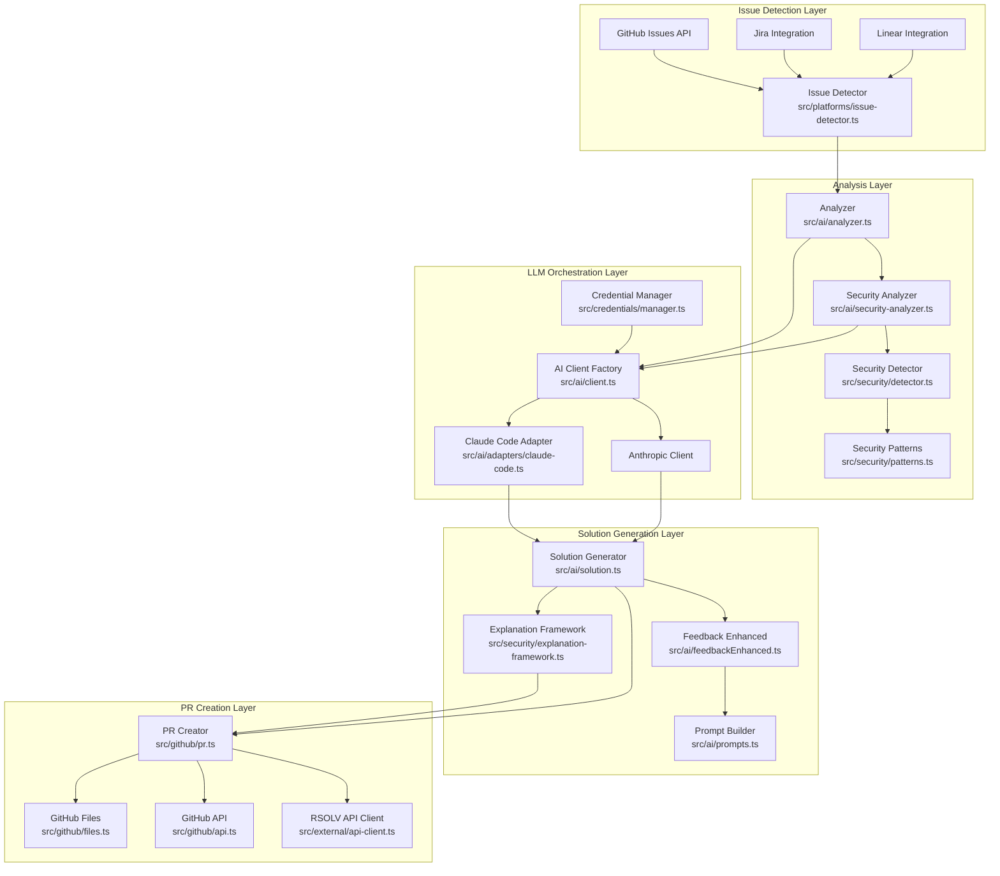
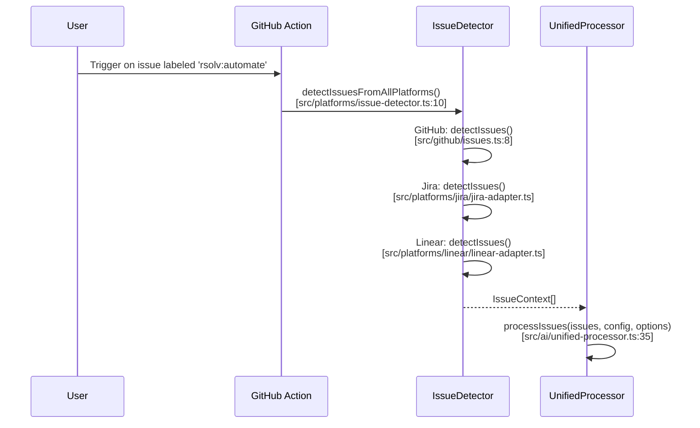
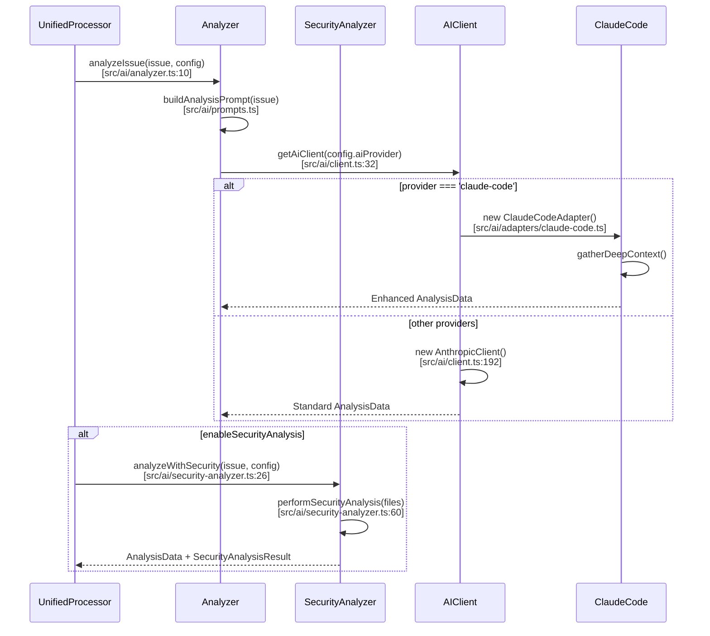
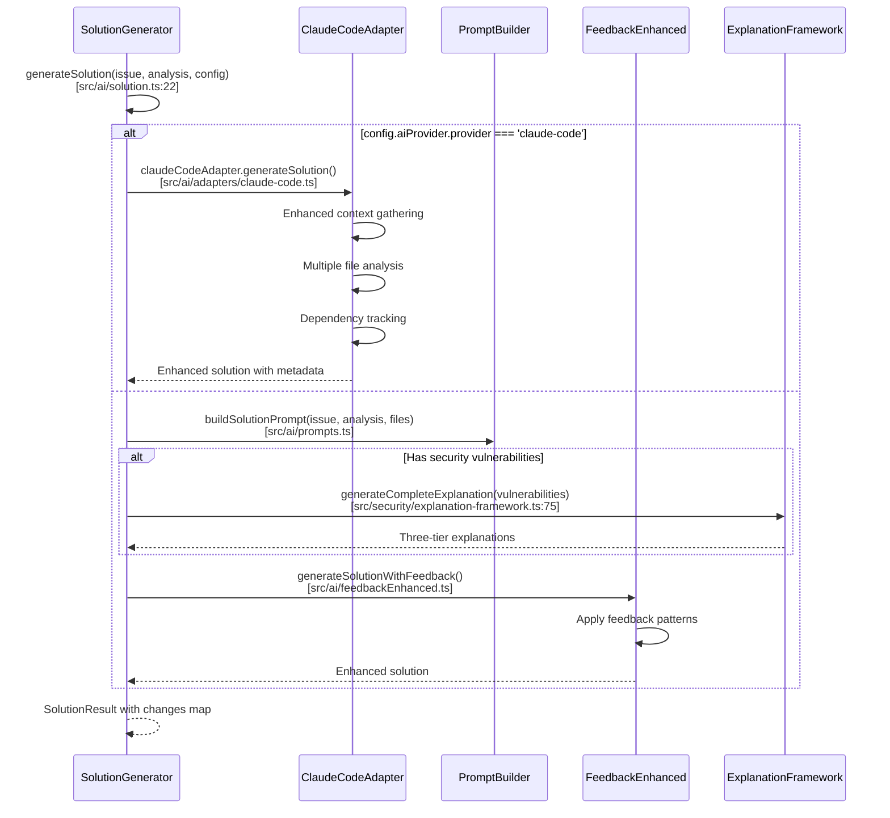
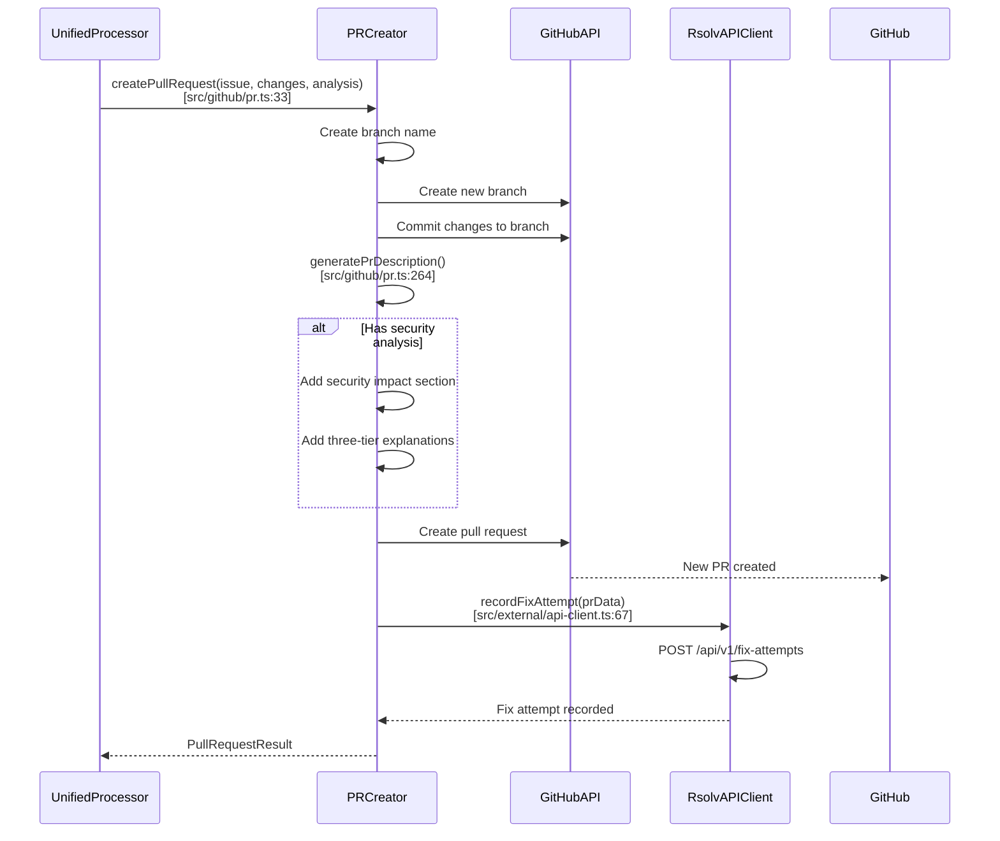
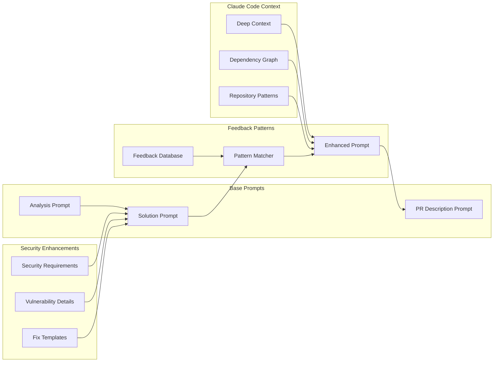
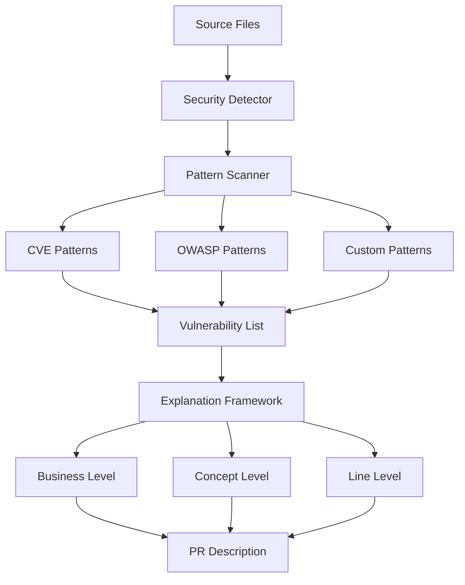

# RSOLV System Architecture & Data Flow

## Overview
This document illustrates the complete data flow from issue detection through PR creation, showing how modules interact and how Claude Code orchestrates the solution generation.

## High-Level Architecture



## Detailed Module Flow

### 1. Issue Detection & Processing



### 2. Issue Analysis Flow



### 3. Solution Generation with Claude Code



### 4. Pull Request Creation



## Key Function Signatures

### Issue Detection
```typescript
// src/platforms/issue-detector.ts
export async function detectIssuesFromAllPlatforms(
  config: ActionConfig
): Promise<IssueContext[]>

// src/github/issues.ts
export async function detectIssues(
  config: ActionConfig
): Promise<IssueContext[]>
```

### Analysis Layer
```typescript
// src/ai/analyzer.ts
export async function analyzeIssue(
  issue: IssueContext,
  config: ActionConfig,
  injectedClient?: any
): Promise<AnalysisData>

// src/ai/security-analyzer.ts
async analyzeWithSecurity(
  issue: IssueContext,
  config: ActionConfig,
  codebaseFiles?: Map<string, string>
): Promise<AnalysisData & { securityAnalysis?: SecurityAnalysisResult }>
```

### LLM Orchestration
```typescript
// src/ai/client.ts
export async function getAiClient(
  config: AiProviderConfig
): Promise<AiClient>

// src/ai/adapters/claude-code.ts
export class ClaudeCodeAdapter {
  async generateSolution(
    issue: IssueContext,
    analysis: AnalysisData,
    enhancedPrompt?: string
  ): Promise<SolutionResult>
}
```

### Solution Generation
```typescript
// src/ai/solution.ts
export async function generateSolution(
  issue: IssueContext,
  analysisData: AnalysisData,
  config: ActionConfig,
  injectedClient?: any,
  _injectedFileGetter?: any,
  securityAnalysis?: any
): Promise<SolutionResult>

// src/ai/feedbackEnhanced.ts
export async function generateSolutionWithFeedback(
  issue: IssueContext,
  analysis: AnalysisData,
  config: ActionConfig,
  basePrompt?: string
): Promise<SolutionResult>
```

### PR Creation
```typescript
// src/github/pr.ts
export async function createPullRequest(
  issue: IssueContext,
  changes: Record<string, string>,
  analysis: AnalysisData,
  config: ActionConfig,
  securityAnalysis?: SecurityAnalysisResult,
  explanations?: CompleteExplanation
): Promise<PullRequestResult>
```

## Prompt Flow & Enhancement



## Data Structures

### IssueContext
```typescript
interface IssueContext {
  id: string;
  number: number;
  title: string;
  body: string;
  labels: string[];
  repository: RepositoryInfo;
  source: 'github' | 'jira' | 'linear';
}
```

### AnalysisData
```typescript
interface AnalysisData {
  issueType: IssueType;
  filesToModify: string[];
  estimatedComplexity: 'low' | 'medium' | 'high';
  suggestedApproach: string;
  canBeFixed: boolean;
  confidenceScore: number;
  securityAnalysis?: SecurityAnalysisResult;
}
```

### SolutionResult
```typescript
interface SolutionResult {
  success: boolean;
  message: string;
  changes?: Record<string, string>; // filepath -> new content
  error?: string;
  explanations?: CompleteExplanation;
}
```

## Claude Code Integration Points

1. **Provider Detection**: `src/ai/client.ts:46-59`
   - Maps 'claude-code' to AnthropicClient
   - Enables special handling in solution generator

2. **Enhanced Context**: `src/ai/solution.ts:34-46`
   - Detects claude-code provider
   - Uses ClaudeCodeAdapter for deep context

3. **Solution Generation**: `src/ai/adapters/claude-code.ts`
   - Gathers repository-wide context
   - Analyzes dependencies
   - Generates comprehensive fixes

4. **Credential Vending**: `src/credentials/manager.ts`
   - Exchanges RSOLV API key for provider credentials
   - Manages rate limits and quotas

## Security Analysis Flow



This architecture enables RSOLV to provide comprehensive, security-aware, and educational pull requests that not only fix issues but also help teams understand and prevent future occurrences.